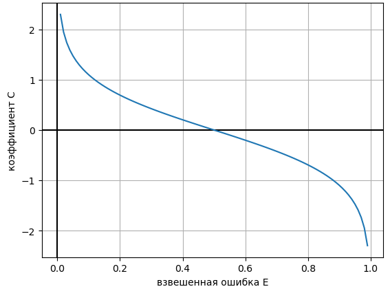

# Алгоритм AdaBoost

**Алгоритм AdaBoost** ([[1]](https://en.wikipedia.org/wiki/AdaBoost), впервые предложен в [[2]](https://www.cis.upenn.edu/~mkearns/teaching/COLT/adaboost.pdf)) исторически был первым алгоритмом бустинга. Он работает в следующей постановке: 

- Рассматривается задача бинарной классификации $y\in\{+1,-1\}$, решаемая с помощью экспоненциальной функции потерь $e^{-G(\mathbf{x})y}$.

- Начальное приближение полагается равным нулю: $f_0(\mathbf{x})\equiv 0$.

- В качестве базовых алгоритмов $f_1(\mathbf{x}),...f_M(\mathbf{x})$ можно брать любые алгоритмы, способные обучаться на <u>взвешенной обучающей выборке</u> (где каждое наблюдение учитывается со своим весом). 

:::tip Обучение на взвешенной выборке

Большинство алгоритмов машинного обучения допускает минимизацию средних потерь на взвешенной выборке. Например, в решающих деревьях необходимо каждый объект $(\mathbf{x}_n,y_n)$ учитывать $w_n$ раз при расчете функции неопределённости и минимизации потерь в листе.

Если алгоритм настройки не позволяет учитывать веса, можно сгенерировать обучающую выборку, в которой каждый объект будет повторяться пропорционально его весу (например, если вес равен 3, то объект в выборке нужно повторить 3 раза). Но этот способ работает только для целочисленных весов (таких как 1,2,3,...) и может приводить к большому разрастанию выборки.

Альтернативно (хоть это и не то же самое, а лишь приближение) можно обучать модель на случайной подвыборке объектов, в которую каждый объект попадает из обучающей выборки с вероятностью, пропорциональной весу наблюдения $w_n$. 

:::

Результатом работы AdaBoost является относительный рейтинг положительного класса

$$
G_M(\mathbf{x})=c_1 f_1(\mathbf{x})+c_2 f_2(\mathbf{x})+...+c_M f_M(\mathbf{x}),
$$

а прогноз осуществляется знаком величины $G_M(\mathbf{x})$:

$$
\widehat{y}(\mathbf{x})=\text{sign}\left(G_M(\mathbf{x})\right)=\text{sign}\left(\sum_{m=1}^{M}c_{m}f_{m}(\mathbf{x})\right)
$$

:::note Алгоритм AdaBoost

1. Инициализируем веса объектов $w_{n}^0=1/N, n=1,2,...N$.

2. Для каждого $m=1,2,...M$:
   
   1. Настраиваем $f_{m}(\mathbf{x})$ по выборке $\{(\mathbf{x}_n,y_n)\}_{n=1}^N$ с весами $\left\{ w_{n}\right\} _{n=1}^{N}$.
   
   2. Вычисляем <u>взвешенную</u> частоту ошибок:
      
      $$
      E_{m}=\frac{\sum_{n=1}^{N}w_{n}\mathbb{I}[f_{m}(\mathbf{x}_{n})\ne y_{n}]}{\sum_{n=1}^{N}w_{n}}
      $$
   
   3. Если $E_{m}=0$ или $E_m \ge 0.5$, то останавливаем построение ансамбля.
   
   4. Вычисляем $c_{m}=\frac{1}{2}\ln\left((1-E_{m})/E_{m}\right)$.
   
   5. Пересчитываем веса:
      
      $$
      w_{n}^{m+1}:=w_{n}^{m}e^{-y_{n}c_{m}f_{m}(\mathbf{x}_{n})}
      $$
   
   6. Нормируем веса:
      
      $$
      w_n^{m+1}:=\frac{w_n^{m+1}}{\sum_{n=1}^N w_n^{m+1}}
      $$

3. Возвращаем классификатор, действующий по правилу:
   
   $$
   \widehat{y}(\mathbf{x}) = \text{sign}\left(\sum_{m=1}^{M}c_{m}f_{m}(\mathbf{x})\right)
   $$

:::

## Анализ алгоритма

Проверка $E_m=0$ на шаге 3 производится, поскольку если $E_m=0$, то $f_m(\mathbf{x})$ безошибочно классифицирует все объекты выборки, и можно использовать только эту модель для классификации. На практике такое реализуется редко, поскольку в качестве базовых моделей используются очень простые алгоритмы, такие как деревья решений небольшой глубины.

Как видно по шагу алгоритма 2.i, каждая базовая модель $f_m(\mathbf{x})$ настраивается на одну и ту же исходную обучающую выборку $\{(\mathbf{x}_n,y_n)\}_{n=1}^N$, <u>меняются лишь веса</u>, с которыми учитывается каждый объект. 

Нормировка на шаге 2.vi производится для численной устойчивости, иначе веса могут снижаться до машинного нуля либо возрастать слишком сильно. 

Из шага 2.v, видно, что веса зависят от промежуточного ансамбля $G_m(\mathbf{x})$ следующим образом:

$$
\begin{align}
\notag w_{n}^{m+1} &= w_{n}^{m}e^{-y_{n}c_{m}f_{m}(\mathbf{x}_{n})}\\
\notag &\propto \frac{1}{N}e^{-y_n(c_1 f_1(\mathbf{x})+...+c_m f_m(\mathbf{x}))}\\
&= \frac{1}{N}e^{-y_n G_m(\mathbf{x})} \tag{1}
\end{align}
$$

> Знак $\propto$ означает "равен с точностью до константы", которая возникает в силу того, что веса перенормируются на шаге 2.vi, чтобы суммироваться в единицу. 

Этот вид весов очень интуитивен, поскольку $y_n G_m(\mathbf{x})$ представляет собой [отступ](../General-classifiers/Margin#отступ-для-бинарной-классификации) при классификации объекта $\mathbf{x}$ ансамблем $G_m(\mathbf{x})$ и по смыслу представляет собой качество классификации этого объекта. Чем качество классификации объекта выше, тем соответствующий вес ниже, и следующая базовая модель будет слабее его учитывать. А чем качество ниже, тем вес проблемного объекта выше, что вынуждает следующую базовую модель сильнее его учитывать, чтобы исправить неточную классификацию.

:::tip Обобщение подхода

По аналогии с AdaBoost можно разработать собственную версию итеративного построения ансамбля, где на каждом шаге настраивается одна и та же модель по одной и той же обучающей выборке, но вес проблемных объектов повышается, а хорошо предсказанных - снижается по пользовательскому правилу.

:::

На шаге 2.4 рассчитывается коэффициент при следующей базовой модели. Его зависимость от взвешенной частоты ошибок имеет вид:



Отсюда видно, что вес, с которым добавляется следующая базовая модель $f_m(\mathbf{x})$, тем выше, чем точнее она работает ($E_m$ ниже). Если $E_m=0.5$, то $c_m=0$ и новая базовая модель добавится с нулевым весом, не изменив ансамбль. Веса на шаге 2.v также не изменятся, поэтому последующие запуски алгоритма ничего изменять не будут. В связи с этим, при $E_m=0.5$ на шаге 2.iii целесообразно досрочно останавливать алгоритм. При очень плохом классификаторе с частотой ошибок $E_m>0.5$ процесс также останавливается, хотя остаётся вариант инвертировать его прогнозы (сделав $E_m<0.5$) и продолжить процесс обучения.

Условие $E_m<0.5$ гарантирует, что всегда выполнено условие $c_m>0$.

## Вывод AdaBoost

Выведем аналитически алгоритм AdaBoost. 

Задаём начальное приближение $G_{0}(\mathbf{x})\equiv 0$. Настройка $c_m,f_m(\mathbf{x})$ будет производится, используя экспоненциальную функцию ошибки на отступ классификации:

$$
\mathcal{L}(G(\mathbf{x}),y)=e^{-yG(\mathbf{x})}
$$

Применяя правило последовательной настройки с этой функцией потерь, получим:

$$
\begin{align}
\notag (c_{m},f_{m})    &=    \arg\min_{c_{m},f_{m}}\sum_{n=1}^{N}\mathcal{L}(G_{m-1}(\mathbf{x}_{n})+c_{m}f_{m}(\mathbf{x}_{n}),\,y_{n}) \\
\notag     &=    \arg\min_{c_{m},f_{m}}\sum_{n=1}^{N}e^{-y_{n}G_{m-1}(\mathbf{x}_{n})}e^{-c_{m}y_{n}f_{m}(\mathbf{x}_{n})} \\
\tag{2}    &=    \arg\min_{c_{m},f_{m}}\sum_{i=1}^{N}w_{n}^{m}e^{-c_{m}y_{n}f_{m}(\mathbf{x}_{n})},
\end{align}
$$

где веса для объекта $n$ на итерации $m$  определяем по правилу

$$
w_{n}^{m}=e^{-y_{n}G_{m-1}(\mathbf{x}_{n})}
$$

### Вывод множителя при базовой модели

Функция потерь, как сумма выпуклых функций (экспонент с неотрицательными коэффициентами), является выпуклой по $c_m$. Поэтому не только необходимым, но и достаточным условием минимума является равенство нулю производной потерь в формуле (2):

$$
\frac{\partial L(c_{m})}{\partial c_{m}}=-\sum_{n=1}^{N}w_{n}^{m}e^{-c_{m}y_{n}f_{m}(\mathbf{x}_{n})}y_{n}f_{m}(\mathbf{x}_{n})=0
$$

$$
-\sum_{n:f_{m}(\mathbf{x}_{n})=y_{n}}w_{n}^{m}e^{-c_{m}}+\sum_{n:f_{m}(\mathbf{x}_{n})\ne y_{n}}w_{n}^{m}e^{c_{m}}=0
$$

$$
e^{2c_{m}}=\frac{\sum_{n:f_{m}(\mathbf{x}_{n})=y_{n}}w_{n}^{m}}{\sum_{n:f_{m}(\mathbf{x}_{n})\ne y_{n}}w_{n}^{m}}
$$

$$
\begin{aligned}
c_m &= \frac{1}{2}\ln\frac{\left(\sum_{n:f_{m}(\mathbf{x}_{n})=y_{n}}w_{n}^{m}\right)/\left(\sum_{n=1}^{N}w_{n}^{m}\right)}{\left(\sum_{n:f_{m}(\mathbf{x}_{n})\ne y_{n}}w_{n}^{m}\right)/\left(\sum_{n=1}^{N}w_{n}^{m}\right)} \\
&= \frac{1}{2}\ln\frac{1-E_{m}}{E_{m}},
\end{aligned}
$$

где $E_m$ - взвешенная частота ошибок:

$$
E_{m}:=\frac{\sum_{n=1}^{N}w_{n}^{m}\mathbb{I}[f_{m}(\mathbf{x}_{n})\ne y_{n}]}{\sum_{n=1}^{N}w_{n}^{m}}
$$

### Вывод критерия для настройки базовой модели

Распишем потери в формуле (2) в эквивалентном виде:

$$
\begin{aligned}
\sum_{n=1}^{N}w_{n}^{m}e^{-c_{m}y_{n}f_{m}(\mathbf{x}_{n})} &= \sum_{n:f_{m}(\mathbf{x}_{n})=y_{n}}w_{n}^{m}e^{-c_{m}}+\sum_{n:f_{m}(\mathbf{x}_{n})\ne y_{n}}w_{n}^{m}e^{c_{m}} \\
&= e^{-c_{m}}\sum_{n:f_{m}(\mathbf{x}_{n})=y_{n}}w_{n}^{m}+e^{c_{m}}\sum_{n:f_{m}(\mathbf{x}_{n})\ne y_{n}}w_{n}^{m} \\
&= e^{-c_{m}}\sum_{n=1}^{N}w_{n}^{m}-e^{-c_{m}}\sum_{n:f_{m}(\mathbf{x}_{n})\ne y_{n}}w_{n}^{m}+e^{c_{m}}\sum_{n:f_{m}(\mathbf{x}_{n})\ne y_{n}}w_{n}^{m} \\
&=e^{-c_{m}}\sum_{n}w_{n}^{m}+(e^{c_{m}}-e^{-c_{m}})\sum_{n:f_{m}(\mathbf{x}_{n})\ne y_{n}}w_{n}^{m}
\end{aligned}
$$

Первое слагаемое от $f_m(\mathbf{x})$ не зависит. Во втором слагаемом, поскольку $c_m>0$, то $e^{c_m}-e^{-c_m}>0$, следовательно, для минимизации потерь по $f_m(\mathbf{x})$ необходимо, чтобы $f_m(\mathbf{x})$ решала задачу минимизации взвешенного числа ошибок:

$$
f_{m}(\cdot)=\arg\min_{f}\sum_{n=1}^{N}w_{n}^{m}\mathbb{I}[f(\mathbf{x}_{n})\ne y_{n}]
$$

### Вывод формулы для пересчёта весов

Мы определили веса по формуле (1):

$$
w_{n}^{m+1} \propto \frac{1}{N}e^{-y_n G_m(\mathbf{x})}
$$

Следовательно, 

$$
\begin{aligned}
w_{n}^{m+1} & \propto \frac{1}{N}e^{-y_n (G_{m-1}(\mathbf{x})+c_m f_m(\mathbf{x}))} \\
&= \frac{1}{N}e^{-y_n G_{m-1}(\mathbf{x})} e^{-y_n c_m f_m(\mathbf{x})} \\
&= w_n^m e^{-y_n c_m f_m(\mathbf{x})} 
\end{aligned}
$$

## Пример запуска на Python

<div class="code_start">AdaBoost для классификации:</div>

```py
from sklearn.ensemble import AdaBoostClassifier
from sklearn.metrics import accuracy_score
from sklearn.metrics import brier_score_loss

X_train, X_test, Y_train, Y_test = get_demo_classification_data()  

# инициализация AdaBoost (по умолчанию-над деревьями)
model = AdaBoostClassifier(n_estimators=50)   
model.fit(X_train, Y_train)     # обучение модели   
Y_hat = model.predict(X_test)   # построение прогнозов
print(f'Точность прогнозов: {100*accuracy_score(Y_test, Y_hat):.1f}%')

P_hat = model.predict_proba(X_test)  # можно предсказывать вероятности классов
loss = brier_score_loss(Y_test, P_hat[:,1])  # мера Бриера на вер-ти положительного класса
print(f'Мера Бриера ошибки прогноза вероятностей: {loss:.2f}') 
```

<div class="code_end"></div>

[Больше информации](https://scikit-learn.org/stable/modules/ensemble.html#adaboost). [Полный код](https://github.com/victorkitov/ML/blob/main/%D0%9F%D1%80%D0%B8%D0%BC%D0%B5%D1%80%D1%8B%20%D0%B7%D0%B0%D0%BF%D1%83%D1%81%D0%BA%D0%B0%20%D0%BE%D1%81%D0%BD%D0%BE%D0%B2%D0%BD%D1%8B%D1%85%20%D0%BC%D0%B5%D1%82%D0%BE%D0%B4%D0%BE%D0%B2%20%D0%B2%20sklearn.ipynb). 

Также в библиотеке sklearn существует алгоритм [AdaBoost.R2](https://scikit-learn.org/stable/auto_examples/ensemble/plot_adaboost_regression.html#sphx-glr-auto-examples-ensemble-plot-adaboost-regression-py) для решения задачи регрессии.


## Литература

1. [Wikipedia: AdaBoost.](https://en.wikipedia.org/wiki/AdaBoost)

2. [Freund Y., Schapire R. E. A desicion-theoretic generalization of on-line learning and an application to boosting //European conference on computational learning theory. – Berlin, Heidelberg : Springer Berlin Heidelberg, 1995. – С. 23-37.](https://www.cis.upenn.edu/~mkearns/teaching/COLT/adaboost.pdf)
