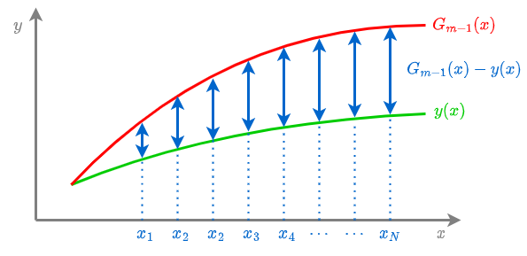
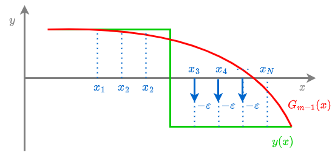

# Градиентный бустинг

**Градиентный бустинг** (gradient boosting [[1]](https://en.wikipedia.org/wiki/Gradient_boosting), предложен в [[2]](https://www.researchgate.net/publication/2424824_Greedy_Function_Approximation_A_Gradient_Boosting_Machine)) представляет собой приближение бустинга с использованием <u>градиента функции потерь</u>. В отличие от [AdaBoost](AdaBoost), он работает с произвольной дифференцируемой функцией потерь, а не только с экспоненциальной. В частности это позволяет решать не только задачу классификации, но и регрессии.

В качестве базовых моделей чаще всего используются [решающие деревья](../Decision-trees/Decision-trees) небольшой глубины (gradient boosting over decision trees, GBDT).

Когда говорят о бустинге, то чаще всего имеют ввиду именно градиентный бустинг.

## Идея метода

Если отвлечься от множителя при базовой функции, то в бустинге решается задача подбора оптимальной $f_{m+1}(\mathbf{x})$ такой, что

$$
\mathcal{L}(f_{m})=\frac{1}{N}\sum_{n=1}^{N}\mathcal{L}\left(G_{m}(\mathbf{x}_{n})+f_{m}(\mathbf{x}_{n}),y_{n}\right)\to\min_{f_{m}}
$$

Если вектор прогнозов функции $\left[f_{m}(\mathbf{x}_{1}),f_{m}(\mathbf{x}_{2}),...f_{m}(\mathbf{x}_{N})\right]$ заменить на вектор вещественных чисел $\mathbf{u}=[u_{1},u_{2},...u_{N}]$, то задача переформулируется в виде классической минимизации функции по аргументам:

$$
\mathcal{L}(\mathbf{u})=\mathcal{L}(u_{1},...u_{N})=\frac{1}{N}\sum_{n=1}^{N}\mathcal{L}\left(G_{m}(\mathbf{x}_{n})+u_{n},y_{n}\right)\to\min_{u_{1},u_{2},...u_{N}}
$$

Используя идеологию [градиентного спуска](../Numerical-optimization/Gradient-descent), эту задачу в линейном приближении можно решить, положив

$$
\begin{aligned}
u_{1} &= -\frac{\partial\mathcal{L}(G_{m}(\mathbf{x}_{1}),y_{1})}{\partial G} \\
u_{2} &= -\frac{\partial\mathcal{L}(G_{m}(\mathbf{x}_{2}),y_{2})}{\partial G} \\
& \cdots \\
u_{N} &= -\frac{\partial\mathcal{L}(G_{m}(\mathbf{x}_{N}),y_{N})}{\partial G} \\
\end{aligned}
$$

Следовательно, в исходной постановке следует выбирать $f_{m}(\mathbf{x})$ так, чтобы обеспечить

$$
\begin{aligned}
f_{m}(\mathbf{x}_{1}) &\approx -\frac{\partial\mathcal{L}(G_{m}(\mathbf{x}_{1}),y_{1})}{\partial G}\\
f_{m}(\mathbf{x}_{2}) &\approx -\frac{\partial\mathcal{L}(G_{m}(\mathbf{x}_{2}),y_{2})}{\partial G}\\
&\cdots \\ 
f_{m}(\mathbf{x}_{N}) &\approx -\frac{\partial\mathcal{L}(G_{m}(\mathbf{x}_{N}),y_{N})}{\partial G}
\end{aligned}
$$

:::tip Реализация

На практике это означает обучение $f_m(\mathbf{x})$ на обучающей выборке:

$$
\left\{ 
\left(\mathbf{x}_1,-\frac{\partial\mathcal{L}(G_{m}(\mathbf{x}_{1}),y_{1})}{\partial G}\right),
\left(\mathbf{x}_2,-\frac{\partial\mathcal{L}(G_{m}(\mathbf{x}_{2}),y_{2})}{\partial G}\right),
...
\left(\mathbf{x}_N,-\frac{\partial\mathcal{L}(G_{m}(\mathbf{x}_{N}),y_{N})}{\partial G}\right)
\right\} 
$$

:::

Алгоритм градиентного бустинга основан на итеративной оценке $f_m(\mathbf{x})$ для $m=1,2,...M$ и добавлении этих функций к ансамблю $G_m(\mathbf{x})$. 

> Заметим, что в обучающей выборке для каждой базовой модели $f_m$ вектора признаков будут одинаковыми, а целевые значения - разными, поскольку разными будут ошибки  $G_m(\mathbf{x})$, уточняемой на каждой итерации. 

Настройка $f_m(\mathbf{x})$ происходит по правилу:

$$
\sum_{n=1}^{N}\left(f_{m}(\mathbf{x}_{n})+\frac{\partial\mathcal{L}(G_{m-1}(\mathbf{x}_{n}),y_{n})}{\partial G}\right)^{2}\to\min_{f_{m}}
$$

> Заставить $f_m(\mathbf{x})$ приближать антиградиент ансамбля можно, используя <u>любую</u> регрессионную функцию потерь. Квадратичные потери выше - просто наиболее типичный случай.

Тогда шагу градиентного спуска при минимизации $\mathcal{L}(\mathbf{u})$

$$
\mathbf{u}:=\mathbf{u}-\varepsilon\nabla\mathcal{L}(\mathbf{u})
$$

будет приближённо соответствовать обновление ансамбля:

$$
G_{m}(\mathbf{x}):=G_{m-1}(\mathbf{x})+\varepsilon f_{m}(\mathbf{x}),
$$

где шаг обучения (learning rate) $\varepsilon>0$ выбирается пользователем (гиперпараметр).

:::warning Случай функции выигрыша

Если настройка ансамбля производится не <u>минимизацией</u> функции потерь, а  <u>максимизацией</u> функции выигрыша, то $f_m(\mathbf{x})$ нужно настраивать приближать не антиградиент потерь (градиент *со знаком минус*), а градиент функции (*со знаком плюс*). 

:::

## Примеры

### Случай регресии

Рассмотрим задачу регрессии $y\in\mathbb{R}$ с функцией потерь: 

$$
\mathcal{L}(G,y)=\frac{1}{2}\left(G-y\right)^{2}
$$

Тогда следующая базовая модель будет настраиваться приближать 

$$
f(\mathbf{x})\approx-\frac{\partial\mathcal{L}(G,y)}{\partial G}=-(G-y)=(y-G)
$$

Обновление базовой модели пройдёт по правилу

$$
\begin{aligned}
G_{m}(\mathbf{x}_{n})&:=G_{m-1}(\mathbf{x}_{n})+\varepsilon f(\mathbf{x}) \\
& \approx G_{m-1}(\mathbf{x}_{n})+\varepsilon (y_{n}-G_{m-1}(\mathbf{x}_{n}))
\end{aligned}
$$

То есть в каждой точке $\mathbf{x}_n$ ансамбль будет корректироваться на величину недопрогноза $y_{n}-G_{m-1}(\mathbf{x}_{n})$.

### Случай бинарной классификации

Для бинарной классификации $y\in\{+1,-1\}$ зададим функцию потерь персептрона:

$$
\mathcal{L}(G,y) = \max\{-Gy,0\}

$$

Тогда следующая базовая модель будет настраиваться приближать

$$
f_{m}(\mathbf{x})\approx-\frac{\partial\mathcal{L}(G,y)}{\partial G}=\begin{cases}
y, & Gy<0\\
0, & Gy\ge0
\end{cases}
$$

$$
\begin{aligned}
G_{m}(\mathbf{x}_{n})&:=G_{m-1}(\mathbf{x}_{n})+\varepsilon f_{m}(\mathbf{x}) \\
& \approx G_{m-1}(\mathbf{x}_{n})+\begin{cases}
\varepsilon y_{n}, & G(\mathbf{x}_{n})y_{n} \le 0\\
0, & G(\mathbf{x}_{n})y_{n}>0
\end{cases}
\end{aligned}
$$

В результате такого обновления ансамбль не изменяется для объектов, которые уже классифицируются корректно ($G(\mathbf{x}_{n})$ и $y_{n}$ одного знака), и изменится на $\varepsilon$ в сторону $y_n$ на неверно классифицированных объектах. 

Это улучшает качество классификации неверно предсказанных объектов (повышает отступ), поскольку конечные прогнозы ансамбль выдаёт по правилу:

$$
\hat{y}(\mathbf{x})=
\begin{cases} 
+1, G_m(\mathbf{x})>0, \\
-1, G_m(\mathbf{x})<0.
\end{cases}
$$

Это изменение проиллюстрировано ниже:

Как видим, при использовании функции потерь персептрона корректировка на $\varepsilon$ осуществляется только для ошибочно классифицированных объектов, у которых $y(\mathbf{x})$ и $G_{m-1}(\mathbf{x})$ разных знаков.

### Случай многоклассовой классификации

Для многоклассовой классификации можно использовать методы [один-против-одного](../Multiclass-with-binary-classifiers/One-vs-one), [один-против-всех](../Multiclass-with-binary-classifiers/One-vs-all) и [коды, исправляющие ошибки,](../Multiclass-with-binary-classifiers/Binary-embeddings) которые решают многоклассовую классификацию с помощью набора бинарных классификаторов.

Альтернативно можно решать многоклассовую классификацию напрямую. В этом случае $G_{m-1}(\mathbf{x})\in\mathbb{R}^{C}$ будет представлять собой уже <u>вектор из рейтингов</u> для каждого из $C$ классов, а в качестве прогноза будет назначаться класс, обладающий максимальным рейтингом:

$$
\hat{y} = \arg\max_{c\in\{1,2,...C\}} G_{m-1,c}(\mathbf{x})
$$

В случае минимизации потерь $\mathcal{L}(\cdot)$:

$$
f_{m}(\mathbf{x}_{n})\approx-\frac{\partial\mathcal{L}(G_{m-1}(\mathbf{x}_{n}),y_{n})}{\partial G}\in\mathbb{R}^{C},
$$

то есть базовая базовая модель и целевая величина будут представлять собой $C$-мерные векторы, сближаемые через <u>векторную</u> функцию потерь.

---

Далее мы рассмотрим [алгоритм бустинга в общем виде](GB-algorithm).

С частным случаем многоклассового бустинга при логистической функции потерь можно ознакомиться, например, в [[3]](https://urss.ru/cgi-bin/db.pl?lang=Ru&blang=ru&page=Book&id=241884&srsltid=AfmBOorL6KjhUfo0Y42_NmrUhzKrDo4zOsneZDwK8AP0Sl_U9aD13AbJ).

## Литература

1. [Wikipedia: gradient boosting.](https://en.wikipedia.org/wiki/Gradient_boosting)

2. [Friedman J. H. Greedy function approximation: a gradient boosting machine //Annals of statistics. – 2001. – С. 1189-1232.](https://www.researchgate.net/publication/2424824_Greedy_Function_Approximation_A_Gradient_Boosting_Machine)

3. [Мерков А. Б. Распознавание образов: введение в методы статистического обучения. // Москва: Едиториал УРСС. – 2019.](https://urss.ru/cgi-bin/db.pl?lang=Ru&blang=ru&page=Book&id=241884&srsltid=AfmBOorL6KjhUfo0Y42_NmrUhzKrDo4zOsneZDwK8AP0Sl_U9aD13AbJ)
