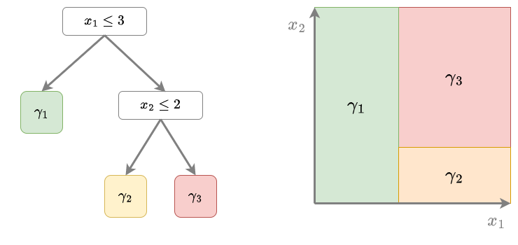

# Алгоритм градиентного бустинга

## Базовый алгоритм

Разобравшись [в идее построения каждой следующей базовой модели в градиентном бустинге](GB-idea), приходим к следующему алгоритму построения итогового ансамбля:

:::note Алгоритм градиентного бустинга 

**Вход**: 

- обучающая выборка $X,Y=\left\{ (\mathbf{x}_{n},y_{n})\right\} _{n=1}^{N}$ ;

- функция потерь $\mathcal{L}(f,y)$ и число базовых моделей $M$.

----

1. Настраиваем начальное приближение $G_{0}(\mathbf{x})$ по $X,Y$.

2. Для каждого $m=1,2,...M$:
   
   1. вычисляем градиенты: $g_{n}=\frac{\partial\mathcal{L}(G_{m-1}(\mathbf{x}_{n}),y_{n})}{\partial G};$
   
   2. настраиваем $f_{m}(\cdot)$ на выборке $\{(\mathbf{x}_{n},-g_{n})\}_{n=1}^{N}$;
   
   3. обновляем $G_{m}(\mathbf{x})=G_{m-1}(\mathbf{x})+\varepsilon f_{m}(\mathbf{x})$.

----

**Выход**: композиция $G_{M}(\mathbf{x})$.

:::

## Алгоритм с переменным шагом

Шаг обучения $\varepsilon$ можно варьировать, подбирая его наилучшее значение на каждой итерации, решая задачу одномерной оптимизации (например, простым перебором по сетке):

:::note Алгоритм градиентного бустинга с адаптацией шага обучения

**Вход**: 

- обучающая выборка $X,Y=\left\{ (\mathbf{x}_{n},y_{n})\right\} _{n=1}^{N}$ ;

- функция потерь $\mathcal{L}(f,y)$ и число базовых моделей $M$.

----

1. Настраиваем начальное приближение $G_{0}(\mathbf{x})$ по $X,Y$.

2. Для каждого $m=1,2,...M$:
   
   1. вычисляем градиенты: $g_{n}=\frac{\partial\mathcal{L}(G_{m-1}(\mathbf{x}_{n}),y_{n})}{\partial G};$
   
   2. настраиваем $f_{m}(\cdot)$ на выборке $\{(\mathbf{x}_{n},-g_{n})\}_{n=1}^{N}$;
   
   3. **настраиваем шаг** $\varepsilon_{m}=\arg\min_{\varepsilon>0}\sum_{n=1}^{N}\mathcal{L}\left(G_{m-1}(\mathbf{x}_{n})+\varepsilon f_{m}(\mathbf{x}_{n}),y_{n}\right);$
   
   4. обновляем $G_{m}(\mathbf{x})=G_{m-1}(\mathbf{x})+\varepsilon_{m} f_{m}(\mathbf{x}).$

----

**Выход**: композиция $G_{M}(\mathbf{x})$.

:::

## Модификация для решающих деревьев

Когда базовыми алгоритмами $f_1(\mathbf{x}),...f_M(\mathbf{x})$ выступают решающие деревья (что и применяется почти всегда на практике), то алгоритм немного изменяется. Как известно, решающее дерево разбивает пространство признаков на систему непересекающихся прямоугольников $R_1,...R_K$, соответствующих листьям дерева. Каждому листу $k=1,2,...K$ (и соответствующему прямоугольнику) назначается константный прогноз $\gamma_k$, как показано на иллюстрации:



Прогноз решающего дерева имеет вид:

$$
\hat{y}(\mathbf{x}) = \sum_{k=1}^K \gamma_k \mathbb{I}[\mathbf{x}\in R_k]
$$

После настройки решающего дерева на шаге 2.ii, предлагается <u>индивидуально</u> подобрать прогнозы $\gamma_1,...\gamma_K$ для каждой соответствующей области признакового пространства, чтобы они лучше всего улучшили качество работы ансамбля:

:::note Алгоритм градиентного бустинга для решающих деревьев

**Вход**: 

- обучающая выборка $X,Y=\left\{ (\mathbf{x}_{n},y_{n})\right\} _{n=1}^{N}$;

- функция потерь $\mathcal{L}(f,y)$ и число базовых моделей $M$.

----

1. Настраиваем начальное приближение $G_{0}(\mathbf{x})$ по $X,Y$.

2. Для каждого $m=1,2,...M$:
   
   1. вычисляем градиенты: $g_{n}=\frac{\partial\mathcal{L}(G_{m-1}(\mathbf{x}_{n}),y_{n})}{\partial G}$;
   
   2. настраиваем **решающее дерево** $f_{m}(\cdot)$ на выборке $\{(\mathbf{x}_{n},-g_{n})\}_{n=1}^{N}$,
      **получаем разбиение пространства признаков** $\{R_{k}\}_{k=1}^{K}$; 
   
   3. для каждого прямоугольника $R_{k}$ $(k=1,2,...K)$ **пересчитываем прогнозы**:
      
      $$
      \gamma_{k}=\arg\min_{\gamma}\sum_{\mathbf{x}_{n}\in R_{k}}\mathcal{L}(F_{m-1}(\mathbf{x}_{n})+\gamma,\,y_{n})  
      $$
   
   4. обновляем $G_{m}(\mathbf{x}):=G_{m-1}(\mathbf{x}) + \sum_{k=1}^{K}\gamma_{k}\mathbb{I}[\mathbf{x}\in R_{k}] $.

----

**Выход**: композиция $G_{M}(\mathbf{x})$.

:::

Обратим внимание, что в этой схеме <u>отсутствует</u> подбор коэффициента $\varepsilon_m$ при базовой модели. Учёт коэффициента мог бы синхронно изменять все прогнозы добавляемого решающего дерева в каждом прямоугольнике. Но необходимости в этом нет, поскольку мы <u>уже подобрали индивидуальные прогнозы в каждом прямоугольнике на шаге 2.iii</u>.

Также с реализацией градиентного бустинга и особенностью реализации для решающих деревьев можно ознакомиться в [[1]](https://hastie.su.domains/ElemStatLearn/).

## Пример запуска на Python

<div class="code_start">Градиентный бустинг для классификации:</div>

```py
from sklearn.ensemble import GradientBoostingClassifier
from sklearn.metrics import accuracy_score
from sklearn.metrics import brier_score_loss

X_train, X_test, Y_train, Y_test = get_demo_classification_data()  

# инициализация модели (базовые модели-по умолчанию деревья, но могут быть другие):
model = GradientBoostingClassifier(n_estimators=1000,  # число базовых моделей   
                                   learning_rate=0.1,  # шаг обучения 
                                   subsample=1.0,      # доля случайных объектов для обучения
                                   max_features=1.0)   # доля случайных признаков для обучения
model.fit(X_train, Y_train)       # обучение модели   
Y_hat = model.predict(X_test)     # построение прогнозов
print(f'Точность прогнозов: {100*accuracy_score(Y_test, Y_hat):.1f}%')

P_hat = model.predict_proba(X_test)  # можно предсказывать вероятности классов
loss = brier_score_loss(Y_test, P_hat[:,1])  # мера Бриера на вер-ти положительного класса
print(f'Мера Бриера ошибки прогноза вероятностей: {loss:.2f}')
```

<div class="code_end"></div>

<br/>

<div class="code_start">Градиентный бустинг для регрессии:</div>

```py
from sklearn.ensemble import GradientBoostingRegressor
from sklearn.metrics import mean_absolute_error

X_train, X_test, Y_train, Y_test = get_demo_regression_data()  

# инициализация модели (базовые модели-по умолчанию деревья, но могут быть другие):
model = GradientBoostingRegressor(n_estimators=1000,  # число базовых моделей   
                                  learning_rate=0.1,  # шаг обучения  
                                  subsample=1.0,      # доля случайных объектов для обучения
                                  max_features=1.0)   # доля случайных признаков для обучения     
model.fit(X_train, Y_train)       # обучение модели   
Y_hat = model.predict(X_test)     # построение прогнозов
print(f'Средний модуль ошибки (MAE): \
    {mean_absolute_error(Y_test, Y_hat):.2f}')       
```

<div class="code_end"></div>

[Больше информации](https://scikit-learn.org/stable/modules/ensemble.html#gradient-boosted-trees). [Полный код](https://github.com/victorkitov/ML/blob/main/%D0%9F%D1%80%D0%B8%D0%BC%D0%B5%D1%80%D1%8B%20%D0%B7%D0%B0%D0%BF%D1%83%D1%81%D0%BA%D0%B0%20%D0%BE%D1%81%D0%BD%D0%BE%D0%B2%D0%BD%D1%8B%D1%85%20%D0%BC%D0%B5%D1%82%D0%BE%D0%B4%D0%BE%D0%B2%20%D0%B2%20sklearn.ipynb). 

## Литература

1. [Hastie T., Tibshirani R., Friedman J. The Elements of Statistical Learning: Data Mining, Inference, and Prediction. – Springer Science & Business Media, 2009.](https://hastie.su.domains/ElemStatLearn/)
