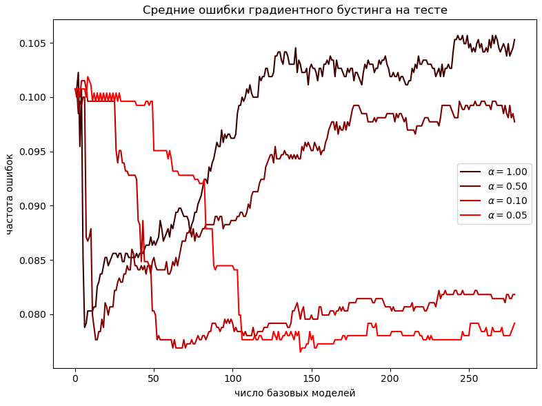
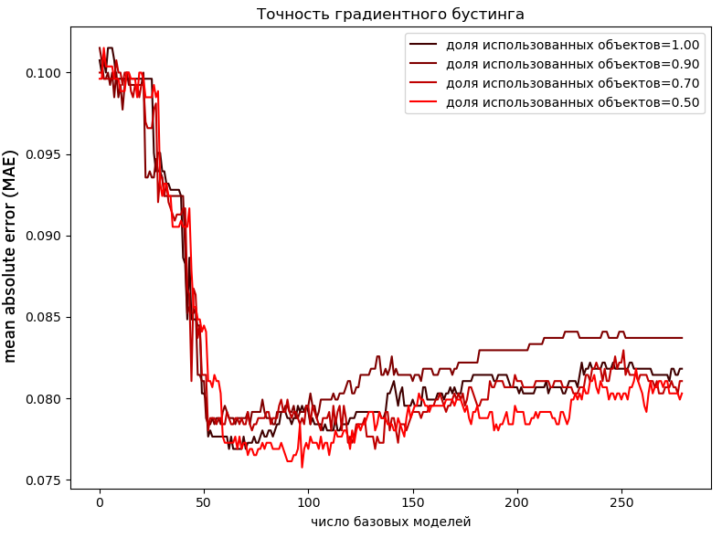
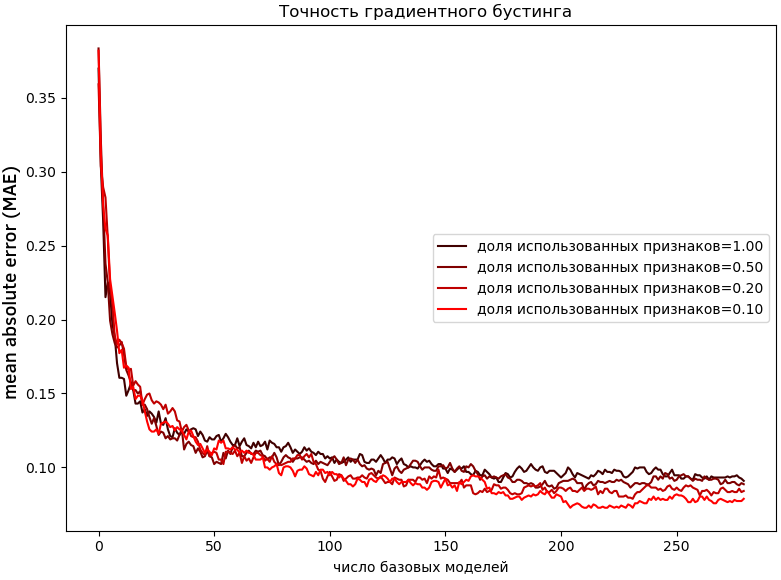

# Улучшения градиентного бустинга

Есть две популярные техники, призванные улучшить качество итоговой модели градиентного бустинга - сжатие и сэмплирование.

## Сжатие

В традиционном градиентном бустинге обновление ансамбля происходит добавлением новой базовой модели с коэффициентом (если модель - решающее дерево, то без коэффициента):

$$
G_{m}(\mathbf{x}):=G_{m-1}(\mathbf{x})+\varepsilon_m f_m(\mathbf{x})
$$

Идея **сжатия** (shrinkage) основана на том, чтобы добавлять $\varepsilon_m f_m(\mathbf{x})$ не полностью, а с некоторым малым коэффициентом  $\alpha\in (0,1]$:

$$
G_{m}(\mathbf{x}):=G_{m-1}(\mathbf{x})+{\color{red}\alpha} \varepsilon_m f_m(\mathbf{x})
$$

:::tip Константный шаг

В случае обновления ансамбля с фиксированным шагом

$$
G_{m}(\mathbf{x}):=G_{m-1}(\mathbf{x})+\varepsilon f_m(\mathbf{x})
$$

домножать отдельно на $\alpha$ смысла нет, так как достаточно просто уменьшить множитель $\varepsilon\in(0,1]$.

:::

Чем базовых моделей в ансамбле больше, тем весь ансамбль в среднем получается точнее, поскольку модели отчасти компенсируют ошибки друг друга. Сжатие позволяет <u>искусственно увеличить число базовых моделей в ансамбле</u>, снижая вклад каждой базовой модели в отдельности. Чем гиперпараметр $\alpha$ меньше, тем больше шагов $\hat{M}$ потребуется произвести, чтобы дойти до оптимального решения, поскольку двигаться мы будем более малыми шагами. Вместе они связаны следующим соотношением:

$$
\alpha \hat{M} \approx const
$$

> Например, если двигаться с уменьшенным шагом в десять раз, то потребуется в 10 раз больше итераций. 

Такая модификация улучшает качество прогнозов за счёт того, что алгоритм точнее сойдётся к оптимуму. Обычно выбирают $\alpha \sim 0.01-0.1$. 

Цена повышения точности - <u>увеличение вычислительных ресурсов</u>, поскольку придётся дольше обучать ансамбль, а также производить больше вычислений, чтобы строить каждый прогноз увеличенным числом базовых моделей.

Рассмотрим задачу классификации. Пример зависимости точности градиентного бустинга от числа базовых моделей для различных значений $\alpha$ приведён ниже:

Как видим, уменьшение $\alpha$ приводит к более высокому числу базовых моделей в оптимальной конфигурации. Зато точность ансамбля повышается!

:::tip Ускоренный поиск лучшей конфигурации

Чтобы найти наилучшую конфигурацию бустинга быстрее, поступают следующим образом:

1. С большим $\alpha$ по сетке значений настраивают параметры градиентного бустинга. Это включает оптимальное число базовых моделей $\hat{M}$, глубину решающих деревьев, критерий неопределённости при их настройке и прочие гиперпараметры.

2. Уменьшают $\alpha$ в $K$ раз: 
   
   $$
   \alpha:=\alpha/K
   $$

3. Увеличивают оптимальное число базовых моделей в $K$ раз:
   
   $$
   \hat{M}:=\hat{M}*K
   $$

В итоге получаем готовую модель, настройка гиперпараметров которой производилась быстрее по её вычислительно эффективной аппроксимации!

:::

## Сэмплирование

В обычной реализации бустинга каждая базовая модель $f_m(\mathbf{x})$ настраивается, используя все объекты и признаки обучающей выборки.

Идея **сэмплирования** (subsampling) заключается в том, чтобы настраивать каждую базовую модель, используя случайную подвыборку из объектов и признаков, сэмплируемых <u>без возвращения</u>. В результате: 

- настройка бустинга производится быстрее; 

- базовые модели становятся более разнообразными, что повышает итоговую точность ансамбля исходя из [разложения неоднозначности](../Model-ensembles/Mathematical-justifications#уточнение-прогнозов-при-неравномерном-усреднении). 

> Поскольку для каждой базовой модели подмножество используемых объектов и признаков <u>своё</u>, а ансамбль состоит из большого числа таких моделей, то итоговая модель будет зависеть почти от всех объектов и признаков.

Настройка базовых моделей бустинга по подмножеству объектов также позволяет использовать [out-of-bag оценку](../Model-ensembles/Sample-based-base-models#оценка-out-of-bag) для оценки качества ансамбля, не прибегая к дополнительной валидационной выборке.

:::tip Гиперпараметры сэмплирования

При использовании сэмплирования возникают гиперпараметры:

- доля сэмплируемых объектов;

- доля сэмплируемых признаков.

Для оптимальной точности метода их необходимо настроить, используя [отдельную валидационную выборку или кросс-валидацию](../Base-concepts/Quality-estimation).

:::

Рассмотрим задачу регрессии. Пример зависимости средней ошибки [MAE](../Regression-evaluation/Regression-evaluation-metrics#mean-absolute-error-mae) на тестовой выборке от доли использованных объектов приведён ниже:

Далее приведён пример зависимости от числа сэмплируемых признаков:

В приведённых примерах настройка базовых моделей не на всех, а на случайной части объектов и признаков привела к улучшению точности ансамбля. 

:::warning Выбор гиперпараметров

В отличие от $\alpha$, которое чем меньше, тем лучше при достаточном числе базовых моделей, зависимость от доли используемых объектов и признаков сложна и неоднозначна и требует тщательного подбора по [валидационной выборке или кросс-валидации](../Base-concepts/Quality-estimation).

:::

Идея использования не всех объектов, а случайной подвыборки при настройке базовых моделей была предложена в [[1]](https://www.researchgate.net/publication/222573328_Stochastic_Gradient_Boosting). Механизмы shrinkage и subsampling также описаны в [[2]](https://hastie.su.domains/ElemStatLearn/).

## Поиск разбиений по сетке

При использовании решающих деревьев в качестве базовых моделей бустинга вместо того, чтобы перебирать все допустимые пороги, можно перебирать пороги только по грубой сетке значений. Для этого рекомендуется использовать 10,20,30, ... 90% квантильные значения признака для объектов, <u>попадающих в соответствующий узел дерева</u>. Можно использовать и другую сетку квантизации. Это ускоряет выбор правил при настройке решающих деревьев, снижая точность подгонки под данные. Но высокая точность в бустинге нам и не нужна, поскольку неточности в настройке текущей базовой модели исправят последующие модели ансамбля. 

Подобная квантизация порогов используется, например, в алгоритме xgBoost [[3]](https://dl.acm.org/doi/abs/10.1145/2939672.2939785).

## Литература

1. [Friedman J. H. Stochastic gradient boosting //Computational statistics & data analysis. – 2002. – Т. 38. – №. 4. – С. 367-378.](https://www.researchgate.net/publication/222573328_Stochastic_Gradient_Boosting)

2. [Hastie T., Tibshirani R., Friedman J. The Elements of Statistical Learning: Data Mining, Inference, and Prediction. – Springer Science & Business Media, 2009.](https://hastie.su.domains/ElemStatLearn/)

3. [Chen T., Guestrin C. Xgboost: A scalable tree boosting system //Proceedings of the 22nd acm sigkdd international conference on knowledge discovery and data mining. – 2016. – С. 785-794.](https://dl.acm.org/doi/abs/10.1145/2939672.2939785)
