# Иллюстрация работы градиентного бустинга по шагам

Рассмотрим визуализацию работы градиентного бустинга:

$$
G_m(\mathbf{x})=f_0(\mathbf{x})+\varepsilon f_1(\mathbf{x})+\varepsilon f_2(\mathbf{x})+...+\varepsilon f_m(\mathbf{x}),
$$

$$
m=1,2,3,...,
$$

где

- $f_0(\mathbf{x})\equiv 0$;

- $f_1(\mathbf{x}),f_2(\mathbf{x}),...$ - решающие деревья глубины 3;

- $\varepsilon=0.3$.

Для простоты визуализации рассмотрим двумерное признаковое пространство 

$$
\mathbf{x}=[x^1,x^2]
$$

Будем строить целевую зависимость $y(\mathbf{x})$ и текущее приближение $G_m(\mathbf{x})$ на левом графике, а ошибку $y(\mathbf{x})-G_m(\mathbf{x})$ и следующую базовую модель $f_{m+1}(\mathbf{x})$ - на правом.

$$
m=0:
$$

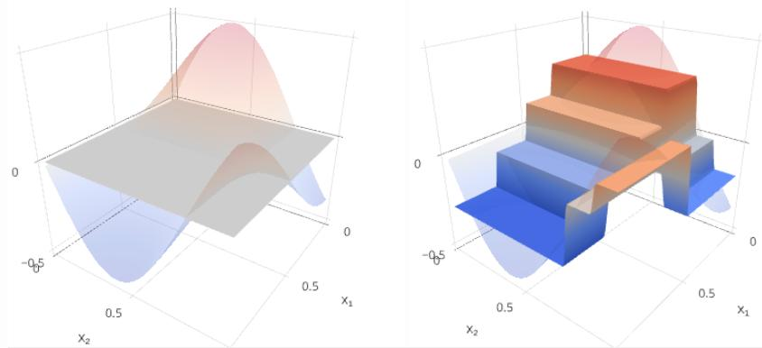

$$
m=1:
$$

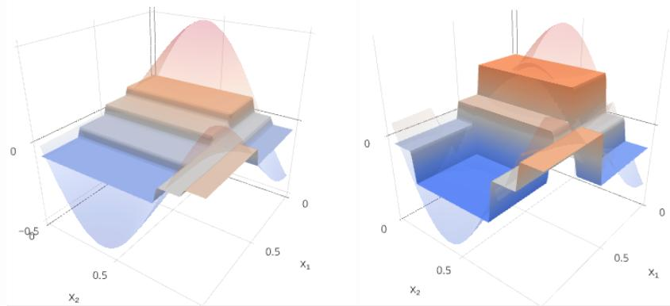

$$
m=2:
$$

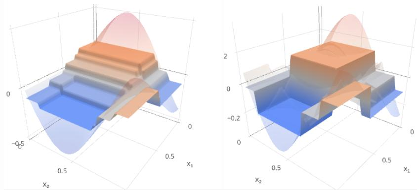

$$
m=3:
$$

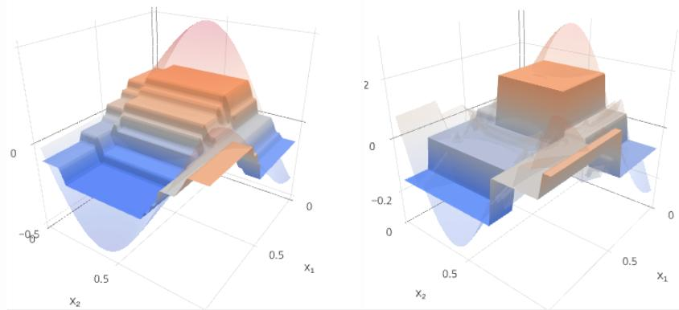

$$
m=4:
$$

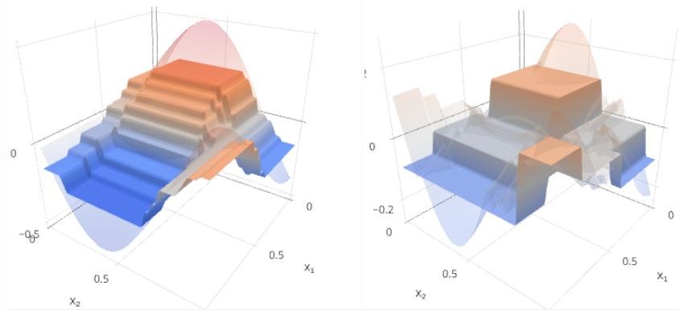

$$
m=5:
$$

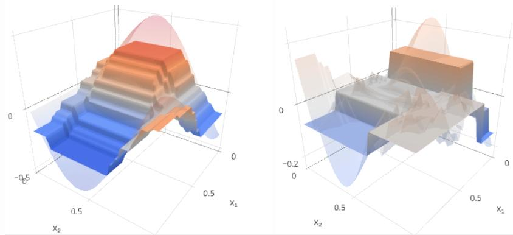

$$
m=6:
$$

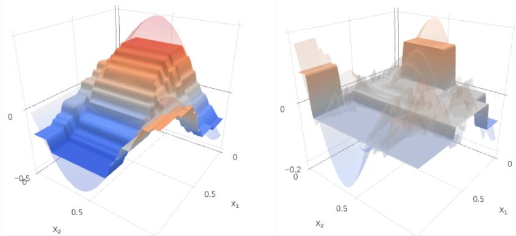

$$
m=7:
$$

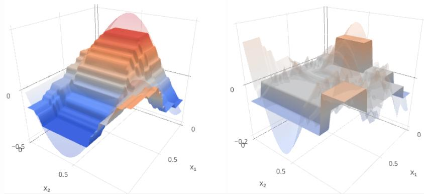

$$
m=8:
$$

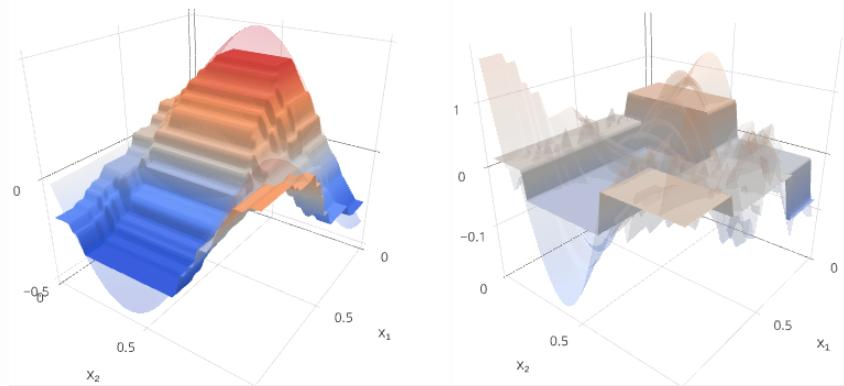

$$
m=9:
$$

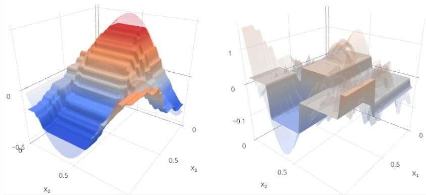

$$
m=10:
$$

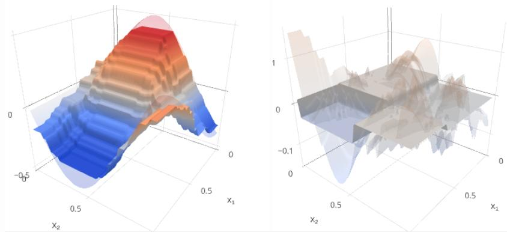

Как видим, с ростом $m$ отклонение прогноза от истинного значения уменьшается и становится более шумным. Скачки в ошибке возникают на местах разбиения признакового пространства узлами деревьев.

Результаты работы были получены, используя интерактивный визуализатор Алексея Рогожникова [[1]](https://arogozhnikov.github.io/2016/06/24/gradient_boosting_explained.html), в котором можно отобразить работу бустинга и при других пользовательских настройках.

## Литература

1. [Brilliantly wrong: Gradient Boosting explained.](https://arogozhnikov.github.io/2016/06/24/gradient_boosting_explained.html) 

