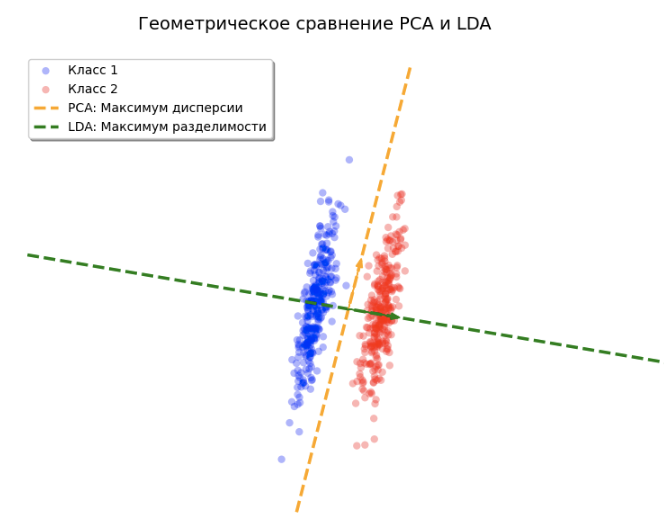

# Снижение размерности методом LDA

Ранее мы изучили [линейный дискриминантный анализ](../Generative-classification-models/Linear-discriminant-analysis) (Linear Discriminant Analysis, LDA) как вероятностную модель, основанную на предположении о нормальном распределении признаков внутри каждого класса с <u>общей ковариационной матрицей</u> $\Sigma$:

$$
p(\boldsymbol{x} | y) = \frac{1}{(2\pi)^{D/2} |\Sigma|^{1/2}} \exp \left( -\frac{1}{2} (\boldsymbol{x} - \boldsymbol{\mu}_y)^T \Sigma^{-1} (\boldsymbol{x} - \boldsymbol{\mu}_y) \right)
$$

Однако данный метод популярен не только как [метод классификации](../Generative-classification-models/Generative-models), но и как метод [снижения размерности с учителем](Dimensionality-reduction#типы-снижения-размерности), поскольку он позволяет строить информативные проекции данных в пространство низкой размерности, <u>учитывая метки классов</u>.

Учёт меток позволяет находить направления, проекции на которые лучше дискриминируют классы, как показано на рисунке ниже, на котором показана одна главная компонента, извлечённая методом LDA и PCA:

Главная компонента метода PCA (оранжевая) учитывает только направления максимального разброса признаков, что не всегда сочетается с качеством разделения классов, как в приведённом случае. В методе LDA подбирается такое направление (зелёное), вдоль которого классы классы лучше всего разделены.

## Геометрия ближайших центроидов

Рассмотрим [дискриминантную функцию LDA](../Generative-classification-models/Linear-discriminant-analysis#вывод-дискриминантной-функции):

$$
g_y(\boldsymbol{x}) = -\frac{1}{2} (\boldsymbol{x} - \boldsymbol{\mu}_y)^T \Sigma^{-1} (\boldsymbol{x} - \boldsymbol{\mu}_y) + \ln p(y)
$$

Здесь выражение $(\boldsymbol{x} - \boldsymbol{\mu}_y)^T \Sigma^{-1} (\boldsymbol{x} - \boldsymbol{\mu}_y)$ представляет собой квадрат [расстояния Махаланобиса](../Metric-methods/Distance-functions#расстояние-махаланобиса) (Mahalanobis distance) между точкой $\boldsymbol{x}$ и центроидом класса $\boldsymbol{\mu}_y$.

> Таким образом, LDA можно интерпретировать как **метод ближайшего центроида** (nearest centroid method), где расстояние измеряется с учётом корреляционной структуры данных ($\Sigma$), а выбор класса корректируется на априорную вероятность класса $\ln p(y)$.

### Декорреляция данных

Расстояние Махаланобиса легко свести к обычному евклидову расстоянию через преобразование **декорреляции** (decorrelation):

$$
\boldsymbol{x}^* = \Sigma^{-1/2} \boldsymbol{x}
$$

Покажем, что в новом декоррелированном пространстве после указанного преобразования расстояние становится евклидовым:

$$
d_{\Sigma}^2(\boldsymbol{x}, \boldsymbol{\mu}_y) = (\boldsymbol{x} - \boldsymbol{\mu}_y)^T \Sigma^{-1} (\boldsymbol{x} - \boldsymbol{\mu}_y)
$$

$$
= (\boldsymbol{x} - \boldsymbol{\mu}_y)^T (\Sigma^{-1/2})^T \Sigma^{-1/2} (\boldsymbol{x} - \boldsymbol{\mu}_y)
$$

$$
= (\Sigma^{-1/2}(\boldsymbol{x} - \boldsymbol{\mu}_y))^T (\Sigma^{-1/2}(\boldsymbol{x} - \boldsymbol{\mu}_y)) = \|\boldsymbol{x}^* - \boldsymbol{\mu}_y^*\|^2
$$

:::tip Геометрическая интерпретация
Декоррелирующее преобразование $\Sigma^{-1/2}$ преобразует пространство таким образом, что эллипсоидальное облако исходных объектов превращается в сферическое распределение декоррелированных точек. Далее в этом пространстве вычисляется обычное евклидово расстояние.
:::

:::tip Декоррелирование векторов-строк

Если $\boldsymbol{x}^T$ - вектор-строка (а не вектор-столбец), то декоррелирующее преобразование 

$$
\boldsymbol{x}^* = \Sigma^{-1/2} \boldsymbol{x}
$$

после транспонирования будет

$$
(\boldsymbol{x}^*)^T = \boldsymbol{x}^T \Sigma^{-1/2}
$$

Мы воспользовались свойством $(\Sigma^{-1/2})^T=\Sigma^{-1/2}$ для симметричной матрицы $\Sigma$.

:::

## Неявное снижение размерности

Важной особенностью классификатора LDA является <u>скрытое снижение размерности</u>. Метод производит классификацию, сравнивая расстояния от целевого объекта $\boldsymbol{x}$ до каждого из центроидов $\boldsymbol{\mu}_1, \dots, \boldsymbol{\mu}_C$ в $D$-мерном пространстве. Указанные $C$ центроидов порождают некоторое аффинное подпространство размерности не более **$C-1$**.

При поиске ближайшего центроида (в декоррелированном пространстве) мы можем полностью игнорировать любые отклонения объекта, которые перпендикулярны этому подпространству, так как они вносят одинаковый вклад в расстояние до каждого класса. 

## Метод проекций (Reduced-Rank LDA)

Для снижения размерности до уровня $K \le C-1$ (например, до $K=2$ для визуализации), мы должны выбрать наиболее информативное подпространство. Будем считать таким то подпространство, в котором проекции центроидов максимально разнесены с учётом мощности каждого центроида (числа объектов в соответствующем классе).

Для этого применяется метод главных компонент (PCA), но для центроидов с учётом их веса (числа объектов в соответствующем кластере):

1. Находится общая матрица ковариации $\Sigma$ исходных данных.
2. Вычисляется матрица центроидов $M\in\mathbb{R}^{C \times D}$. 
3. Проводится декорреляция центроидов: $M^* = M \Sigma^{-1/2}$.
4. Вычисляется **межклассовая матрица разброса** $B^*$ для трансформированных средних с учётом <u>частотности классов</u> $\pi_y = p(y)$:

$$
B^* = \sum_{y=1}^C \pi_y (\boldsymbol{\mu}_y^* - \bar{\boldsymbol{\mu}}^*)(\boldsymbol{\mu}_y^* - \bar{\boldsymbol{\mu}}^*)^T
$$

Здесь $\bar{\boldsymbol{\mu}}^* = \sum \pi_y \boldsymbol{\mu}_y^*$ — общее среднее в новом пространстве. 

Затем находится $K$ собственных векторов $\boldsymbol{v}^*_{k}$, $k=1,2,...K$ матрицы $B^*$, отвечающих $K$ максимальным собственным значениям (главные компоненты). Эти векторы определяют направления в декоррелированном пространстве, вдоль которых центроиды классов имеют <u>максимальный разброс</u>.

## Ограничение на количество компонент

Метод LDA позволяет извлечь не более $C-1$ информативных направлений, поскольку справедливо следующее утверждение: 

**Утверждение:**

Ранг матрицы $B^* = \sum_{y=1}^C \pi_y (\boldsymbol{\mu}_y^* - \bar{\boldsymbol{\mu}}^*)(\boldsymbol{\mu}_y^* - \bar{\boldsymbol{\mu}}^*)^T$ не превосходит $C-1$.

**Доказательство:**

Матрица $B^*$ является суммой $C$ внешних произведений векторов вида $(\boldsymbol{\mu}_y^* - \bar{\boldsymbol{\mu}}^*)$. Заметим, что по определению общего среднего $\bar{\boldsymbol{\mu}}^* = \sum \pi_y \boldsymbol{\mu}_y^*$ выполняется условие:

$$
\sum_{y=1}^C \pi_y (\boldsymbol{\mu}_y^* - \bar{\boldsymbol{\mu}}^*) = \sum \pi_y \boldsymbol{\mu}_y^* - \bar{\boldsymbol{\mu}}^* \sum \pi_y = \bar{\boldsymbol{\mu}}^* - \bar{\boldsymbol{\mu}}^* = \boldsymbol{0}
$$

Это означает, что векторы отклонений центроидов линейно зависимы. Следовательно, подпространство, натянутое на эти векторы, имеет размерность не более $C-1$. Ранг матрицы $B^*$ (и количество её ненулевых собственных чисел) также ограничен этой величиной.

$\square$

:::warning Практическое следствие
Если в вашей задаче всего 2 класса (бинарная классификация), LDA всегда предложит только <u>одну главную компоненту</u> (проекцию на прямую), даже если исходных признаков тысячи. Для визуализации данных в 2D (на плоскости) методом LDA требуется наличие как минимум 3-х классов.
:::

## Направления в исходном пространстве

Чтобы спроецировать исходный объект $\boldsymbol{x}$ на $k$-ю дискриминантную ось, нам нужно найти соответствующий вектор весов $\boldsymbol{v}_{k}$ в исходном признаковом пространстве. 

Как было показано ранее, результат проекции $z_{k}$ в декоррелированном пространстве равен:

$$
z_{k} = (\boldsymbol{v}^*_{k})^T \boldsymbol{x}^* = (\boldsymbol{v}^*_{k})^T \Sigma^{-1/2} \boldsymbol{x} = (\Sigma^{-1/2}\boldsymbol{v}^*_{k})^T \boldsymbol{x}
$$

Следовательно, искомый вектор направления выражается формулой:

$$
\boldsymbol{v}_{k} = \Sigma^{-1/2} \boldsymbol{v}^*_{k}
$$

## Снижение размерности

Для поиска новых признаков, равных проекциям $\boldsymbol{x}$ на найденные направления, нужно скалярно перемножить $\boldsymbol{x}$ на каждое направление:

$$
[x^1,x^2,...x^D] \to [\boldsymbol{v_1}^T\boldsymbol{x},\:\boldsymbol{v_2}^T\boldsymbol{x},\:...\:\boldsymbol{v_K}^T\boldsymbol{x}]
$$

В векторном виде это можно записать как

$$
\boldsymbol{z} = V^T \boldsymbol{x},
$$

где $V = [\boldsymbol{v}_1, \boldsymbol{v}_2, \dots, \boldsymbol{v}_K]$ — матрица размера $D \times K$, столбцы которой являются найденными направлениями.

## Свойства метода

Векторы $\boldsymbol{v}^*_1, \dots, \boldsymbol{v}^*_K$, будучи главными компонентами в декоррелированном пространстве, имеют единичную норму и взаимно ортогональны:

$$
(\boldsymbol{v}^*_i)^T \boldsymbol{v}^*_j = \mathbb{I}\{i=j\}
$$

Однако это свойство не сохраняется для соответствующих дискриминантных направлений $\boldsymbol{v}_k$ в исходном пространстве. 

Визуально в исходном пространстве оси LDA могут выглядеть как пересекающиеся под <u>произвольным углом</u>. Это происходит потому, что LDA «подстраивается» под эллиптическую форму облака данных.

Таким образом, при переходе к исходным признакам мы жертвуем привычной евклидовой ортонормированностью векторов ради сохранения сильных дискриминирующих свойств новых признаков.

Однако для этих векторов справедливо следующее свойство:

$$
\begin{aligned}
\boldsymbol{v}_i^T \Sigma \boldsymbol{v}_j &= (\Sigma^{-1/2} \boldsymbol{v}^*_i)^T \Sigma (\Sigma^{-1/2} \boldsymbol{v}^*_j) \\
&= (\boldsymbol{v}^*_i)^T (\Sigma^{-1/2})^T \Sigma \Sigma^{-1/2} \boldsymbol{v}^*_j \\
&= (\boldsymbol{v}^*_i)^T \Sigma^{-1/2} \Sigma \Sigma^{-1/2} \boldsymbol{v}^*_j \\
&= (\boldsymbol{v}^*_i)^T I \boldsymbol{v}^*_j = \mathbb{I}\{i=j\}
\end{aligned}
$$

Отсюда следует следующее важное свойство проекций на дискриминантные направления:

**Утверждение: нескоррелированность признаков**

Новые признаки $z^i$, полученные путём проекции центрированных данных на дискриминантные направления $\boldsymbol{v}_i$, нескоррелированы между собой и имеют единичную дисперсию.

**Доказательство:**

Рассмотрим ковариацию между двумя новыми признаками $z^i$ и $z^j$. Поскольку исходные признаки центрированы ($\mathbb{E}[\boldsymbol{x}] = \boldsymbol{0}$), математическое ожидание проекций также равно нулю: $\mathbb{E}[z^i] = \mathbb{E}[\boldsymbol{v}_i^T \boldsymbol{x}] = 0$. 

Тогда ковариация записывается как:

$$
\text{cov}(z^i, z^j) = \mathbb{E}[z^i z^j] = \mathbb{E}[(\boldsymbol{v}_i^T \boldsymbol{x})(\boldsymbol{x}^T \boldsymbol{v}_j)]
$$

Воспользуемся линейностью математического ожидания и вынесем векторы весов за знак оператора:

$$
\text{cov}(z^i, z^j) = \boldsymbol{v}_i^T \mathbb{E}[\boldsymbol{x} \boldsymbol{x}^T] \boldsymbol{v}_j = \boldsymbol{v}_i^T \Sigma \boldsymbol{v}_j
$$

Используя ранее доказанное свойство $\boldsymbol{v}_i^T \Sigma \boldsymbol{v}_j = \mathbb{I}\{i=j\}$, получаем:

$$
\text{cov}(z^i, z^j) = \mathbb{I}\{i=j\}
$$

Таким образом, при $i \neq j$ ковариация (а значит, и корреляция) равна нулю. При $i = j$ получаем дисперсию $i$-го признака, которая будет равна единице.

$\square$

Дополнительно о методе LDA для снижения размерности вы можете прочитать в [[1]](https://hastie.su.domains/ElemStatLearn/). Этот метод реализован в библиотеке scikit-learn [[2]](https://scikit-learn.org/stable/modules/lda_qda.html#mathematical-formulation-of-lda-dimensionality-reduction).

## Литература

1. [Hastie T., Tibshirani R., Friedman J. The Elements of Statistical Learning: Data Mining, Inference, and Prediction. – Springer Science & Business Media, 2009.](https://hastie.su.domains/ElemStatLearn/)
2. [Документация scikit-learn: Linear and Quadratic Discriminant Analysis.](https://scikit-learn.org/stable/modules/lda_qda.html#mathematical-formulation-of-lda-dimensionality-reduction)
