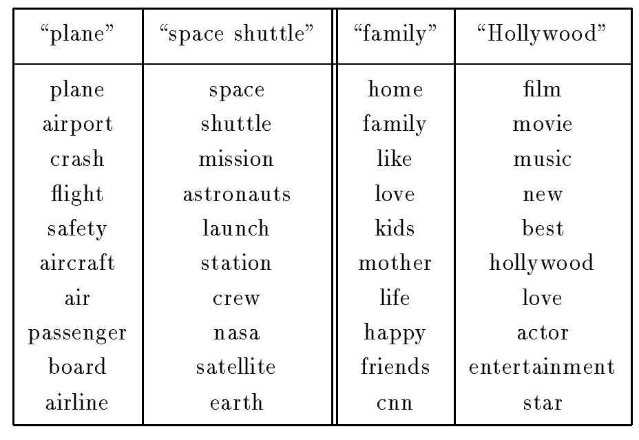

# Тематическое моделирование

Рассмотрим работу с текстовыми данными, представляющими собой набор текстовых документов.

Стандартное представление документов вида «[мешок слов](../Data-preprocessing/Preprocessing-text-data)» (bag-of-words) порождает признаковое пространство высокой размерности, равной числу уникальных слов текстовой коллекции, которое имеет порядок нескольких десятков или даже сотен тысяч уникальных слов. В таком высокоразмерном пространстве признаков модели легко [переобучаются](../Base-concepts/Generalization-ability), а [интерпретация](../Simple-models-interpretation/Interpretable-machine-learning) объектов и моделей затруднена из-за слишком большого числа признаков.

Однако слова в языке не независимы: они группируются в <u>скрытые темы</u> (latent topics). 

> Например, слова «инфляция», «банк» и «кредит» часто встречаются вместе, сигнализируя о финансовой тематике текста.
> 
> А слова «модель», «переобучение» и «бустинг», в свою очередь, выражают тему машинного обучения. 

**Тематическое моделирование** (topic modeling) — это метод снижения размерности для текстовых данных, в котором объект (являющийся документом) представляется не как набор слов, а как распределение по темам. Это позволяет <u>сжать информацию</u> и находить семантически близкие документы, даже если в них нет общих слов.

> Пример: "ремонт машины" и "обслуживание автомобиля" семантически близки, хоть и состоят из разных слов. 

Анализируя же вектора полученных тем, можно быстро составить общее представление о типах текстов в большой текстовой коллекции.

> Например, если документы - это обращения пользователей в справочную службу, то, используя тематическое моделирование, мы можем быстро понять, по каким основным темам у пользователей возникают вопросы.

Каждый документ $d$ представляется последовательностью слов длины $n_d$:

$$
w^d_1 w^d_2 ... w^d_{n_d}
$$

В тематическом моделировании предполагается предполагается двухуровневая вероятностная модель порождения каждого слова в документе:

1. Сначала сэмплируется тема из распределения тем в документе.

2. Затем из темы сэмплируется уже само слово.

По итогам настройки тематической модели автоматически определяются:

- Основные темы текстовой коллекции, где каждая тема - это распределение на словах. Для интерпретации каждой темы визуализируют топ-K самых популярных слов темы.

- Распределение тем в каждом документе (что даёт высокоуровневое семантическое описание каждого документа, с которым просто работать, а не низкоуровневое описание на уровне отдельных слов).

В тематических моделях требуется заранее задавать число тем - это внешний гиперпараметр. Настроив темы, можно в онлайн-режиме восстанавливать их распределение в новых документах без переобучения модели на всех данных.

## Вероятностный латентно-семантический анализ (PLSA)

Впервые тематическое моделирование было предложено в методе **вероятностный латентно-семантический анализа** (Probabilistic Latent Semantic Analysis, PLSA [[1]](https://dl.acm.org/doi/pdf/10.1145/312624.312649)).

Пусть у нас есть набор из $N$ документов и словарь из $D$ слов. Мы предполагаем наличие $T$ скрытых тем. Появление слова $w$ в документе $d$ моделируется через описанный выше двухуровневый вероятностный процесс порождения темы $t$, а затем уже порождения слова $w$ в рамках темы $t$. Итоговая вероятность появления слова тогда по формуле полной вероятности записывается следующим образом:

$$
p(w | d) = \sum_{i=1}^T p(w | t=i) p(t=i | d)=\sum_{i=1}^T \boldsymbol{\theta}^d_i \boldsymbol{\phi}^i_w,
$$

где мы использовали обозначения:

- $\boldsymbol{\theta}^d = [p(t=1|d),\:p(t=2|d),\:...\:p(t=T|d)]$ - распределение тем в документе $d$

- $\boldsymbol{\phi}^i=[p(w=1|t=i),\:p(w=2|t=i),\:...\:p(w=D|t=i)]$ - распределение слов в теме $i$.

### Настройка модели

Для настройки используется **метод максимального правдоподобия** (Maximum Likelihood Estimation). Мы максимизируем логарифм вероятности всей коллекции текстов:

$$
\sum_{n=1}^N \sum_{i=1}^D n(d_n, w^i) \ln p(w^i | d_n) \to \max_{\boldsymbol{\theta}, \boldsymbol{\phi}}
$$

где $n(d_n, w^i)$ — количество вхождений слова $i$ в документ $n$. Оптимизация  проводится с помощью **EM-алгоритма** (Expectation-Maximization algorithm [[2]](https://ru.wikipedia.org/wiki/EM-%D0%B0%D0%BB%D0%B3%D0%BE%D1%80%D0%B8%D1%82%D0%BC)).

В результате настройки модели мы получаем: 

- компактное семантическое представление каждого документа в виде распределения представленных в нём тем: $d\to \boldsymbol{\theta}^d\in\mathbb{R}^T$.

- расшифровку каждой темы в виде распределения слов в ней: $t\to \boldsymbol{\phi}^i \in \mathbb{R}^D$.

Пример нескольких автоматически извлечённых тем из коллекции TDP-1 представлен ниже [[1]](https://dl.acm.org/doi/pdf/10.1145/312624.312649):

## Латентное размещение Дирихле (LDA)

**Латентное размещение Дирихле** (Latent Dirichlet Allocation, LDA [[3]](https://www.jmlr.org/papers/volume3/blei03a/blei03a.pdf)) является развитием PLSA. В этой модели параметры $\boldsymbol{\theta}^d$ и $\boldsymbol{\phi}^t$ сами являются не настраиваемыми параметрами, а сами являются случайными величинами, подчиняющимися **распределению Дирихле** [[4]](https://en.wikipedia.org/wiki/Dirichlet_distribution).

> Распределение Дирихле выбрано потому, что для него проще получить оценку модели через байесовский вывод.

### Формулы и гиперпараметры

В LDA вводится иерархический процесс:

1. Для каждого документа $d$ сэмплируется вектор распределения тем: $\boldsymbol{\theta}^d \sim \text{Dir}(\alpha)$.
2. Для каждой темы $t$ сэмплируется вектор распределения слов: $\boldsymbol{\phi}^t \sim \text{Dir}(\beta)$.

Модель LDA гибче модели PLSA тем, что введённые гиперпараметры $\alpha$ и $\beta$ позволяют контролировать распределения слов в темах и распределение тем в документах:

* **Концентрация тем** $\boldsymbol{\alpha}$ определяет <u>разреженность тем в документах</u>. При малых $\alpha$ документ будет значимо содержать всего 1–3 темы, а при больших — будет содержать все темы с большими весами. Обычно берут $\alpha$ малой, поскольку стандартные документы содержат небольшое число тем.
* **Концентрация слов** $\boldsymbol{\beta}$ определяет <u>разреженность слов в темах</u>. Малые $\beta$ заставляют темы состоять в основном всего из нескольких характерных слов, а при увеличении гиперпараметра распределение слов в темах становится более равномерным. Обычно берут $\beta$ малой чтобы сделать каждую тему более интерпретируемой за счёт узкой специализации.

С кодом настройки LDA-модели можно ознакомиться в [[5]](https://scikit-learn.org/stable/auto_examples/applications/plot_topics_extraction_with_nmf_lda.html) (библиотека scikit-learn) и в [[6]](https://www.geeksforgeeks.org/nlp/topic-modeling-using-latent-dirichlet-allocation-lda/) (библиотека gensim).

## Основные сценарии использования

1. **Высокоуровневая обработка текстов** на основе не низкоуровневого многомерного представления (слов), а на основе высокоуровневого маломерного представления (тем) - классификация, суммаризация текстов, поисковая система, рекомендация новостей. 
2. **Борьба с переобучением моделей** за счёт снижения размерности признаков, описывающих тексты.
3. **Группировка документов по темам**, например, в новостных агрегаторах (по рубрикам: политика, спорт, наука, культура и т.д.).
4. **Анализ отзывов**: выделение ключевых аспектов продукта, которыми недовольны клиенты (доставка, качество, цена, ограничения функционала и т.д.).

## Литература

1. [Hofmann T. Probabilistic latent semantic indexing //Proceedings of the 22nd annual international ACM SIGIR conference on Research and development in information retrieval. – 1999. – С. 50-57.](https://dl.acm.org/doi/pdf/10.1145/312624.312649)
2. [Википедия: EM-алгоритм.](https://ru.wikipedia.org/wiki/EM-%D0%B0%D0%BB%D0%B3%D0%BE%D1%80%D0%B8%D1%82%D0%BC)
3. [Blei D. M., Ng A. Y., Jordan M. I. Latent dirichlet allocation //Journal of machine Learning research. – 2003. – Т. 3. – №. Jan. – С. 993-1022.](https://www.jmlr.org/papers/volume3/blei03a/blei03a.pdf)
4. [Wikipedia: Dirichlet distribution.](https://en.wikipedia.org/wiki/Dirichlet_distribution)
5. [Документация scikit-learn: Topic extraction with Non-negative Matrix Factorization and Latent Dirichlet Allocation.](https://scikit-learn.org/stable/auto_examples/applications/plot_topics_extraction_with_nmf_lda.html)
6. [GeeksForGeeks: Topic Modeling Using Latent Dirichlet Allocation (LDA).](https://www.geeksforgeeks.org/nlp/topic-modeling-using-latent-dirichlet-allocation-lda/)
