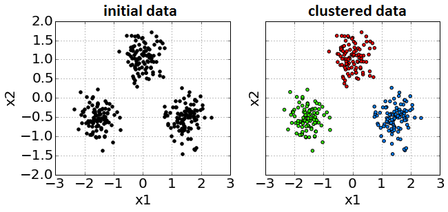
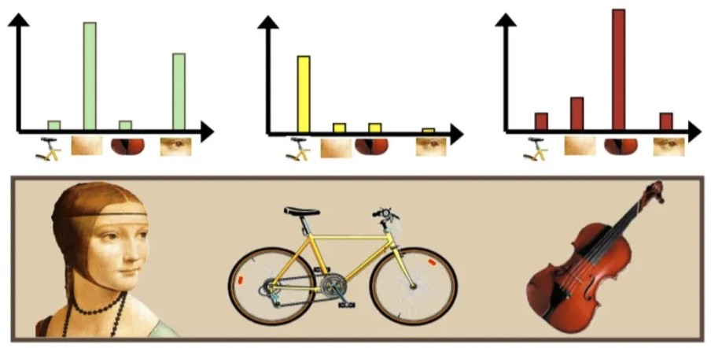

# Кластеризация данных

## Постановка задачи

**Кластеризация** — это разбиение объектов на группы, такие что:

* внутри групп объекты метрически похожи;
* объекты из разных групп метрически непохожи.

Метрическая похожесть определяется согласно дополнительно вводимой функции расстояния $\rho(\boldsymbol{x},\boldsymbol{x}')$, измеряющей степень непохожести любой пары объектов $\boldsymbol{x},\boldsymbol{x}'$ друг на друга. 

> Чаще всего используется Евклидово расстояние или его квадрат, но в целом выбор расстояния диктуется логикой задачи. Используя разные функции мы будем получать <u>разные</u> результаты кластеризации!

Это [задача обучения без учителя](../Base-concepts/Unsupervised-learning) (unsupervised learning), так как в классической постановке здесь нет правильных ответов.

Пример входных данных и результата их разбиения на кластеры показан ниже:

## Характеристики алгоритмов

На качественном уровне методы кластеризации можно сравнивать по следующим критериям:

- Используемая метрика похожести.
- Вычислительная сложность.
- Устойчивость к выбросам.
- Находится ли число кластеров автоматически или задается вручную?
- Гибкость формы извлекаемых кластеров, могут ли кластеры получаться разной плотности и быть невыпуклыми?
- Строится ли плоская или иерархическая структура?

## Применения кластеризации

Рассмотрим основные сценарии применения результатов кластеризации.

### Сегментация клиентов

Это классическая задача маркетинга. Понимание того, какие группы клиентов существуют в базе, позволяет бизнесу делать персонализированные предложения (uplift) и удерживать пользователей (churn prevention).

> **Пример:**
> Банк анализирует транзакции клиентов и выделяет кластеры:
> 
> - **«Студенты»:** много мелких транзакций в фастфуде и транспорте, малые остатки. Им предлагаем кэшбэк на развлечения.
> - **«Путешественники»:** редкие, но крупные траты в разных странах, покупка авиабилетов. Им предлагаем страховку и премиальные карты с бесплатными "милями" в виде бонусов.
> - **«Домохозяйства»:** регулярные траты в супермаркетах и аптеках. Им предлагаем скидки в продуктовых сетях.

### Классификация без обучающей выборки

Если у нас есть большой набор данных, но нет разметки (меток классов), размечать каждый объект вручную слишком дорого. Мы можем кластеризовать данные, а затем вручную просмотреть только центры кластеров или несколько случайных примеров из каждого кластера, чтобы присвоить метку всем объектам кластера. Это также называют **псевдо-разметкой** (pseudo-labeling).

> **Пример:**
> У новостного агрегатора есть 100,000 новостных статей без тегов. Алгоритм кластеризации разбивает их на группы по встречаемости слов. Редактор просматривает ключевые слова центроидов:
> 
> * Кластер 1 (слова "гол", "матч", "счет") $\to$ помечаем как "Спорт".
> * Кластер 2 (слова "индекс", "акции", "торги") $\to$ помечаем как "Финансы".
> * и т.д.
> 
> Так мы автоматически разметим тысячи статей, просмотрев лишь несколько примеров.

### Рекомендательные системы

Кластеризация позволяет строить рекомендательные системы, рекомендующие пользователям потенциально полезные им товары и услуги. Идея заключена в том, что если пользователю нравится определенный контент, то ему, скорее всего, понравится и то, что популярно в кластере похожих на него пользователей.

> **Пример:**
> Онлайн-кинотеатр группирует зрителей по истории просмотров.
> Пользователь Иван попал в кластер любителей фэнтези вместе с Марией. И Иван, и Мария высоко оценили фильмы «Хоббит» и «Аватар». Мария также посмотрела и лайкнула «Хроники Нарнии», который Иван еще не видел. Тогда система порекомендует этот фильм Ивану, так как фильм популярен в его кластере пользователей со схожими вкусами.

### Детекция выбросов

Объекты, которые не попадают ни в один кластер (находятся от них слишком далеко) или образуют очень маленькие разреженные кластеры, часто являются [аномалиями](../Base-concepts/Unsupervised-learning#обнаружение-аномалий). Выявлять подобные аномалии критически важно в финтехе и кибербезопасности.

> **Пример:**
> Система мониторинга серверов собирает метрики (CPU, RAM, трафик).
> В обычном режиме сервера работают в нескольких стандартных состояниях. Вдруг появляется точка, далекая от всех центров: CPU 100%, а трафик 0%. Это аномалия — возможно, процесс завис или идет скрытый майнинг.

### Ускорение поиска похожих объектов

Многие алгоритмы основаны на поиске ближайших соседей к объекту $\boldsymbol{x}$. Приведём примеры таких задач.  

1. **Алгоритм k-ближайших соседей (k-NN):** Поиск соседей выполняется для того, чтобы **построить прогноз** ([классификация или регрессия](../Metric-methods/KNN)). Мы ищем похожие объекты в обучающей выборке, чтобы на основе их меток предсказать метку для $\boldsymbol{x}$.
2. **Информационный поиск:** Поиск соседей выполняется для того, чтобы найти похожих представителей в базе данных. Система должна просто вернуть пользователю список объектов (картинки, документы, товары), которые наиболее похожи на запрос $\boldsymbol{x}$.

На больших данных поиск ближайших соседей полным перебором слишком медленен, поэтому данные предварительно кластеризуют, чтобы искать соседей только внутри подходящего кластера.

> **Пример:**
> Пусть мы реализуем поиск по изображениям, которые закодированы в виде компактных векторов признаков, называемых эмбеддингами. База содержит миллионы изображений. Все они предварительно кластеризованы. Когда вы загружаете фото кота, алгоритм определяет, что вектор этого фото ближе всего к кластеру, в котором сгруппированы «домашние животные / кошки». Поиск точного совпадения происходит только внутри этого кластера, игнорируя фото машин, зданий и людей.

### Отладка моделей с учителем

Когда сложная модель (например, нейросеть) ошибается, анализ ошибок вручную может быть хаотичным. Если кластеризовать ошибочно обработанные объекты, а потом рассмотреть типичные случаи в рамках каждого кластера, то ошибки модели можно изучить более системно.

> **Пример:**
> Модель автопилота распознает дорожные знаки с точностью 95%. Инженеры берут 5% ошибочных изображений и кластеризуют их. Анализ центров полученных кластеров выявляет разные типы системных сбоев:
> 
> * **Кластер 1:** Знаки, частично закрытые ветками деревьев.
> * **Кластер 2:** Знаки, на которые нанесено граффити.
> * **Кластер 3:** Знаки, залепленные снегом.
> 
> Это дает чёткое понимание разных классов проблемных случаев.

### Извлечение новых признаков

Результаты кластеризации можно использовать для генерации новых признаков, помогающих решать целевую задачу обучения с учителем.
Обычно добавляют:

1. One-hot кодирование номера кластера.
2. Расстояния до центров кластеров.

> **Пример:**
> Рассмотрим прогнозирование стоимости квартиры. Исходные признаки могут включать расположение недвижимости (широта и долгота). Линейная модель не может выучить сложную нелинейную зависимость цены от координат.
> Мы запускаем кластеризацию на координатах и получаем 10 кластеров (фактически, выделяем районы города). Добавление признака «Номер кластера» позволяет линейной модели назначать разную базовую цену для каждого района.

### Генерация признаков для структурированных данных

Кластеризация играет ключевую роль в **извлечении признаков** (feature extraction) из сложных структурированных данных, таких как изображения, видео, аудиосигналы и временные ряды.

Сырые данные (например, массив пикселей или последовательность амплитуд звука)  имеют слишком высокую размерность и содержат много шума. Также они могут различаться по длине и размерам. Чтобы применять к ним классические алгоритмы машинного обучения, необходимо перейти к их компактному векторному представлению фиксированной длины.

Общая идея подхода:

1. Сложный объект разбивается на множество локальных фрагментов (патчи изображения, короткие нарезки звука/временного ряда).
2. С помощью кластеризации находятся <u>типичные паттерны</u> (прототипы) среди всех фрагментов обучающей выборки.
3. Каждый объект описывается частотами встречаемости этих паттернов в объекте (гистограммой).

#### Пример: Bag of Visual Words

Классическим примером этого подхода в компьютерном зрении является **мешок визуальных слов** (Bag of Visual Words, BoVW). Он позволяет представить изображение в виде вектора, используя идеи из анализа текстов. Поскольку у изображений нет естественных «слов», они создаются автоматически.

Процесс состоит из следующих шагов:

1. **Извлечение признаков.** Из всего набора изображений выделяется множество локальных фрагментов или дескрипторов особых точек.
2. **Создание визуального словаря.** Выделенные фрагменты кластеризуются. Полученные центры кластеров объявляются «визуальными словами», а их совокупность образует словарь (codebook).
3. **Квантование.** Каждый фрагмент конкретного изображения заменяется на ближайшее к нему «визуальное слово» (центр кластера) из словаря.
4. **Построение гистограммы.** Изображение описывается итоговым вектором, в котором записано, сколько раз каждое «визуальное слово» встретилось на этом изображении.

Визуальные слова и частоты их встречаемости проиллюстрированы ниже [[1]](https://medium.com/@aybukeyalcinerr/bag-of-visual-words-bovw-db9500331b2f).

По распределению визуальных слов уже не составит большого труда обучить классификатор, умеющий различать на изображениях, как в примере выше, лица, велосипеды и скрипки.

## Литература

1. [medium.com: Bag Of Visual Words.](https://medium.com/analytics-vidhya/bag-of-visual-words-bag-of-features-9a2f7aec7866)
