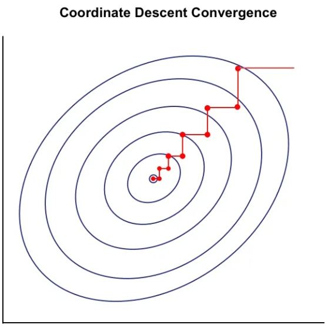

# Кластеризация K представителями

**Кластеризация K представителями** (representative-based clustering) обладает следующими свойствами:

1. Кластеризация плоская (не иерархическая).
2. Число кластеров $K$ задается пользователем.
3. Каждый объект $\mathbf{x}_n$ соотносится с одним и только одним кластером $z_n \in \{1, 2, \dots, K\}$.

Каждый кластер $k$ определяется своим центром (называемым также центроидом или представителем) $\boldsymbol{\mu}_k$, где $k=1,2,...K$.

В общем виде решается задача оптимизации суммарного отклонения объектов от центров их кластеров:

$$
\tag{1} \mathcal{L}(z_{1},...z_{N};\boldsymbol{\mu}_{1},...\boldsymbol{\mu}_{K})=\sum_{n=1}^{N}\rho(\mathbf{x}_{n},\boldsymbol{\mu}_{z_{n}})\to\min_{z_{1},...z_{N};\boldsymbol{\mu}_{1},...\boldsymbol{\mu}_{K}}
$$

Настраиваемыми параметрами выступают

- назначения объектам $\mathbf{x}_1,\mathbf{x}_2,...\mathbf{x}_{N}$ номеров их кластеров $z_{1},...z_{N}\in\{1,2,...K\}$;

- центры каждого кластера $\boldsymbol{\mu}_{1},...\boldsymbol{\mu}_{K}$, называемые центроидами.

## Метод оптимизации

Для решения этой задачи находится <u>локальный</u> минимум методом покоординатного спуска - в цикле поочерёдно обновляются то метки кластеров объектов при фиксированных центроидах, то сами центроиды при фиксированных метках до сходимости. Визуально метод покоординатного спуска для минимизируемого критерия с заданными линиями уровня приведён ниже [[1]](https://adeveloperdiary.com/machine%20learning/algorithm/introduction-to-coordinate-descent-using-least-squares-regression/):

## Алгоритм кластеризации $K$ представителями

Обозначим за $C_k$ индексы объектов, принадлежащих кластеру $k$:

$$
C_{k}=\left\{ n:z_{n}=k\right\}
$$

Тогда алгоритм кластеризации $K$ представителями в общем виде выглядит так:

1. Инициализировать $\boldsymbol{\mu}_1, \dots, \boldsymbol{\mu}_K$ (обычно, случайными объектами выборки).

2. Повторять до сходимости:
   
   * Для $n=1,2,...N$ обновить метки кластеров:
     
     $$
     z_n=\arg\min_k \rho(\boldsymbol{x}_n,\boldsymbol{\mu}_k)
     $$
   
   * Для $k=1,2,...K$ пересчитать центроиды кластеров:
     
     $$
     \boldsymbol{\mu}_k=\arg\min_{\boldsymbol{\mu}}\sum_{n\in C_k} \rho(\boldsymbol{x}_n,\boldsymbol{\mu})
     $$

3. **ВЕРНУТЬ** $z_1, \dots, z_N$.

Этот алгоритм представляет собой не один, а целое семейство методов кластеризации, параметризованное выбором конкретной функции расстояния $\rho(\boldsymbol{x},\boldsymbol{x}')$ между объектами:

- при $\rho(\boldsymbol{x},\boldsymbol{x}')=\|\boldsymbol{x}-\boldsymbol{x}'\|^2_2$ получим метод [K-средних](K-means);

- при $\rho(\boldsymbol{x},\boldsymbol{x}')=\|\boldsymbol{x}-\boldsymbol{x}'\|_1$ получим метод [K-медиан](K-representatives-variations#метод-k-медиан-k-medians);

:::warning Проблема локальных оптимумов:
Целевой функционал невыпуклый и содержит много локальных минимумов. Поэтому рекомендуется запускать оптимизацию несколько раз из разных случайных инициализаций и выбирать решение с <u>наименьшим значением</u> целевого критерия (1).

:::

## Критерий сходимости

В качестве **критерия сходимости** можно задать условие, что метки кластеров объектов не поменялись по сравнению с предыдущей итерацией. Это будет соответствовать <u>точной</u> сходимости алгоритма к локальному оптимуму и применимо для малых выборок. 

Для больших выборок эффективнее не дожидаться полной сходимости, а ограничиваться приближённой сходимостью, прерывая настройку досрочно, когда когда изменение положения центроидов или уменьшение значения целевой функции (1) становится меньше заданного порога.

Также на практике часто используют жесткое ограничение на максимальное количество итераций (например, 100 или 300), так как основные изменения структуры кластеров обычно происходят на начальных этапах работы алгоритма.

## Инициализация центров

Результат работы алгоритма существенно зависит от выбора начальных позиций центров $\boldsymbol{\mu}_1, \dots, \boldsymbol{\mu}_K$. Неудачная инициализация может привести к тому, что алгоритм «застрянет» в плохом решении или будет сходиться медленнее.

Рассмотрим подходы к выбору начальных представителей.

### Случайная инициализация

$K$ представителей обычно инициализируются случайными объектами обучающей выборки. Это гарантирует, что представители будут принадлежать тому же распределению, что и исходные данные.

Это самый распространённый и простой подход, но он существенно зависит от случайности. В результате могут происходить неблагоприятные инициализации:

- Несколько центров могут быть выбраны внутри одного плотного кластера, в то время как другие кластеры останутся без начальных центров. Это может привести к тому, что один кластер будет раздроблен, а несколько других ошибочно объединены.

- Центр может совпасть с объектом-выбросом, лежащим далеко от остальных объектов. В результате выделится кластер, состоящий только из этого объекта.

При использовании метода важно предварительно очистить данные от выбросов. Также, чтобы снизить чувствительность метода к случайной инициализации, рекомендуется перезапускать сходимость из разных случайных инициализаций, полученных предложенным способом, а потом выбирать наилучшее решение, дающее минимальное значение целевого критерия (1) и более-менее равномерно распределяющее объекты по кластерам.

### Усреднение случайных подвыборок

Этот метод является модификацией случайной инициализации, направленной на повышение устойчивости. Для инициализации каждого из $K$ центров мы выбираем не один случайный объект, а небольшую группу из $M$ случайных объектов, и вычисляем их среднее (или медиану) в качестве $\boldsymbol{\mu}_k$.

Этот подход снижает риск неблагоприятной инициализации за счёт присутствия объектов-выбросов (особенно при использовании [медианы](../Data-preprocessing/Feature-normalization#медиана), которая устойчива к ним). Даже если выброс попадет в подвыборку, усреднение с другими объектами притянет центр ближе к основной массе данных.

:::warning Риск сближения центров: 

При увеличении параметра $M$ по закону больших чисел средние значения разных случайных подвыборок <u>будут стремиться к общему среднему</u> для всей выборки. Близко расположенные начальные инициализации замедлят сходимость метода, поскольку потребуется больше итераций для разведения центроидов по разным кластерам. Поэтому $M$ не следует выбирать слишком большим.

:::

### K-means++

Этот метод инициализации центроидов является очень популярным и часто выбирается по умолчанию в реализации метода [K-средних](K-means). Идея состоит в том, чтобы распределить начальные центры <u>как можно дальше друг от друга</u>, но с учетом плотности данных.

**Алгоритм инициализации:**

1. Первый центр $\boldsymbol{\mu}_1$ выбирается случайно из всех объектов выборки.

2. Для каждого следующего центра $k = 2, \dots, K$:
   
   * Для каждого объекта $\mathbf{x}_n$ вычисляется квадрат расстояния до ближайшего уже выбранного центра:
     
     $$
     D(\mathbf{x}_n) = \min_{j < k} \|\boldsymbol{x}_n - \boldsymbol{\mu}_j\|^2
     $$
   
   * Новый центр $\boldsymbol{\mu}_k$ выбирается из объектов $\mathbf{x}_n$ случайным образом, но с вероятностью, пропорциональной вычисленному квадрату расстояния:
     
     $$
     P(\boldsymbol{\mu}_k = \mathbf{x}_n) = \frac{D(\boldsymbol{x}_n)}{\sum_{i=1}^N D(\boldsymbol{x}_i)}
     $$

**Детерминированный вариант**
В классическом варианте K-means++ является вероятностным алгоритмом. Однако его можно сделать <u>детерминированным</u>, если на шаге 2 выбирать не случайный объект с учетом вероятности, а объект, имеющий <u>максимальное</u> расстояние до текущих центров: $\boldsymbol{x}_{new} = \arg\max_{\boldsymbol{x}} D(\boldsymbol{x})$.
Такой подход, называемый *MaxMin* инициализацией, гарантирует воспроизводимость результата при перезапусках, но делает алгоритм чрезвычайно чувствительным к выбросам, поэтому выбросы необходимо очистить перед запуском K-means++.

### Инициализация по главной компоненте (PCA partitioning)

Этот детерминированный метод использует глобальную структуру данных. Идея состоит в том, что наибольшая вариативность данных содержится вдоль [первой главной компоненты](../Dimensionality-reduction/Finding-principal-components#первая-главная-компонента). Если «разрезать» данные вдоль этой оси, можно получить хорошее начальное приближение.

**Алгоритм:**

1. Вычислить первую главную компоненту (собственный вектор, соответствующий максимальному собственному значению ковариационной матрицы данных).
2. Спроецировать все объекты выборки на этот вектор, получив одномерный массив проекций $p_1, \dots, p_N$.
3. Разбить диапазон проекций на $K$ интервалов (по [квантилям распределения](../Data-preprocessing/Feature-normalization#p-процентная-перцентиль)), содержащих равное количество объектов.
4. В качестве начальных центров $\boldsymbol{\mu}_k$ взять средние значения объектов, попавших в каждый интервал, или просто центров этих интервалов.

Этот подход хорошо работает, когда кластера действительно распределены вдоль одного направления, но игнорирует другие направления вариативности данных.

## Литература

1. [adeveloperdiary.com: Introduction to Coordinate Descent using Least Squares Regression.](https://adeveloperdiary.com/machine%20learning/algorithm/introduction-to-coordinate-descent-using-least-squares-regression/)
