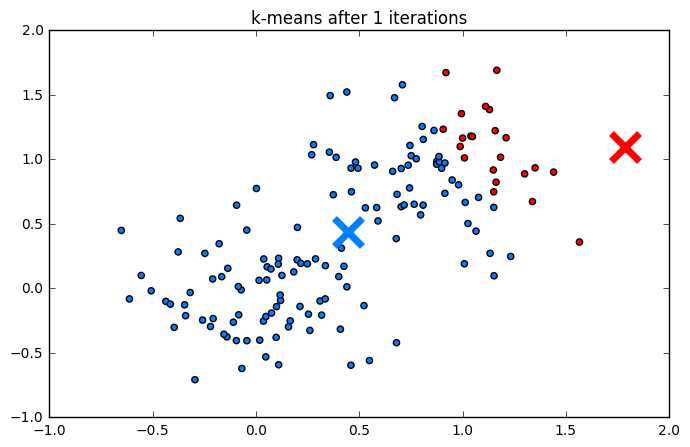
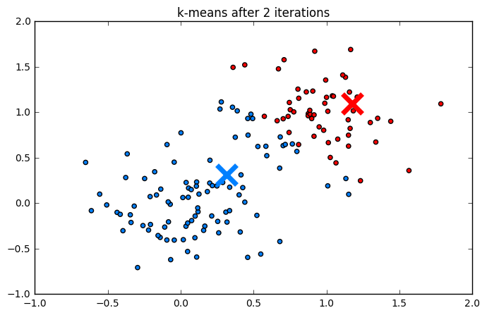
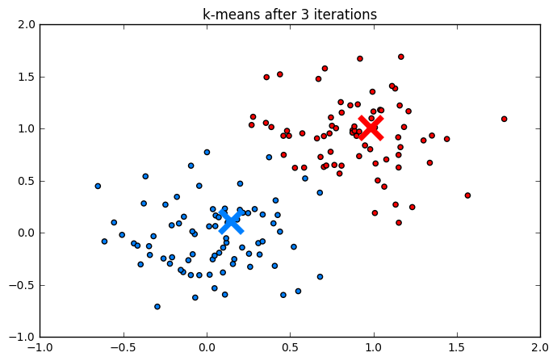
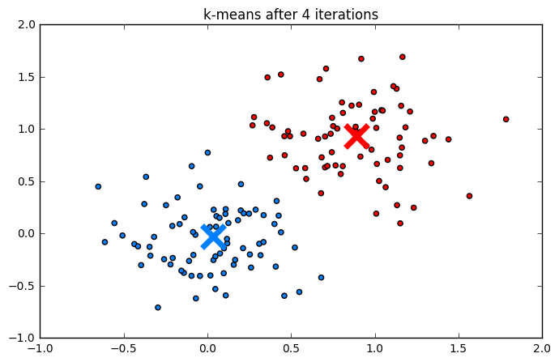
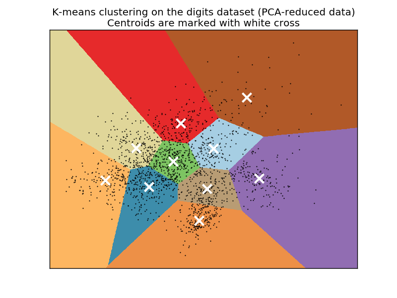
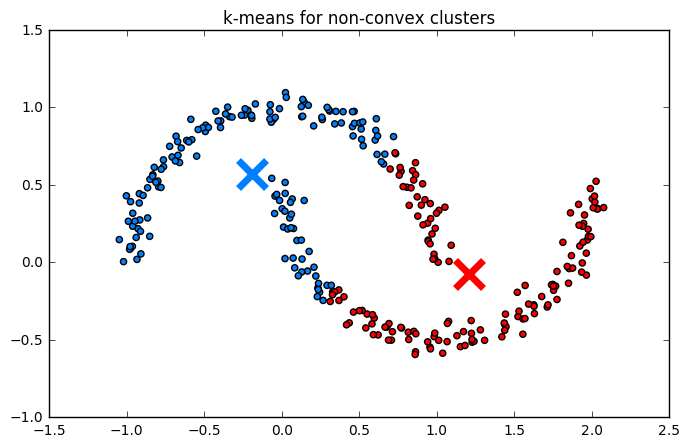
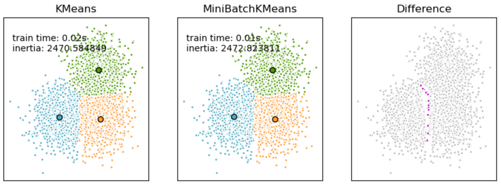
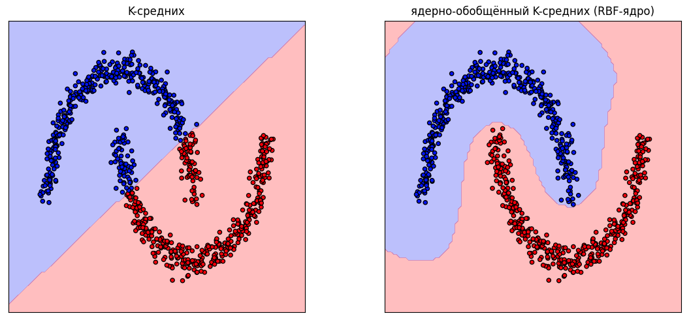

# Метод K-средних

## Кластеризация $K$ представителями

Повторим общую схему работы метода [K-представителей](Representative-based-clustering):

1. Инициализировать $\boldsymbol{\mu}_1, \dots, \boldsymbol{\mu}_K$.

2. Повторять до сходимости:
   
   * Для $n=1,2,...N$ обновить метки кластеров:
     
     $$
     z_n=\arg\min_k \rho(\mathbf{x}_n,\boldsymbol{\mu}_k)
     $$
   
   * Для $k=1,2,...K$ обновить центроиды кластеров:
     
     $$
     \boldsymbol{\mu}_k=\arg\min_{\boldsymbol{\mu}}\sum_{n\in C_k} \rho(\mathbf{x}_n,\boldsymbol{\mu})
     $$

3. **ВЕРНУТЬ** $z_1, \dots, z_N$.

Здесь

- $C_k$ - индексы объектов, принадлежащих кластеру $k$;

- $z_{1},...z_{N}$ - назначения объектам $\mathbf{x}_1,\mathbf{x}_2,...\mathbf{x}_{N}$ номеров их кластеров ;

- $\boldsymbol{\mu}_{1},...\boldsymbol{\mu}_{K}$ - центры каждого кластера, называемые также центроидами.

## Кластеризация методом $K$ средних

Метод **$K$-средних** (K-means) является самым популярным частным случаем общего алгоритма $K$-представителей. Он получается, если в качестве меры расстояния $\rho(\cdot)$ выбрать **квадрат Евклидова расстояния**:

$$
\rho(\boldsymbol{x}, \boldsymbol{\mu}) = \|\boldsymbol{x} - \boldsymbol{\mu}\|^2 = \sum_{j=1}^D (x^j - \mu^j)^2
$$

где $\boldsymbol{x} \in \mathbb{R}^D$ — вектор объекта, а $\boldsymbol{\mu} \in \mathbb{R}^D$ — вектор центра кластера. Индекс $j$, как обычно, обозначает номер признака.

Минимизируемая функция потерь называемая **инерцией** и выглядит так:

$$
\mathcal{L} = \sum_{n=1}^{N} \|\boldsymbol{x}_n - \boldsymbol{\mu}_{z_n}\|^2 \to \min_{\boldsymbol{\mu}, \boldsymbol{z}}
$$

## Расчёт центроидов

Почему же метод называется "$K$-средних"? Рассмотрим шаг обновления центров при фиксированных метках кластеров $z_1, \dots, z_N$. Нам нужно найти такой вектор $\boldsymbol{\mu}_k$, который минимизирует сумму квадратов расстояний до всех объектов $\boldsymbol{x}_n$, входящих в кластер $C_k$:

$$
\boldsymbol{\mu}_k = \arg\min_{\boldsymbol{\mu}} \sum_{n \in C_k} \|\boldsymbol{x}_n - \boldsymbol{\mu}\|^2
$$

Функция $J(\boldsymbol{\mu}) = \sum_{n \in C_k} \|\boldsymbol{x}_n - \boldsymbol{\mu}\|^2$ является суммой квадратичных функций, а значит — строго выпуклой (параболоиды с ветвями вверх). Следовательно, условие равенства градиента нулю является не только необходимым, но и <u>достаточным</u> условием глобального минимума.

Возьмем производную по вектору $\boldsymbol{\mu}$ и приравняем её к нулю:

$$
\nabla_{\boldsymbol{\mu}} J(\boldsymbol{\mu}) = \sum_{n \in C_k} \nabla_{\boldsymbol{\mu}} (\boldsymbol{x}_n - \boldsymbol{\mu})^T (\boldsymbol{x}_n - \boldsymbol{\mu}) = -2 \sum_{n \in C_k} (\boldsymbol{x}_n - \boldsymbol{\mu}) = 0
$$

Раскрывая сумму, получаем:

$$
\sum_{n \in C_k} \boldsymbol{x}_n - |C_k| \cdot \boldsymbol{\mu}_k = 0
$$

Отсюда следует формула пересчета:

$$
\boldsymbol{\mu}_k = \frac{1}{|C_k|} \sum_{n \in C_k} \boldsymbol{x}_n
$$

Таким образом, оптимальным представителем кластера по квадрату метрики $L_2$ является <u>среднее арифметическое</u> всех объектов этого кластера.

## Алгоритм Ллойда

Классическая реализация метода $K$-средних называется **алгоритмом Ллойда**. Она выглядит следующим образом:

1. Инициализировать центры $\boldsymbol{\mu}_1, \dots, \boldsymbol{\mu}_K$ (случайно или методом [K-means++](Representative-based-clustering#k-means)).

2. **ПОВТОРЯТЬ** до сходимости:
   
   * Для $n=1,2,...N$ обновить метки кластеров:
     
     $$
     z_n = \arg\min_{k \in \{1,\dots,K\}} \|\boldsymbol{x}_n - \boldsymbol{\mu}_k\|^2_2
     $$
   
   * Для $k=1,2,...K$ обновить центроиды кластеров:
     
     $$
     \boldsymbol{\mu}_k = \frac{1}{|C_k|} \sum_{n \in C_k} \boldsymbol{x}_n
     $$

3. **ВЕРНУТЬ** $z_1, \dots, z_N$.

> K-means популярен за счёт <u>быстрой скорости работы</u> - центры не нужно оптимизировать, поскольку для их оптимального расположения есть аналитическая формула в виде усреднения объектов каждого кластера.

:::tip Инициализация центров

Метод K-средних, как частный случай метода K-представителей, чувствителен к начальной инициализации центров кластеров. К нему применимы те же приёмы [повышения эффективности инициализации](Representative-based-clustering#инициализация-центров), что и для общего метода K-представителей.

:::

## Пример работы

Ниже приведен процесс работы алгоритма шаг за шагом:

**Кластеризация рукописных цифр (MNIST):**
Если кластеризовать данные датасета Digits (рукописные цифры [[1]](https://archive.ics.uci.edu/dataset/80/optical+recognition+of+handwritten+digits)), уменьшенные до двух измерений с помощью метода главных компонент, то разбиение на кластера будет таким [[2]](https://scikit-learn.org/stable/auto_examples/cluster/plot_kmeans_digits.html):

## Ограничения метода

Метод <u>всегда</u> возвращает $K$ кластеров, где $K$ - заданный пользователем гиперпараметр, даже если кластерная структура в данных реально отсутствует, как на примере ниже:

Также метод вернёт в точности $K$ кластеров, даже если реальное число кластеров больше или меньше этого значения. 

Выбор Евклидова расстояния накладывает строгие ограничения на форму получаемых кластеров. Объект $\boldsymbol{x}$ сильнее принадлежит $i$-му, а не $j$-му кластеру, если выполняется условие: 

$$
\|\boldsymbol{x} - \boldsymbol{\mu}_i\| < \|\boldsymbol{x} - \boldsymbol{\mu}_j\|
$$

Это уравнение задает линейную полуплоскость. Множество объектов $i$-го кластера  будет получаться пересечением всех таких полуплоскостей

$$
\{\boldsymbol{x}: \|\boldsymbol{x} - \boldsymbol{\mu}_i\| < \|\boldsymbol{x} - \boldsymbol{\mu}_j\|,\; \forall j\ne i\}
$$

и представлять собой <u>выпуклый</u> многогранник. Таким образом, алгоритм конструктивно <u>не сможет выделять невыпуклые кластеры</u>, как на примере ниже:

Также алгоритм стремится минимизировать дисперсию во всех направлениях одинаково. Это означает неявное предположение, что кластеры имеют сферическую форму, поэтому он будет <u>плохо справляться с выделением кластеров вытянутой формы</u>. Чтобы уменьшить эффект этой особенности, признаки важно приводить [к одной шкале](../Data-preprocessing/Feature-normalization) перед запуском метода.

Из равномерности учёта всех расстояний следует другое предположение, что кластера имеют <u>примерно одинаковый размер</u>.

## Алгоритмическая сложность

Вычислительная сложность алгоритма Ллойда оценивается как **$O(I \cdot N \cdot K \cdot D)$**, где:

- $N$ — количество объектов в выборке;
- $K$ — количество кластеров;
- $D$ — размерность пространства признаков;
- $I$ — количество итераций до сходимости.

Действительно, алгоритм состоит из циклического повторения двух основных шагов - назначение меток и обновление центроидов. Рассмотрим сложность одной итерации цикла:

1. **Назначение меток.**
   На этом этапе для каждого из $N$ объектов необходимо найти ближайший центроид.
   
   - Чтобы вычислить квадрат Евклидова расстояния $\|\boldsymbol{x}_n - \boldsymbol{\mu}_k\|^2$ между одним объектом и одним центроидом, требуется $O(D)$ операций.
   - Это вычисление проводится для каждого из $K$ центроидов.
   - Следовательно, для одного объекта сложность поиска ближайшего центра составляет $O(K \cdot D)$.
   - Для всех $N$ объектов суммарная сложность шага: **$O(N \cdot K \cdot D)$**.

2. **Обновление центроидов.**
   На этом этапе пересчитываются координаты центров.
   
   - Для вычисления нового центра $\boldsymbol{\mu}_k$ необходимо усреднить векторы всех объектов, попавших в кластер $C_k$.
   - Сложение двух векторов размерности $D$ требует $O(D)$ операций.
   - Поскольку каждый из $N$ объектов принадлежит ровно одному кластеру, он участвует в суммировании ровно один раз.
   - Следовательно, суммарная сложность пересчета всех центров составляет **$O(N \cdot D)$**.

В итоге получаем сложность одной итерации цикла $O(N \cdot K \cdot D)$. Поскольку итерации повторяются $I$ раз, то итоговая сложность $K$-средних равна $O(I \cdot N \cdot K \cdot D)$. 

> Сложность растёт линейно с увеличением числа объектов $N$, делает <u>алгоритм пригодным для обработки больших массивов данных</u>, в отличие от многих других методов кластеризации.

## Алгоритмические оптимизации

Стандартный алгоритм Ллойда на каждой итерации вычисляет расстояния от каждого объекта до всех $K$ центров. Существуют **алгоритм Элкана** [[3]](https://cdn.aaai.org/ICML/2003/ICML03-022.pdf), ускоряющий этот процесс, который основан на использовании неравенства треугольника для расстояний:

$$
\|\boldsymbol{x} - \boldsymbol{\mu}_j\| \ge \|\boldsymbol{\mu}_i - \boldsymbol{\mu}_j\| - \|\boldsymbol{x} - \boldsymbol{\mu}_i\|
$$

Это позволяет отбрасывать далекие центры без явного вычисления расстояний до них, если известно, что объект уже достаточно близок к своему текущему центру.

Ускорение достигается ценой <u>повышенных расходов на память</u> порядка $O(N\cdot K)$ для хранения промежуточных переменных.

### Mini-batch K-means

Несмотря на то, что метод K-средних обладает линейной сложностью, для очень больших данных (таких, как веб-страницы интернета) используется его приближённая стохастическая версия, которая работает приближённо, но сходится гораздо быстрее. Это алгоритм **K-средних на минибатчах** (Mini-batch K-means [[4]](https://dl.acm.org/doi/pdf/10.1145/1772690.1772862)), представляющий собой аналог  [стохастического градиентного спуска](../Numerical-optimization/SGD).

Обозначим $N(k)$ — текущее число элементов кластера $k$. 

Алгоритм работает следующим образом:

1. Инициализировать $\boldsymbol{\mu}_k$ (случайно).

2. Повторять до сходимости:
   
   * Сэмплировать минибатч случайных объектов $\mathbf{x}'_b, \quad b=1,2,...B$.
   
   * Для $b=1,2,...B$: 
     
     * определить кластер $z_b$ для $\mathbf{x}'_b$ (по принципу ближайшего центроида).
     
     * Обновить размер кластера: $N(z_b) := N(z_b)+1$.
     
     * Обновить центроид кластера:
       
       $$
       \boldsymbol{\mu}_{z(b)}:=\left(1-\frac{1}{N(z_b)}\right)\boldsymbol{\mu}_{z(b)}+\frac{1}{N(z_b)}\mathbf{x}'_b
       $$

Выходом алгоритма являются центроиды $\boldsymbol{\mu}_1,...\boldsymbol{\mu}_K$ по близости к которым можно кластеризовать любые данные.

K-средних на минибатчах не требует прохода по всем объектам выборки и приближённо сходится к ожидаемым центрам кластеров при просмотре лишь части обучающих объектов. При этом разница результатов K-means и Mini-batch K-means оказывается небольшой, как проиллюстрировано ниже [[5]](https://scikit-learn.org/stable/modules/clustering.html#mini-batch-kmeans):

## Ядерное обобщение K-средних

### Идея

Как мы показали выше, метод K-средних выделяет лишь линейные границы между кластерами, а границы кластеров могут иметь только выпуклую форму. Однако метод K-средних допускает [ядерное обобщение](../Kernel-method/Kernel-trick) (Kernel K-means), которое способно сделать границы между классами нелинейными, а выделяемые области каждого класса - невыпуклыми, как показано на примере ниже:

Ядерное обобщение соответствует обычному методу K-средних, но не в исходном пространстве $\boldsymbol{x}$, а в новом пространстве $\phi(\boldsymbol{x})$, которое называемом спрямляющим.

При этом центроиды кластеров формально вычисляются по формуле 

$$
\boldsymbol{\mu}_i = \frac{1}{|C_i|}\sum_{n \in C_i} \phi(\boldsymbol{x}_n),
$$

но <u>напрямую не вычисляются</u>, поскольку спрямляющее пространство может быть сложной структуры и даже бесконечномерным.

### Ядерное обобщение расстояния до центроидов

Расстояние от объекта до центроида кластера вычисляется по формуле:

$$
\rho(\boldsymbol{x}, \boldsymbol{\mu}_i)^2 = \|\phi(\boldsymbol{x}) - \boldsymbol{\mu}_i\|^2
$$

Воспользуемся тем, что квадрат L2-нормы можно вычислить через скалярное произведение, а также свойствами скалярного произведения:

$$
\|\phi(\boldsymbol{x}) - \boldsymbol{\mu}_i\|^2 = \langle\phi(\boldsymbol{x}) - \boldsymbol{\mu}_i, \phi(\boldsymbol{x}) - \boldsymbol{\mu}_i \rangle = \langle \phi(\boldsymbol{x}), \phi(\boldsymbol{x}) \rangle - 2\langle \phi(\boldsymbol{x}), \boldsymbol{\mu}_i \rangle + \langle \boldsymbol{\mu}_i, \boldsymbol{\mu}_i \rangle
$$

Теперь выразим каждое слагаемое через [функцию ядра](../Kernel-method/Kernel-trick#идея-ускорения-расчётов):

$$
K(\boldsymbol{x},\boldsymbol{x}') = \langle\phi(\boldsymbol{x}), \phi(\boldsymbol{x}') \rangle
$$

1. Первое слагаемое:
   
   $$
   \langle \phi(\boldsymbol{x}), \phi(\boldsymbol{x}) \rangle = K(\boldsymbol{x}, \boldsymbol{x})
   $$

2. Второе слагаемое:
   
   $$
   2\langle \phi(\boldsymbol{x}), \frac{1}{|C_i|}\sum_{n \in C_i} \phi(\boldsymbol{x}_n) \rangle = \frac{2}{|C_i|} \sum_{n \in C_i} K(\boldsymbol{x}, \boldsymbol{x}_n)
   $$

3. Третье слагаемое:
   
   $$
   \langle \frac{1}{|C_i|}\sum_{n \in C_i} \phi(\boldsymbol{x}_n), \frac{1}{|C_i|}\sum_{m \in C_i} \phi(\boldsymbol{x}_m) \rangle = \frac{1}{|C_i|^2} \sum_{n \in C_i} \sum_{m \in C_i} K(\boldsymbol{x}_n, \boldsymbol{x}_m)
   $$

**Итоговая формула:**

$$
\rho(\boldsymbol{x}, \boldsymbol{\mu}_i)^2 = \underbrace{K(\boldsymbol{x}, \boldsymbol{x})}_{\text{const по } i} - \underbrace{\frac{2}{|C_i|} \sum_{n \in C_i} K(\boldsymbol{x}, \boldsymbol{x}_n)}_{\text{средняя близость к объектам кластера}} + \underbrace{\frac{1}{|C_i|^2} \sum_{n \in C_i} \sum_{m \in C_i} K(\boldsymbol{x}_n, \boldsymbol{x}_m)}_{\text{компактность кластера}}
$$

### Итоговый алгоритм

В отличие от стандартного K-means, здесь мы не можем явно хранить и пересчитывать координаты центров $\boldsymbol{\mu}_i$. Вместо этого состояние алгоритма определяется текущим распределением объектов по кластерам (метками $z_n$), которые <u>неявно</u> задают центроиды в спрямляющем пространстве.

**Вход:**

* $\mathbf{X} = \{\boldsymbol{x}_1, \dots, \boldsymbol{x}_N\}$ — набор данных.
* $K$ — число кластеров.
* $k(\cdot, \cdot)$ — функция ядра (обычно это [гауссово или полиномиальное](../Kernel-method/Kernel-trick#популярные-ядра) ядро).

**Алгоритм:**

1. Инициализация:
   Случайным образом назначить начальные метки кластеров $z_n \in \{1, \dots, K\}$ для всех объектов $n=1, \dots, N$. Это определяет начальные множества $C_1, \dots, C_K$.

2. Повторять до сходимости:
   
   1. Для каждого кластера $i=1, \dots, K$ вычислить слагаемое, отвечающее за его компактность (не зависит от текущего объекта $\boldsymbol{x}$):
      
      $$
      L_i = \frac{1}{|C_i|^2} \sum_{n \in C_i} \sum_{m \in C_i} K(\boldsymbol{x}_n, \boldsymbol{x}_m)
      $$
   
   2. Для каждого объекта $n=1, \dots, N$:
      
      - Вычислить расстояние от $\boldsymbol{x}_n$ до центра каждого кластера $i$:
      
      $$
      d^2(\boldsymbol{x}_n, i) = L_i - \frac{2}{|C_i|} \sum_{m \in C_i} K(\boldsymbol{x}_n, \boldsymbol{x}_m)

      $$
      
      *(Слагаемое $K(\boldsymbol{x}_n, \boldsymbol{x}_n)$ опущено, так как оно одинаково для всех $i$ и не влияет на выбор минимума).*
      
      - Назначить новый кластер:
      
      $$
      z_n = \arg\min_{i} d^2(\boldsymbol{x}_n, i)
      $$

3. Вернуть $z_1, \dots, z_N$.

:::warning Недостатки метода
Недостатком ядерного обобщения K-means является высокая вычислительная сложность.
Чтобы вычислить расстояние от одного объекта до центра кластера $i$, нужно просуммировать значения ядра со всеми объектами этого кластера.
Суммарная сложность одной итерации составляет **$O(N^2)$**. Квадратичная сложность по числу объектов делает метод неприменимым для очень больших выборок.

Также метод, производя переход в спрямляющее пространство, теряет изначальную интуитивность и интерпретируемость. Для его работы необходимо выбрать функцию ядра и её гиперпараметры.
:::

## Литература

1. [Репозиторий UCI: Optical Recognition of Handwritten Digits.](https://archive.ics.uci.edu/dataset/80/optical+recognition+of+handwritten+digits)
2. [Документация sklearn: A demo of K-Means clustering on the handwritten digits data.](https://scikit-learn.org/stable/auto_examples/cluster/plot_kmeans_digits.html) 
3. [Elkan C. Using the triangle inequality to accelerate k-means //Proceedings of the 20th international conference on Machine Learning (ICML-03). – 2003. – С. 147-153.](https://cdn.aaai.org/ICML/2003/ICML03-022.pdf)
4. [Sculley D. Web-scale k-means clustering //Proceedings of the 19th international conference on World wide web. – 2010. – С. 1177-1178.](https://dl.acm.org/doi/pdf/10.1145/1772690.1772862)
5. [Документация sklearn: Mini Batch K-Means.](https://scikit-learn.org/stable/modules/clustering.html#mini-batch-kmeans)
