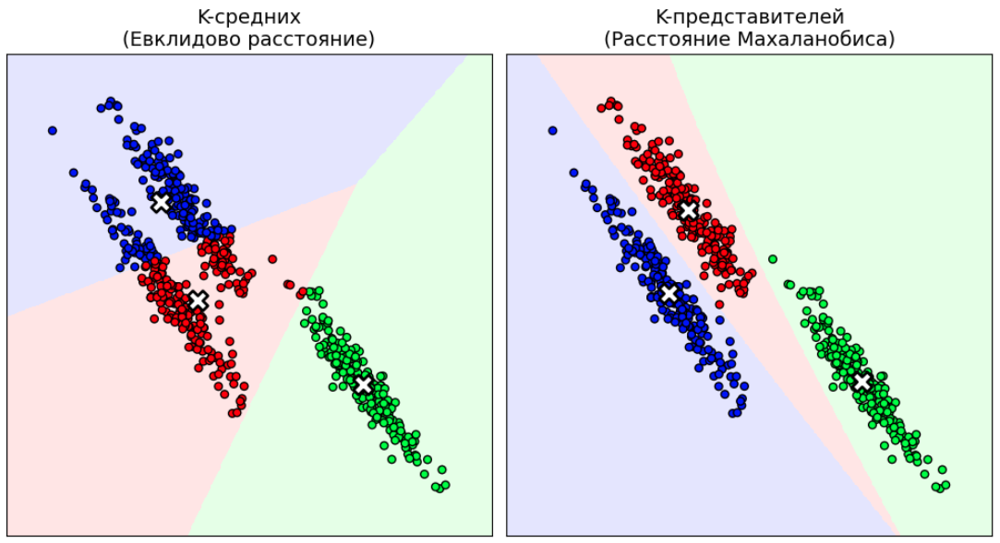

# Вариации метода K представителей

Общая схема алгоритма [K-представителей](Representative-based-clustering) позволяет гибко настраивать метод под природу данных, изменяя функцию расстояния $\rho(\boldsymbol{x}, \boldsymbol{\mu})$ и способ обновления центров. Изучим наиболее важные частные случаи этого метода помимо уже<u> </u>рассмотренного [метода K-средних](K-means).

## Метод K-медиан (K-medians)

Этот метод получается, если вместо квадратичного Евклидова расстояния использовать **Манхэттенское расстояние** ($L_1$-норму).

### Спецификация

Функция потерь для одного объекта:

$$
\rho(\boldsymbol{x}, \boldsymbol{\mu}) = \|\boldsymbol{x} - \boldsymbol{\mu}\|_1 = \sum_{j=1}^D |x^j - \mu^j|
$$

Глобальный функционал ошибки (инерция):

$$
\mathcal{L} = \sum_{n=1}^{N} \sum_{j=1}^D |x_n^j - \mu_{z_n}^j| \to \min_{\boldsymbol{z}, \boldsymbol{\mu}}
$$

### Обновление центров

На шаге пересчета центров нам необходимо найти вектор $\boldsymbol{\mu}_k$, минимизирующий сумму модулей отклонений для объектов кластера $C_k$:

$$
\boldsymbol{\mu}_k = \arg\min_{\boldsymbol{\mu}} \sum_{n \in C_k} \sum_{j=1}^D |x_n^j - \mu^j|
$$

Поскольку слагаемые по разным измерениям $j$ независимы, задачу можно решать для каждого признака отдельно. Известно, что сумма модулей разностей $|a - c|$ минимизируется, когда $c$ является <u>медианой</u> выборки $a$.

Следовательно, новый центр кластера вычисляется как <u>покомпонентная медиана</u>:

$$
\mu_k^j = \text{median}(\{x_n^j \mid n \in C_k\})
$$

### Особенности метода

* **Форма кластеров.** Использование $L_1$-метрики приводит к тому, что линии уровня имеют форму гипероктаэдров (ромбов в 2D). Кластеры стремятся выравниваться вдоль осей координат.
* **Устойчивость к выбросам.** Это главное преимущество метода. Квадратичная функция в K-means сильно штрафует большие отклонения, поэтому один далекий выброс может сильно сместить среднее значение. Медиана же <u>устойчива</u> к отдельным аномальным значениям.

:::tip Пример сравнения устойчивости среднего и медианы к выбросам.
Пусть кластер состоит из точек $\{1, 2, 3, 100\}$.

* **Среднее (K-means):** $(1+2+3+100)/4 = 26.5$. Центр смещен в сторону выброса 100 и расположен далеко от основной массы наблюдений.
* **Медиана (K-medians):** $2.5$. Центр находится внутри плотной группы, игнорируя выброс.
  :::

> Выбросы часто возникают при анализе, например, финансовых данных, таких как доходы населения. Среднее значение в таких случаях становится слабо репрезентативным.

## Кластеризация с расстоянием Махаланобиса

Классический метод K-средних строит сферические кластеры, так как использует Евклидово расстояние. Если данные вытянуты в эллипсоиды или имеют разный масштаб, K-средних может работать <u>некорректно</u>, разбивая один вытянутый кластер на части.

Возможное решение проблемы состоит в использовании в методе K-представителей в качестве функции расстояния не квадрат $L_2$-нормы, а квадрат **расстояния Махаланобиса**:

$$
\rho(\boldsymbol{x}, \boldsymbol{\mu}_k) = (\boldsymbol{x} - \boldsymbol{\mu}_k)^T \boldsymbol{\Sigma}_k^{-1} (\boldsymbol{x} - \boldsymbol{\mu}_k),
$$

где $\boldsymbol{\Sigma}_k$ - ковариационная матрица объектов, попавших в $k$-й кластер. Эта функция имеет эллипсоидальные линии уровня, а потому позволяет моделировать кластера эллипсоидальной формы, как показано на результатах кластеризации ниже:

### Обновление параметров

В этом методе, помимо центров $\boldsymbol{\mu}_k$, на каждом шаге необходимо обновлять и матрицы ковариации $\boldsymbol{\Sigma}_k$ для каждого кластера.

1. **Центры**, как и в K-means, остаются средними арифметическими:
   
   $$
   \boldsymbol{\mu}_k = \frac{1}{|C_k|} \sum_{n \in C_k} \boldsymbol{x}_n
   $$

2. **Ковариационные матрицы** вычисляются как выборочные ковариационные матрицы точек соответствующего кластера:
   
   $$
   \boldsymbol{\Sigma}_k = \frac{1}{|C_k|} \sum_{n \in C_k} (\boldsymbol{x}_n - \boldsymbol{\mu}_k)(\boldsymbol{x}_n - \boldsymbol{\mu}_k)^T
   $$

### Особенности метода

* **Адаптивность формы:** Метод способен выделять кластеры эллипсоидальной формы, причем эллипсы могут быть <u>повернуты</u> и иметь <u>разный размер</u> для разных кластеров. Метод способен выделять одновременно и крупные, и маленькие кластера.
* **Инвариантность:** Результат не зависит от линейных преобразований координат - масштабирования и поворота.
* **Связь с GMM:** Идейно данный подход очень похож на кластеризации смесью Гауссиан (Gaussian Mixture Models, GMM [[1]](https://www.ibm.com/think/topics/gaussian-mixture-model)) при сопоставлении каждому объекту одного максимально вероятного кластера.

:::warning Вычислительная сложность
Необходимость хранить и обращать матрицу $\boldsymbol{\Sigma}_k$ размера $D \times D$ на каждой итерации делает метод вычислительно дорогим (сложность $O(D^3)$). Кроме того, для корректной оценки ковариации требуется как минимум $D+1$ представителей в каждом кластере, иначе матрица будет вырожденной. Для повышения устойчивости при обращении этой матрицы можно использовать те же [приёмы регуляризации](../Generative-classification-models/Quadratic-discriminant-analysis#регуляризация), что были предложены в методе QDA. 
:::

Подводя итоги, этот метод удобен для кластеризации разнородных данных, в которых признаки имеют разный масштаб, а также в случае, когда форма кластеров может быть наклонена к осям координат. Однако метод всё ещё неспособен моделировать кластера невыпуклой формы.

## Метод K-медоидов (K-medoids)

Методы К-средних и K-представителей с расстоянием Махаланобиса основаны на итеративном уточнении центроидов кластеров $\boldsymbol{\mu}_1,...\boldsymbol{\mu}_K$ как выборочных средних по объектам кластера. В случае K-медиан они вычисляются как медианы. Подобная агрегация <u>невозможна</u>, если агрегируются объекты разного размера и структуры, такие как 

- временные ряды разной длины;

- изображения разного размера;

- графы с разным числом вершин и рёбер.

Даже если объекты представимы в виде векторов одинаковой длины, подобная агрегация <u>не всегда имеет смысл</u>. Для примера рассмотрим задачу логистики, в которой нужно выбрать $K$ существующих складов из $N$ возможных, чтобы минимизировать среднее время доставки определённого товара. Мы не можем построить склад в "средней точке" (в чистом поле или озере), мы должны выбрать конкретную локацию среди <u>уже существующих</u> складов.

В таких случаях используется метод **K-медоидов** [[2]](https://en.wikipedia.org/wiki/K-medoids), в котором накладывается дополнительное ограничение в том, что центр кластера <u>обязан совпадать с одним из объектов обучающей выборки</u>:

$$
\boldsymbol{\mu}_k \in \{\boldsymbol{x}_1, \dots, \boldsymbol{x}_N\}, \quad k=1,2,...K
$$

Такой объект-представитель называется **медоидом**.

При этом функция расстояния $\rho(\boldsymbol{x}, \boldsymbol{x}')$ может быть любой, лишь бы она описывала степень различия между рассматриваемыми объектами.

### Алгоритм

Как [мы помним](Representative-based-clustering#алгоритм-кластеризации-k-представителями), общий алгоритм кластеризации K-представителями состоит из итеративного обновления меток объектов и пересчёта центроидов. Обновление меток не меняется, а вот пересчёт центроидов производится уже дискретной оптимизацией, поскольку сводится к перебору вариантов <u>среди существующих объектов выборки</u>. Конкретнее, для каждого кластера $C_k$ мы ищем такой объект из этого же кластера, который минимизирует суммарное расстояние до остальных объектов:

$$
\boldsymbol{\mu}_k = \arg\min_{\boldsymbol{m} \in \{\boldsymbol{x}_n : n \in C_k\}} \sum_{n \in C_k} \rho(\boldsymbol{x}_n, \boldsymbol{m})
$$

Здесь для каждого объекта требуется вычислить расстояния до всех остальных объектов его кластера, что делает сложность пересчёта "в лоб" $O(N^2)$ по числу объектов, а не $O(N)$, как в методе K-средних и K-медиан.

Наиболее популярная реализация этого подхода называется PAM (Partitioning Around Medoids [[3]](https://onlinelibrary.wiley.com/doi/epdf/10.1002/9780470316801.ch2)).

### Особенности метода

* **Интерпретируемость:** Центр кластера — это реальный пример (например, "типичный покупатель" или "эталонная статья"), а не абстрактный усредненный вектор. Это делает результаты метода более интерпретируемыми.
* **Универсальность:** Работает с любыми типами данных, для которых определена мера близости (строки, множества, временные ряды).
* **Устойчивость:** Метод более устойчив к выбросам, чем K-средних, поскольку медоид выбирается перебором среди существующих объектов и не может переместиться в пустое пространство.

### Недостатки

Недостатком метода является его высокая вычислительная сложность. Поиск медоида требует вычисления расстояний "всех со всеми" внутри кластера, что дает квадратичную сложность $O(|C_k|^2)$ на каждой итерации. Существуют ускоренные реализации метода K-медоид [[2]](https://en.wikipedia.org/wiki/K-medoids), но они дают лишь <u>приближённое</u> решение.

Простейший способ повышения вычислительной эффективности K-медоид - запускать метод на случайной подвыборке данных. Либо на этапе пересчёта центроидов рассматривать не все возможные объекты кластера, а опять же случайную подвыборку, которую менять на каждой итерации внешнего цикла, чтобы учесть больше первоначальных данных.

## Литература

1. [IBM Blog: What is a Gaussian mixture model?](https://www.ibm.com/think/topics/gaussian-mixture-model)

2. [Wikipedia: k-medoids.](https://en.wikipedia.org/wiki/K-medoids)

3. [Kaufman L. Partitioning around medoids (program pam) //Wiley series in probability and statistics. – 1990. – Т. 344. – С. 68-125.](https://onlinelibrary.wiley.com/doi/epdf/10.1002/9780470316801.ch2)
