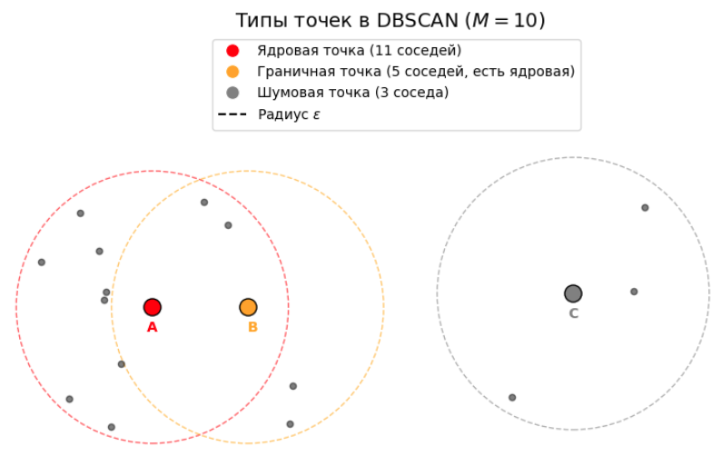
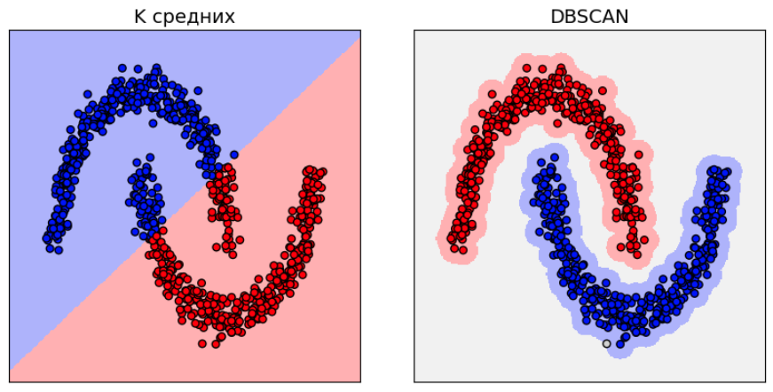
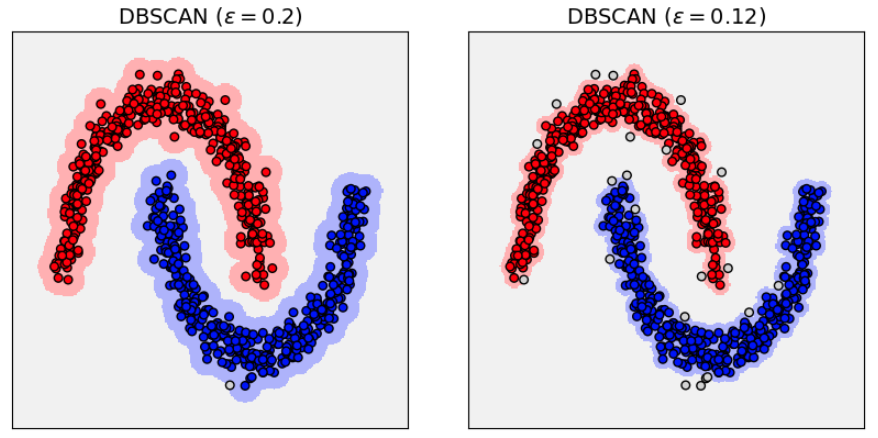
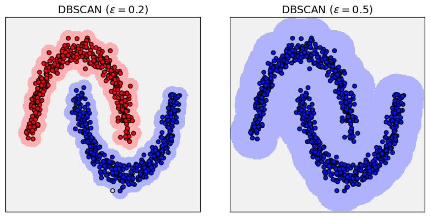
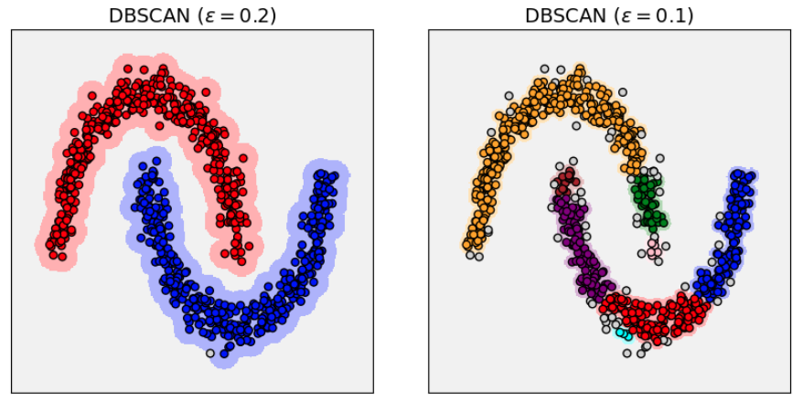
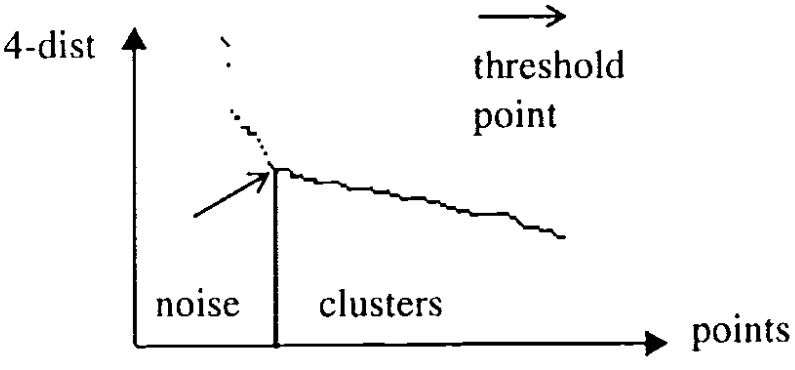
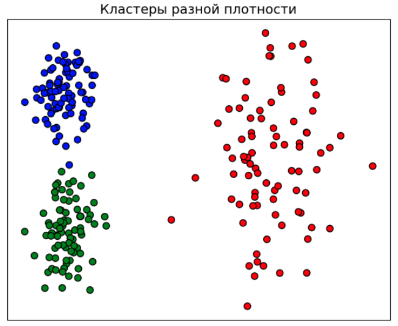

# DBSCAN

Рассмотренные ранее методы кластеризации ищут кластеры сферической, кубической или эллипсоидальной формы и требуют от пользователя заранее задать число извлекаемых кластеров. При этом методы относят к кластерам все объекты выборки, даже если они нетипичны и представляют шум в данных.

Однако в реальных данных:

- кластеры могут иметь более сложную, иногда даже невыпуклую геометрическую структуру;

- число кластеров заранее неизвестно;

- содержатся шумовые наблюдения, которые неверно относить к определённому кластеры.

Для учёта этой специфики разработан алгоритм **DBSCAN** (Density-Based Spatial Clustering of Applications with Noise [[1]](https://cdn.aaai.org/KDD/1996/KDD96-037.pdf)).

В предположении алгоритма кластеры — это области высокой плотности точек, разделенные областями низкой плотности. Точки в областях низкой плотности считаются шумом (выбросами). Алгоритм использует локальные плотностные характеристики точек данных для их объединения в кластеры.

## Основные определения

Плотность в точке определяется количеством соседей, попадающих в радиус $\varepsilon$ (включая саму точку). Алгоритм опирается на два гиперпараметра:

1. $\varepsilon$ — радиус окрестности.
2. $M$ — минимальное количество точек в окрестности для того, чтобы считать область плотной.

Все точки разбиваются на три типа:

1. **Ядровая точка (core point):** точка считается ядровой, если в её $\varepsilon$-окрестности находится не менее $M$ точек.

2. **Граничная точка (border point):** точка объявляется граничной, если в её $\varepsilon$-окрестности находится меньше $M$ точек, но она содержит в своей окрестности хотя бы одну ядровую точку.

3. **Шумовая точка (noise point):** точка, которая не является ни ядровой, ни граничной.

Ниже проиллюстрированы точки A, B и C, которые являются ядровой, граничной и шумовой точкой соответственно при $M=10$:

## Алгоритм DBSCAN

Логика работы DBSCAN отличается от итеративного пересчета центров. Кластеризация выполняется следующим образом:

1. **Определение типов точек:** Для всего датасета определяются ядровые, граничные и шумовые точки при заданных гиперпараметрах $\varepsilon$ и $M$.

2. **Построение графа ядровых точек:** Создается граф, вершинами которого являются только ядровые точки. Ребро между двумя ядровыми точками добавляется тогда и только тогда, когда расстояние между ними не превышает $\varepsilon$.

3. **Поиск компонент связности:** В этом графе находятся все компоненты связности [[2]](https://ru.wikipedia.org/wiki/%D0%9A%D0%BE%D0%BC%D0%BF%D0%BE%D0%BD%D0%B5%D0%BD%D1%82%D0%B0_%D1%81%D0%B2%D1%8F%D0%B7%D0%BD%D0%BE%D1%81%D1%82%D0%B8_%D0%B3%D1%80%D0%B0%D1%84%D0%B0). Каждая связная компонента и является искомым кластером.

4. **Привязка граничных точек:** Каждая граничная точка приписывается к той компоненте связности (кластеру), с которой она связана (находится в $\varepsilon$-окрестности ядровой точки этого кластера).

5. **Формирование результата:** Результатом работы метода являются кластера, приписанные ядровым и граничным точкам. Шумовые точки помечаются как выбросы и <u>не кластеризуются</u>.

DBSCAN способен выделять кластеры любой связной геометрической формы, лишь бы точки кластера лежали близко друг к другу. Ниже показано сравнение кластеризации методом K-средних и DBSCAN:

> Обратим внимание, что за пределами небольшой окрестности кластеров точки в DBSCAN будут относиться к шуму, поэтому большая часть признакового пространства для этого метода не закрашена.

При уменьшении гиперпараметра $\varepsilon$ будет возрастать число точек, отнесённых к шуму:

Формально алгоритм самостоятельно определяет число кластеров. Однако фактическое число кластеров будет зависеть от выбора гиперпараметров $M$ и $\varepsilon$.

При слишком большом $\varepsilon$ группы объектов будут сливаться в один кластер, как показано на рисунке справа:

А при слишком малом $\varepsilon$ группы будут разбиваться на более мелкие кластера за счёт небольших вариаций в плотности точек в рамках каждой группы:

## Выбор гиперпараметров

В оригинальной статье [[1]](https://cdn.aaai.org/KDD/1996/KDD96-037.pdf) предлагается задавать $M$ небольшой константой (тем выше, чем выше априорные ожидания об уровне шума в данных), а гиперпараметр $\varepsilon$ предлагается выбирать следующим образом:

1. Для каждой точки $\mathbf{x}$ из датасета вычисляется расстояние до её $M$-го ближайшего соседа.

2. Полученные значения расстояний сортируются <u>по убыванию</u>.

3. Строится график, где по оси X откладывается индекс точки в отсортированном списке, а по оси Y — значение расстояния.

4. На графике визуально определяется точка максимального перегиба («локтя» или «колена»). Значение расстояния по оси Y в этой точке и принимается в качестве **$\varepsilon$**.

Пример подобного графика и выбираемого по нему порога $\varepsilon$ при $M=4$ показан ниже [[1]](https://cdn.aaai.org/KDD/1996/KDD96-037.pdf):

Логика этого подхода основывается на том, что внутри плотного кластера расстояние до $M$-го соседа для большинства точек будет небольшим и примерно одинаковым (формируя пологую часть графика, "плато").

Напротив, для шумовых точек и выбросов, находящихся в разреженных областях, $M$-й сосед будет находиться значительно дальше, что даст резкий скачок значений на графике (крутая часть слева).

Точка перегиба является порогом, разделяющим эти два режима: выбрав $\varepsilon$ на уровне этого излома, мы классифицируем точки с аномально большими расстояниями как шум, а остальные — как кандидатов в ядровые или граничные точки.

## Проблема переменной плотности

Алгоритм DBSCAN использует глобальный параметр $\varepsilon$, что затрудняет выделение этим методом кластеров переменной плотности. Рассмотрим в качестве примера данные, показанные ниже:

Если выбрать $\varepsilon$ слишком большим, то зелёный и синий кластера сольются в один кластер. Если же выбрать $\varepsilon$ слишком малым, то почти все точки красного кластера будут отнесены к шуму в силу его большей разреженности.

Для работы с кластерами переменной плотности используются более продвинутые методы кластеризации, такие как OPTICS [[3]](https://dl.acm.org/doi/abs/10.1145/304181.304187) и HDBSCAN [[4]](https://link.springer.com/chapter/10.1007/978-3-642-37456-2_14).

## Литература

1. [Ester M. et al. A density-based algorithm for discovering clusters in large spatial databases with noise //kdd. – 1996. – Т. 96. – №. 34. – С. 226-231.](https://cdn.aaai.org/KDD/1996/KDD96-037.pdf)
2. [Википедия: компонента связности графа.](https://ru.wikipedia.org/wiki/%D0%9A%D0%BE%D0%BC%D0%BF%D0%BE%D0%BD%D0%B5%D0%BD%D1%82%D0%B0_%D1%81%D0%B2%D1%8F%D0%B7%D0%BD%D0%BE%D1%81%D1%82%D0%B8_%D0%B3%D1%80%D0%B0%D1%84%D0%B0)
3. [Ankerst M. et al. OPTICS: Ordering points to identify the clustering structure //ACM Sigmod record. – 1999. – Т. 28. – №. 2. – С. 49-60.](https://dl.acm.org/doi/abs/10.1145/304181.304187)
4. [Campello R. J. G. B., Moulavi D., Sander J. Density-based clustering based on hierarchical density estimates //Pacific-Asia conference on knowledge discovery and data mining. – Berlin, Heidelberg : Springer Berlin Heidelberg, 2013. – С. 160-172.](https://link.springer.com/chapter/10.1007/978-3-642-37456-2_14)
