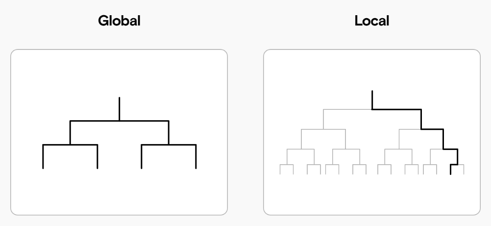

# Интерпретируемое машинное обучение

## Интерпретируемость моделей и её приложения

Прогностическая модель называется **интерпретируемой** (interpretable) или **объяснимой** (explainable), если <u>человек может проинтерпретировать её решения</u>. 

> Как правило, более сложные модели, учитывающие большее число факторов нелинейным образом, являются менее интерпретируемыми, но обеспечивают более высокую точность, поэтому существует противоречие между объяснимостью и качеством прогнозов. 

Преимущества, которые даёт интерпретируемость:

- В приложениях, где цена ошибки высока (например, в задаче медицинской диагностики, определяющей, нужно ли пациенту делать операцию), важна не только точность, но и способность модели обосновать своё решение (для врача). Поэтому в таких приложениях лучше использовать несколько интерпретируемых моделей, а не одну сложную. Модель, способная объяснить свои прогнозы, вызывает больше доверия и проще внедряется на практике.

- Интерпретируемость позволяет оценить адекватность принятого решения: было ли оно принято, основываясь на сильных и значимых факторах (causal factors), или модель переобучилась и приняла пусть даже верное решение, но отталкиваясь от ложных взаимосвязей (false correlations). 
  
  > Например, в задаче классификации кошек и собак на изображении можно проанализировать факторы, которые повлияли на тот или иной прогноз. Это могут быть характеристические факторы, такие как размер и расположение (кошки могут забираться на деревья, а собаки - нет). Или это могут быть ошибочные факторы (например, наличие снега на заднем плане), которые в силу ограниченности обучающей выборки присутствовали в комбинации только с одним из классов, но не с другим (например, со снегом попадались только фото с собаками).
  
  Оценка адекватности модели позволяет производить отладку (debugging) модели, делая её прогнозы более логичными и корректными. 

- В процессе интерпретации прогнозов модели иногда можно отследить, что модель использует какие-либо запрещённые факторы (такие как национальность и цвет кожи в задаче кредитного скоринга), что может делать процесс принятия решений несправедливым к тем или иным социальным группам. Либо модель может опираться на какие-то приватные признаки о пользователях, использование которых не разрешено законом.

## Виды интерпретируемости

Методы интерпретации делятся на

- <u>привязанные к конкретной модели</u>, такой как решающее дерево, линейная регрессия и т.д. (model based);

- <u>не зависящие от модели</u> (model agnostic).

Также различают <u>глобальную</u> и <u>локальную</u> интерпретируемость, как схематично показано ниже [[1]](https://www.comet.com/site/blog/model-interpretability-part-3-local-model-agnostic-methods/):

Модель является **глобально интерпретируемой**, если человек понимает весь  процесс принятия решений целиком <u>для любых объектов</u>. 

**Локальная интерпретируемость** означает, что человек может понять, почему <u>для конкретного объекта</u> было принято то или иное решение.

Подходом к интерпретации сложных многоуровневых моделей может быть разделение процесса принятия решения на отдельные интерпретируемые блоки. 

> Пример: для [многослойной нейросети](../../Neural-networks/Multilayer-perceptron) можно пытаться интерпретировать работу отдельных нейронов. Систему автоматического управления транспортным средством можно декомпозировать на отдельные блоки, такие как детекция пешеходов и транспортных средств на дороге, определение расстояния до них, распознавание дорожных знаков, прогноз расположения транспортного средства в следующий момент времени и т.д.

## Интерпретируемые и неинтерпретируемые модели

Модели в машинном обучении по своей конструкции бывают простыми и сложными. **Простые модели** (white-box models), как правило, не могут обеспечить наилучшую точность, зато обладают глобальной интерпретируемостью. Примерами таких моделей являются:

- [метрические методы](../Metric-methods) (при использовании небольшого числа локальных объектов);

- линейные модели [регрессии](../Linear-regression-extensions) и [классификации](../Linear-classification) (от небольшого числа признаков);

- [решающие деревья](../Decision-trees) небольшой глубины;

- [метод наивного Байеса](Naive-Bayes) (naive Bayes).

При решении ответственных задач с высокой ценой ошибки (например, при предсказании, нужно ли делать пациенту операцию или нет) именно таким моделям отдаётся предпочтение, в силу их интерпретируемости.

**Сложные модели** (black-box models) способны моделировать более широкий класс зависимостей, поэтому, при достаточном объёме обучающих данных, обеспечивают более точные прогнозы. Но из-за сложности внутренней логики их непосредственная интерпретация затруднена. Однако существуют опосредованные способы анализа прогнозов и для сложных моделей.

Далее мы изучим интерпретацию простых моделей, а интерпретацией сложных займёмся в [следующем разделе книги](../Complex-models-interpretation).

---

О важности интерпретируемости моделей машинного обучения, а также о классификации подходов к интерпретируемости коротко можно прочитать в блог-посте [[2]](https://heartbeat.comet.ml/model-interpretability-part-1-the-importance-and-approaches-f93239edcd21https://heartbeat.comet.ml/model-interpretability-part-1-the-importance-and-approaches-f93239edcd21). Также интерпретирумости моделей целиком посвящён отдельный учебник [[3]](https://christophm.github.io/interpretable-ml-book/).

## Литература

1. [comet.com: model interpretability part 3: local model agnostic methods.](https://www.comet.com/site/blog/model-interpretability-part-3-local-model-agnostic-methods/)

2. [Heartbeat blog: model interpretability part 1: the importance and approaches.](https://heartbeat.comet.ml/model-interpretability-part-1-the-importance-and-approaches-f93239edcd21)

3. [Molnar C. Interpretable machine learning. – Lulu. com, 2020.](https://christophm.github.io/interpretable-ml-book/)
