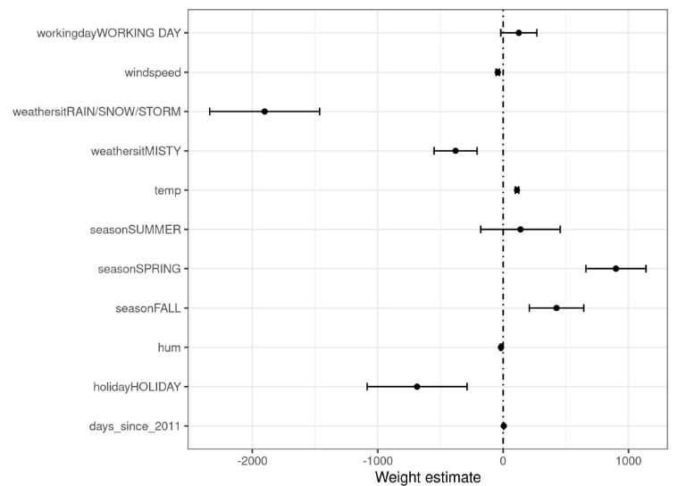
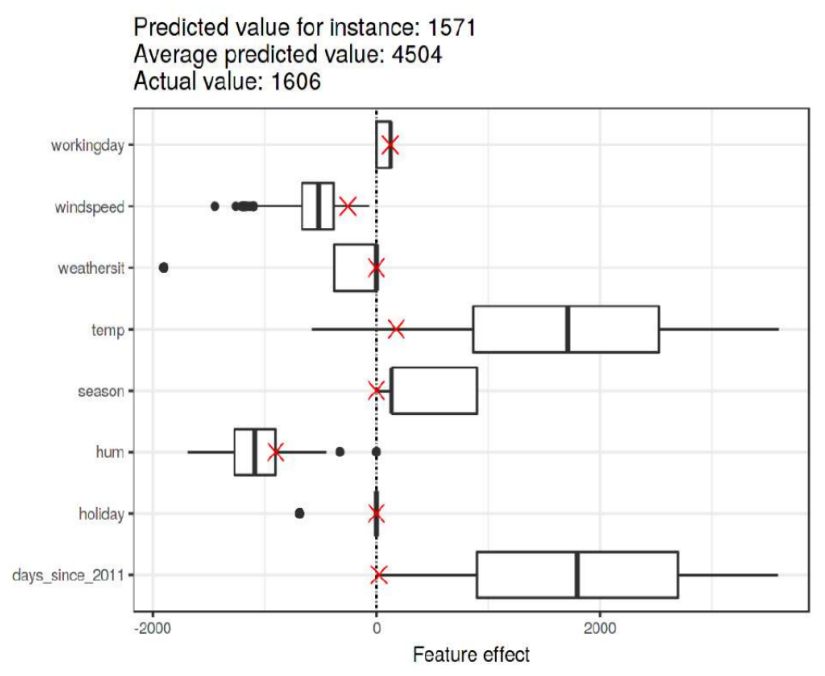

# Интерпретация линейной регрессии

## Предположения метода

[Линейная регрессия](../Linear-regression-extensions/Linear-regression) строит прогноз по формуле:

$$
\widehat{y}(\mathbf{x}) = w_{0}+w_{1}x^{1}+w_{2}x^{2}+...+w_{D}x^{D}
$$

Модель использует достаточно сильные предположения о данных:

- каждый признак $x^{i}$ влияет на отклик линейно со своим фиксированным весом $\mathbf{w}_{i}$;

- характер этого влияния не зависит от значений остальных признаков.

На практике эти предположения, скорее всего, не выполнены, зато настроенная модель проста и легко поддаётся интерпретации. 

## Интерпретация весов

Веса линейной регрессии можно интерпретировать следующим образом:

- Знак веса $w_i$ определяет <u>направленность влияния</u> $i$-го признака на отклик. Признак с положительным весом положительно влияет на отклик, а с отрицательным - отрицательно.

- Величина веса $w_i$ определяет <u>силу влияния</u>: увеличение $x^i$ на единицу приводит к увеличению $y$ на $w_i$. В случае, если $x^i$ - бинарный признак (присутствие определённой характеристики), то $w_i$ показывает, насколько увеличился бы прогноз, если бы признак был активен. 
  
  > Например, если прогнозируем, за какое время спортсмен пробежит марафон, а $x^i=\mathbb{I}[\text{была травма}]$, то $w_i$ покажет, насколько изменится время забега при наличии травмы у спортсмена. Если $x^i$ является категориальным признаком (например, у какого тренера занимался спортсмен) и кодируется [one-hot кодированием](../Data-preprocessing/Categorical-preprocessing#one-hot-кодирование), то полезно одну из категорий назначить референсной и закодировать вектором из нулей [0,0,...,0] (например, категорию, что спортсмен учился без тренера). Тогда вес при каждом бинарном признаке one-hot кодирования показывает вклад методики обучения соответствующего тренера в результат забега.

- Модуль веса при признаке $|w_i|$ оценивает степень влияния признака на прогноз. Однако перед применением этой методики все признаки необходимо привести к единой шкале ([нормализовать](../Data-preprocessing/Feature-normalization)). 
  
  > Иначе уменьшение признака в K раз и перенастройка модели приведут к увеличению веса при нём в K раз, но это не будет означать, что признак стал в K раз более важным!

- В статистике существует [асимптотическая оценка стандартного отклонения](https://homepage.ntu.edu.tw/~ckuan/pdf/et01/et_Ch6.pdf) $\sigma_i$ для оценки веса $w_i$. Это позволяет визуализировать для каждого признака не только $w_i$, но и его стандартное отклонение. 
  
  > Если интервал $(-3\sigma_i+w_i, w_i+3\sigma_i)$ покрывает ноль, то можно говорить о статистически незначимом влиянии $i$-го признака на отклик. 
  
  Для проверки значимости влияния признака этого же можно использовать и t-тест Стьюдента [[1]](https://en.wikipedia.org/wiki/Student%27s_t-test), основанный на t-статистике, равной $w_i/\sigma_i$. Можно на графике откладывать $w_i$ и соответствующий 95% интервал для этого теста, как показано на рисунке ниже [[2]](https://christophm.github.io/interpretable-ml-book/limo.html) для задачи BikeSharing [[3]](https://archive.ics.uci.edu/dataset/275/bike+sharing+dataset): 
  
  
  
  Если интервал на графике покрывает ноль, то влияние признака на целевое значение статистически незначимо, иначе влияние считается значимым.
  
  > Значимость влияния признака на отклик важна в таких задачах, как определение оптимального лечения заболевания. Если признак представляет собой объём выпитого лекарства, а выяснится, что влияние статистически незначимое, то нужно подбирать другие методы лечения!

## Анализ аддитивных эффектов

Величина $w_{i}x^{i}$ характеризует **аддитивный эффект**, который i-й признак оказывает на прогноз для вещественного и бинарного признака. Перед использованием <u>необходимо центрировать каждый признак</u>, вычтя из него его среднее по всей выборке.

Визуализировать распределение аддитивных эффектов удобно, используя **ящики с усами** (boxplots [[4]](https://en.wikipedia.org/wiki/Box_plot)). 

:::tip Построение ящика с усами 

- Краями прямоугольника ("ящика") выступают 25% и 75% [персентили](../Data-preprocessing/Feature-normalization#p-процентная-перцентиль) $Q_1$ и $Q_3$.

- Черта внутри прямоугольника соответствует 50% персентили ([медиане](../Data-preprocessing/Feature-normalization#медиана)).

- "Усы" строятся слева и справа от "ящика" строятся как линия, покрывающая интервал $(Q_1-1.5(Q_3-Q_1), Q_3+1.5(Q_3-Q_1))$, при этом границы интервала должны лежать на ближайших реальных наблюдениях в данных, поэтому могут выглядеть несимметрично относительно "ящика".

- Наблюдения, выпадающие за границы интервала "усов" визуализируются отдельными точками.

> "Ящик" и "усы" могут строиться по другим правилам, если об этом явно говорится в тексте.

:::

Рассмотрим визуализацию распределения аддитивных эффектов для задачи BikeSharing [[3]](https://archive.ics.uci.edu/dataset/275/bike+sharing+dataset), в которой оценивается число сданных напрокат велосипедов в разные дни. Для каждого дня известны его дата, день недели, погода, температура и другие параметры.

На этом же графике можно отложить частные аддитивные эффекты для отдельного прогноза (выделено красным), как показано на рисунке ниже [[2]](https://christophm.github.io/interpretable-ml-book/limo.html#explain-individual-predictions):

По графику видно, что в целом на аренду велосипедов сильнее всего в плюс влияло время с начала наблюдений (days_since_2011), так как популярность сервиса росла со временем, а также температура дня (temp). А сильнее всего в минус влияла влажность воздуха (hum).

Для аномально низкого прогноза в интересующий день аддитивные эффекты обозначены красными крестиками. Из графика видно, что малый прогноз для выбранного наблюдения основывается на малой температуре, а также на том, что рассматривается аренда в начале наблюдений, когда аренда велосипедов еще не была так популярна. 

## Снижение числа признаков

Интерпретация даже такой простой модели, как линейная регрессия, может будет затруднена, если число признаков велико, как происходит, например, при работе с текстовыми данными. В этом случае мы можем понять, как <u>каждый отдельно взятый признак влияет на прогноз</u>, но <u>не можем мысленно предсказать прогноз</u> из-за одновременного влияния большого числа других признаков.

Для упрощения интерпретации можно настраивать линейную регрессию с сильной [L1-регуляризацией](../Linear-regression-extensions/Regularization-in-linear-regression), которая способна отбирать в модель только те признаки, которые сильнее всего влияют на отклик.

Варьируя силу регуляризации (множитель при регуляризаторе), можно заставить модель использовать требуемое небольшое число признаков.

> Альтернативно можно использовать [OMP-регрессию](../Linear-regression-extensions/Orthogonal-matching-pursuit), отбирающей самые значимые признаки либо использовать другие методы отбора признаков.

## Литература

1. [Wikipedia: Student's t-test.](https://en.wikipedia.org/wiki/Student%27s_t-test)
2. [Molnar C. Interpretable machine learning. – Lulu. com, 2020: linear regression.](https://christophm.github.io/interpretable-ml-book/)
3. [UC Irvine Machine Learning Repository: Bike Sharing dataset.](https://archive.ics.uci.edu/dataset/275/bike+sharing+dataset)
4. [Wikipedia: box plot.](https://en.wikipedia.org/wiki/Box_plot)
