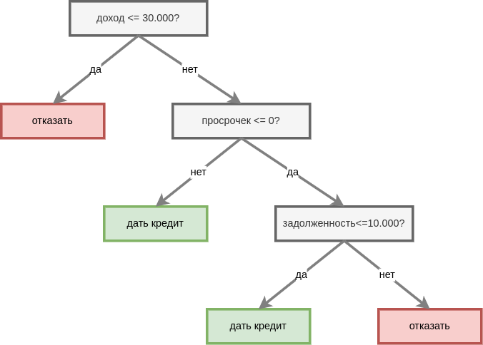
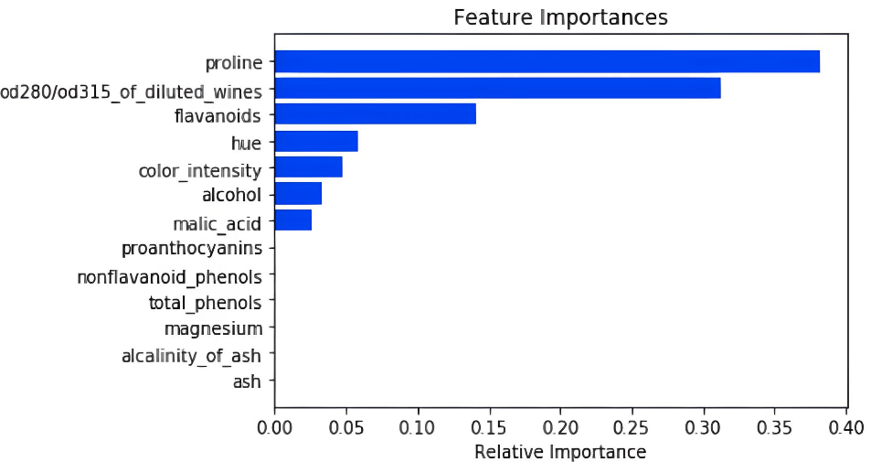

# Интерпретация решающего дерева

Решающее дерево является интерпретируемым алгоритмом машинного обучения. Интерпретация возможна:

- визуализацией решающего дерева;

- оценкой степени влияния каждого признака на прогнозы в среднем по выборке;

- оценкой степени влияния каждого признака на прогноз интересующего объекта.

Ниже мы рассмотрим каждый из подходов детально.

## Визуализация деревьев

Решающее дерево небольшой глубины можно визуализировать и анализировать напрямую. В этом смысле это метод, обладающий [глобальной интерпретируемостью](Interpretable-machine-learning#виды-интерпретируемости). 

Ниже приведён простой пример решающего дерева для задачи кредитного скоринга в банке, работу которого может понять даже не-специалист:

## Глобальная важность признаков

Можно оценивать значимость каждого признака для прогнозов решающего дерева в целом по выборке, используя ранее уже изученное [среднее изменение неопределённости](../Decision-trees/Feature-importances) (mean decrease in impurity, MDI). 

Рассмотрим задачу wine [[1]](https://rpubs.com/Kanasani/724932), в которой по характеристикам вина требуется предсказать его класс. Значимости каждого признака приведены ниже [[2]](https://kanoki.org/2020/05/13/decision-tree-in-sklearn/):

Из графика сразу видно, что уровень пролина оказывается самым важным признаком.

Эту же методику можно применять для ансамбля над решающими деревьями (бэггинг, случайный лес, бустинг и др.) - нужно лишь усреднить важности признаков каждого дерева с теми коэффициентами, с которыми оно учитываются в ансамбле. 

> Поскольку ансамбли дают более точные прогнозы, расчёт важности по ансамблю деревьев даст более надёжную оценку влияния признаков на отклик!

:::tip Первичный анализ данных

Анализ самых значимых признаков по ансамблю решающих деревьев - важный этап <u>первичного анализа данных</u>, который стоит применять, даже если вы не собираетесь впоследствии использовать сами решающие деревья!

:::

## Вклад признака в отдельный прогноз

Нас может интересовать вклад каждого признака не для всех объектов выборки, а для одного интересующего объекта $\mathbf{x}$. Рассмотрим, как это можно рассчитать.

Как известно в решающих деревьях прогноз приписывается каждому листу дерева [простым усреднением откликов объектов, попавших в лист](../Decision-trees/Tree-fitting#назначение-прогноза-в-листах). В случае классификации усредняются one-hot закодированные метки классов, что на выходе даёт вектор предсказанных вероятностей классов. Но аналогично можно сопоставить прогноз и каждому промежуточному узлу, усредняя отклики объектов, прошедших через соответствующий узел.

Введём обозначения: 

- $t$ - узел дерева, 

- $\text{Parent}\left(t\right)$ - соответствующий родительский узел, 

- $\text{root}$ - корень дерева, 

- $\text{path}\left(\mathbf{x}\right)$ - путь от корня до листа, по которому объект $\mathbf{x}$ спустился вниз по дереву. 

Посчитаем для объекта $\mathbf{x}$ прогноз $\widehat{y}\left(t\right)$ в каждом промежуточном узле дерева $t$ вдоль пути $\text{path}\left(\mathbf{x}\right)$. Итоговый прогноз можно декомпозировать по вкладу в него каждого узла:

$$
\widehat{y}(\mathbf{x})=\sum_{t\in\text{path}\left(\mathbf{x}\right)\backslash\left\{ \text{root}\right\} }|\widehat{y}\left(t\right)-\widehat{y}\left(\text{Parent}\left(t\right)\right)|
$$

Но нам нужен не вклад каждого узла, а <u>вклад каждого признака</u> в прогноз для интересующего объекта. Для этого для каждого признака $i$ найдём множество тех узлов $T_i$, где этот признак использовался в решающем правиле дерева.

Тогда вклад $i$-го признака в прогноз $\hat{y}(\mathbf{x})$ считается как суммарный вклад по узлам, учитывающим $i$-й признак:

$$
\text{Importance}(i|\mathbf{x})=\sum_{t\in\text{path}\left(\mathbf{x}\right)\backslash\left\{ \text{root}\right\} \textcolor{red}{\cap T_i} }|\widehat{y}\left(t\right)-\widehat{y}\left(\text{Parent}\left(t\right)\right)|
$$

Так мы рассчитаем вклад каждого признака в прогноз определённого объекта $\mathbf{x}$. Метод был предложен в [[3]](https://blog.datadive.net/interpreting-random-forests/).

Обратим внимание, что

$$
\sum_i \text{Importance}(i|\mathbf{x}) = \hat{y}(\mathbf{x}),
$$

причём часть признаков будут оказывать положительное, а часть - отрицательное влияние на величину прогноза.

> Метод обобщается на ансамбль решающих деревьев (бэггинг, бустинг, решающий лес и др.): для этого нужно усреднить вклады признаков по деревьям ансамбля.

:::tip Глобальная важность признака

Усредняя оценку важности по всем объектам выборки, получим <u>глобальную важность признака</u>, похожую по смыслу на меру [среднего изменения неопределённости](../Decision-trees/Feature-importances). Первая мера оценивает среднее изменение прогноза при учёте признака, а вторая - среднее влияние признака на снижение [неопределённости прогнозов](../Decision-trees/Impurity-functions). 

:::

---

Вы также можете прочитать про интерпретацию решающих деревьев в [[4]](https://christophm.github.io/interpretable-ml-book/tree.html). А в [следующем разделе учебника](../Complex-models-interpretation) мы изучим подходы интерпретации прогнозов сложных моделей (balck-box models), таких как ансамбли алгоритмов и нейронные сети.

## Литература

1. [UC Irvine Machine Learning Repository: wine dataset.](http://archive.ics.uci.edu/dataset/109/wine)

2. [Kanoki.org: decision tree in sklearn.](https://kanoki.org/2020/05/13/decision-tree-in-sklearn/)

3. [Blog.datadive.net: interpreting random forests.](https://blog.datadive.net/interpreting-random-forests/)

4. [Molnar C. Interpretable machine learning. – Lulu. com, 2020: Decision Tree.](https://christophm.github.io/interpretable-ml-book/tree.html)
