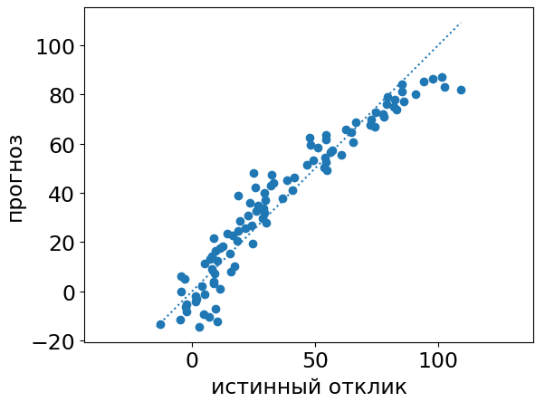

# Анализ ошибок модели

Для отладки моделей и улучшения их качества полезно анализировать не агрегированную меру качества по всей выборке, такую как точность классификации или средний модуль ошибки, а смотреть на ошибки <u>в разбивке по различным истинным значениям целевой переменной</u>. Это позволяет понять характер зависимости ошибок от реального значения отклика.

## Регрессия

В случае регрессии для этого строят график зависимости прогноза $\hat{y}$ от истинного значения $y$, как показано ниже:

> По представленному графику видно, что модель хорошо предсказывает объекты со средним откликом, но плохо - с низким или высоким, недооценивая его величину. Таким образом, качество прогнозов можно улучшить, повысив прогноз, когда он оказался ниже или выше среднего значения.

В библиотеке sklearn есть специальный класс PredictionErrorDisplay, позволяющий легко строить подобные визуализации [[1]](https://scikit-learn.org/stable/modules/generated/sklearn.metrics.PredictionErrorDisplay.html).

## Классификация

В случае классификации можно анализировать [матрицу ошибок](../Classifier-evaluation/Standard-multiclass-label-quality-estimation#матрица-ошибок-классификации) (confusion matrix), строкам которой соответствуют реальные отклики, а столбцам - их прогнозы. Таким образом, $(i,j)$-й элемент матрицы содержит число случаев, когда истинный класс $i$ был предсказан $j$-м классом.

Ниже приведён пример этой матрицы для трёх классов:

|       | $\hat{y}=1$ | $\hat{y}=2$ | $\hat{y}=3$ |
| ----- | ----------- | ----------- | ----------- |
| $y=1$ | 10          | 3           | 0           |
| $y=2$ | 0           | 20          | 12          |
| $y=3$ | 2           | 5           | 30          |

> По матрице видно, что классификатор в целом справляется с задачей (высокие значения на диагонали), а самая типичная ошибка классификатора - назначить объекту 2-го класса 3-й класс. Таким образом, если модель предсказывает 3-й класс, можно для этого объекта проводить дополнительную классификацию отдельной моделью, специально обученной точно различать 2-й и 3-й классы.

В библиотеке sklearn матрица ошибок вычисляется функцией confusion_matrix [[2]](https://scikit-learn.org/stable/modules/generated/sklearn.metrics.confusion_matrix.html). 

## Анализ проблемных объектов

Полезно смотреть на те объекты, на которых модель была уверена в одном прогнозе, а верным оказался другой прогноз. Такие ошибки считаются наиболее существенными.

В случае классификации уверенность модели можно оценить по:

- рейтингам классов;

- вероятностям классов;

- величине [отступа](../General-classifiers/Margin#отступ-для-многоклассовой-классификации).

Если прогноз строится ансамблем, то об уверенности прогноза можно судить по числу базовых моделей, голосующих за тот или иной класс.

Анализ таких объектов может дать подсказку, какие дополнительные свойства объектов необходимо учесть в модели, чтобы она реже ошибалась. 

## Литература

1. [Документация sklearn: plotting cross-validated predictions.](https://scikit-learn.org/stable/auto_examples/model_selection/plot_cv_predict.html#sphx-glr-auto-examples-model-selection-plot-cv-predict-py)

2. [Документация sklearn: confusion_matrix.](https://scikit-learn.org/stable/modules/generated/sklearn.metrics.confusion_matrix.html)
