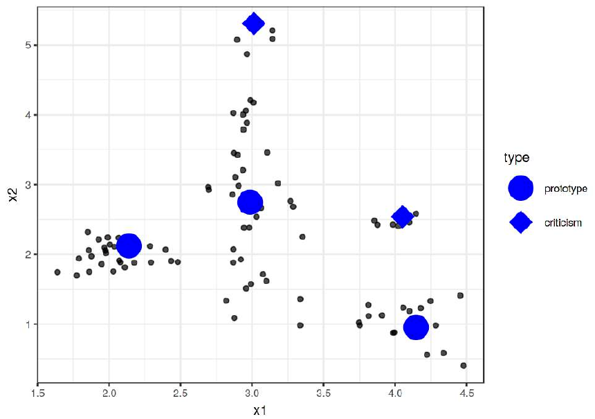
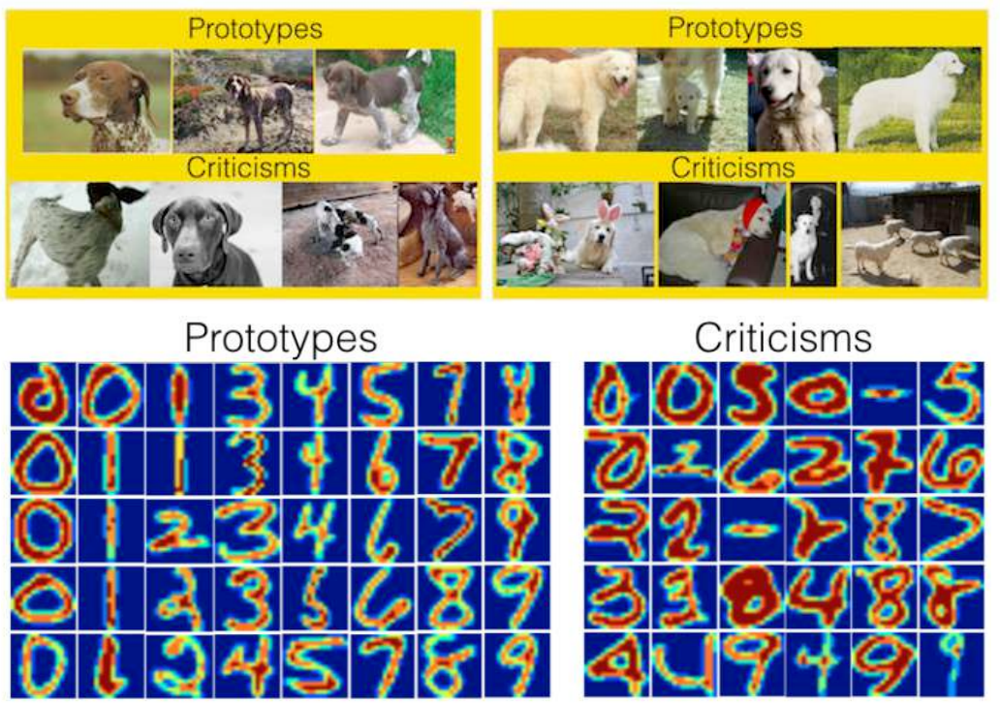

# Прогнозы на типичных и нетипичных объектах

Для отладки обученной модели полезно рассмотреть её обработку: 

- <u>типичных объектов</u> (прототипов, prototypes);

- <u>нетипичных объектов</u> (критиков, criticisms).

Объекты-прототипы лежат в центрах плотно заполненных областей признакового пространства. Объекты-критики находятся, наоборот, в слабо заполненных областях пространства признаков.

> Для простоты последующего анализа множество прототипов и критиков нужно выбирать минимально достаточным, т.е. с использованием минимального числа характерных примеров. 

Пример выделения прототипов и критиков для двумерных данных показан ниже [[1]](https://christophm.github.io/interpretable-ml-book/proto.html):

> Как видим, прототипы лежат в областях сгущения характерных объектов, а критики - в сгущениях нетипичных объектов, что позволяет описать типичные и нетипичные случаи минимальным числом примеров!

Примеры объектов-прототипов и критиков для задачи определения породы собаки и распознавания рукописных цифр по фото показаны ниже [[1]](https://christophm.github.io/interpretable-ml-book/proto.html):

> Видно, что прототипы первой задачи представляют собой классические фото собак крупным планом. Критики же представляют нетипичные случаи, где собак на фото может быть много, на собаку что-то одето и т.д.
> 
> Аналогично и во второй задаче - прототипы представляют собой классические и разборчивые написания цифр. На изображениях-критиках цифры написаны неразборчиво, слишком жирно или вообще не соответствуют никакой цифре!

Поскольку прототипы и критики ёмко описывают множество типичных и нетипичных случаев, они позволяют легко получить комплексное представление о работе модели в разных сценариях перед её внедрением.

Прототипы можно найти как центры кластеров при кластеризации методом К-медоид [[2]](https://en.wikipedia.org/wiki/K-medoids). Этот метод кластеризации аналогичен методу К-средних [[3]](https://en.wikipedia.org/wiki/K-means_clustering), только центрами могут выступать лишь объекты обучающей выборки. В качестве критиков можно выбирать объекты выборки, далёкие от центров кластеров, а также друг от друга. 

Существует и более продвинутая процедура выделения прототипов и критиков - MMD-critic, описанная в [[1]](https://christophm.github.io/interpretable-ml-book/proto.html#theory) и имеющая реализацию на python [[4]](https://pypi.org/project/mmd-critic/).

## Литература

1. [Molnar C. Interpretable machine learning. – Lulu. com, 2020: prototypes and criticisms.](https://christophm.github.io/interpretable-ml-book/proto.html)

2. [Wikipedia: k-medoids.](https://en.wikipedia.org/wiki/K-medoids)

3. [Wikipedia: k-means clustering.](https://en.wikipedia.org/wiki/K-means_clustering)

4. [pypi.org: mmd-critic library.](https://pypi.org/project/mmd-critic/)
