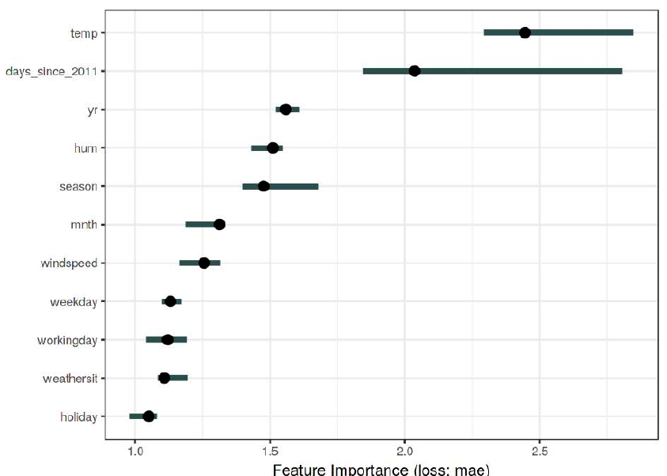

# Влияние признаков на качество прогнозов

## Перестановочная важность признаков

**Метод перестановочной важности признаков** (permutation feature importance) представляет собой способ расчёта степени влияния каждого признака на прогнозы модели.

Достоинством метода является то, что он применим:

- для любой модели (white-box, black-box models); 

- для любой задачи (классификация, регрессия и др.);

- для любой функции потерь. 

Пусть $X\in\mathbb{R}^{N\times D}$ - матрица объекты-признаки (вектора признаков для каждого объекта составляют строки этой матрицы), а $Y\in\mathbb{R}^{N}$ - вектор откликов для объектов в матрице $X$. Пара $(X,Y)$ может соответствовать [как обучающей, так и внешней валидационной выборке](../Base-concepts/Quality-estimation).

Пусть $L\left(f|X,Y\right)$ - потери модели на выборке $(X,Y)$, например, средний модуль ошибки для регрессии или частота ошибок для классификации. Чтобы оценить важность $j$-го признака, перемешаем (с возвращением) случайным образом значения этого признака (значения $j$-го столбца матрицы $X$), 
получим новую матрицу $\widetilde{X}_{j}$, отличную от $X$ только в $j$-м столбце. 

При таком случайном перемешивании общее распределение $j$-го признака сохранится, но связь с $y$ потеряется. Пусть $L\left(f|\widetilde{X}_{j},Y\right)$ - потери модели на выборке $(\widetilde{X}_{j},Y)$. Тогда перестановочная важность признака $j$ (permutation feature importance, PMI, [[1]](https://link.springer.com/article/10.1023/a:1010933404324), [[2]](https://www.jmlr.org/papers/v20/18-760.html)) считается по одной из следующих формул:

$$
\tag{1}  \frac{L\left(f|\widetilde{X}_{j},Y\right)}{L\left(f|X,Y\right)}
$$

$$
\tag{2}  L\left(f|\widetilde{X}_{j},Y\right)-L\left(f|X,Y\right)
$$

Таким образом, перестановочная важность признака показывает, во сколько/на сколько средние потери прогнозов изменятся, если модель не сможет эффективно использовать информацию, хранящуюся в том или ином признаке.

:::tip Устойчивость к случайности

Обратим внимание, что результат зависит от случайной перестановки признака. При различных перестановках будем получать различный результат. Поэтому на практике статистика пересчитывается много раз для случайных перестановок, а в качестве итогового ответа выдаётся её <u>среднее значение</u>.

:::

Пример расчёта важности признаков по формуле (1) для задачи bike sharing [[3]](https://archive.ics.uci.edu/dataset/275/bike+sharing+dataset) приведён ниже [[4]](https://christophm.github.io/interpretable-ml-book/feature-importance.html), где точками обозначены средние значения важности при перезапусках метода, а интервал показывает нижнюю и верхнюю квантиль по значениям в различных запусках:

> Как видим, все признаки оказывают значимое влияние на прогноз, кроме признака holiday, поскольку его доверительный интервал покрывает единицу.

Рекомендуется использовать отношение (1), а не разность потерь (2), поскольку тогда можно сопоставлять важность признаков на разных моделях <u>с разными диапазонами потерь</u>: относительное изменение потерь более инвариантно к изменению диапазона, чем разность.

Перестановочную важность признаков можно считать:

- <u>по обучающей выборке</u>: тогда узнаем, на каких признаках модель сильнее всего переобучилась;

- <u>по валидационной тестовой выборке</u>: тогда узнаем, какой признак важнее для прогнозирования новых объектов.

## Достоинства

Метод даёт глобальную интерпретируемость для всей выборки в привязке к конкретной функции потерь. В этом её достоинство по сравнению с внешними эвристическими методами расчёта важности признаков, такими как корреляция [[5]](https://en.wikipedia.org/wiki/Correlation) с откликом или нормализованная взаимная информация (normalized mutual information, NMI [[6]](https://en.wikipedia.org/wiki/Mutual_information)), которые зависят от прогнозов и верных ответов, но <u>никак не зависят от рассматриваемой функции потерь</u>. 

## Недостатки

К недостаткам метода стоит отнести то, что расчёт важности будет во многом основываться на нереалистичных объектах. 

> Рассмотрим в качестве объектов пациентов больницы, у которых признаки включают рост и вес. Оценивая важность роста, мы переставляем значения роста случайным образом, оставляя вес таким, каким он был, что может приводить к малореальным пациентам с большим весом, но малого роста, и наоборот. 

Также в случае связанных признаков (как тот же рост и вес пациента), если мы переставим случайно значения одного признака, то у модели останется возможность извлекать информацию об "испорченном" признаке из оставшихся связанных признаков. Это приведёт к занижению важности каждого признака в группе зависимых признаков. 

Поэтому рекомендуется вначале разбивать признаки на группы связанных друг с другом признаков, а потом переставлять элементы сразу для всех признаков группы. Так мы оценим важность каждой зависимой группы признаков как целого без смещений.

---

Также с перестановочной важностью признаков можно ознакомиться в [[4]](https://christophm.github.io/interpretable-ml-book/feature-importance.html). А в [[7]](https://www.researchgate.net/publication/279244338_Variable_importance_analysis_A_comprehensive_review) представлен обзор и сравнение различных методов оценки важности признаков.

## Литература

1. [Breiman L. Random forests //Machine learning. – 2001. – Т. 45. – С. 5-32.](https://link.springer.com/article/10.1023/a:1010933404324)

2. [Fisher A., Rudin C., Dominici F. All models are wrong, but many are useful: Learning a variable's importance by studying an entire class of prediction models simultaneously //Journal of Machine Learning Research. – 2019. – Т. 20. – №. 177. – С. 1-81.](https://www.jmlr.org/papers/v20/18-760.html)

3. [UC Irvine Machine Learning Repository: bike sharing dataset.](https://archive.ics.uci.edu/dataset/275/bike+sharing+dataset)

4. [Molnar C. Interpretable machine learning. – Lulu. com, 2020: permutation feature importance.](https://christophm.github.io/interpretable-ml-book/feature-importance.html)

5. [Wikipedia: correlation.](https://en.wikipedia.org/wiki/Correlation)

6. [Wikipedia: mutual information.](https://en.wikipedia.org/wiki/Mutual_information)

7. [Wei P., Lu Z., Song J. Variable importance analysis: A comprehensive review //Reliability Engineering & System Safety. – 2015. – Т. 142. – С. 399-432.](https://www.researchgate.net/publication/279244338_Variable_importance_analysis_A_comprehensive_review)
