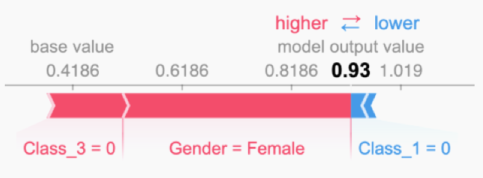

# Значения Шепли

**Значения Шепли** (Shapley values [[1]](https://en.wikipedia.org/wiki/Shapley_value)) позволяют объяснить для выбранного объекта $\mathbf{x}$ вклад значения каждого признака в прогноз модели $f\left(\mathbf{x}\right)$. Оценка производится для конкретного объекта и конкретного значения выбранного признака. Вклад значений всех признаков и обеспечивает результирующий прогноз. 

Рассмотрим в качестве примера задачу Titanic [[2]](https://www.openml.org/search?type=data&sort=version&status=any&order=asc&exact_name=Titanic), в которой по описанию каждого  пассажира (включающему класс билета, пол, возраст и т.д.) нужно предсказать, выжил он в результате кораблекрушения или нет. На рисунке ниже [[3]](https://www.researchgate.net/profile/Alicja-Gosiewska/publication/332033937_iBreakDown_Uncertainty_of_Model_Explanations_for_Non-additive_Predictive_Models/links/5cb4e67892851c8d22ee00ee/iBreakDown-Uncertainty-of-Model-Explanations-for-Non-additive-Predictive-Models.pdf) показано объяснение прогнозируемой вероятности выживания для одного из пассажиров: 

> Видно, что высокая вероятность прогнозируемого выживания 0.93 обеспечивается тем, что пассажир - женщина, которая не путешествовала третьим классом. Однако то, что она не путешествовала первым классом (в one-hot кодировании индикаторы класса - разные признаки) несколько снизило оцениваемую вероятность выжить.

Псевдокод для приближённого расчёта значения Шепли, измеряющего вклад $j$-го признака в прогноз приведён ниже.

**Результат:** значение Шепли для значения $j$-го признака  

**Параметры:** количество итераций $M$, исследуемый объект $\mathbf{x}$, индекс признака $j$, матрица данных $\mathbf{X}$, модель машинного обучения $f$.

1. Для всех $m = 1, \ldots, M$:
   
   - Выбрать случайный объект $\mathbf{z}$ из матрицы данных $\mathbf{X}$
   - Случайным образом выбрать перестановку $\mathbf{p}$ признаков
   - Упорядочить объект $\mathbf{x}$:  $\mathbf{x}_{\mathbf{p}} = (x_{(1)}, \ldots, x_{(j)}, \ldots, x_{(D)})$
   - Упорядочить объект $\mathbf{z}$:  $\mathbf{z}_{\mathbf{p}} = (z_{(1)}, \ldots, z_{(j)}, \ldots, z_{(D)})$
   - Построить два новых объекта:
     - С признаком $j$:  $\mathbf{x}_{+j} = (x_{(1)}, \ldots, x_{(j-1)}, x_{(j)}, z_{(j+1)}, \ldots, z_{(D)})$
     - Без признака $j$:    $\mathbf{x}_{-j} = (x_{(1)}, \ldots, x_{(j-1)}, z_{(j)}, z_{(j+1)}, \ldots, z_{(D)})$
   - Вычислить маржинальный вклад:
     
     $$
     \phi_j^{(m)} = f(\mathbf{x}_{+j}) - f(\mathbf{x}_{-j})
     $$

2. Вычислить значение Шепли как среднее маржинальных вкладов:  
   
   $$
   \phi_j(\mathbf{x}) = \frac{1}{M} \sum_{m=1}^M \phi_j^{(m)}
   $$

Число повторов $M$ определяет точность полученной оценки: чем выше - тем она получится точнее.

По сути, происходит оценка, насколько в среднем вырастает прогноз, если оставить и заменить интересующее значение признака случайным значением из выборки при одновременной замене случайного подмножества других признаков. В итоге получим <u>среднее изменение прогноза за счёт того, что интересующий признак принимает заданное значение</u>. 

Таким образом, значения Шепли оценивают важность признаков в контексте заданного объекта $\mathbf{x}$, а сумма их значений равна отклонению прогноза $f(\mathbf{x})$ от среднего прогноза по всем объектам. 

Недостатком метода, как для [перестановочной важности признаков](Permutation-feature-importance), является <u>усреднение по малореальным объектам</u>, поскольку в процедуре оценки генерируются синтетические объекты, для которых часть значений признаков взята из одного объекта, а другая часть - из другого, что может приводить к маловероятным комбинациям признаков, особенно когда признаки сильно скоррелированы.

:::tip Глобальная важность признака

С помощью значений Шепли можно вычислить и <u>глобальную важность признака</u>. Для этого абсолютные значения Шепли для этого признака усредняются по всем объектам выборки:

$$
\text{Importance}(j)=\frac{1}{N}\sum_{n=1}^N |\phi_j(\mathbf{x}_n)|
$$

:::

---

Детальнее о значениях Шепли, их теоретическом обосновании и свойствах можно прочитать в [[4]](https://christophm.github.io/interpretable-ml-book/shapley.html) и [[5]](https://christophm.github.io/interpretable-ml-book/shap.html). Пример практического расчёта этих значений в python, используя библиотеку shap, доступен в [[6]](https://shap.readthedocs.io/en/latest/example_notebooks/overviews/An%20introduction%20to%20explainable%20AI%20with%20Shapley%20values.html). 

## Литература

1. [Wikipedia: Shapley value.](https://en.wikipedia.org/wiki/Shapley_value)

2. [openml.org: Titanic dataset.](https://www.openml.org/search?type=data&sort=version&status=any&order=asc&exact_name=Titanic)

3. [Gosiewska A., Biecek P. IBreakDown: Uncertainty of model explanations for non-additive predictive models //arXiv preprint arXiv:1903.11420. – 2019.](https://www.researchgate.net/profile/Alicja-Gosiewska/publication/332033937_iBreakDown_Uncertainty_of_Model_Explanations_for_Non-additive_Predictive_Models/links/5cb4e67892851c8d22ee00ee/iBreakDown-Uncertainty-of-Model-Explanations-for-Non-additive-Predictive-Models.pdf)

4. [Molnar C. Interpretable machine learning. – Lulu. com, 2020: Shapley values.](https://christophm.github.io/interpretable-ml-book/shapley.html)

5. [Molnar C. Interpretable machine learning. – Lulu. com, 2020: SHAP.](https://christophm.github.io/interpretable-ml-book/shap.html)

6. [Документация shap: an introduction to explainable AI with Shapley values.](https://shap.readthedocs.io/en/latest/example_notebooks/overviews/An%20introduction%20to%20explainable%20AI%20with%20Shapley%20values.html)
