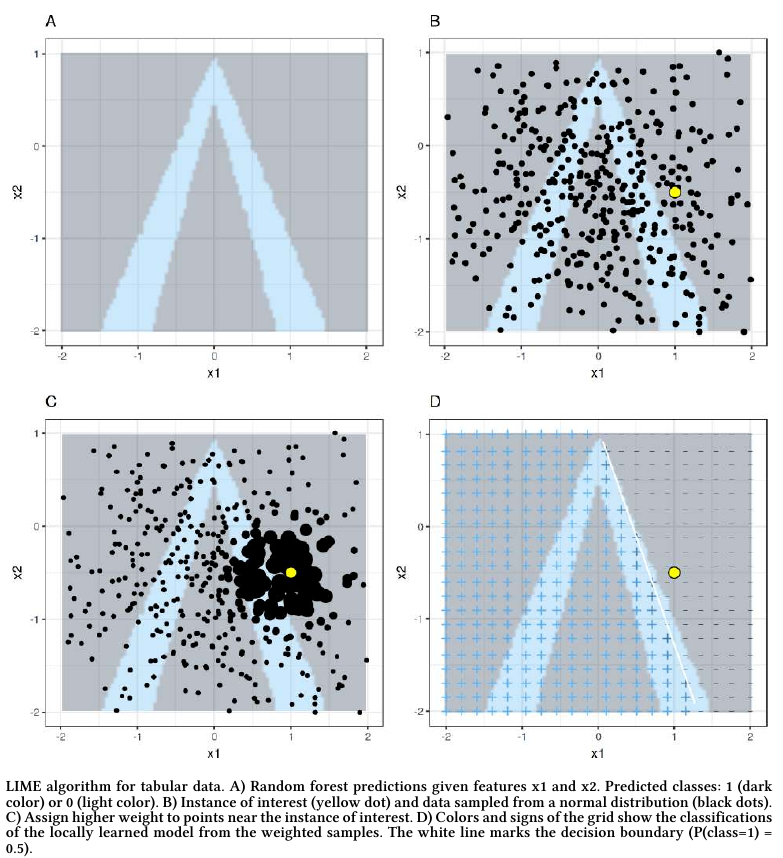
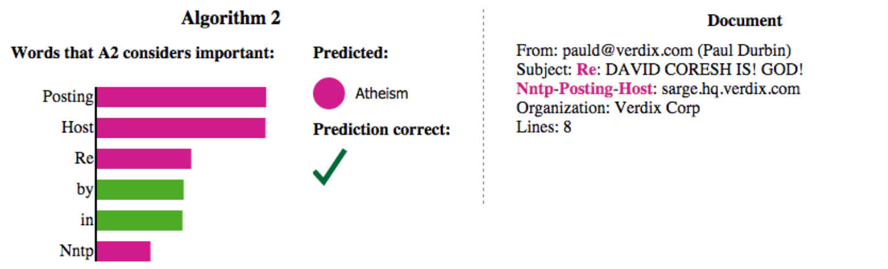
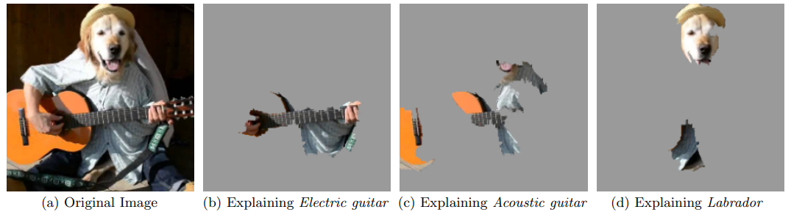

# Локальное объяснение интерпретируемой моделью

## Алгоритм LIME

Метод **LIME** (local interpretable model-agnostic explanations [[1]](https://arxiv.org/abs/1606.05386)) позволяет объяснить прогноз сложной модели $f(\mathbf{x})$ для интересуемого объекта $\mathbf{x}$ за счёт <u>аппроксимации прогнозов этой модели другой простой и интерпретируемой моделью</u> в окрестности точки $\mathbf{x}$. 

> Например, в задаче кредитного скоринга нас может интересовать, почему для определённого клиента кредит не был одобрен. Пусть прогноз возврата кредита осуществляется многослойной нейросетью или сложным ансамблем моделей, поэтому напрямую неинтерпретируем. Но мы можем сгенерировать много синтетических клиентов, похожих на интересующего, посмотреть на прогнозы сложной модели для этих похожих клиентов и настроить <u>простую интерпретируемую модель, аппроксимирующую прогнозы сложной модели в окрестности интересуемого клиента</u>. Простыми и интерпретируемыми моделями могут выступать решающее дерево, линейная модель, метод ближайших центроидов и т.д.

Простая модель поддаётся непосредственной интерпретации, поэтому можно напрямую изучить логику её работы, чтобы делать выводы о работе сложной модели в окрестности интересующего объекта. 

Метод LIME работает следующим образом:

1. Выбрать объект $\mathbf{x}$, для которого нужно объяснить прогноз сложной модели $f(\mathbf{x})$.

2. Сгенерировать выборку, состоящую из локальных вариаций $\widetilde{\mathbf{x}}_{1},\widetilde{\mathbf{x}}_{2},...\widetilde{\mathbf{x}}_{K}$ объекта $\mathbf{x}$.

3. Построить для вариаций прогнозы сложной моделью $f\left(\cdot\right)$, получив выборку: 
   
   $$
   \left\{ \left[\widetilde{\mathbf{x}}_{1},f\left(\widetilde{\mathbf{x}}_{1}\right)\right];~\left[\widetilde{\mathbf{x}}_{2},f\left(\widetilde{\mathbf{x}}_{2}\right)\right];~...\left[\widetilde{\mathbf{x}}_{K},f\left(\widetilde{\mathbf{x}}_{K}\right)\right]\right\}
   $$

4. Взвесить объекты по близости к $\mathbf{x}$ (чем вариация ближе, тем её вес больше):
   
   $$
   \left\{ \left[w_{1},\widetilde{\mathbf{x}}_{1},f\left(\widetilde{\mathbf{x}}_{1}\right)\right];~\left[w_{2},\widetilde{\mathbf{x}}_{2},f\left(\widetilde{\mathbf{x}}_{2}\right)\right];~...\left[w_{K},\widetilde{\mathbf{x}}_{K},f\left(\widetilde{\mathbf{x}}_{K}\right)\right]\right\}
   $$

5. Настроить интерпретируемую модель $g\left(\mathbf{x}\right)$ по взвешенной выборке (чем вес выше, тем объект учитывается [сильнее](../Base-concepts/Weighted-account)).

6. Исследовать интерпретируемую модель, аппроксимирующую прогноз сложной модели для точки $\mathbf{x}$.

Этапы работы алгоритма визуализированы ниже на графиках A,B,C,D [[2]](https://christophm.github.io/interpretable-ml-book/lime.html):

Процесс сэмплирования объектов, похожих на заданный, зависит от характера объектов:

- Для вектора вещественных чисел можно добавлять шум с небольшой дисперсией.

- Для текста можно включать/исключать отдельные слова.

- Для изображения - включать/исключать отдельные суперпиксели (области соседних пикселей, примерно похожих по цвету [[3]](https://darshita1405.medium.com/superpixels-and-slic-6b2d8a6e4f08)).
  
  

В качестве простой интерпретируемой модели, аппроксимирующей сложную, обычно используется:

- Решающее дерево небольшой глубины.

- Линейная модель с сильной [L1-регуляризацией](../Linear-regression-extensions/Regularization-in-linear-regression). 

L1-регуляризация используется для сокращения числа признаков. Альтернативно для этого можно использовать [OMP-регрессию](../Linear-regression-extensions/Orthogonal-matching-pursuit) или другой метод [отбора признаков](../Data-preprocessing/Feature-reduction), такой как forward-selection (последовательный выбор самых важных признаков) или backward-selection (последовательное исключение самых незначимых). 

## Контроль ошибки аппроксимации

Cтоит помнить, что простая интерпретируемая модель является лишь <u>аппроксимацией</u> сложной модели, поэтому важно контролировать качество её аппроксимации. Например, для задачи регрессии это может быть ошибка аппроксимации относительно ошибки аппроксимации константой:

$$
\text{ApproxError}=\sqrt{\frac{\frac{1}{K}\sum_{k=1}^{K}\left(f\left(\mathbf{x}_{k}\right)-g\left(\mathbf{x}_{k}\right)\right)^{2}}{\frac{1}{K}\sum_{k=1}^{K}\left(f\left(\mathbf{x}_{k}\right)-\frac{1}{K}\sum_{k=1}^{K}f\left(\mathbf{x}_{k}\right)\right)^{2}}}
$$

Если ошибка аппроксимации высока, нужно либо усложнять аппроксимирующую модель (увеличивая глубину дерева или увеличивая число признаков, ослабляя  L1-регуляризацию), либо уменьшить окрестность сэмплируемых вокруг интересующего объекта $\mathbf{x}$ точек (которую при прочих равных лучше брать побольше, чтобы описать поведение исходной модели в более широкой области).

## Примеры использования

### Классификация текста

В [[1]](https://dl.acm.org/doi/abs/10.1145/2939672.2939778) представлена интерпретация бинарного классификатора документа из подмножества документов датасета 20-news-groups [[4]](https://archive.ics.uci.edu/dataset/113/twenty+newsgroups), относящихся к классам christianity и atheism:

Самые значимые слова показаны слева, а начало документа - справа. Хотя классификация корректна, модель использовала нерелевантные слова Posting, Host и Re, не имеющие никакого отношения к темам христианства и атеизма! Подобный анализ позволяет <u>выявить переобученные модели</u>, даже если они показывают хорошее качество прогнозов.

### Классификация изображений

Метод LIME можно использовать и для интерпретации моделей, классифицирующих изображения по объектам, которые на них показаны. Для этого можно сложную модель, такую как [Google inception network](../../Neural-networks/Convolutional-architectures/GoogLeNet), аппроксимировать линейным классификатором, использующим небольшое число суперпикселей. Пример подобной интерпретации для наиболее вероятных классов приведён ниже [[1]](https://dl.acm.org/doi/abs/10.1145/2939672.2939778):

Как видим, наиболее сильно влияющие суперпиксели согласуются с классами, и модель не переобучилась.

---

Метод LIME на python реализован в [одноимённой библиотеке](https://github.com/marcotcr/lime). Детальнее о методе можно почитать в [[2]](https://christophm.github.io/interpretable-ml-book/lime.html), а также в оригинальной статье [[1]](https://dl.acm.org/doi/abs/10.1145/2939672.2939778).

## Литература

1. [Ribeiro M. T., Singh S., Guestrin C. " Why should i trust you?" Explaining the predictions of any classifier //Proceedings of the 22nd ACM SIGKDD international conference on knowledge discovery and data mining. – 2016. – С. 1135-1144.](https://dl.acm.org/doi/abs/10.1145/2939672.2939778)

2. [Molnar C. Interpretable machine learning. – Lulu. com, 2020: LIME.](https://christophm.github.io/interpretable-ml-book/lime.html)

3. [Medium.com: superpixels and SLIC.](https://darshita1405.medium.com/superpixels-and-slic-6b2d8a6e4f08)

4. [UC Irvine Machine Learning Repository: twenty newsgroups dataset.](https://archive.ics.uci.edu/dataset/113/twenty+newsgroups)
