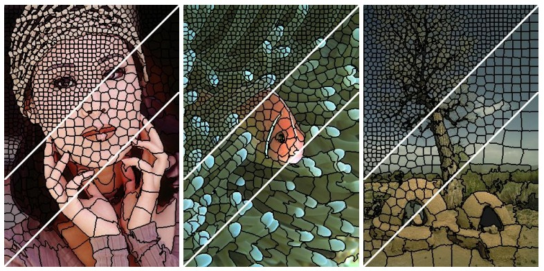
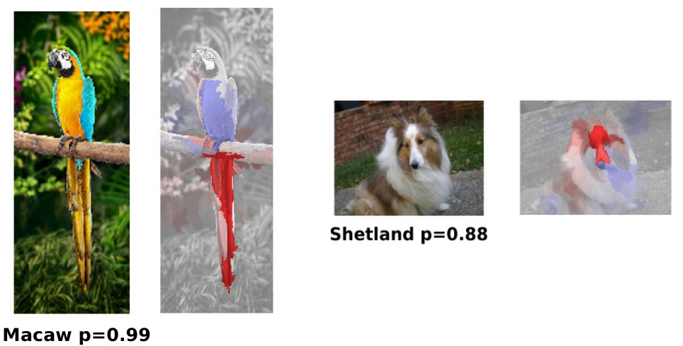

# Влияние фрагментов на прогноз

В задаче классификации фотографий можно очень легко оценивать влияние каждого фрагмента изображения на прогноз. Для этого изображение нужно разбить на суперпиксели (superpixels [[1]](https://paperswithcode.com/task/superpixels)), то есть группы соседних пикселей, примерно похожих по цвету и размеру, а затем поочерёдно затирать каждый суперпиксель (заполняя равномерно некоторым цветом) и смотреть, <u>насколько изменится прогноз модели</u>. 

Ниже показаны примеры разбиения изображения на суперпиксели [[2]](https://infoscience.epfl.ch/entities/publication/2dd26d47-3d00-43eb-9e31-4610db94a26e):

На изображениях ниже подсвечены суперпиксели, заполнение которых равномерным цветом приводит к максимальному изменению прогноза [[3]](https://www.albany.edu/faculty/mchang2/files/2018_08_ICPR_InterpretDNN.pdf):

По самым значимым суперпикселям видно, что модель обучилась корректно - при классификации объекта она анализирует именно его, а не фон.

> Вместо суперпикселей изображение можно разбить на квадратные участки и затирать поочерёдно каждый участок, чтобы оценить его влияние. Однако в этом случае полученная карта влияния будет получаться более грубой, чем используя суперпиксели.

:::tip Анализ текстов

Аналогичный подход можно применить и при классификации текстов - нужно <u>поочерёдно удалять слова, фразы или целые предложения</u> и смотреть, насколько изменится прогноз модели, чтобы определить самые значимые части текста, голосующие за выбранный класс.

:::

## Выделение суперпикселей

Для выделения суперпикселей существуют различные алгоритмы. Опишем один из самых известных - алгоритм SLIC (simple linear iterative clustering) [[2]](https://infoscience.epfl.ch/entities/publication/2dd26d47-3d00-43eb-9e31-4610db94a26e):

1. Изображение переводится в цветовое пространство [CIELAB](../../Neural-networks/ConvPool-Images/Image-representation#представление-в-cielab). Тогда цвет каждой точки будет кодироваться не тройкой $(R,G,B)$, а тройкой $(l,a,b)$.

2. Инициализируются центры K кластеров по равномерной сетке координат $\left\{ (l_k,a_k,b_k,x_{0}^{k},y_{0}^{k})\right\} _{k=1}^{K}$. Если у нас $N$ пикселей, то вначале каждый кластер будет содержать $N/K$ пикселей, а сторона каждого кластера будет примерно равна $S=\sqrt{N/K}$.

3. Центры немного смещаются, чтобы обеспечить минимум перепада цветов вдоль вертикальной и горизонтальной оси в окрестности 3x3:

$$
\begin{gathered}\left\lVert I(x+1,y)-I(x-1,y)\right\rVert _{2}^{2}+\left\lVert I(x,y-1)-I(x,y+1)\right\rVert _{2}^{2}\\
\to\min_{x,y\in\Omega(x_{0}^{k},y_{0}^{k})}
\end{gathered}
$$

4. В цикле до сходимости, используя алгоритм K-средних [[4]](https://en.wikipedia.org/wiki/K-means_clustering): 
   1. для каждого центра производится распределение окружающих его пикселей между кластерами по принципу близости до его центра в пространстве $(l,a,b,x,y)$ и пространственной окрестности $(\pm2S,\pm2S)$.
   2. обновляются расположения центров кластеров как средние значения 5-мерных векторов, описывающих каждый пиксель.
5. Постобработка: если обнаружены несвязные области, отнесенные к одному центроиду, они присоединяются к ближайшему соседнему кластеру.

---

В работе [[5]](https://www.researchgate.net/publication/380556411_A_survey_of_superpixel_methods_and_their_applications) можно прочитать про другие методы извлечения суперпикселей и их сравнение с методом SLIC. Алгоритмы извлечения суперпикселей реализованы в библиотеке scikit-image [[6]](https://scikit-image.org/docs/0.25.x/auto_examples/segmentation/plot_segmentations.html).

## Литература

1. [Paperswithcode.com: superpixels.](https://paperswithcode.com/task/superpixels)
2. [Achanta R. et al. Slic superpixels. – 2010.](https://infoscience.epfl.ch/entities/publication/2dd26d47-3d00-43eb-9e31-4610db94a26e)
3. [Wei Y. et al. Explain black-box image classifications using superpixel-based interpretation //2018 24th International Conference on Pattern Recognition (ICPR). – IEEE, 2018. – С. 1640-1645.](https://www.albany.edu/faculty/mchang2/files/2018_08_ICPR_InterpretDNN.pdf)
4. [Wikipedia: K-means clustering.](https://en.wikipedia.org/wiki/K-means_clustering)
5. [Wu C., Yan H. A survey of superpixel methods and their applications //Authorea Preprints. – 2024.](https://www.researchgate.net/publication/380556411_A_survey_of_superpixel_methods_and_their_applications)
6. [Документация scikit-image: сomparison of segmentation and superpixel algorithms.](https://scikit-image.org/docs/0.25.x/auto_examples/segmentation/plot_segmentations.html)
   
   
   
   
   
   
