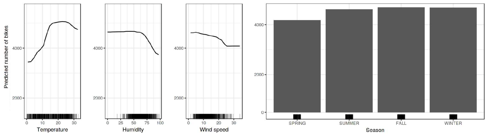
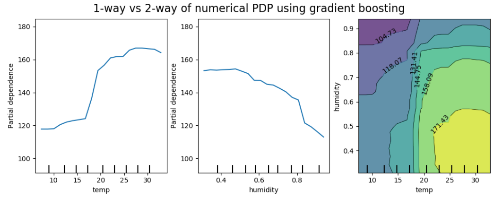
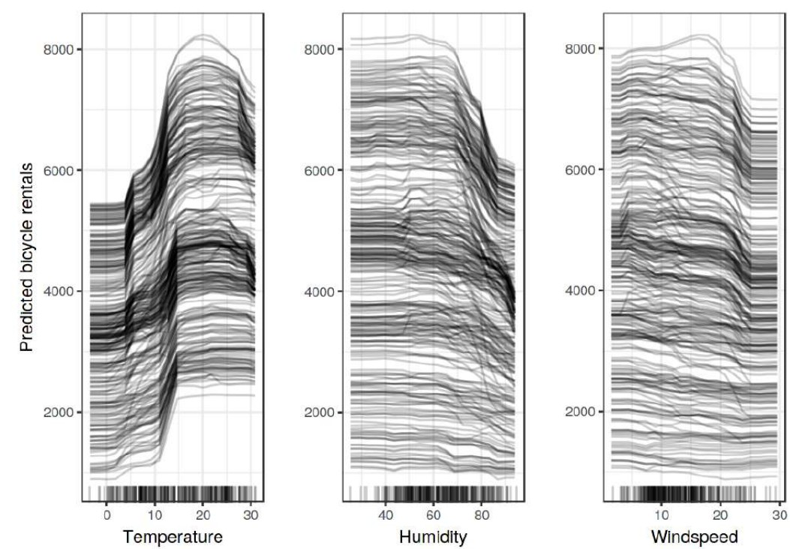
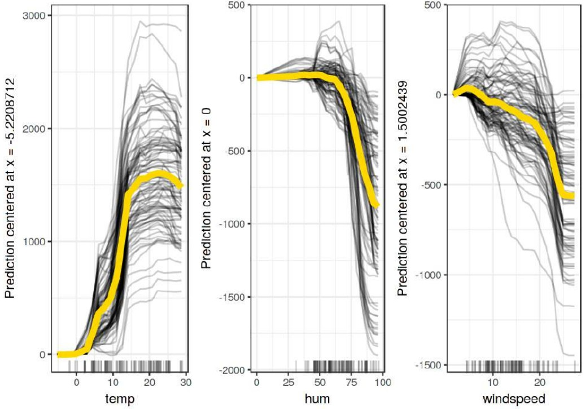
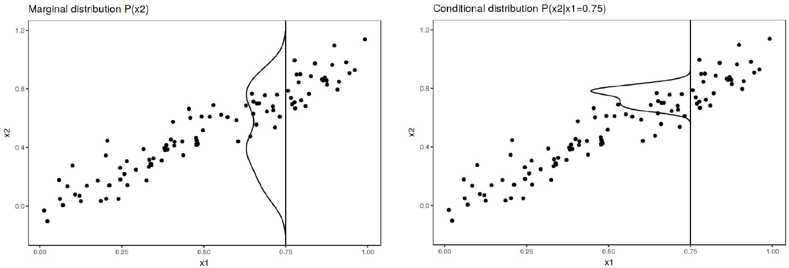
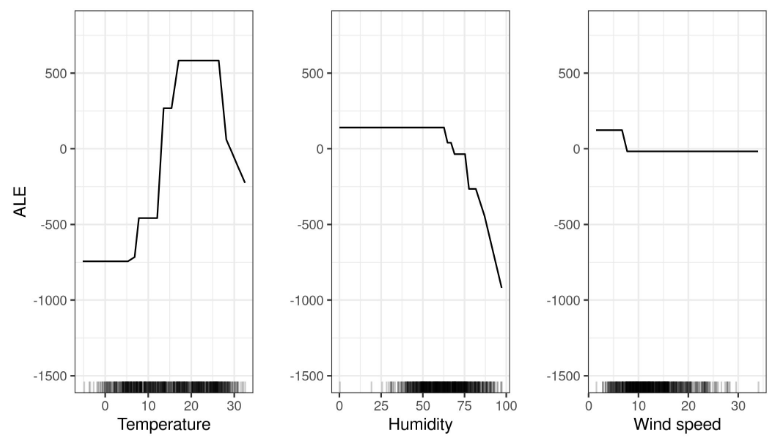

# Зависимость прогноза от признаков

Сложные неинтерпретируемые модели (black-box models) можно анализировать, визуализируя <u>зависимость их прогнозов от изменения отдельных входных признаков</u>. Тем самым можно выделить признаки, оказывающие наибольшее влияние на модель, а также оценить характер этого влияния и проверить, насколько это влияние согласуется с априорными знаниями. 

## График частичной зависимости

### Определение

**График частичной зависимости** (partial dependence plot, PDP [[1]](https://hastie.su.domains/ElemStatLearn/)) показывает влияние выбранного признака $u$ (например, первого) на прогноз модели $f\left(\mathbf{x}\right)=f\left([u,\mathbf{v}]\right)$, где вектором $\mathbf{v}$ обозначены все признаки, кроме выбранного (например, второй, третий и т.д.). Определим ожидаемое значение прогноза $g\left(u\right)$, зафиксировав интересующий признак и усредняя по всем оставшимся:

$$
g_{u}\left(u\right)=\mathbb{E}_{\mathbf{v}}\left\{ f\left([u,\mathbf{v}]\right)\right\} =\int f\left([u,\mathbf{v}]\right)d\mathbb{P}\left(\mathbf{v}\right)
$$

На практике распределение признаков неизвестно, поэтому используется численная оценка среднего по объектам выборки при фиксированном признаке $u$:

$$
\widehat{g}_{u}\left(u\right)=\frac{1}{N}\sum_{n=1}^{N}f\left([u,\mathbf{v}_{n}]\right)
$$

> $[u,\mathbf{v}_{n}]$ представляет собой объект $\mathbf{x}_{n}$, у которого интересующий признак положен равным $u$.

### Примеры

Рассмотрим задачу BikeSharing [[2]](https://archive.ics.uci.edu/dataset/275/bike+sharing+dataset), в которой прогнозируется число арендованных велосипедов по характеристикам дня (дата, температура, влажность и т.д.). График частичной зависимости для этой задачи показан на рисунке ниже для вещественных признаков слева, а для категориального признака (season) справа [[3]](https://christophm.github.io/interpretable-ml-book/pdp.html):  

По графикам видно, что велосипедов арендуется меньше при низкой и высокой температуре. Снижает число аренд высокая влажность и скорость ветра. Это согласуется с общей логикой и свидетельствует в пользу того, что модель построена верно. Хотя зависимость от сезона оказалась не настолько ярко выражена.

### Зависимость от двух признаков

Можно строить PDP-график зависимости <u>сразу для пары признаков</u>. В этом случае он будет представлять собой тепловую карту (heatmap) изменений целевого значения от двух признаков, на которой будет видно их совместное воздействие на прогноз, как показано ниже на графике справа [[4]](https://scikit-learn.org/stable/modules/partial_dependence.html#g2015):

Зависимость такого рода позволит выявить более сложные виды <u>совместного воздействия двух признаков</u> на прогнозы модели.

### Преимущества и недостатки метода

График частичной зависимости PDP интуитивен и его легко реализовать. Также эту зависимость можно строить не для одного, а сразу для двух признаков.

PDP - это метод глобальной интерпретации модели (без привязки к определённому объекту), показывающий общую зависимость прогнозов модели от признака. С другой стороны, вычисление PDP вычислительно трудоёмко - приходится проводить усреднение <u>по всем объектам выборки</u> для каждого значения признака (для больших выборок лучше считать приближённо по подвыборке). Также из-за усреднения по всем объектам мы можем потерять часть зависимостей. 

> Например, если для половины объектов признак положительно влияет на прогноз, а для другой половины - отрицательно, то при усреднении получим отсутствие связи! 

В PDP предполагается, что интересующий признак $u$ и остальные признаки $\mathbf{v}$ <u>независимы</u>, поскольку при построении графика значение интересующего признака фиксируется, а остальные признаки берутся из выборки независимо. Если в действительности признаки сильно зависимы, это будет приводить к появлению малореалистичных объектов. 

> Например, при анализе данных пациентов больницы можно строить PDP для признака "рост". При этом скоррелированный признак "вес" будет браться независимо от роста, что будет приводить к появлению нереалистичных пациентов с детским ростом и взрослым весом.

## График индивидуальных условных ожиданий

**График индивидуальных условных ожиданий** (Individual Conditional Expectation, ICE [[5]](https://arxiv.org/abs/1309.6392)) показывает зависимость отклика от интересующего признака, не усредняя по остальным объектам, а для каждого объекта в отдельности. Разобьём, как и раньше, вектор признаков $\mathbf{x}$ на интересующий признак $u$ и все остальные признаки $\mathbf{v}$. ICE график представляет <u>собой совокупность графиков</u> зависимостей прогноза от признака <u>для каждого объекта валидационной выборки</u> $n=1,2,...N$:

$$
\left\{ g_{un}\left(u\right)=f\left(u,v_{n}\right)\right\} _{n}
$$

 и показан для задачи BikeSharing на рисунке ниже [[6]](https://christophm.github.io/interpretable-ml-book/ice.html):

График ICE даёт более детальную картину: он показывает влияние интересующего признака на прогноз <u>по каждому объекту в отдельности</u>, что позволяет увидеть, например, ситуацию, когда для половины объектов признак имеет положительное влияние, а для половины - отрицательное. 

Недостатком подхода является перегруженная графиками иллюстрация, на которой сложно выделить основные тенденции, поэтому часто строят графики сдвинутых индивидуальных условных ожиданий (Centered ICE plot, c-ICE) по объектам, центрируя, чтобы все графики выходили из одной точки:

$$
\left\{ g_{un}\left(u\right)=f\left(u,\mathbf{v}_{n}\right)-f\left(u_{0},\mathbf{v}_{n}\right)\right\} _{n},\quad u_{0}-\text{референсное значение (гиперпараметр),}
$$

после чего отдельным цветом можно отобразить усреднённую по объектам зависимость для простоты визуализации, как показано ниже [[6]](https://christophm.github.io/interpretable-ml-book/ice.html):

> Усреднённая зависимость на графике (жёлтая), с точностью до сдвига, будет PDP-графиком.

Стоит отметить, что как графики ICE и c-ICE, точно так же, как PDP, опираются на предположение о <u>независимости</u> признака $u$ от всех остальных, поскольку используют  сгенерированные объекты, где признаки меняются независимо от друга. Это может приводить использованию в вычислениях малореалистичных объектов.

## Условный график

**Условный график** (marginal plot, M-plot [[7]](https://christophm.github.io/interpretable-ml-book/ale.html)) лишён недостатка PDP и ICE графиков, состоящего в усреднении по несуществующим малореальным объектам за счёт того, что там при каждом значении признака $u$ происходит усреднение не по безусловному распределению оставшихся признаков $P\left(v\right)$, а <u>по условному</u> $P\left(v|\mathbf{u}\right)$. 

Приведём иллюстрацию, на которой слева показано безусловное распределение $P\left(x^2\right)$, а справа - условное распределение $P\left(x^2|x^1\right)$ [[7]](https://christophm.github.io/interpretable-ml-book/ale.html):

Формулой условный график запишется следующим образом:

$$
g_{u}\left(u\right)=\frac{1}{\left|N\left(k\right)\right|}\sum_{n:\mathbf{x}_{n}\in N\left(k\right)}f\left(u_{k},\mathbf{v}_{n}\right),
$$

где анализируемый признак $u$ разбивается на полуинтервалы $\left(u_{k-1},u_{k}\right], k=1,2,...K$, а $N\left(k\right)$ - множество объектов, для которых значение признака $u$ попало в $k$-й интервал,  $\left|N\left(k\right)\right|$ обозначает мощность (число элементов) этого множества. 

На условном графике, в отличие от графиков PDP и ICE, усреднение производится только по реалистичным объектам, однако при анализе признака, сильно связанного с другим признаком, график покажет <u>совокупное влияние обоих скореллированных признаков, а не чистый эффект одного из них</u>. 

> В примере с пациентами больницы это будет совокупное влияние и роста, и веса пациента, а не только роста (или только веса) в чистом виде.

## 

## График аккумулированных локальных эффектов

**График аккумулированных локальных эффектов** (Accumulated Local Effects, ALE [[8]](https://arxiv.org/abs/1612.08468)) повторяет методологию условного M-графика, но лишён недостатка, состоящего в том, что если два признака сильно скоррелированы, то будет показан совокупный эффект этих признаков, а не чистый эффект одного из них. ALE-график покажет именно <u>чистый эффект интересующего признака</u>. При этом усреднение будет производиться только по реалистичным объектам. 

Формула для расчёта графика аккумулированных локальных эффектов следующая:

$$
g_{u}\left(u\right)=\sum_{k=1}^{K}\frac{1}{\left|N\left(k\right)\right|}\sum_{n:~\mathbf{x}_{n}\in N\left(k\right)}\left[f\left(u_{k}, \mathbf{v}_{n}\right)-f\left(u_{k-1},\mathbf{v}_{n}\right)\right],
$$

где обозначения такие же, как для условного графика M-plot. 

Динамика зависимости от значения признака складывается из малых локальных изменений в областях полуинтервала значений признака $u\in\left(u_{k-1},u_{k}\right]$. Формула показывает изменения прогноза <u>только за счёт интересующего признака</u> $u$, когда прочие признаки не влияют, поскольку по ним происходит локальное усреднение вокруг значений признака, который мы анализируем. 

Итоговый ALE-график - это аккумулированная сумма таких малых изменений по аналогии того как разность значений функции в двух точках - это интеграл от её производной между этими точками. Пример ALE-графика для задачи BikeSharing показан ниже [[7]](https://christophm.github.io/interpretable-ml-book/ale.html):

:::tip Зависимость от двух признаков

Как и для PDP-графика, ALE-график можно строить сразу для пары признаков. В этом случае он будет представлять собой тепловую карту (heatmap) изменений целевого значения от двух признаков, на которой будет видно их <u>совместное воздействие</u> на прогноз.

:::

---

Детальнее о PDP-графике можно прочитать в [[3]](https://christophm.github.io/interpretable-ml-book/pdp.html), о ICE-графике - в [[4]](https://christophm.github.io/interpretable-ml-book/ice.html), а об условном и ALE-графике - в [[7]](https://christophm.github.io/interpretable-ml-book/ale.html).

С кодом, реализующим построение PDP- и ICE-графиков с использованием библиотеки sklearn, можно ознакомиться в [[4]](https://scikit-learn.org/stable/modules/partial_dependence.html). Построение PDP- и ALE-графиков реализовано в библиотеках PiML [[9]](https://selfexplainml.github.io/PiML-Toolbox/_build/html/index.html) и effector [[10]](https://xai-effector.github.io/#supported-methods).

## Литература

1. [Hastie T., Tibshirani R., Friedman J. The Elements of Statistical Learning: Data Mining, Inference, and Prediction. – Springer Science & Business Media, 2009.](https://hastie.su.domains/ElemStatLearn/)
2. [UC Irvine Machine Learning Repository: Bike Sharing dataset.](https://archive.ics.uci.edu/dataset/275/bike+sharing+dataset)
3. [Molnar C. Interpretable machine learning. – Lulu. com, 2020: Partial Dependence Plot (PDP).](https://christophm.github.io/interpretable-ml-book/pdp.html)
4. [Документация sklearn: Partial Dependence and Individual Conditional Expectation plots.](https://scikit-learn.org/stable/modules/partial_dependence.html)
5. [Goldstein A. et al. Peeking inside the black box: Visualizing statistical learning with plots of individual conditional expectation //journal of Computational and Graphical Statistics. – 2015. – Т. 24. – №. 1. – С. 44-65.](https://arxiv.org/abs/1309.6392)
6. [Molnar C. Interpretable machine learning. – Lulu. com, 2020: Individual Conditional Expectation (ICE).](https://christophm.github.io/interpretable-ml-book/ice.html)
7. [Molnar C. Interpretable machine learning. – Lulu. com, 2020: Accumulated Local Effects (ALE).](https://christophm.github.io/interpretable-ml-book/ale.html)
8. [Apley D. W., Zhu J. Visualizing the effects of predictor variables in black box supervised learning models //Journal of the Royal Statistical Society Series B: Statistical Methodology. – 2020. – Т. 82. – №. 4. – С. 1059-1086.](https://arxiv.org/abs/1612.08468)
9. [Документация PiML.](https://selfexplainml.github.io/PiML-Toolbox/_build/html/index.html)
10. [Документация effector.](https://xai-effector.github.io/#supported-methods)
