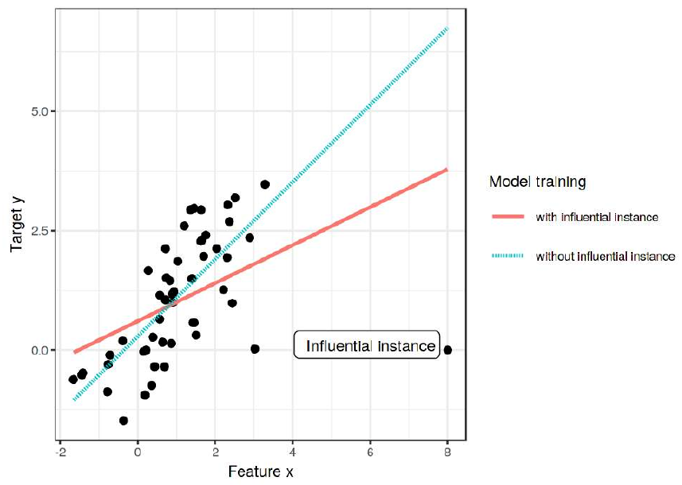
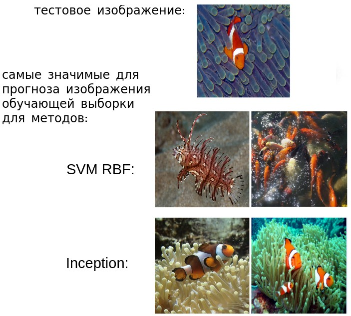

# Влияние обучающих объектов

## Значимые объекты (influential instances)

Прогнозы модели зависят от её параметров, которые настраиваются по обучающей выборке. Разумно поставить следующий вопрос: какие объекты обучающей выборки сильнее всего влияют на

- параметры модели,

- прогноз модели для частного объекта $\mathbf{x}$,

- качество прогнозов модели для всей выборки?

Обучающие примеры, оказывающие наиболее сильное влияние, называются **значимыми объектами** (influential instances). 

На рисунке ниже [[1]](https://christophm.github.io/interpretable-ml-book/influential.html) хорошо виден один объект справа внизу, который оказывает наиболее сильное влияние на прогнозы модели, смещая их: 

Очевидно, это неправильная ситуация, когда лишь один объект способен сильно смещать все прогнозы модели!

## Использование информации о значимых объектах

Выявление значимых объектов и силы их влияния позволяет решать следующие задачи:

- <u>Выявление вредных объектов</u>, которые приводят к смещённым прогнозам и должны быть исключены из выборки. Этими объектами могут быть:
  
  - объекты-выбросы, полученные, например, в результате ошибки измерения или описания нестандартных случаев, которые модель не должна обрабатывать;
  
  - целенаправленно занесённые ошибочные наблюдения для искажения прогнозов модели в нужную злоумышленнику сторону (data poisoning attack [[2]](https://www.crowdstrike.com/en-us/cybersecurity-101/cyberattacks/data-poisoning/))

- <u>Верификация корректности обучающей выборки и выявление переобучения</u>: прогноз модели не должен определяться отдельными наблюдениями, а должен интегрировать опыт от многих обучающих примеров!

- <u>Приоретизация измерений для перепроверки</u>: вместо перепроверки корректности занесения данных от всех наблюдений перепроверим в первую очередь значимые наблюдения.

- <u>Обнаружение наиболее информативных объектов</u> чтобы понять, какими новыми объектами дополнять обучающую выборку, чтобы расширенная обучающая выборка дала максимальное улучшение качества прогнозов (active learning [[3]](https://en.wikipedia.org/wiki/Active_learning_(machine_learning))).

Последнее особенно важно, когда мы обучили модель на одной выборке, а применяем к другой (с немного отличающимся распределением объектов). Используя значимые наблюдения  можно анализировать несоответствие выборок и понимать, объектов какого типа не хватает при обучении модели. 

> Например, модель обучена предсказывать вероятность невозврата кредита на клиентах банка из одного региона, а затем применяется в другом. Если для прогнозов значимыми объектами окажутся клиенты с нестабильным источником доходов, привязанном к сезонности, то следует больше собрать данных именно по таким клиентам!

## Расчёт значимости объектов

Определим влияние объектов более формально. Пусть предиктивная модель $f\left(\mathbf{x}\right)$ обучена на всех наблюдениях, а $f_{-i}\left(\mathbf{x}_{n}\right)$ обучена на всех, кроме $i$-го объекта $\left(\mathbf{x}_{i},y_{i}\right)$. Тогда влияние $i$-го наблюдения на прогноз объекта $\mathbf{x}$ можно оценить как

$$
\text{influence}_{i}\left(\mathbf{x}\right)=\left|f\left(\mathbf{x}\right)-f_{-i}\left(\mathbf{x}\right)\right|,
$$

а глобальное влияние на все прогнозы выборки будет получаться усреднением по объектам:

$$
\text{influence}_{i}\left(X,Y\right)=\frac{1}{N}\sum_{n=1}^{N}\left|f\left(\mathbf{x}_{n}\right)-f_{-i}\left(\mathbf{x}_{n}\right)\right|
$$

> Впервые подобный анализ был предложен в [[4]](http://www.stat.ucla.edu/~nchristo/statistics100C/1268249.pdf) для выявления значимых наблюдений для линейной регрессии, а в качестве меры отклонений использовался квадрат ошибки.

В случае векторного прогноза (например, вектор вероятностей классов) модуль в формулах нужно заменить на векторную норму от изменений.

Можно исключать объекты не по одному, а группами по определённому критерию. Например, по времени наблюдений. И анализировать, насколько модель зависит от более старых и более новых наблюдений. Или анализировать наблюдения, полученные из разных источников. 

Оценив влияние $\text{infuence}_{i}\left(\mathbf{x}_{n}\right)$ для каждого объекта $\mathbf{x}_{n}$ обучающей выборки, можно построить простую интерпретируемую модель, которая будет предсказывать это влияние. Проще всего использовать дерево небольшой глубины. Анализируя структуру этого дерева, мы получим общее представление о тех характеристиках, которыми обладают значимые объекты. 

Если исключать объекты по одному, а не группами, то расчёты важности будут вычислительно трудоёмкими, поскольку предполагают, что для каждого объекта выборки нужно перенастраивать модель, когда этот объект в выборку включён и исключён. Эти расчёты упрощаются при использовании [метода опорных векторов](../Linear-classification/SVM) и [регрессии опорных векторов](../Linear-regression-extensions/Support-vector-regression), поскольку прогнозы для этих методов зависят только от опорных объектов (которых мало) и не зависят от неинформативных объектов (большинство). 

Для моделей, оцениваемых градиентными методами оптимизации (линейные методы, нейросети) существует эффективный алгоритм приближённого расчёта важности объектов без многократной перенастройки модели с включением/исключением каждого объекта выборки [[5]](https://proceedings.mlr.press/v70/koh17a?ref=https://githubhelp.com). В этой работе, в частности, рассматривается задача классификации изображений на собак и рыб, и для тестового изображения рыбы приводятся два самых значимых обучающих объекта для её классификации двумя моделями - методом опорных векторов с Гауссовым ядром (SVM-RBF) и нейросетевой моделью Inception V3:

Из иллюстрации видно, что метод SVM-RBF больше зависит от попиксельного сходства между изображениями, игнорируя семантику, поскольку самые важные обучающие изображения оказались той же цветовой гаммы, но содержат рыб другой разновидности. А модель Inception концентрируется именно на семантической близости: самые важные обучающие объекты для неё отличаются по цветам, зато содержат фотографии рыбы того же самого вида, которую необходимо классифицировать.

---

Подробный разбор темы значимых объектов доступен в [[1]](https://christophm.github.io/interpretable-ml-book/influential.html). Обзор различных методов вычисления значимости объектов (помимо перенастройки модели с объектом/без объекта), а также их сравнение предоставлено в [[6]](https://arxiv.org/abs/2111.04683).

## Литература

1. [Molnar C. Interpretable machine learning. – Lulu. com, 2020: Influential Instances.](https://christophm.github.io/interpretable-ml-book/influential.html)

2. [crowdstrike.com: data-poisoning.](https://www.crowdstrike.com/en-us/cybersecurity-101/cyberattacks/data-poisoning/)

3. [Wikipedia: Active learning.](https://en.wikipedia.org/wiki/Active_learning_(machine_learning))

4. [Cook R. D. Detection of influential observation in linear regression //Technometrics. – 1977. – Т. 19. – №. 1. – С. 15-18.](http://www.stat.ucla.edu/~nchristo/statistics100C/1268249.pdf)

5. [Koh P. W., Liang P. Understanding black-box predictions via influence functions //International conference on machine learning. – PMLR, 2017. – С. 1885-1894.](https://proceedings.mlr.press/v70/koh17a?ref=https://githubhelp.com)

6. [Søgaard A. et al. Revisiting methods for finding influential examples //arXiv preprint arXiv:2111.04683. – 2021.](https://arxiv.org/abs/2111.04683)

