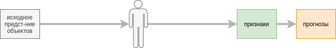

Посвящается моей жене Ирине.

# Машинное и глубокое обучение

**Машинное обучение** (machine learning) решает задачу построения прогноза по входному описанию исследуемого **объекта** (object), при этом параметры **прогнозирующей функции** или **модели** не задаются явно, а определяются автоматически в результате [процедуры обучения](../Machine-learning/Base-concepts/Function-selection) (model training) на так называемой **обучающей выборке** (training set) - размеченном (в [задаче с учителем](../Machine-learning/Base-concepts/Supervised-learning)) или не размеченном (в [задаче без учителя](../Machine-learning/Base-concepts/Unsupervised-learning)) наборе объектов.

Автоматическая настройка параметров позволяет существенно упростить и ускорить построение прогнозирующих моделей. Также это позволяет использовать более сложные модели, содержащие большое количество автоматически настраиваемых параметров, что повышает точность прогнозов.

**Глубокое обучение** (deep learning)  представляет собой подобласть машинного обучения и решает те же самые задачи, используя более сложные многоуровневые вычисления, <u>автоматически извлекающие более информативные признаки</u> из первоначальных данных. 

Перед изучением глубокого обучения убедитесь, что вы разобрались в базовых темах [машинного обучения](../Machine-learning/intro):  

- [Основы машинного обучения](../Machine-learning/Base-concepts)

- [Подготовка данных](../Machine-learning/Data-preprocessing)

- [Классификаторы в общем виде](../Machine-learning/General-classifiers)

- [Оценка качества регрессии](../Machine-learning/Regression-evaluation)

- [Оценка качества классификации](../Machine-learning/Classifier-evaluation) 

- [Переобучение и недообучение](../Machine-learning/Overfitting-and-underfitting)

В дальнейшем будет предполагаться знакомство читателя с этими разделами. 

Не обязательной, но полезной для интерпретации работы моделей глубокого обучения будет глава про [интерпретацию сложных моделей](../Machine-learning/Complex-models-interpretation).

## Принцип глубокого обучения

Объекты представляются в виде исходного **низкоуровневого представления объектов** (raw representation). 

Например, в обработке изображений низкоуровневым представлением изображения будет:

- матрица интенсивностей пикселей $I\in\mathbb{R}^{H\times W}$ (в случае черно-белого изображения $H\times W$);

- тензор интенсивностей $I\in\mathbb{R}^{3 \times H\times W}$, представляющего объединение 3-х матриц для красного, зелёного и синего каналов (в случае цветного изображения $H \times W$).

При обработке звуков низкоуровневым представлением будет последовательность амплитуд (силы звуковой волны) в каждый момент времени.

Применять прогнозирующую модель к низкоуровневому представлению непрактично - слишком велика размерность признакового пространства, поэтому модель необходимо настраивать <u>на небольшом числе</u> высокоуровневых и информативных признаков (high level representation).

Традиционный подход в машинном обучении, называемый **неглубоким обучением** (shallow learning), полагается на человека при генерации высокоуровневых признаков для прогнозирующей модели:

  

> Для изображений, например, можно в качестве признаков построить распределение цветов по красному, зелёному и синему каналам, посчитать их средние и стандартные отклонения. Для звуков - среднюю силу звуковой волны, её стандартное отклонение, количество и длительность пауз и т.д.

Сразу понятны ограничения этого подхода:

- необходимо тратить ограниченные человеческие ресурсы на разработку признаков и создание процедуры их извлечения (медленно и долго);

- это в любом случае окажутся несложные преобразования (недостаточно эффективно для конечной задачи).

В глубоком обучении настраивается не только модель, но и <u>последовательность преобразований, генерирующих признаки</u>, которые будет использовать конечная модель для прогнозов:

Каждое преобразование генерирует **промежуточное представление признаков** (intermediate representation), которое с каждым последующим преобразованием получается всё более сложным и информативным. 

> Например, в случае изображений, сначала будут  извлекаться границы, потом - углы, потом - геометрические фигуры, а начиная с некоторого этапа станут извлекаться уже сложные объекты, такие как глаз человека, колесо машины, окно дома, и т.д., на основе которых уже несложно будет решить итоговую задачу (например, классифицировать, что именно показано на изображении).

Преимущества подхода:

- извлечение информативных признаков происходит автоматически по данным - точно так же, как в машинном обучении производилась настройка прогнозирующей модели; не нужно расходовать человеческие ресурсы на извлечение признаков вручную.

- признаки подбираются быстрее, причём это будут более сложные и более подходящие признаки для конечной задачи, полученные в результате  многомерной оптимизации.

> Для применения глубокого обучения <u>требуется гораздо больше обучающих данных</u>, поскольку теперь настраиваются не только параметры модели, но и параметры промежуточных преобразований признаков! 

Применительно к изображениям необходимы уже как минимум десятки тысяч размеченных примеров. Более сложные модели требуют обучающих выборок (называемых **датасетами** от англ. dataset), содержащих несколько миллионов обучающих примеров, таких как ImageNet [[1]](https://ru.wikipedia.org/wiki/ImageNet), [[2]](https://www.image-net.org/).

:::tip Сила глубокого обучения

Глубокое обучение устраняет разрыв между исходным высокоразмерным низкоуровневым описанием объекта и конечной моделью, способной обрабатывать лишь маломерное компактное описание объекта из высокоуровневых признаков.

:::

Принцип глубокого обучения успешно применяется и в других областях, таких как обработка текста, речи и графов.

Какой ранее изученный подход классического машинного обучения идеологически похож на глубокое обучение?

[Стэкинг моделей](../Machine-learning/Model-ensembles/Stacking), при котором конечная модель строит прогноз, используя прогнозы базовых моделей в качестве признаков. Здесь также признаки, с которыми работает конечная модель, настраиваются автоматически. Можно рассмотреть и стэкинг, состоящий из большего числа уровней.

В глубоком обучении функции извлечения признаков настраиваются одновременно с параметрами итоговой модели в отличие от стэкинга, где сначала настраиваются базовые модели, а потом агрегирующая мета-модель. Также в глубоком обучении признаки не обязаны соответствовать прогнозам целевой переменной.

Для реализации принципа глубокого обучения используются **нейросети** (neural networks), поскольку нейросеть представляет собой последовательность нелинейных преобразований, которые как раз и описывают последовательное преобразование признаков и построение прогноза по ним. 

Нейросети показывают отличные результаты и зачастую способны решать широкий класс задач быстрее и лучше среднестатистического человека не только там, где нужно предсказать число (регрессия) или категорию (классификация), но и в более творческих задачах, где нужно сгенерировать изображение, текст, звук (например генерация вокала по словам песни) или граф (описывающий химическое соединение вещества или лекарства).

## Сильный и слабый искусственный интеллект

Решение частных формализованных задач методами машинного обучения называется **слабым искусственным интеллектом** (или прикладным ИИ, narrow AI).

Также в научном сообществе существует гипотеза **общего искусственного интеллекта** (artificial general intelligence, AGI [[3]](https://en.wikipedia.org/wiki/Artificial_general_intelligence)), способного решать любую задачу путём самообучения и развития. Большим шагом к созданию общего искусственного интеллекта стало развитие больших языковых моделей (large language models), таких как ChatGPT, способных поддерживать разговор и отвечать на вопросы общего вида.

Также существует гипотеза **сильного искусственного интеллекта** (strong AI), способного мыслить и осознавать себя как отдельную личность (artificial consciousness). Насколько искусственно созданная система теоретически способна к этому - большой философский вопрос. 

> Автор книги эту гипотезу не разделяет. Скорее всего, будет создан общий искусственный интеллект, способный качественно имитировать самосознание живых людей.

Детальнее о видах искуственного интеллекта по уровню решаемых задач можно прочитать в [[4]](https://www.ibm.com/think/topics/artificial-general-intelligence).

## Развитие глубокого обучения

Глубокое обучение получило импульс к развитию в 2010-х годах с появлением

- доступных вычислительных мощностей, способных выполнять большие объёмы вычислений (графические ускорители, FPGA-чипы);

- больших обучающих выборок, содержащих миллионы размеченных наблюдений.

Глубокое обучение без преувеличения осуществляет революцию в экономике, политике и социальной сфере. Глубокие нейросети позволяют быстрее и эффективнее осуществлять торговлю на бирже (см. algorithmic trading [[5]](https://en.wikipedia.org/wiki/Algorithmic_trading)), управлять технологическими процессами, распознавать людей в системах видеонаблюдения, отслеживать и предугадывать поведение клиентов по их поведению в сети, перемещениям и финансовым транзакциям, генерировать реалистичные тексты, изображения, звуки и видео, практически неотличимые от настоящих, а также компилируемый программный код по запросу. Нейросети постепенно вытесняют людей даже из таких творческих профессий, как написание рассказов, рисование графических сюжетов и создание музыки.

## Этические вопросы

Стремительное развитие технологий искусственного интеллекта несёт в себе не только возможности, но и вызовы, которые широко обсуждаются не только в экспертном сообществе, но и в среде обычных пользователей.

Риски глубокого обучения заключаются в том, что его технологии 

- приводят к вытеснению людей из многих профессий;

- позволяют создавать фейковые новости, практически неотличимые от настоящих;

- способствуют тому, что погружённость и вовлечённость людей смещаются из реального мира в виртуальный;

- дают очень большую власть над обществом, причём технологии концентрируются в узком круге больших компаний, обладающих данными и оборудованием для внедрения и развития этой науки.

Изучающим глубокое обучение необходимо задаться вопросами, насколько их деятельность приводит к положительным изменениям в обществе? Делает ли она общество более свободным, расширяя его возможности или, наоборот, делает его заложником технологий и контролирующих их компаний? 

> Технологии существуют для человека, а не человек для технологий.

Однозначных и простых ответов, как справиться с вызовами новых технологий так, чтобы общество воспользовалось их преимуществами, не став при этом их заложником, пока нет. Это сложная этическая проблема, которая должна решаться сообща государствами, технологическими компаниями и общественными движениями. Заинтересованные читатели могут детальнее ознакомиться с проблемой в книге со-основателя DeepMind и Inflection AI Мустафы Сулеймана “The coming wave: AI, power, and our future.” [[6]](https://the-coming-wave.com/).

## Литература

1. [Wikipedia: ImageNet.](https://ru.wikipedia.org/wiki/ImageNet)

2. [Официальный сайт датасета ImageNet.](https://www.image-net.org/)

3. [Wikipedia: Artificial general intelligence.](https://en.wikipedia.org/wiki/Artificial_general_intelligence)

4. [ibm.com: What is artificial general intelligence (AGI)?](https://www.ibm.com/think/topics/artificial-general-intelligence)

5. [Wikipedia: Algorithmic trading.](https://en.wikipedia.org/wiki/Algorithmic_trading)

6. [Suleyman M. The coming wave: AI, power, and our future. – Random House, 2025.](https://the-coming-wave.com/)
