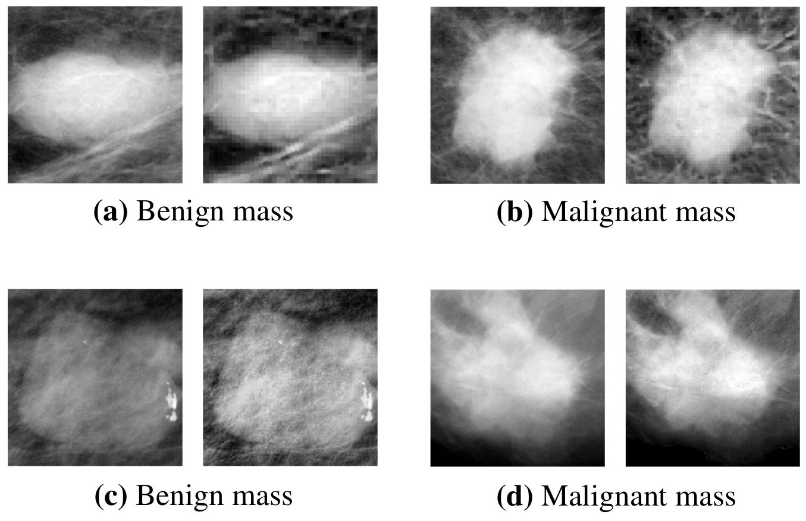
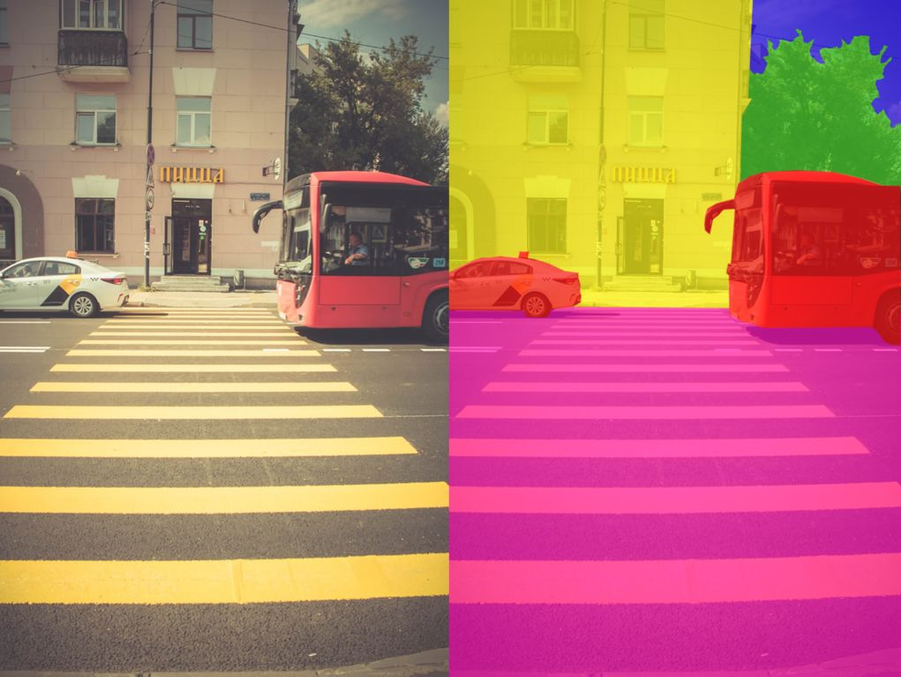
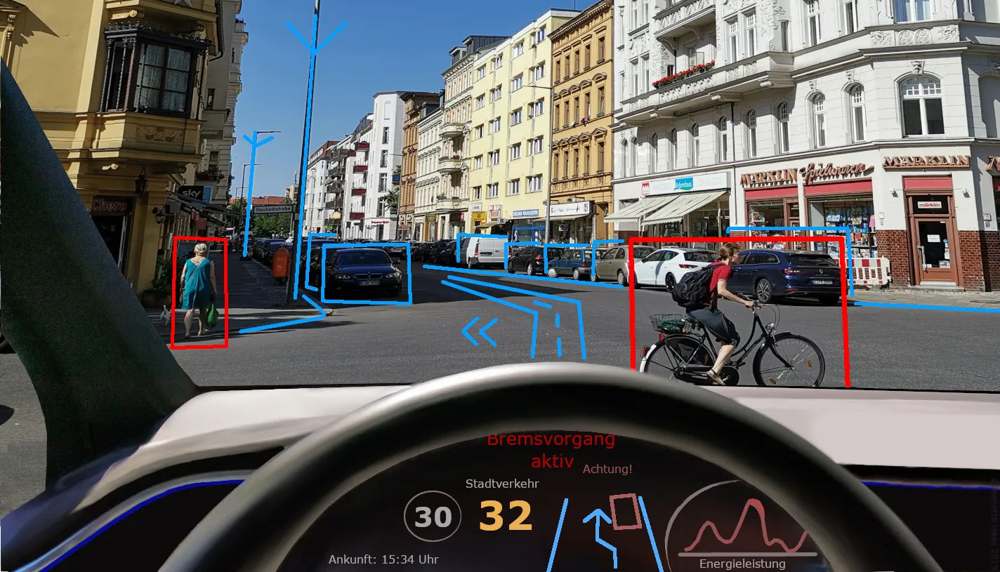
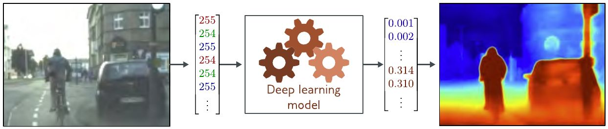
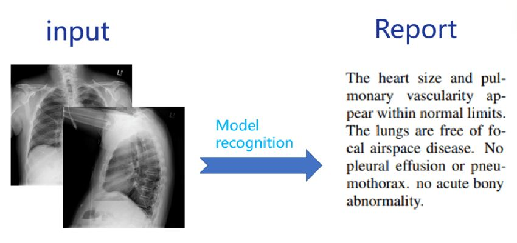
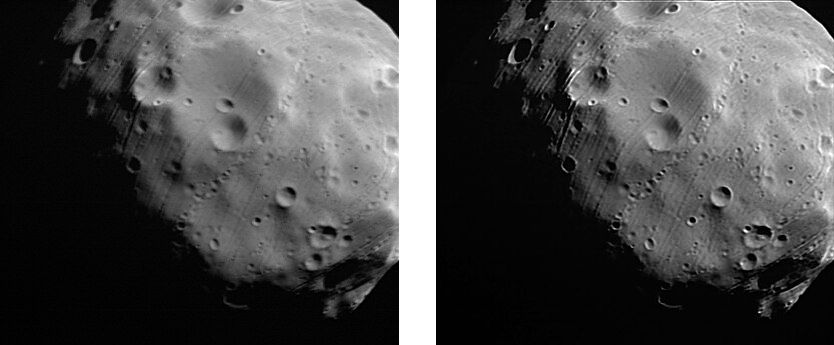
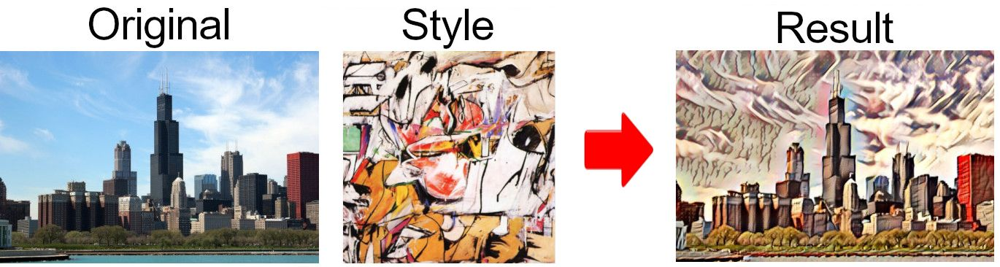
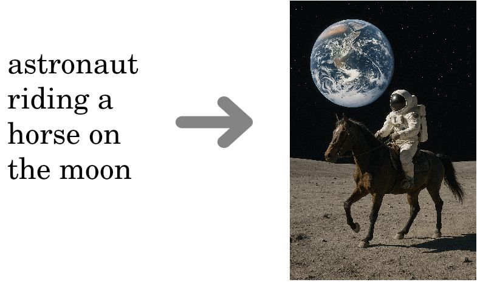
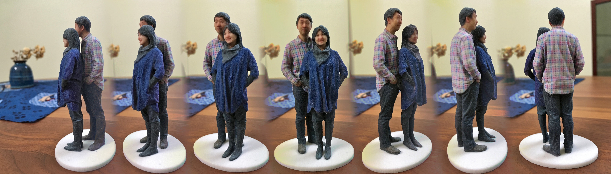

# Обработка изображений

Рассмотрим основные задачи, возникающие в глубоком обучении при обработке изображений с помощью нейросетей.

## Разметка изображений

При разметке изображений выходом модели будет высокоуровневая семантическая информация об объектах на изображении.

**Классификация изображений** (image classification [[1]](https://www.geeksforgeeks.org/computer-vision/what-is-image-classification/)) - задача, в которой по входному изображению необходимо классифицировать, что именно на нём изображено. Популярным приложением выступает медицина, где по снимку опухоли необходимо понять, доброкачественная она или злокачественная, как на рисунке ниже [[2]](https://www.ncbi.nlm.nih.gov/pmc/articles/PMC10949936/):

Другим популярным применением классификации изображений является распознавание человека по лицу в системах безопасности. Классификации изображений посвящён [отдельный раздел книги](../Convolutional-architectures).

В **семантической сегментации изображений** (semantic segmentation [[3]](https://www.ibm.com/think/topics/semantic-segmentation)) необходимо отнести к определённому классу не всё изображение целиком, а каждый его пиксель, получая в результате сегментационную карту, на которой размечено, где какие объекты расположены ([источник](https://commons.wikimedia.org/wiki/File:Image_segmentation.png)):

В семантической сегментации разные объекты одного типа, такие как машины на рисунке, относятся к одному и тому же классу. Детальному изучению этой темы также посвящён [отдельный раздел](../Semantic-segmentation).

Существует и более сложная задача **сегментации объектов** (instance segmentation), описываемая в соответствующем [разделе книги](../Instance-segmentation), в которой различные объекты одного и того же типа (например, разные люди или разные машины) <u>разделяются</u> и помечаются <u>разными метками</u>.

В **детекции объектов** (object detection [[4]](https://www.ibm.com/think/topics/object-detection)) на входном изображении необходимо выделить рамками все объекты заданного типа, как показано ниже ([источник](https://logituit.com/2023/11/15/object-detection-in-video-streaming/)) при выделении пешеходов, машин и велосипедистов:

Детекции объектов также посвящён [отдельный раздел](../Object-detection) учебника. 

Детекция объектов, а также связанные с ней [семантическая сегментация](../Semantic-segmentation) и [сегментация объектов](../Instance-segmentation) часто используются в системах безопасности, при управлении транспортными потоками и в системах автоматического вождения.

В задаче **оценки глубины изображения** (depth estimation [[5]](https://www.flowhunt.io/glossary/depth-estimation/)) по входному изображению нужно оценить расстояние до объекта в каждом пикселе изображения [[6]](https://udlbook.github.io/udlbook/):

**Описание изображений** (image captioning [[7]](https://medium.com/@pmegne/image-captioning-5162e22ef2ac)) - задача, в которой по изображению необходимо сгенерировать его текстовое описание. Оно часто используется в медицине для автоматической диагностики заболеваний, как показано ниже [[8]](https://www.researchgate.net/publication/362724390_Research_on_chest_radiography_recognition_model_based_on_deep_learning):

Также эта задача активно используется в поиске изображений по текстовому запросу для предварительной конвертации изображения в текст.

## Генерация изображений

В задачах **генерации изображений** (image generation) требуется сгенерировать изображение, обладающее заданными свойствами.

В задаче **супер-разрешения** (super-resolution [[9]](https://en.wikipedia.org/wiki/Super-resolution_imaging)) по входному изображению в низком разрешении нужно сгенерировать его правдоподобную версию в более высоком разрешении ([источник](https://commons.wikimedia.org/wiki/File:Phobos_in_super-resolution_–_before_and_after_image_correction_ESA204381.jpg)):

Эта технология активно применяется для улучшения размытых снимков, а также для повышения разрешающей способности при сильном приближении в цифровых фотоаппаратах, микроскопах и телескопах.

**Перенос стиля** (image style transfer [[10]](https://en.wikipedia.org/wiki/Neural_style_transfer)) - задача, в которой входное изображение необходимо перерисовать в стиле, задаваемым другим изображением, в качестве которого обычно выступает картина известного художника ([источник](https://commons.wikimedia.org/wiki/File:Image_style_transfer.jpg)):

Эта задача сложнее, чем перекраска изображений (image recoloring), поскольку требует переноса не только стилевых цветов, но и характерных стилевых паттернов, таких как мазки кисти художника. 

Эта задача активно применяется в индустрии развлечений, дизайне и рекламе для создания выразительных спецэффектов. А в [[11]](https://arxiv.org/abs/1707.09899) эту технологию применили для разработки новых видов одежды.

**Генерация изображения по текстовому описанию** (text to image [[12]](https://en.wikipedia.org/wiki/Text-to-image_model)) - другая прикладная задача для создания иллюстраций и рекламных постеров. Пример работы показан ниже [[6]](https://udlbook.github.io/udlbook/):

Другими примерами генерации изображений выступают следующие задачи:

- удаление и замена фона (background removal/replacement);
- раскраска чёрно-белых изображений (image coloring);
- заполнение испорченных фрагментов изображения (image inpainting), например, когда птица попала в кадр и закрыла часть фотографируемого объекта.

## 3D-реконструкция

Отдельной интересной задачей является **3D-реконструкция** (3D reconstruction), в которой по серии 2D-снимков необходимо восстановить 3D-модель фотографируемого объекта ([источник](https://commons.wikimedia.org/wiki/File:Madurodam_Shapeways_3D_selfie_in_1_20_scale_after_a_second_spray_of_varnish_FRD.jpg)):

Это может использоваться для 3D-печати скульптуры фотографируемого объекта, определения его пространственных размеров (например, для рекомендации одежды человеку или при расчёте технического задания при реконструкции зданий).

## Литература

1. [GeeksForGeeks: What is Image Classification?](https://www.geeksforgeeks.org/computer-vision/what-is-image-classification/)

2. [Harris C., Okorie U., Makrogiannis S. Spatially localized sparse approximations of deep features for breast mass characterization //Mathematical biosciences and engineering: MBE. – 2023. – Т. 20. – №. 9. – С. 15859.](https://pmc.ncbi.nlm.nih.gov/articles/PMC10949936/)

3. [ibm.com: What is semantic segmentation?](https://www.ibm.com/think/topics/semantic-segmentation)

4. [ibm.com: What is object detection?](https://www.ibm.com/think/topics/object-detection)

5. [FlowHunt.io: Depth Estimation.](https://www.flowhunt.io/glossary/depth-estimation/)

6. [Prince S. J. D. Understanding deep learning. – MIT press, 2023.](https://udlbook.github.io/udlbook/)

7. [Medium.com: Image Captioning.](https://medium.com/@pmegne/image-captioning-5162e22ef2ac)

8. [Li H. et al. Research on chest radiography recognition model based on deep learning //Math. Biosci. Eng. – 2022. – Т. 19. – С. 11768-11781.](https://www.researchgate.net/publication/362724390_Research_on_chest_radiography_recognition_model_based_on_deep_learning)

9. [Wikipedia: Super-resolution imaging.](https://en.wikipedia.org/wiki/Super-resolution_imaging)

10. [Wikipedia: Neural style transfer.](https://en.wikipedia.org/wiki/Neural_style_transfer)

11. [Ganesan A. et al. Fashioning with networks: Neural style transfer to design clothes //arXiv preprint arXiv:1707.09899. – 2017.](https://arxiv.org/abs/1707.09899)

12. [Wikipedia: Text-to-image model.](https://en.wikipedia.org/wiki/Text-to-image_model)
