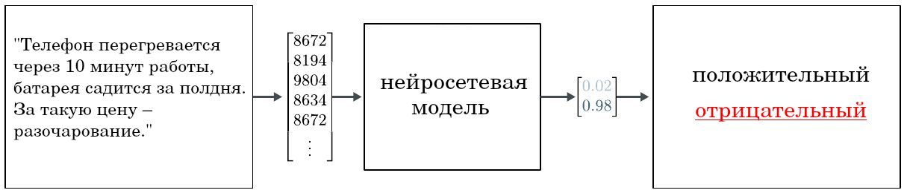
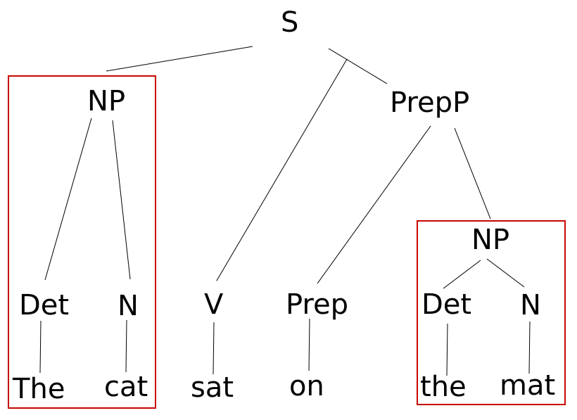

# Обработка текста

Рассмотрим основные задачи обработки текстов, решаемые в машинном и глубоком обучении.

Простейшей задачей обработки текста является его классификация (text classification). Рассмотрим примеры:

- Оценка того, написан ли текст ботом или человеком.

- **Автоматическая категоризация новостей** (news categorization) по новостным рубрикам (новости спорта, экономики, политики, культуры и т.д.) для более удобной навигации.

- **Оценка полярности/тональности** (sentiment analysis), в которой по отзыву человека на товар/услугу определяется, является ли этот отзыв положительным или отрицательным.

**Распознавание именованных сущностей** (named entity recognition, NER [[1]](https://en.wikipedia.org/wiki/Named-entity_recognition)) - другая популярная задача на текстах, состоящая в автоматическом выделении сущностей интересующего вида (таких, как имена людей, компаний, время, стоимость и т.д.) из неструктурированного текста. Например, текст

> Google bought YouTube in November 2006 for US$1.65 billion.

преобразуется в размеченную строку:

> [Google]company bought [YouTube]company in [November 2006]time for [US$1.65 billion]price.

Иногда ссылка на именованные сущности происходит посредством местоимения, как в следующем предложении:

> Джон помог Мэри. Он был добрым.

В задаче **разрешения анафоры** (anaphora resolution) выявляется, на какой объект ссылается каждое местоимение в тексте ("он" ссылается на Джона).

Для более удобной обработки текста, он часто представляется в виде **дерева синтаксического разбора** (syntax parse tree), представляющего предложения в виде иерархической структуры ([источник](https://commons.wikimedia.org/wiki/File:The_cat_sat_on_the_mat.png)):

Используются следующие аббревиатуры:

- S=sentence (предложение);

- NP=noun phrase (фраза с существительным);

- N=noun (существительное);

- VP=verb phrase (фраза с глаголом);

- V=verb (глагол);

- D=determiner (частица).

Распознавание именованных сущностей, разрешение анафор и построение дерева синтаксического разбора представляют собой первоначальные шаги задачи **извлечения информации** (information extraction [[2]](https://en.wikipedia.org/wiki/Information_extraction)) из неструктурированного текста, которые помогают решать следующие задачи:

- **суммаризация текста** (text summarization) - краткий пересказ длинной истории, генерация основных выводов из текста;

- **информационный поиск** (information retrieval [[3]](https://en.wikipedia.org/wiki/Information_retrieval)) - поиск документов или их фрагментов, релевантных поисковому запросу;

- **автоматические ответы на вопросы** (question answering) - построение ответов на вопросы пользователя на естественном языке, возможно, с аргументацией;

- **чат-боты** (chat-bots), самостоятельно поддерживающие разговор с пользователем и помнящие контекст беседы;

- **извлечение событий** (event extraction) определенного вида в структурированном виде, например, информации о покупке одних компаний другими при торговле на бирже;

- **построение онтологий** (ontology learning [[4]](https://en.wikipedia.org/wiki/Ontology_learning)) - извлечение информации из текста или коллекции текстов об окружающем мире в виде графа знаний (knowledge graph [[5]](https://en.wikipedia.org/wiki/Knowledge_graph)), как показано ниже:

Другими задачами обработки текстов являются: 

- **Машинный перевод** (machine translation) - перевод предложения с одного языка на другой. Также решаются задачи перевода с одного языка программирования на другой (например, с Java на Python).

- **Определение автора по тексту** - определить, принадлежат ли два фрагмента текста одному автору.

- **Стилизация текста** (text style transfer) - переформулировка текста в заданном стиле (например, из разговорного стиля в формальный деловой).

- **Генерация текста по заданной теме** (topic-guided text generation). 

> Раньше обработка и генерация текстов осуществлялась [рекуррентными сетями](../Recurrent-neural-nets). В настоящее время используется [механизм внимания](../Recurrent-neural-nets/Attention-RNN) и [модель трансформера](../Transformer). Эти подходы описаны в последующих главах учебника. 

## Литература

1. [Wikipedia: Named-entity recognition.](https://en.wikipedia.org/wiki/Named-entity_recognition)

2. [Wikipedia: Information extraction.](https://en.wikipedia.org/wiki/Information_extraction)

3. [Wikipedia: Information retrieval.](https://en.wikipedia.org/wiki/Information_retrieval)

4. [Wikipedia: Ontology learning.](https://en.wikipedia.org/wiki/Ontology_learning)

5. [Wikipedia: Knowledge graph.](https://en.wikipedia.org/wiki/Knowledge_graph)
