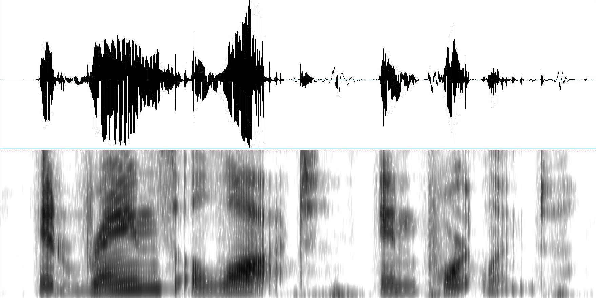

# Обработка звука

Рассмотрим основные задачи, которые решаются для звуковых данных с помощью нейронных сетей.

## Представление звука

Звук для обработки представляется либо в виде **wave-формы** (динамики силы звуковой волны во времени [[1]](https://en.wikipedia.org/wiki/Waveform)), либо **спектрограммы** (spectrogram [[2]](https://en.wikipedia.org/wiki/Spectrogram)), описывающей представленность тех или иных частот во времени. Они показаны на рисунке сверху и снизу соответственно ([источник](https://www.flickr.com/photos/aaronpk/4947807970)):

## Основные задачи обработки звуковых данных

Опишем основные задачи, возникающие при обработке звуковых данных.

**Классификация звука** (audio classification [[3]](https://paperswithcode.co/tasks/audio-classification)) - отнесение звука к одной из заранее заданных категорий. Примеры:

- Определение жанра, исполнителя и названия композиции записанной мелодии. 

- Идентификация по голосу - установление личности говорящего на основе уникальных характеристик его речи.

- Анализ эмоций по голосу (интонации, тембру, скорости речи и другим акустическим характеристикам). Используется в колл-центрах и виртуальных ассистентах.

**Сегментация звука** (audio segmentation, speaker diarization) - разделение разговора нескольких собеседников на фрагменты, в которых говорит каждый из собеседников. 

> Это может использоваться для автоматической фокусировки камеры на говорящем спикере, транскрипции диалога и суммаризации проведённой видеоконференции.

**Повышение качества звука** (audio super-resolution, speech enhancement [[4]](https://paperswithcode.co/tasks/speech-enhancement)). Цифровой звук имеет два уровня дискретизации: число бит, кодирующих сигнал в каждый момент времени, а также частоту моментов времени, в которые записывается сила звукового сигнала. Нейросетевыми методами можно повышать оба уровня дискретизации, улучшая качество воспроизведения.

**Распознавание речи** (automatic speech recognition, ASR [[5]](https://paperswithcode.co/tasks/automatic-speech-recognition)) - перевод звука в текст. Применяется для документирования переговоров, а также для автоматического формирования субтитров на видеоплатформах.

**Генерация речи** (text-to-speech, TTS, speech synthesis [[6]](https://paperswithcode.co/tasks/text-to-speech)) используется голосовыми помощниками. Родственной задачей является **генерация музыки** по жанру, нотам или словам песни.

**Удаление шума** (noise removal, speech enhancement [[7]](https://paperswithcode.co/tasks/speech-enhancement)) - задача извлечения чистого речевого сигнала из шумной аудиозаписи. Применяется в системах видеосвязи и распознавании речи.

**Разделение источников звука** (audio source separation). Используется при разделении записанного диалога на фразы отдельных спикеров, а также при декомпозиции песни на голос, барабаны, бас и другие инструменты. 

**Сжатие аудио** (neural audio compression) и генерация по сжатому представлению. Используется для компактного хранения аудиоданных.

**Стилизация звука** (voice conversion / voice cloning [[8]](https://paperswithcode.co/tasks/voice-cloning)) - трансформация речи под другого спикера. Это применяется в озвучивании аудиокниг, а в играх позволяет игроку говорить голосом своего персонажа.

> Звук, как последовательность амплитуд звуковой волны (в wav-формате) или как последовательность звучащих в каждый момент времени частот (в виде спектрограммы) можно обрабатывать [рекуррентными сетями](../Recurrent-neural-nets). Более высокое качество достигается использованием [механизма внимания и моделью трансформера](../Transformer).

## Литература

1. [Wikipedia: Waveform.](https://en.wikipedia.org/wiki/Waveform)

2. [Wikipedia: Spectrogram.](https://en.wikipedia.org/wiki/Spectrogram)

3. [PapersWithCode: Audio classification.](https://paperswithcode.co/tasks/audio-classification)

4. [PapersWithCode: Speech enhancement.](https://paperswithcode.co/tasks/speech-enhancement)

5. [PapersWithCode: Automatic Speech Recognition.](https://paperswithcode.co/tasks/automatic-speech-recognition)

6. [PapersWithCode: Text-to-speech.](https://paperswithcode.co/tasks/text-to-speech)

7. [PapersWithCode: Speech enhancement.](https://paperswithcode.co/tasks/speech-enhancement)

8. [PapersWithCode: Voice cloning.](https://paperswithcode.co/tasks/voice-cloning)

9. PapersWithCode: 

