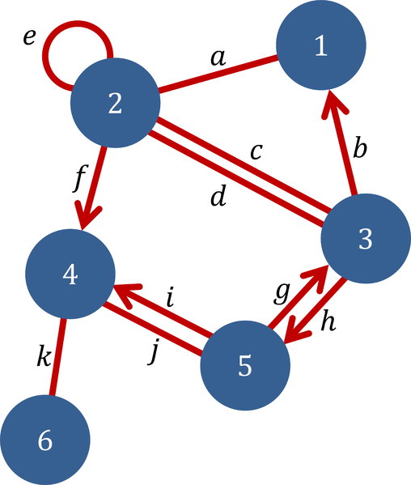
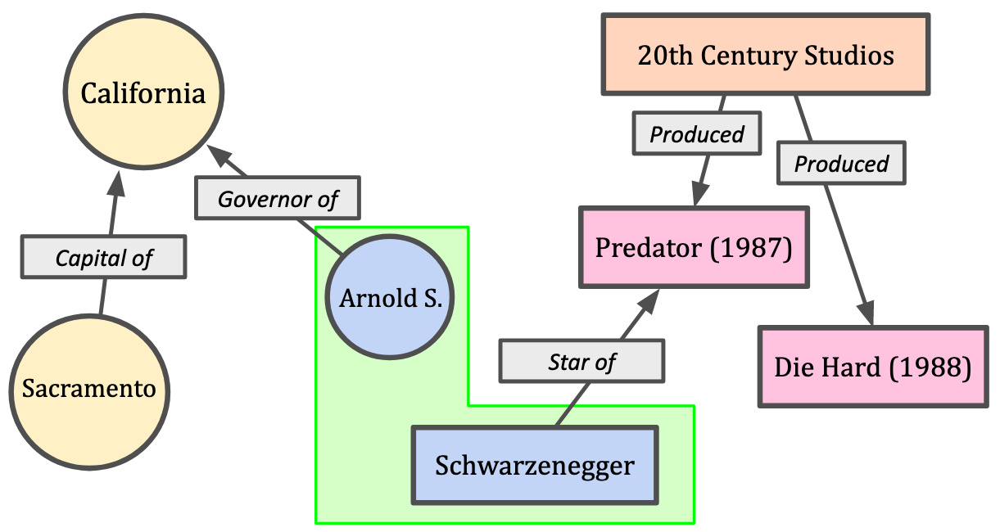
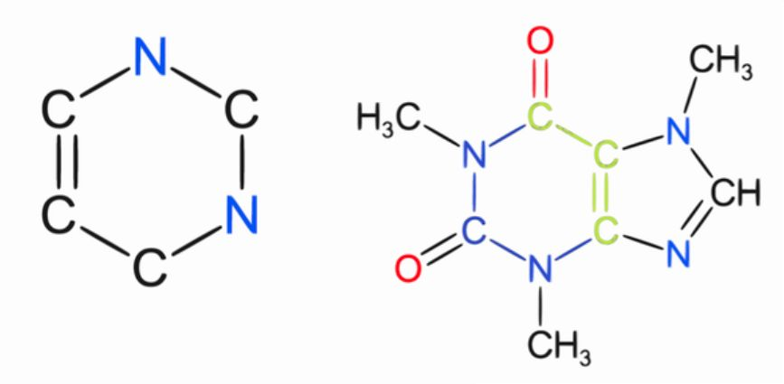

# Обработка графов

Рассмотрим основные задачи, которые решаются для данных, представимых в виде графа, с помощью нейронных сетей.

## Понятие графа и его основные виды

**Граф** [[1]](https://ru.wikipedia.org/wiki/Граф_(математика)) в математике представляет собой коллекцию **вершин** (vertices) или **узлов** (nodes), соединённых друг с другом рёбрами (edges). Граф может быть **направленным** (directed graph) и **ненаправленным** (undirected graph) в зависимости от того, отношение связности действует в одну сторону или всегда в обе. Также граф может быть **взвешенным** (weighted graph), когда каждому ребру ставится в соответствие вещественная сила связи. Вершинам и рёбрам можно ставить в соответствие дискретные категории (их тип), а также набор вещественных признаков. Ниже приведён пример графа ([источник](https://commons.wikimedia.org/wiki/File:Graph_example_%28Graph_theory%29.png)):

## Примеры данных, представляемых в виде графа

Графы часто возникают на практике. Например, ими можно представлять следующие сущности:

- <u>социальная сеть</u>, где узлами выступают люди, а связи - добавил ли человек другого человека в друзья или писал ли ему сообщения;

- <u>интернет</u>, где узлами выступают веб-страницы, а связи отражают ссылки одних веб-страниц на другие;

- <u>научные публикации</u>, где узлами выступают статьи, а рёбра проводятся, если одна статья ссылается на другую;

- <u>компьютерная сеть</u>, где узлами выступают компьютеры и сетевые устройства, а ребра проводятся, если устройства соединены и посылают друг другу данные;

- <u>знания</u>, где узлами выступают сущности, а ребра отражают связи между этими сущностями, как показано ниже ([источник](https://en.wikipedia.org/wiki/Knowledge_graph)):

- <u>вещества</u>, где узлами выступают атомы, а связями - их химические соединения друг с другом ([источник](https://commons.wikimedia.org/wiki/File:Chemical_Graph_Representation.svg)):
  

## Задачи на графах, решаемый нейросетями

Опишем основные задачи, которые можно решать на графах с помощью нейросетей.

**Классификация графа** (graph classification [[2]](https://paperswithcode.co/task/graph-classification)) - отнесение графа к одному из дискретных классов. Например, по химическому соединению лекарства предсказать, будет ли оно обладать лечебным эффектом. Также можно решать и **задачу регрессии** (graph regression [[3]](https://paperswithcode.co/task/graph-regression)), например, по виду химического соединения определить его температуру плавления.

**Классификация узлов графа** (node classification [[4]](https://paperswithcode.co/task/node-classification)). Например, для графа социальной сети определять, является ли аккаунт ботом или реальным человеком.

**Восстановление ребер на графе** (link prediction [[5]](https://paperswithcode.co/task/link-prediction)). Например, в графе научных работ предсказывать недостающие ссылки на связанные научные исследования.

Можно решать **задачу классификации и регрессии на ребрах графа** (edge classification / edge regression). Например, в графе социальной сети предсказывать, как часто друзья будут обмениваться сообщениями и будут ли посылать друг другу изображения, приглашать в группы и т.д.

**Генерация графа** (graph generation [[6]](https://graph-neural-networks.github.io/gnnbook_Chapter11.html)) заключается в порождении графа, обладающего требуемыми свойствами. Например, в авиапромышленности нас может интересовать список химических соединений, обладающих как высокой прочностью, так и низкой плотностью . А в медицине интересны лекарственные вещества, обладающие максимальным лечебным действием при минимуме побочных эффектов.

**Прогнозирование изменений во времени** (dynamic / temporal graph prediction [[7]](https://graph-neural-networks.github.io/gnnbook_Chapter15.html)) позволяет обрабатывать графы, которые динамически меняются во времени. Примером такого графа выступает логистический граф перемещения транспортных средств между локациями, для которого можно решать задачу прогнозирования загруженности дорог и образования пробок.

**Кластеризация графа** (graph clustering [[8]](https://jmlr.org/papers/volume24/20-998/20-998.pdf)) разбивает вершины графа на группы, обладающие свойством, что вершины в рамках одной группы сильно связаны друг с другом, а вершины разных групп - слабо. Эта задача решается, например, в графе социальной сети, в которой вершинами выступают люди, а кластеризация разбивает их на сообщества по интересам.

**Сопоставление графов** (graph matching / graph similarity [[9]](https://en.wikipedia.org/wiki/Graph_matching)) решает задачу точного или приближённого сравнения графов. Это полезно в информационном поиске по изображениям, структура которых описывается в виде графа (по опорным точкам), а также в медицине, где среди всевозможных химических соединений ищется подструктура, обладающая некоторым лечебным эффектом.

> Обработке графов нейросетевыми методами посвящён [отдельный раздел учебника](../Graph-processing).

## Литература

1. [Wikipedia: Граф (математика).](https://ru.wikipedia.org/wiki/Граф_(математика))
2. [paperswithcode.co: Graph Classification.](https://paperswithcode.co/task/graph-classification)
3. [paperswithcode.co: Graph Regression.](https://paperswithcode.co/task/graph-regression)
4. [paperswithcode.co: Node Classification.](https://paperswithcode.co/task/node-classification)
5. [paperswithcode.co: Link Prediction.](https://paperswithcode.co/task/link-prediction)
6. [Liao R. Graph neural networks: Graph generation //Graph Neural Networks: Foundations, Frontiers, and Applications. – Singapore : Springer Nature Singapore, 2022. – С. 225-250.](https://graph-neural-networks.github.io/gnnbook_Chapter11.html)
7. [Kazemi S. M. Dynamic graph neural networks //Graph neural networks: Foundations, frontiers, and applications. – Singapore : Springer Nature Singapore, 2022. – С. 323-349.](https://graph-neural-networks.github.io/gnnbook_Chapter15.html)
8. [Tsitsulin A. et al. Graph clustering with graph neural networks //Journal of Machine Learning Research. – 2023. – Т. 24. – №. 127. – С. 1-21.](https://www.jmlr.org/papers/v24/20-998.html)
9. [Wikipedia: Graph matching.](https://en.wikipedia.org/wiki/Graph_matching)
