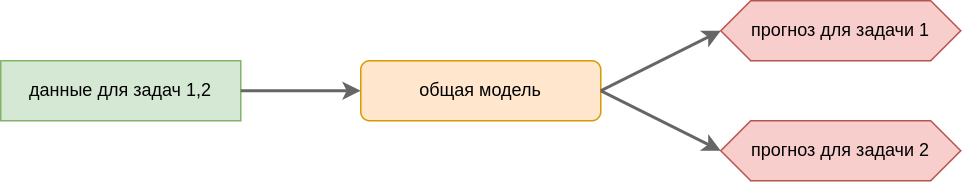
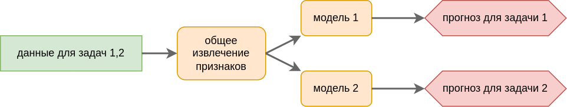
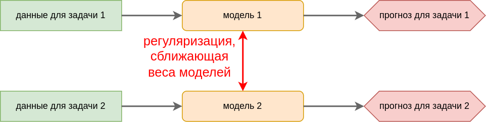

# Специальные типы обучения моделей

Рассмотрим специальные виды задач, решаемые в глубоком обучении.

**Многозадачное обучение** (multi-task learning [[1]](https://www.geeksforgeeks.org/deep-learning/multi-task-learningmtl-for-deep-learning/), предложено в [[2]](https://people.eecs.berkeley.edu/~russell/classes/cs294/f05/papers/caruana-1997.pdf)): парадигма машинного обучения, заключающаяся в совместном обучении модели решению нескольких связанных задач. Основная идея состоит в использовании общих представлений (shared representations) для извлечения универсальных признаков, что позволяет задачам «помогать» друг другу и улучшает обобщающую способность модели.

Примеры:

- детекция людей на фото и их одновременное распознавание;

- в беспилотных автомобилях пешеходы, знаки остановки и другие препятствия могут обнаруживаться одновременно;

- прогноз будущих цен не для одной, а сразу для нескольких акций.

Решается тремя способами.

1. **Hard weight sharing.** Настраивается одна модель, принимающей на вход данные для всех задач и выдающей прогнозы для всех задач одновременно. Преимущество обеспечивается тем, что обе задачи используют одинаковые признаки, которые лучше настраиваются используя информацию о всех задачах одновременно.
   
   

2. **Common features.** Модели решающие различные задачи различаются только последними слоями, опирающимися на общие извлечённые признаки.
   
   

3. **Soft weight sharing.** Настраивается своя модель под каждую задачу. При этом при настройке весов моделей добавляется дополнительное требование, чтобы параметры (веса) разных моделей не сильно различались между собой. Математически это требование реализуется добавлением регуляризации на расхождение весов моделей в процессе их настройки.
   
   

**Трансферное обучение** (transfer learning [[3]](https://www.geeksforgeeks.org/machine-learning/ml-introduction-to-transfer-learning/)) - использование знаний, полученных из решения одной задачи на решение другой родственной задачи. Это целесообразно, когда для первой задачи есть много обучающих данных или уже настроена точная модель, но решать нужно вторую задачу, которая очень похожа на первую.Примеры:

- Есть модель, хорошо классифицирующая машины. Хотим построить модель, классифицирующую грузовики.

- Есть модель, хорошо переводящая с английского языка на французский. Хотим построить модель, переводящую с английского на монгольский.

- Голосовой ассистент хорошо научился понимать голос Алисы. Хотим, чтобы он научился понимать голос Боба.

В трансферном обучении начальные слои модели, решающей первую задачу, переносятся в модель, решающую вторую задачу, что сразу позволяет ей использовать качественные предобученные признаки, что схематично показано ниже:

Связанный подход - **дообучение** (finetuning), при котором предобученные первые слои выступают лишь в качестве инициализации первых слоёв модели, решающей вторую задачу, а дальше <u>все слои</u> обучаются на данных второй задачи.

**Последовательное обучение** (continual learning [[4]](https://www.ibm.com/think/topics/continual-learning)) - тип обучения, когда обучающие примеры поступают постепенно, а не известны заранее. Это требует модификации процесса обучения нейросети таким образом, чтобы более новые данные, изменяя настраиваемую модель, не приводили к забыванию старых данных, на которые модель настраивалась ранее (эффект catastrophic forgetting). 

> Примеры:
> 
> - Прогнозирование цен акций, данные поступают динамически во времени.
> 
> - Визуальный идентификатор пользователя телефона динамически учится опознавать владельца, когда он покупает новую одежду (например, зимой опознаётся уже в шапке и шарфе).

В задачах классификации бывают постановки, когда в процессе обучения появляются новые классы, которые тоже нужно учиться обрабатывать.

> Пример: в задаче автоматического вождения могут появляться новые модели машин на дороге, которые также нужно уметь объезжать.

**Обучение по одному или нескольким прецедентам** (one-shot learning, few shot learning [[5]](https://en.wikipedia.org/wiki/One-shot_learning_(computer_vision))) - технология быстрого дообучения модели по одну или нескольким примерам.  Задача вдохновлена способностью человека распознавать объекты, увидев их всего один или пару раз. Существуют следующие подходы:

- **Контрастное обучение**. Нейросеть обучается переводить объекты в векторное пространство (эмбеддинги) так, чтобы похожие объекты оказывались близко друг к другу, а разные — далеко. Для классификации нового объекта достаточно измерить расстояние от него до нескольких известных примеров.

- **Мета-обучение**. Модель обучается не конкретной задаче, а алгоритму быстрой адаптации. Сеть подбирает такие начальные веса, из которых можно прийти к идеальному решению всего за несколько шагов градиентного спуска на новых данных.

- **Аугментация данных**. Если данных мало, их можно сгенерировать. Модель использует априорные знания о мире, чтобы создать реалистичные вариации тех нескольких примеров, которые у неё есть.

- **Контекстное обучение**. Веса модели зафиксированы и не меняются. А информация о нескольких примерах и их разметке подаётся в качестве запроса модели. Этот метод особенно популярен при работе с текстами с использованием больших языковых моделей.

Отдельно отметим, что существует даже **обучение без прецедентов** (zero-shot learning [[6]](https://en.wikipedia.org/wiki/Zero-shot_learning)), в котором модель способна классифицировать объекты или решать задачи, не имея ни одного обучающего примера целевого класса. Этот подход вдохновлен способностью человека распознать незнакомый объект исключительно по его текстовому описанию

> Пример: человек легко распознает изображение грифона, зная лишь то, что это мифическое существо с головой и крыльями орла, но с телом, лапами и хвостом льва.

**Нейросетевой поиск архитектур** (neural architecture search [[7]](https://en.wikipedia.org/wiki/Neural_architecture_search)) - задача, в которой нужно автоматически подобрать оптимальную нейросетевую архитектуру для решения заданной задачи. Для этого часто используются генетические алгоритмы дискретной оптимизации.

**Автоматическое машинное обучение** (AutoML [[8]](https://www.automl.org/automl/)) - задача, в которой нужно автоматически подобрать всю цепочку предобработки данных, генерации признаков, выбора модели и её гиперпараметров для достижения наилучшего качества решения определённой задачи.

Такую задачу можно решать средствами классического машинного обучения, в котором

- объектами выступают задачи, описанные в виде вектора признаков (тип задачи, число объектов, число признаков, доля числовых, бинарных и категориальных признаков, количество разреженных признаков и т.д.);

- ответами выступают наилучшие конфигурации моделей и предобработки данных для решения указанных задач.

**Сжатие и оптимизация модели** (model compression [[9]](https://en.wikipedia.org/wiki/Model_compression)) — технология построения  по точной, но вычислительно сложной модели похожей по точности, но компактной и быстрой структуры. Это важно для запуска моделей на маломощных устройствах (смартфоны, дроны, IoT-датчики), а также для повышения пропускной способности серверов (работа с видеопотоками в реальном времени, обработка миллионов запросов). Для этого существуют следующие подходы:

- **Дистилляция знаний** (Knowledge Distillation). Обучение маленькой модели («студента») повторять логику и распределение вероятностей большой и точной модели («учителя»).

- **Прунинг / Обрезка** (Pruning). Удаление из нейросети наименее важных весов, нейронов или целых каналов, которые слабо влияют на финальный результат, что делает матрицу весов разреженной.

- **Квантование / Квантизация** (Quantization). Перевод весов и активаций из высокоточных форматов (например, FP32) в низкоточные (FP16, INT8 или даже INT4), что резко снижает требования к памяти и ускоряет вычисления на аппаратном уровне.

- **Низкоранговая факторизация** (Low-rank Approximation). Разложение больших матриц и тензоров весов на произведение нескольких матриц меньшего размера (например, через SVD), что ускоряет математические операции над ними.

**Распределённое обучение** (distributed learning) - ускорение обучения моделей за счёт распределённых вычислений на разных устройствах.

**Федеративное обучение** (federated learning [[10]](https://en.wikipedia.org/wiki/Federated_learning)) - распределённое обучение, при котором  вычислительные узлы не обмениваются информацией об обучающих объектах напрямую, а пересылают центральному серверу или друг другу информацию в более агрегированном и абстрактном виде.

Это актуально по следующим причинам:

- <u>Защита конфиденциальности</u>. Данные пользователей никогда не покидают их личные устройства (смартфоны, больничные сервера, локальные ПК). Технология позволяет бизнесу легально работать в рамках строгих регламентов по охране персональных данных

- <u>Экономия на инфраструктуре</u>. Отпадает необходимость пересылать терабайты сырых данных по сети.

- <u>Безопасность при конкуренции</u>. Несколько конкурирующих компаний (например, альянс банков) могут обучить одну сильную модель, не раскрывая друг другу коммерческие тайны и базы клиентов.

## Литература

1. [GeeksForGeeks: Multi-Task Learning(MTL) for Deep Learning.](https://www.geeksforgeeks.org/deep-learning/multi-task-learningmtl-for-deep-learning/)
2. [Caruana R. Multitask learning //Machine learning. – 1997. – Т. 28. – С. 41-75.](https://people.eecs.berkeley.edu/~russell/classes/cs294/f05/papers/caruana-1997.pdf)
3. [GeeksForGeeks: Introduction To Transfer Learning.](https://www.geeksforgeeks.org/machine-learning/ml-introduction-to-transfer-learning/)
4. [IBM Blog: What is continual learning?](https://www.ibm.com/think/topics/continual-learning)
5. [Wikipedia: One-shot learning (computer vision).](https://en.wikipedia.org/wiki/One-shot_learning_(computer_vision))
6. [Wikipedia: Zero-shot learning.](https://en.wikipedia.org/wiki/Zero-shot_learning)
7. [Wikipedia: Neural architecture search.](https://en.wikipedia.org/wiki/Neural_architecture_search)
8. [AutoML.org.](https://www.automl.org/automl/)
9. [Wikipedia: Model compression.](https://en.wikipedia.org/wiki/Model_compression)
10. [Wikipedia: Federated learning.](https://en.wikipedia.org/wiki/Federated_learning)
