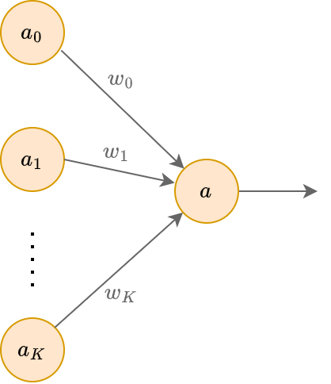

# Модель нейрона

**Нейронные сети** (neural networks) изначально появились как попытка моделировать работу человеческого мозга, который состоит из нейронов, связанные друг с другом аксонами - вытянутыми отростками нервных клеток. Каждый нейрон может перейти в возбуждённое состояние, в этом случае он передаёт по аксонам сигнал другим нейронам посредством электро-химического взаимодействия.

**Нейрон** (neuron) моделируется следующим преобразованием:

$$
a=h\left( \sum_{k=0}^K w_{k} a_k \right),
$$

где 

- $a$ - выход нейрона (что он посылает по аксонам другим нейронам);

- $a_0\equiv 1$ - нейрон, всегда выдающий константу 1;

- $a_1,...a_K$ - нейроны, имеющие входящую связь с рассматриваемым нейроном;

- $w_0,w_1,...w_K$ - веса связей; 
  
  - они показывают, во сколько раз изменяется сигнал, передаваемый нейронами $a_0,a_1,...a_K$ текущему нейрону $a$;

- $h(\cdot)$ - некоторая фиксированная **функция активации** (activation function).

Геометрически это можно представить следующим образом:

## Модель нейрона в машинном обучении

В машинном обучении нейрон можно применять как прогнозирующую модель. Тогда вместо активаций нейронов предыдущего слоя на вход нейрону подаваться исходные признаки, а также константа 1:

$$
a_0\equiv 1,\,a_1=x^1,\,a_2=x^2\,...a_{K}=x^D
$$

> Напомним, что в учебнике признаки обозначаются верхним индексом: $x^i$ - $i$-й признак вектора признаков. А $\mathbf{x}_n$ - $n$-й объект обучающей выборки.

Одиночный нейрон будет моделировать закономерность:

$$
y(\mathbf{x})=h\left( w_{0} + \sum_{d=1}^D w_{d} x^d \right),
$$

где параметр $w_0$ называется **смещением** (bias).

Веса $w_0,w_1,...w_{D}$ представляют собой параметры, настраиваемые по данным. В зависимости от того, как выбрать функцию активации, мы сможем решать как задачу регрессии, так и задачу бинарной классификации.

### Регрессия

Регрессия получается при выборе $h(u)=u$. Тогда

$$
y(\mathbf{x}) = w_{0} + \sum_{d=1}^D w_{d} x^d
$$

### Бинарная классификация

Классификация получается при выборе сигмоидной функции активации:

$$
h(u)=\sigma(u)=1/(1+e^{-u})
$$

Эта функция принимает значения на интервале $(0,1)$, поэтому её можно трактовать как вероятность положительного класса:

$$
p(y=+1|\mathbf{x})=\sigma\left( w_{0} + \sum_{d=1}^D w_{d} x^d \right)
$$

Тогда вероятность отрицательного класса можно посчитать как

$$
p(y=-1|\mathbf{x}) = 1 - p(y=+1|\mathbf{x})
$$

Это даёт нам нейросетевую реализацию [бинарной логистической регрессии](../../Machine-learning/Linear-classification/Binary-logistic-regression).
