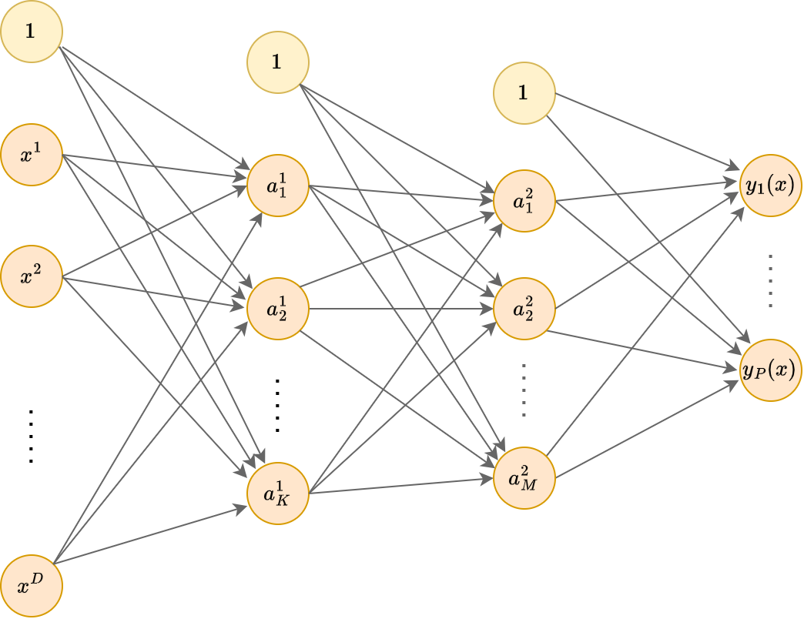
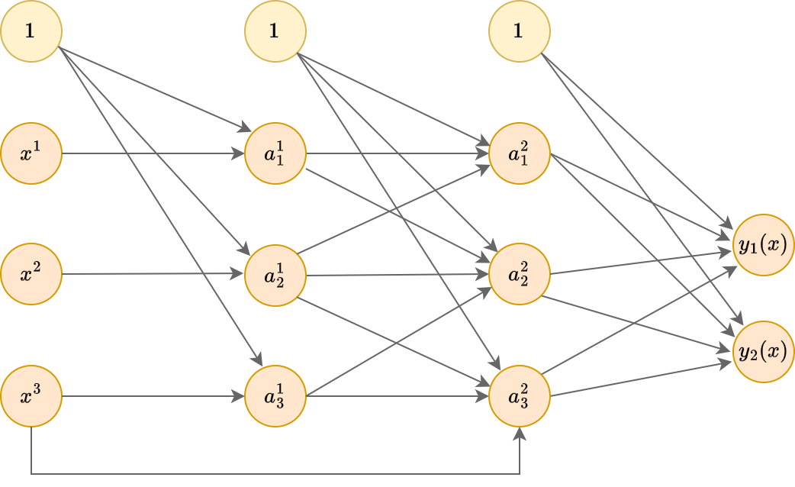

# Многослойный персептрон

## Архитектура

Как [мы выяснили](./Neuron-model#модель-нейрона-в-машинном-обучении), отдельный нейрон способен моделировать линейную регрессию и линейную классификацию. Однако нейросети способны моделировать и более сложные <u>нелинейные зависимости</u>, если слои из нейронов накладывать друг на друга, создавая суперпозиции нелинейных преобразований, как показано ниже:

Это пример **многослойного персептрона** (multilayer perceptron, MLP), то есть нейросети, у которой 

- **входной слой** (input layer) состоит из признаков обрабатываемого объекта $x$, 

- далее следует один или более **скрытых слоёв** (hidden layers), 

- после чего идет **выходной слой** (output layer), состоящий из одного и более нейронов, в зависимости от решаемой задачи. 

> На рисунке выше приведён пример трёхслойного персептрона с двумя скрытыми слоями, поскольку нулевой слой, состоящий из входных признаков, при расчёте числа слоёв не учитывается. Можно создавать архитектуры и с большим числом слоёв.

Действие представленной сети на вектор признаков $\mathbf{x}$ может быть записано аналитически:

$$
\hat{\mathbf{y}} = f(\mathbf{x}) = g(W_3 h(W_2 h(W_1 \mathbf{x}+\mathbf{b_1}) + \mathbf{b}_2) +\mathbf{b}_3),
$$

где 

- $W_1\in\mathbb{R}^{K\times D},\, \mathbf{b}_1\in\mathbb{R}^K$ - матрица весов и вектор смещений 1-го слоя;

- $W_2\in\mathbb{R}^{M\times K},\, \mathbf{b}_2\in\mathbb{R}^M$ - матрица весов и вектор смещений 2-го слоя;

- $W_3\in\mathbb{R}^{P\times M},\, \mathbf{b}_3\in\mathbb{R}^P$ - матрица весов и вектор смещений 3-го (выходного) слоя;

- $h(\cdot)$ - функция нелинейности скрытых слоёв (для разных слоёв может различаться);

- $g(\cdot)$ - функция нелинейности для выходного слоя (зависит от решаемой задачи).

В многослойном персептроне связи строятся только между нейронами соседних слоёв, причём каждый нейрон предыдущего слоя соединён с каждым нейороном последующего слоя. Два слоя нейронов с полным набором связей между ними называется **полносвязным слоем** (fully connected layer, FC).

На каждом слое используется нейрон, выдающий константную единицу (отмечены жёлтым цветом), чтобы моделировать смещение при расчёте взвешенной суммы активаций входных нейронов.

Каждой связи сопоставляется свой настраиваемый вес.

 
  
Рассчитайте общее число параметров сети на рисунке.

  Поскольку связи строятся каждый с каждым, а тождественная единица только выпускает связи, но не принимает, то 
    <ul><li>на первом слое нужно оценить $(D+1)K$ весов,</li> 
      <li>на втором - $(K+1)M$,</li> 
      <li>а на третьем - $(M+1)P$.</li></ul>

По сути, нейроны скрытых слоёв строят **промежуточное признаковое представление** (intermediate feature representation) обрабатываемого объекта, а итоговый прогноз строится по извлечённым признакам последнего скрытого слоя, т.е. работает [принцип глубокого обучения](../intro#принцип-глубокого-обучения), когда модель сама подбирает наиболее информативные признаки, составляя их из входных.

При этом промежуточные признаки строятся автоматически, поскольку внутри сети настраиваются все веса: и для извлечения промежуточных признаков на скрытых слоях, и для построения итогового прогноза на выходном слое.

> Если данных достаточно много, то настроенные промежуточные признаки окажутся более информативными и полезными, чем если бы аналитик строил признаки самостоятельно, а потом применял к ним линейную модель.

Если активациями выступают сигмоиды $h(u)=1/(1+e^{-u})$, то каждый нейрон представляет собой логистическую регрессию (со своими параметрами). Нейроны первого слоя реализуют логистические регрессии относительно исходных признаков, нейроны следующих слоёв - логистические регрессии относительно прогнозов предыдущих логистических регрессий.

 
  
Чем это отличается от многоуровневого стэкинга логистических регрессий?

В стэкинге каждая логистическая регрессия настраивается независимо предсказывать одну и ту же целевую метку класса, а после настройки она фиксируется. 

В многослойном же персептроне все логистические регрессии <u>настраиваются одновременно</u>, причём учатся предсказывать не метку класса, а <u>максимально информативные промежуточные признаки</u> для итогового прогнозирования последним слоем сети.

 
  
Какой класс функций будет моделировать многослойный персептрон, если в каждом нейроне использовать тождественную функцию активации $h(u)=u$? 

Каждый нейрон будет моделировать линейную функцию. Суперпозиция линейных функций будет снова приводить к линейной функции!

Может возникнуть вопрос: зачем тогда использовать подобную суперпозицию? Оказывается это целесообразно для регуляризации (упрощения модели), если на скрытых слоях число нейронов будет небольшим.

Рассмотрим $D=10, K=3, M=3, P=10$ для многослойного персептрона на рисунке. Тогда общее число оцениваемых параметров будет 85. Если бы мы исключили скрытые слои, то общее число связей и весов было бы $11\times 10=110$, то есть более глубокая модель получилась проще!

> Этот пример иллюстрирует, что глубокие нейросети (с большим числом слоёв) могут не только эффективнее решать задачи, оперируя более сложными нелинейными зависимостями, но и содержать меньшее число параметров за счёт переиспользования одних и тех же промежуточных признаков!

Построение полезных промежуточных признаковых описаний объектов называется **обучением представлений** (representation learning).

## Обобщение архитектуры

Из физической природы задачи и для упрощения настройки нейронные сети можно строить не только в виде многослойного персептрона, но и с произвольной топологией (расположением связей), например, такой:

