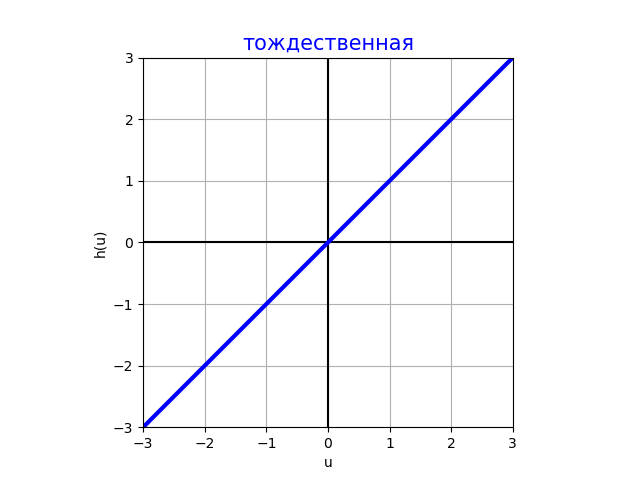
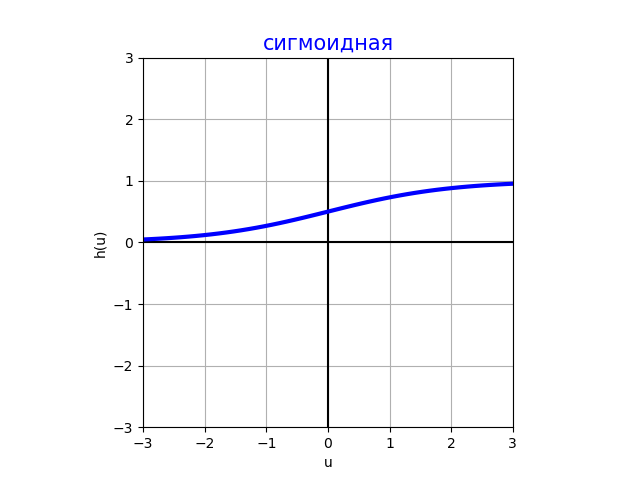
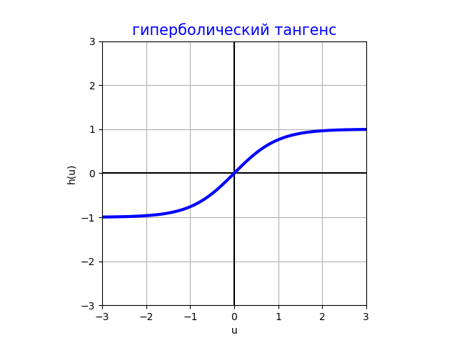
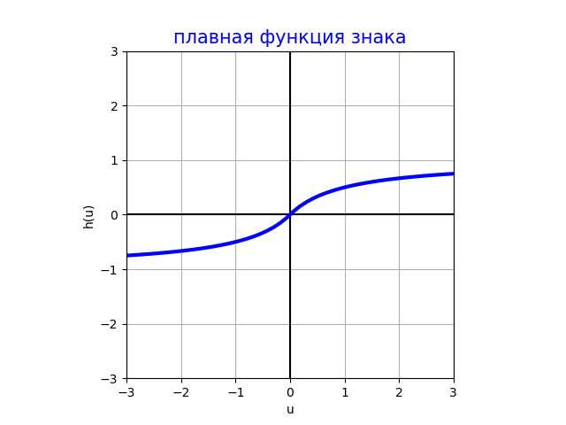
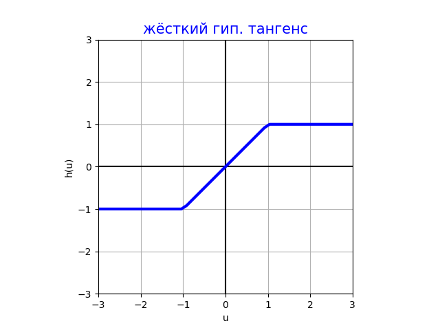
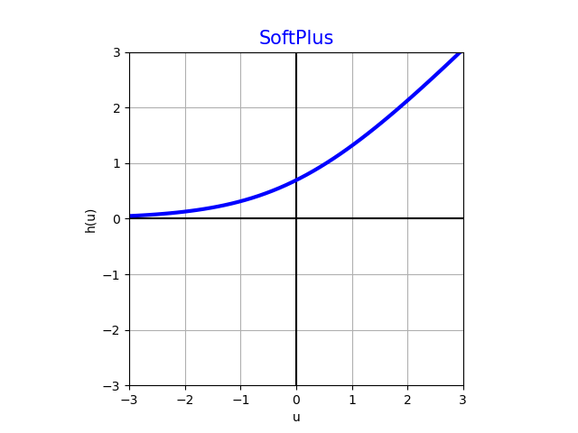
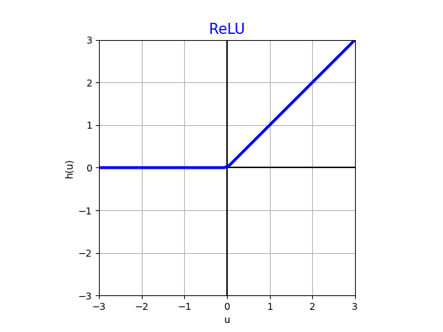
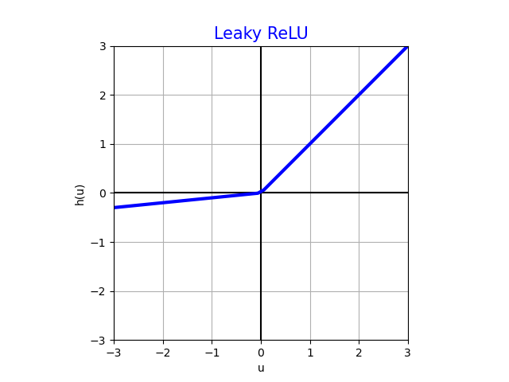

# Функции активации

Рассмотрим популярные функции активации $h(u)$, использующиеся в нейросетях. 

## Тождественная функция активации (identity)

$$
h(u)=u
$$

Эта активация используется в выходном слое, чтобы моделировать [регрессионный выход](../../Machine-learning/Base-concepts/Supervised-learning#типы-задач-обучения-с-учителем). В скрытых слоях почти не используется (кроме случаев регуляризации), так как суперпозиция линейных функций всегда приводит к линейной функции.

## Сигмоидная функция активации (sigmoid)

$$
h(u)=\sigma(u)=\frac{1}{1+e^{-u}}
$$

Принимает значения $h(u)\in(0,1)$ и используется только в выходном слое нейронной сети 

- для решения задачи бинарной классификации, предсказывая вероятность положительного класса $p(y=+1|\mathbf{x})$;

- при прогнозировании неотрицательных значений из заданного отрезка; например, интенсивность пикселя принадлежит отрезку $[0,255]$ и её можно моделировать выходом $255\cdot \sigma(u)$.

В скрытых слоях сигмоида не используется, поскольку за пределами интервала $(-3,3)$ она выходит на горизонтальные асимптоты 0 и +1, почти не меняясь, в результате чего <u>её градиент близок к нулю</u>. Поскольку нейросети оптимизируются [численными методами](../Training-neural-networks), использующими градиент, малые значения производной нежелательны, поскольку <u>приводят к слишком медленной настройке сети</u>.

## Гиперболический тангенс (tangh)

$$
h(u)=\text{tangh}(u)=\frac{e^{u}-e^{-u}}{e^{u}+e^{-u}}=2\sigma(2u)-1
$$

С точностью до линейного сжатия и сдвига активация гиперболического тангенса совпадает с сигмоидной функцией активации, но, в отличие от неё, является нечётной функцией:

$$
\text{tangh}(-u)=-\text{tangh}(u),
$$

что даёт преимущество при инициализации и настройке нейросети за счёт того, что если признаки - случайные величины, центрированные вокруг нуля, то образованные от них активации также будут центрированными вокруг нуля, а также активации от активаций и так далее по всем слоям нейросети, то есть по ходу вычислений не будет происходить систематического смещения в положительную или отрицательную сторону, в отличие от сигмоиды.

Тем не менее, гиперболический тангенс используется в основном только в выходных регрессионных слоях, где есть ограничение на выход и снизу, и сверху, например, где нужно генерировать степень поворота руля $[-1,1]$, чтобы оптимально объехать препятствие. 

В скрытых слоях эта активация практически не используется, поскольку обладает тем же недостатком, что и сигмоида: за пределами интервала $(-3,3)$ выходит на горизонтальные асимптоты -1 и +1 и почти не изменяется, из-за чего градиент по активации становится близким к нулю, и сеть начинает слишком медленно настраиваться градиентными методами оптимизации.

## Плавная функция знака (SoftSign)

$$
h(u) = \frac{u}{1+|u|}
$$

SoftSign-активация идейно повторяет tangh-активацию, но имеет характер приближения к асимптотам +1 и -1 полиномиальный, а не экспоненциальный, вследствие чего на константные значения $\pm 1$ она выходит медленнее, что ускоряет сходимость при настройке сети. Также SoftSign-активация вычисляется быстрее, чем tangh. Тем не менее, за исключением выходных слоёв такая функция используется редко из-за того, что в скрытых слоях возникают горизонтальные асимптоты и малые градиенты.

## Жёсткий гиперболический тангенс (hard tangh)

$$
h(u)=\max\{-1;\min\{u;+1\}\}
$$

Используется так же, как и обычный гиперболический тангенс, но гораздо быстрее вычисляется за счёт ещё более простых операций. Вычисление получается более точным и устойчивым, что актуально при использовании низкобитных представлений чисел (float16, int8) при построении компактных нейросетей для мобильных устройств.

## SoftPlus

$$
h(u)=\ln (1+e^u)
$$

Имеет нетривиальный градиент уже на полуоси $u\ge -3$, за счёт чего <u>используется в скрытых слоях</u>. Также используется и в выходных слоях, когда предсказываем неотрицательный регрессионный отклик, который сверху не ограничен. Примеры подобных задач:

- прогнозирование времени безотказной работы оборудования;

- предсказание стоимости товара;

- прогноз физических величин, которые всегда неотрицательны (интенсивность света, мощность, энергия и т.д.)

## Rectified linear unit (ReLU)

$$
h(u) = \max\{0;u\}
$$

Имеет нетривиальный градиент +1 на полуоси $u>0$ , за счёт чего используется как в скрытых слоях, так и в выходных слоях, где нужно предсказывать неотрицательный регрессионный отклик. 

Идейно повторяя SoftPlus-активацию, вычисляется гораздо быстрее и устойчивее при низкобитных представлениях чисел в облегчённых нейросетевых моделях. За счёт этих свойств ReLU - <u>одна из самых популярных функций активации</u>!

ReLU обладает тем недостатком, что зануляет отрицательные значения, что приводит к холостым вычислениям для отрицательных аргументов (dead neuron).

:::tip Недифференцируемость в нуле

Формально, в нуле градиент этой функции активации не определён. Однако это не приводит к проблемам на практике, так как при случайной инициализации весов и случайных признаках значение, в точности равное нулю, в общем случае не реализуется.

:::

## Leaky rectified linear unit (Leaky ReLU)

$$
h(u)=\max\{ \alpha u; u \},\; \alpha\in (0,1) - \text{гиперпараметр}
$$

Активация Leaky ReLU обладает всеми достоинствами ReLU-активации, но кроме того выдаёт ненулевые значения и для отрицательных аргументов, за счёт чего не вырождается в ноль и не приводит к лишним вычислениям вхолостую. Поэтому <u>эта функция рекомендуется к использованию как наилучший базовый вариант для скрытых слоёв!</u>

> В классическом LeakyReLU $\alpha=0.01$, хотя можно использовать и другие значения и даже настраивать его как параметр вместе с остальными параметрами нейросети.

---

Мы рассмотрели <u>основные функции активации</u>, использующиеся в нейросетях. С расширенным списком функций активации вы можете ознакомиться в [[1]](https://en.wikipedia.org/wiki/Activation_function). 

## Литература

1. [Wikipedia: Activation function.](https://en.wikipedia.org/wiki/Activation_function)
