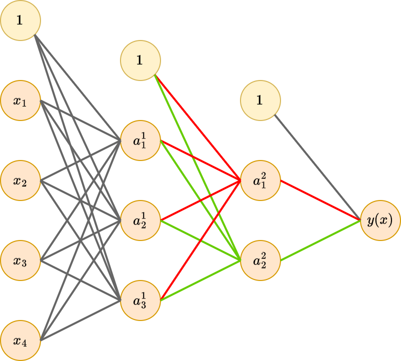

# Симметрия в пространстве весов

Рассмотрим пример [многослойного персептрона](Multilayer-perceptron):

Нетрудно заметить, что если синхронно переставить веса для всех входящих и исходящих связей для любой пары нейронов некоторого скрытого слоя, то мы получим нейросеть, моделирующую в точности ту же самую закономерность!

> Например, на рисунке можно синхронно поменять местами связи, выделенные красным и зелёным цветом - получим эквивалентную нейросеть!

Если в слое $M$ нейронов, сколько эквивалентных перестановок 
такого типа можно произвести?

$M!=M \cdot (M-1)  \cdot (M-2) \cdot ... \cdot 2 \cdot 1$ перестановок.

Если всего есть K скрытых слоёв с числом нейронов $M_1,M_2,...M_K$, то сколько всего эквивалентных перестановок можно произвести, получая ту же самую функцию?

Поскольку мы можем переставлять нейроны в рамках каждого слоя независимо, то всего будет $M_1! \cdot M_2! \cdot ...  \cdot M_{K-1}! \cdot M_K!$ перестановок.

Если используются нечётные функции активации (т.е. для которых $h(-u)=-h(u)$), то, выбрав какой-то нейрон, можно синхронно изменять знак входящих и исходящих связей - это также не окажет влияния на итоговую зависимость.

Какие из рассмотренных [функций активации](Activation-functions) являются нечётными?

Тождественная, гиперболический тангенс, SoftSign и жёсткий гиперболический тангенс.  

Указанные симметрии в пространстве весов показывают, что функция потерь в пространстве весов <u>будет обладать не одним, а большим количеством эквивалентных минимумов</u>, за счёт чего, в частности, она является невыпуклой. 

> На практике это не имеет большого значения, поскольку из всего многообразия эквивалентных минимумов функции потерь нам достаточно найти хотя бы один.
