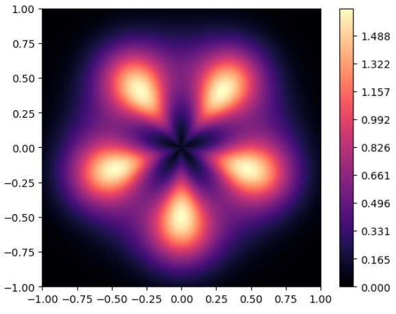
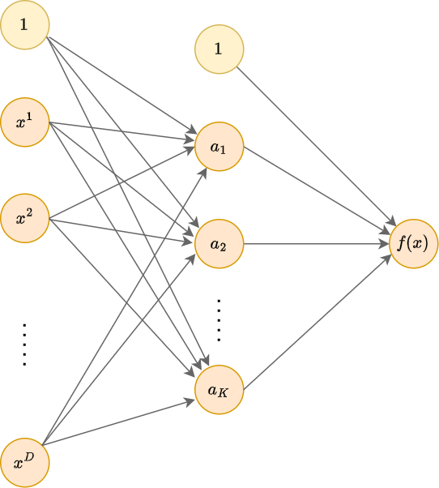
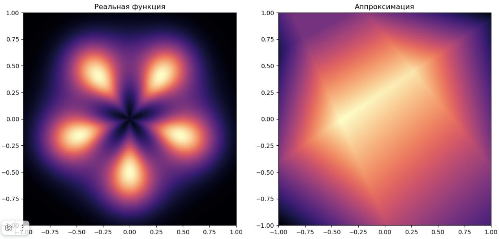
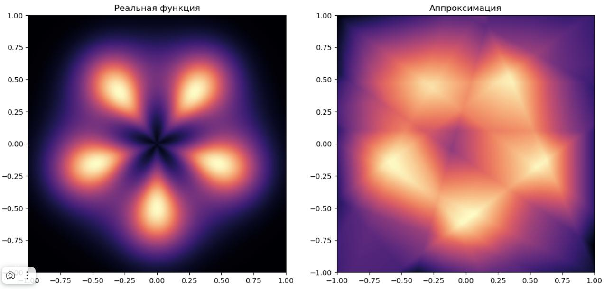
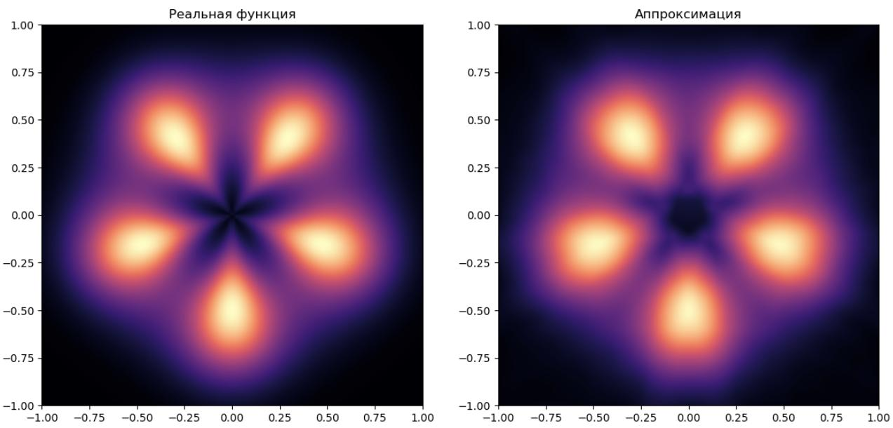
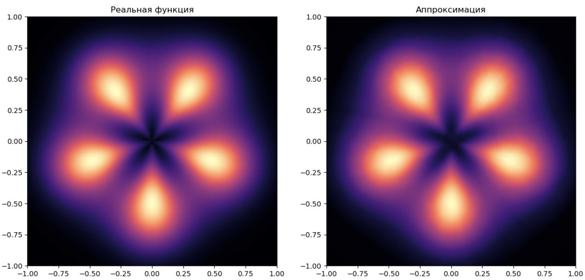

# Моделирующие способности нейросети

## Двухслойный персептрон

Сколько слоёв достаточно для моделирования произвольной регрессионной или классификационной зависимости? Теоретические результаты в статьях [1-4] показывают, что двухслойная нейросеть является <u>универсальным аппроксиматором</u>, то есть способна приблизить любую регулярную зависимость для широкого класса функций активации, включая все [изученные](Activation-functions), кроме тождественной.

В частности, в статье [[2]](https://www.semanticscholar.org/paper/Approximation-by-superpositions-of-a-sigmoidal-Cybenko/8da1dda34ecc96263102181448c94ec7d645d085) доказывается теорема:

> **Теорема (Цыбенко, 1989):** для любой непрерывной функции $f(\mathbf{x}): \mathbb{R}^m \to \mathbb{R}$ и для любого $\varepsilon>0$ найдётся число $N$, вектора $\mathbf{w}_1,...\mathbf{w}_N$ и числа $b_1,...b_N$, $\alpha_1,...\alpha_N$, для которых
> 
> $$
> \left| f(\mathbf{x})-\sum_{i=1}^N\alpha_i\sigma(\mathbf{x}^T w_i+b_i)\right|<\varepsilon
> $$
> 
> для любых объектов $\mathbf{x}$ из единичного куба: $0 \le x^1\le 1, 0 \le x^2\le 1, ... 0 \le x^D\le 1$.

Таким образом, двухслойной сети с сигмоидными функциями активации достаточно, чтобы с любой заданной точностью моделировать любую непрерывную функцию в ограниченной (компактной) области. Аналогичные утверждения справедливы и для [других изученных нелинейных функций активации](./Activation-functions).

В этом можно убедиться на практике, моделируя, например, следующую целевую функцию:

Попробуем её приближать с помощью двухслойного персептрона c $K$ нейронами на скрытом слое, использующим активации LeakyReLU:

При $K=5$ (у модели будет 21 параметр) получаем не очень точную аппроксимацию:

При K=50 (у модели уже 201 параметр) качество аппроксимации вырастает:

При $K=15000$ (60001 параметр) получим очень высокое качество:

Оно всё же пока неидеальное (см. аппроксимацию чёрной звезды в центре изображения), но может и дальше улучшаться за счёт дальнейшего повышения числа нейронов в скрытом слое $K$.

## Глубокие нейросети

Применим принцип глубокого обучения, когда признаки автоматически настраиваются  для итоговой прогностической модели. Для этого применим 5-слойный персептрон с 360, 80, 20, 5, 1 нейронами на слоях и активациями LeakyReLU (кроме выходного слоя с тождественной активацией).

Получим ещё более качественную аппроксимацию: 

Визуально видно, что чёрная звезда в центре аппроксимируется лучше.

По формальным критериям (RMSE) качество выросло более, чем в 3 раза, при этом в модели настраивался всего 31691 параметр - почти в 2 раза меньше, чем в двухслойном персептроне с максимальным числом нейронов!

Это объясняется тем, что если неглубокой сети приходилось генерировать много простых признаков (грубо говоря, выделяющих полуплоскости), то <u>в глубокой сети признаки получаются более сложными</u>, за счёт чего исходную функцию удалось качественно приблизить меньшим числом таких признаков. Также в неглубокой сети простые признаки комбинировались лишь линейно, в то время как в глубокой сети <u>высокоуровневые признаки нелинейно переиспользовались много раз</u>. Это позволило описать сложную закономерность более экономично с меньшим числом параметров!

> Извлечение сложных высокоуровневых признаков, позволяющих компактно описать сложные зависимости в данных, называется **обучением представлений** (representation learning).

Построение архитектуры, выделяющей качественные промежуточные представления для решения смежных задач, представляет собой отдельное направление исследований.

## Литература

1. [Funahashi, K. 1989. “On the approximate realization of continuous mappings by neural networks.” Neural Networks 2 (3): 183–192.](https://www.academia.edu/9573599/On_the_approximate_realization_of_continuous_mappings_by_neural_networks)

2. [Cybenko, G. 1989. “Approximation by superpositions of a sigmoidal function.” Mathematics of Control, Signals and Systems 2:304–314.](https://www.semanticscholar.org/paper/Approximation-by-superpositions-of-a-sigmoidal-Cybenko/8da1dda34ecc96263102181448c94ec7d645d085)

3. [Hornik, K., M. Stinchcombe, and H. White. 1989. “Multilayer feedforward networks are universal approximators.” Neural Networks 2 (5):359–366.](https://cognitivemedium.com/magic_paper/assets/Hornik.pdf)

4. [Leshno, M., V. Y. Lin, A. Pinkus, and S. Schocken. “Multilayer feedforward networks with a nonpolynomial activation function can approximate any function.” Neural Networks 6:861–867.](https://papers.ssrn.com/sol3/papers.cfm?abstract_id=1288490)
