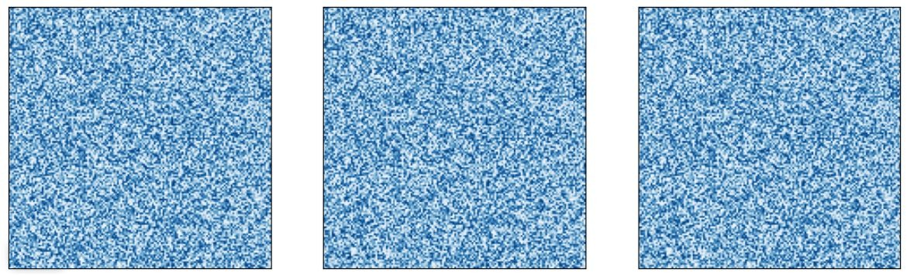
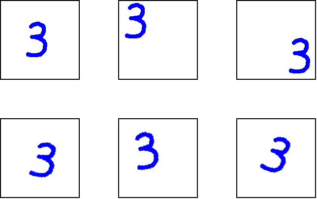
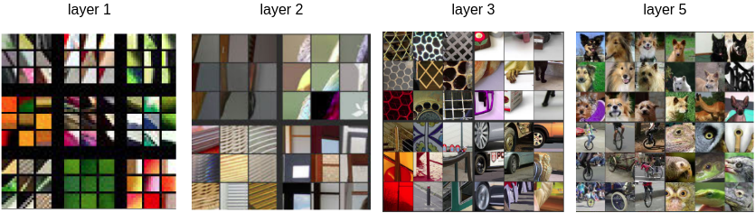

# Обучение представлений

## Понятие представлений

Извлечение сложных высокоуровневых признаков, позволяющих компактно описать сложные зависимости в данных, называется **обучением представлений** (representation learning) и представляет собой ключ к успешному применению моделей глубокого обучения. Эта задача родственна исследованиям по ручной генерации информативных признаков в классическом машинном обучении (feature engineering), но параметры генерации находятся не вручную, а настраиваются автоматически по данным.

> Много исследований посвящено подбору таких нейросетевых архитектур,которые бы опирались в своей работе на более качественные промежуточные представления. Одна из топовых конференций по глубокому обучению так и называется: International Conference on Learning Representations (ICLR [[1]](https://iclr.cc/)).

Моделирование представлений мотивируется тем, что реальные объекты заполняют не всё признаковое пространство, а сосредоточены на некотором маломерном многообразии (low dimensional manifold) в этом пространстве за счёт чего эффективно и компактно представляются методами нелинейного снижения размерности [[2]](https://en.wikipedia.org/wiki/Nonlinear_dimensionality_reduction). 

## Пример

Рассмотрим пример одноцветных изображений рукописных цифр в разрешении 150x150 и градациях синего цвета. Эти изображения представляются в виде матрицы интенсивностей, поэтому размерность признакового пространства $D=150^2=22500$, т.е. достаточно велика. Ниже показаны случайные объекты из этого пространства:

Как видим, случайные изображения совсем не похожи на изображения рукописных цифр! 

Сканы рукописных цифр <u>занимают лишь малую часть пространства признаков</u> и лежат на маломерном многообразии (нелинейной поверхности небольшой размерности) внутри пространства признаков. 

На примере цифры 3 ниже можно предположить, что размерность этого многообразия невелика, а координаты в нём отвечают изменению расположения цифры и угла поворота. Также могут быть дополнительные степени свободы, отвечающие крупности цифры, жирности шрифта и манере написания. 

В любом случае, размерность многообразия рукописных цифр невелика, и нейросети достигают отличных результатов в их распознавании за счёт <u>явного моделирования этого многообразия промежуточными слоями</u>.

## Извлекаемые признаки

Рассмотрим задачу классификации объектов на изображениях. Исследования по визуализации нейронов, такие как [[2]](https://arxiv.org/pdf/1311.2901.pdf), показывают, что первые слои [свёрточной нейросети](../ConvPool-Images/Conv-net) детектируют изменения цветов в определённом направлении, а последующие слои извлекают всё более и более сложные паттерны, как показано ниже [[2]](https://arxiv.org/pdf/1311.2901.pdf):

## Литература

1. [International Conference on Learning Representations.](https://iclr.cc/)
2. [Wikipedia: Nonlinear dimensionality reduction.](https://en.wikipedia.org/wiki/Nonlinear_dimensionality_reduction)
3. [Zeiler M. D., Fergus R. Visualizing and understanding convolutional networks //Computer Vision–ECCV 2014: 13th European Conference, Zurich, Switzerland, September 6-12, 2014, Proceedings, Part I 13. – Springer International Publishing, 2014. – С. 818-833.](https://arxiv.org/abs/1311.2901)
