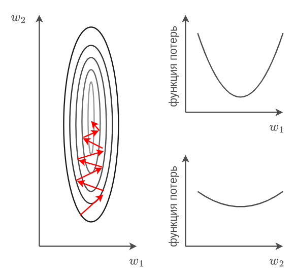

# Оптимизаторы с переменным шагом

Проблемой [стандартных градиентных методов оптимизации](Opt-methods-fixed-lr), таких как стохастический градиентный спуск (SGD) или стохастический градиентный спуск с инерцией (SGD+momentum), является то, что они устанавливают <u>одинаковый</u> шаг обучения $\eta$ (learning rate) вдоль всех направлений в пространстве настраиваемых весов нейросети. Это не оптимально, поскольку 

- вдоль одних направлений функция потерь изменяется резко и быстро, поэтому, во избежание расходимости, нужно выбирать малый шаг обучения;

- вдоль других направлений функция потерь меняется более плавно и постепенно, и шаг обучения нужно выбрать побольше, чтобы ускорить сходимость.

Пример функции потерь с разной скоростью изменений вдоль направлений $w_1$ и $w_2$ показан на рисунке ниже вместе с разрезами вдоль каждой из осей:

Методы с единым шагом обучения приходится запускать с малым шагом обучения, чтобы гарантировать сходимость вдоль направлений быстрого изменения функции, что, в свою очередь, делает сходимость очень медленной вдоль плавно меняющихся направлений.

Идея улучшения методов оптимизации для настройки нейросетей заключается в независимом подборе своей скорости изменений весов вдоль каждой оси в пространстве весов.

> Например, на рисунке выше имеет смысл шаг обучения вдоль оси $w_1$ выбрать поменьше, а вдоль оси $w_2$ - побольше.

:::tip В действительности всё сложнее...

В общем случае направления, вдоль которых функция потерь меняется быстро и медленно, определяются не осями координат, а направлениями собственных векторов [матрицы Гессе](https://ru.wikipedia.org/wiki/%D0%93%D0%B5%D1%81%D1%81%D0%B8%D0%B0%D0%BD_%D1%84%D1%83%D0%BD%D0%BA%D1%86%D0%B8%D0%B8) функции потерь (матрицы, состоящей из всевозможных производных второго порядка потерь по весам). Тем не менее, даже адаптация скорости сходимости вдоль осей существенно повышает скорость сходимости!

:::

Предлагается динамически подстраивать шаг обучения вдоль каждой оси под скорость изменения функции, оценивая эту скорость квадратом частной производной функции потерь вдоль соответствующей оси.

Далее будут описаны основные методы, реализующие эту идею.

## Метод AdaGrad

Метод **AdaGrad** [[1]](https://www.jmlr.org/papers/volume12/duchi11a/duchi11a.pdf) производит изменение каждого веса $w_i$ вектора весов $\mathbf{w}\in\mathbb{R}^K$ по следующим формулам:

$$
\begin{aligned}
g_i^t &= g_i^{t-1}+\left(\frac{\partial \mathcal{L}_{n:n+B-1}(\mathbf{w})}{\partial w_i}\right)^2, \\
w^t_i &= w^t_i-\frac{\eta}{\sqrt{g^t_i}+\delta}\left(\frac{\partial \mathcal{L}_{n:n+B-1}(\mathbf{w})}{\partial w_i}\right), 
\end{aligned}
$$

где 

- $t$ - номер итерации;

- $i$ - номер параметра (оси), вдоль которого производится оптимизация;

- $K$ - число настраиваемых весов сети;

- $\delta=10^{-8}$ - фиксированное смещение, чтобы избежать деления на ноль;

- $\mathcal{L}_{n:n+B-1}(\mathbf{w})$ - средние потери по [мини-батчу объектов](Opt-methods-fixed-lr#стохастический-градиентный-спуск-по-мини-батчам) $n,n+1,...n+B-1$.

## Метод RMSprop

В методе AdaGrad квадрат градиента кумулятивно накапливается в нормировке $g^t_i$. Это решение обладает следующим недостатком: если в начале оптимизации функция потерь менялась резко, а потом стала меняться плавно, то $g^t_i$ всё равно будет оставаться большим, замедляя сходимость. 

Метод **RMSprop** (root mean square propagation, [[2]](https://www.cs.toronto.edu/~tijmen/csc321/slides/lecture_slides_lec6.pdf)) лишён этого недостатка за счёт усреднения квадрата градиента [экспоненциальным сглаживанием](../../Machine-learning/Numerical-optimization/Monitoring#экспоненциальное-сглаживание), за счёт которого  большие по величине градиенты в начале оптимизации будут забываться экспоненциально быстро. 

Обновление каждого вектора весов $w_i$ для $i=1,2,...K$ будет производиться по формулам:

$$
\begin{aligned}
g_i^t &= \beta g_i^{t-1}+(1-\beta)\left(\frac{\partial \mathcal{L}_{n:n+B-1}(\mathbf{w})}{\partial w_i}\right)^2 \\
w^t_i &= w^t_i-\frac{\eta}{\sqrt{g^t_i}+\delta}\left(\frac{\partial \mathcal{L}_{n:n+B-1}(\mathbf{w})}{\partial w_i}\right) 
\end{aligned}
$$

> Гиперпараметр $\beta\in(0,1)$ отвечает за длину истории, по которой копится квадрат градиента, и обычно выбирается равным $\beta=0.9$.

## Метод Adam

Метод **Adam** (adaptive moments, [[3]](https://arxiv.org/abs/1412.6980)) совмещает метод RMRprop с [внесением инерции](./Opt-methods-fixed-lr#стохастический-градиентный-спуск-с-инерцией) (momentum) и является самым популярным методом настройки нейросетей.

Обновление каждого веса $w_i$ для $i=1,2,...K$ производится по следующим формулам:

$$
\begin{aligned}
s_i^t &= \beta_1 s_i^{t-1}+(1-\beta_1)\left(\frac{\partial \mathcal{L}_{n:n+B-1}(\mathbf{w})}{\partial w_i}\right) \\
g_i^t &= \beta_2 g_i^{t-1}+(1-\beta_2)\left(\frac{\partial \mathcal{L}_{n:n+B-1}(\mathbf{w})}{\partial w_i}\right)^2 \\
\hat{s}^t_i &= \frac{s^t_i}{1-\beta_1^t}  \\
\hat{g}^t_i &= \frac{g^t_i}{1-\beta_2^t}  \\
w^t_i &= w^t_i-\frac{\eta}{\sqrt{\hat{g}^t_i}+\delta}\hat{s}_i^t
\end{aligned}
$$

Перенормировка $s_i^t$ и $g_i^t$ осуществляется, чтобы избежать смещения оценок, вызванных начальной инициализацией $s_i^0=g_i^0=0$. 

Обычно гиперпараметры $\beta_1,\beta_2\in (0,1)$ берут равными

$$
\beta_1 = 0.9,\quad \beta_2=0.99
$$

Псевдокод метода представлен ниже для векторов $\mathbf{d},\mathbf{s},\mathbf{g},\hat{\mathbf{s}},\hat{\mathbf{g}},\mathbf{w}$:

> перемешать объекты выборки
> 
> инициализировать $\mathbf{w}$ случайно
> 
> $n:=1$
> 
> $\mathbf{s}:=\mathbf{0}$    # вектор из нулей 
> 
> $\mathbf{g}:=\mathbf{0}$   # вектор из нулей
> 
> ПОВТОРЯТЬ
> 
>     $\mathbf{d} := \nabla_\mathbf{w} \mathcal{L}_{n:n+B-1}(\mathbf{w})$
> 
>     $\mathbf{s}:=\beta_1\mathbf{s}+(1-\beta_1)\mathbf{d}$
> 
>     $\mathbf{g}:=\beta_2 \mathbf{g}+(1-\beta_2)\mathbf{d}\odot \mathbf{d}$ 
> 
>     $\hat{\mathbf{s}}:=\mathbf{s}/(1-\beta_1^t)$
> 
>     $\hat{\mathbf{g}}:=\mathbf{g}/(1-\beta_2^t)$
> 
>     $\mathbf{w}:=\mathbf{w}-\frac{\eta}{\sqrt{\mathbf{g}}+\delta}\odot\hat{\mathbf{s}}$
> 
>     $n:=n+1$
> 
>     ЕСЛИ $n>N$:
> 
>         перемешать объекты выборки
> 
>         $n:=1$
> 
> ДО СХОДИМОСТИ

В псевдокоде $\odot$ обозначает поэлементное перемножение векторов, а извлечение корня из вектора $\mathbf{g}$ и деление на него также происходит поэлементно.

## Литература

1. [Duchi J., Hazan E., Singer Y. Adaptive subgradient methods for online learning and stochastic optimization //Journal of machine learning research. – 2011. – Т. 12. – №. 7.](https://www.jmlr.org/papers/volume12/duchi11a/duchi11a.pdf)

2. [Hinton, G. E. 2012. Neural Networks for Machine Learning. Lecture 6.5. Coursera Lectures.](https://www.cs.toronto.edu/~tijmen/csc321/slides/lecture_slides_lec6.pdf)

3. [Kingma D. P., Ba J. Adam: A method for stochastic optimization //arXiv preprint arXiv:1412.6980. – 2014.](https://arxiv.org/abs/1412.6980)
