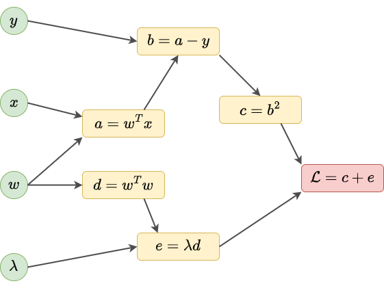
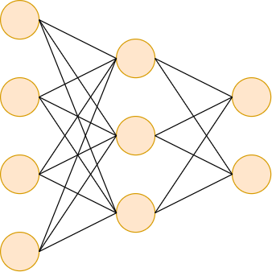
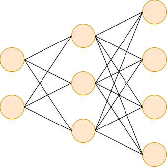
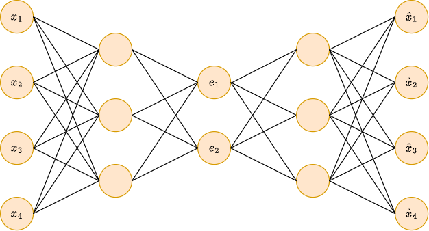

# Автоматическое дифференцирование

[Градиентные методы](Opt-methods-fixed-lr) настройки нейросетей основаны на вычислении градиента $\nabla L(\mathbf{w})$ от функции потерь. Для эффективного обучения нейросетей, вычисление градиента должно производиться 

- точно

- и вычислительно эффективно.

Для этого используются **методы автоматического дифференцирования** - forward mode и backward mode. Второй метод также называется **методом обратного распространения ошибки** (backpropagation) и является <u>основным методом настройки нейросетей</u>.

Вначале же для полноты картины рассмотрим какие другие подходы мы могли бы применить для вычисления градиента функции.

## Дифференцирование напрямую

Градиент можно вычислять вручную и программно реализовывать расчёт найденных производных. Этот подход можно автоматизировать, воспользовавшись библиотеками символьного дифференцирования, такими как SymPy [[1]](https://www.sympy.org/en/index.html) и SymEngine [[2]](https://symengine.org/index.html). Это быстрее и избавит нас от потенциальных ошибок при вычислении производных.

В результате мы получим точное значение градиента. Недостатком подхода является сильное разрастание формул, по которым будет вычисляться градиент. 

> Рассмотрим нахождение производной по скаляру $w$ от функции $A(w)B(w)C(w)$. 
> 
> Производная будет:
> 
> $$
> \left[A(w)B(w)C(w)\right]'=A'(w)B(w)C(w)+A(w)B'(w)C(w)+A(w)B(w)C'(w),
> $$
> 
> в которой потребуется <u>многократное повторное вычисление функций</u> $A(w),B(w),C(w)$, что неэффективно.

Если подобные операции возникают на каждом слое нейросети, то это приведёт к ещё большему разрастанию объёма повторяемых неэффективных вычислений!

## Численная аппроксимация

Градиент можно находить, используя численное приближение производных:

$$
\nabla L(\mathbf{w})=\begin{bmatrix}
           \frac{\partial L(\mathbf{w})}{\partial w_1} \\
           \frac{\partial L(\mathbf{w})}{\partial w_2} \\
           \vdots \\
           \frac{\partial L(\mathbf{w})}{\partial w_K} \\
         \end{bmatrix}
\approx 
\begin{bmatrix}
           \frac{L(\mathbf{w}+\Delta_1 \mathbf{w})-L(\mathbf{w})}{\varepsilon} \\
           \frac{L(\mathbf{w}+\Delta_2 \mathbf{w})-L(\mathbf{w})}{\varepsilon} \\
           \vdots \\
           \frac{L(\mathbf{w}+\Delta_K \mathbf{w})-L(\mathbf{w})}{\varepsilon} \\
         \end{bmatrix}
$$

В формуле вектор $\Delta_i \mathbf{w} = [0,...0,0,\varepsilon,0,...0]$ содержит малую константу $\varepsilon$ на $i$-й позиции. Этот подход избавлен от ошибок дифференцирования, но даст лишь <u>приближённое</u> значение производных. Также он вычислительно неэффективен, поскольку требует $K+1$ прохода по нейросети:

- один проход для вычисления $L(\mathbf{w})$

- $K$ проходов для вычислений $\Delta_i \mathbf{w}),\; i=1,2,...K.$ 

Поскольку стоимость одного прохода вперёд по сети имеет порядок $O(K)$, то общая сложность вычисления всего градиента - $O(K^2)$, что весьма много для современных нейросетей, имеющих миллионы настраиваемых параметров.

## Автоматическое дифференцирование

### Идея

Вычислить производные можно точно и эффективно как по объёму вычислений, так и по памяти, используя **методы автоматического дифференцирования** (automatic differentiation [[3]](http://www.jmlr.org/papers/v18/17-468.html)). Существуют библиотеки, эффективно реализующие эти методы, используя процессор и видеокарты - это PyTorch [[4]](https://pytorch.org/), Tensorflow [[5]](https://www.tensorflow.org/) и JAX [[6]](https://docs.jax.dev/en/latest/). 

:::tip Задача метода

Цель автоматического дифференцирования - не вывести общую функциональную формулу производной, а <u>уметь быстро вычислять её значение в заданной точке</u>, обладая программным кодом для вычисления дифференцируемой функции.

:::

Расчёт функции потерь $\mathcal{L}(\mathbf{w})$ сопряжён с вычислением суперпозиции большого числа математических преобразований, вызванных как расчётом нейросетевого прогноза, так и вычислением самой функции потерь от него.

### Производная сложной функции

Автоматическое дифференцирование основано на формуле расчёта производной сложной функции [[7]](https://ru.wikipedia.org/wiki/Дифференцирование_сложной_функции), которое для скаляра $w$ будет

$$
\mathcal{L}(w)=A(B(w))
$$

$$
\frac{\partial \mathcal{L}(w)}{\partial w}=\frac{\partial A(B)}{\partial B}\cdot\frac{\partial B(w)}{\partial w}
$$

Для функции 

$$
\mathcal{L}(w)=A(B_1(w),B_2(w),B_3(w))
$$

производная по $w$ будет

$$
\frac{\partial \mathcal{L}(w)}{\partial w}=\frac{\partial A(B_1)}{\partial B_1}\cdot\frac{\partial B_1(w)}{\partial w}+\frac{\partial A(B_2)}{\partial B_2}\cdot\frac{\partial B_2(w)}{\partial w}+\frac{\partial A(B_3)}{\partial B_3}\cdot\frac{\partial B_3(w)}{\partial w}
$$

Поскольку нейросети включают в себя суперпозицию большого числа преобразований, необходимо вычислять производную от большого числа вложенных функций.

Например, для суперпозиции нескольких функций от скаляра $w$:

$$
\mathcal{L}(w)=A(B(C(D(w))))
$$

Последовательное применение формулы дифференцирования сложной функции даст

$$
\frac{\partial \mathcal{L}(w)}{\partial w}=\frac{\partial A(B)}{\partial B}\cdot\frac{\partial B(C)}{\partial C}\cdot\frac{\partial C(D)}{\partial D}\cdot\frac{\partial D(w)}{\partial w}
$$

Функция потерь $\mathcal{L}(\mathbf{w})$  представляет собой суперпозицию большого числа нелинейных преобразований, отвечающих промежуточным вычислениям внутри нейросети, а также вычислению самой функции потерь. Поэтому вычисление функции потерь представляется в виде **графа вычислений** (computational graph), в котором узлами являются промежуточные переменные, необходимые для расчёта, а связи указывают, какие промежуточные переменные от каких зависят. Каждая переменная в графе вычислений - это некоторая простая операция от ранее посчитанных переменных, такая как сумма, разность, тригонометрическая или другая стандартная функция. 

> Главное требование - чтобы для этой функции была аналитически известна функция расчёта градиента.

### Пример

Рассмотрим простейшую нейросеть - линейную регрессию, настраиваемую с $L_2$ регуляризацией:

$$
\begin{aligned}
\hat{y} &= \mathbf{w}^T \mathbf{x} \\
\mathcal{L}(\mathbf{w}) &= (\mathbf{w}^T \mathbf{x}-y)^2+\lambda \mathbf{w}^T \mathbf{w} \\
\end{aligned}
$$

Тогда вычисление $\mathcal{L}(\mathbf{w})$ можно представить в виде следующего вычислительного графа:

Все переменные делятся на три типа:

- входные переменные: $y, \mathbf{x},\mathbf{w}, \lambda$; 

- финальная выходная переменная: $\mathcal{L}$;

- промежуточные переменные: $a,b,c,d,e$.

Нас интересует расчёт градиента $\nabla_\mathbf{w}\mathcal{L}(\mathbf{w})$.

Вычислять его можно двумя способами:

- в **режиме прохода вперёд** (forward-mode).

- в **режиме прохода назад** (backward-mode).

### Forward-mode

Рассмотрим эффективный расчёт градиента функции потерь методом **forward-mode**.

Он основан только на **проходе вперёд** (forward pass) по графу, при котором вычисляются не только значения промежуточных переменных графа, но и <u>производные каждой промежуточной переменной по вектору весов сети</u> $\mathbf{w}$. В каждую найденную производную подставляются значения промежуточных переменных графа, от которых она зависит, в результате чего сразу получаем промежуточное *значение производной*. Значение производной по финальной переменной и есть целевой градиент.

### Пример использования forward-mode

Рассмотрим вычисление потерь

$$
\mathcal{L}(\mathbf{w}) = (\mathbf{w}^T \mathbf{x}-y)^2+\lambda \mathbf{w}^T \mathbf{w}
$$

Построим по ней вычислительный граф:

Пусть нам нужно вычислить $\nabla_\mathbf{w} \mathcal{L}(\mathbf{w})$ при

$$
y=0,\; \mathbf{x}=[1,2],\; \mathbf{w}=[3,4],\; \lambda=5
$$

При проходе вперёд по графу вычислений получаем следующие значения промежуточных переменных:

$$
\begin{aligned}
a &= 3+8=11 \\
b &= a-y=11 \\
c &= b^{2}=121 \\
d &= 9+16=25 \\
e &= \lambda d=125 \\
\mathcal{L} &=c+e=121+125=246
\end{aligned}
$$

Но <u>одновременно при проходе вперёд вычисляются и производные по целевой переменной</u> (вектору весов $\mathbf{w}$):

$$
\frac{\partial a}{\partial \mathbf{w}}=x=[1,2]
$$

$$
\frac{\partial d}{\partial \mathbf{w}}=2\mathbf{w}=[6,8]
$$

$$
\frac{\partial b}{\partial \mathbf{w}}=\frac{\partial b(a)}{\partial \mathbf{w}}=\frac{\partial b}{\partial a}\frac{\partial a}{\partial \mathbf{w}}=1\cdot[1,2]=[1,2]
$$

$$
\frac{\partial e}{\partial \mathbf{w}}=\frac{\partial e(d)}{\partial \mathbf{w}}=\frac{\partial e}{\partial d}\frac{\partial d}{\partial \mathbf{w}}=\lambda\cdot[6,8]=[30,40]
$$

$$
\frac{\partial c}{\partial \mathbf{w}}=\frac{\partial c(b)}{\partial \mathbf{w}}=\frac{\partial c}{\partial b}\frac{\partial b}{\partial \mathbf{w}}=2b\cdot[1,2]=22\cdot[1,2]=[22,44]
$$

$$
\frac{\partial\mathcal{L}}{\partial \mathbf{w}}=\frac{\partial\mathcal{L}(c,e)}{\partial \mathbf{w}}=\frac{\partial\mathcal{L}}{\partial c}\frac{\partial c}{\partial \mathbf{w}}+\frac{\partial\mathcal{L}}{\partial e}\frac{\partial e}{\partial \mathbf{w}}=1\cdot[22,44]+1\cdot[30,40]=[52,84]
$$

Градиент равен 2-мерному вектору, поскольку представляет вектор из частных производных 

$$
\left[ \frac{\partial\mathcal{L}}{\partial w_{1}},\frac{\partial\mathcal{L}}{\partial w_{2}}\right ]
$$

### Backward-mode (обратное распространение ошибки)

Теперь рассмотрим другой способ эффективного расчёта градиента потерь по весам нейросети - **backward-mode**.

:::tip Метод обратного распространения ошибки

Этот метод также называется **методом обратного распространения ошибки** (backpropagation, backprop) и является <u>основным методом для настройки весов нейросети</u>.

:::

Этот метод состоит из двух шагов:

1. **Проход вперёд** (forward pass), на котором итеративно <u>слева-направо</u> вычисляются (и запоминаются!) значения всех промежуточных переменных графа вычислений. Производные по весам при этом <u>не вычисляются</u>.

2. **Проход назад** (backward pass), на котором итеративно <u>справа-налево</u> вычисляются производные текущих переменных графа от более ранних переменных (от которых зависят текущие), <u>как функции</u> от переменных графа вычислений. Далее подставляются значения этих переменных, в результате чего производные вычисляются (и используются) <u>как числа</u>.

### Пример использования backward-mode

Рассмотрим снова вычисление потерь

$$
\mathcal{L}(\mathbf{w}) = (\mathbf{w}^T \mathbf{x}-y)^2+\lambda \mathbf{w}^T \mathbf{w}
$$

Построим по ней вычислительный граф:

Пусть, как и раньше, нам нужно вычислить $\nabla_\mathbf{w} \mathcal{L}(\mathbf{w})$ при

$$
y=0,\; \mathbf{x}=[1,2],\; \mathbf{w}=[3,4],\; \lambda=5
$$

При **проходе вперёд** (forward pass) по графу вычислений получаем следующие значения промежуточных переменных:

$$
\begin{aligned}
a &= 3+8=11 \\
b &= a-y=11 \\
c &= b^{2}=121 \\
d &= 9+16=25 \\
e &= \lambda d=125 \\
\mathcal{L} &=c+e=121+125=246
\end{aligned}
$$

Эти переменные запоминаются для использования при **проходе назад** (backward pass), в которых рекуррентно вычисляются производные итоговых потерь по промежуточным переменным графа от более поздних к более ранним (справа-налево). 

Продемонстрируем работу прохода назад:

$$
\frac{\partial\mathcal{L}}{\partial c}=1,\quad\frac{\partial\mathcal{L}}{\partial e}=1
$$

$$
\frac{\partial\mathcal{L}}{\partial b}=\frac{\partial\mathcal{L}(c)}{\partial b}=\frac{\partial\mathcal{L}}{\partial c}\frac{\partial c}{\partial b}=1\cdot2b=22
$$

$$
\frac{\partial\mathcal{L}}{\partial d}=\frac{\partial\mathcal{L}(e)}{\partial d}=\frac{\partial\mathcal{L}}{\partial e}\frac{\partial e}{\partial d}=1\cdot\lambda=5
$$

$$
\frac{\partial\mathcal{L}}{\partial a}=\frac{\partial\mathcal{L}(b)}{\partial a}=\frac{\partial\mathcal{L}}{\partial b}\frac{\partial b}{\partial a}=22\cdot1=22
$$

$$
\begin{aligned}
\frac{\partial\mathcal{L}}{\partial \mathbf{w}}&=\frac{\partial\mathcal{L}(a,d)}{\partial \mathbf{w}} \\
&=\frac{\partial\mathcal{L}}{\partial a}\frac{\partial a}{\partial \mathbf{w}}+\frac{\partial\mathcal{L}}{\partial d}\frac{\partial d}{\partial \mathbf{w}} \\
&=22\cdot \mathbf{x}+5\cdot2\mathbf{w} \\
&=22\cdot[1,2]+5\cdot[6,8] \\
&=[22,44]+[30,40]=[52,84]
\end{aligned}
$$

Как видим, получили тот же результат, что и при режиме forward-mode. 

:::tip Дифференцировать можно не только по весам.

Обратим внимание, что веса ничем принципиально не отличаются от других входных переменных, поэтому мы можем применять тот же алгоритм для вычисления градиента по ним. Например, в первом методе neural style transfer [[8]](https://openaccess.thecvf.com/content_cvpr_2016/html/Gatys_Image_Style_Transfer_CVPR_2016_paper.html) использовался градиент по входному изображению, а не весам нейросети!

:::

### Сравнение forward-mode и backward-mode

Преимуществом forward-mode является то, что и расчёт промежуточных переменных, и расчёт производных производится одновременно всего за один проход (forward pass). Это снижает расходуемый объём памяти, поскольку значения промежуточных переменных достаточно помнить только до их последнего использования, а дальше можно высвобождать память для других вычислений.

Расчёт же градиента методом backward-mode состоит из двух проходов:

1. прохода вперёд, во время которого нужно запомнить значения всех промежуточных переменных;

2. прохода назад, на котором вычисляются производные потерь по промежуточным переменным.

Таким образом, перед проходом назад нужно держать в памяти значения всех промежуточных переменных вычислительного графа, вследствие чего расходы на память у backward-mode увеличиваются.

Если рассматривать расходы на вычисления, то для сужающегося вычислительного графа, как на рисунке ниже, эффективнее backward-mode:

Мы это видели в примере, где для forward-mode все операции были векторными, поскольку forward-mode требовал отдельных вычислений для каждого веса. В backward-mode большая часть операций была над числами, и лишь в конце появились векторные операции.

Для расширяющегося же графа вычислений, как на рисунке ниже, вычислительно эффективнее forward-mode:

:::tip Итоговая рекомендация

На практике обычно работают с архитектурами с <u>сужающимся графом вычислений</u>, которые в конце упираются в единственную скалярную функцию потерь. Поэтому при их настройке используют backward-mode, называемый также **методом обратного распространения ошибки**.

:::

## Пример совмещения forward-mode и backward-mode

Бывают случаи, когда вычислительно эффективно совместить методы forward-mode и backward-mode. Рассмотрим следующую архитектуру:

Пусть нам нужно вычислить изменчивость выходов по отношению ко входам, то есть матрицу $\partial\widehat{\mathbf{x}} / \partial \mathbf{x}$.

Как видим, 

- вначале граф вычислений <u>сужается</u>, когда $\mathbf{x}$ переводится в промежуточное пространство эмбеддингов $\mathbf{e}$; 

- затем граф <u>расширяется</u>, когда из эмбеддингов $\mathbf{e}$ мы вычисляем выходы $\widehat{\mathbf{x}}$.

По формуле производной сложной функции имеем:

$$
\frac{\partial\widehat{\mathbf{x}}}{\partial \mathbf{x}}=\frac{\partial\widehat{\mathbf{x}}(\mathbf{e})}{\partial \mathbf{x}}=\frac{\partial\widehat{\mathbf{x}}}{\partial \mathbf{e}}\frac{\partial \mathbf{e}}{\partial \mathbf{x}}
$$

Тогда производные $\partial \mathbf{e} / \partial \mathbf{x}$ эффективнее посчитать через backward-mode, а $\partial\widehat{\mathbf{x}} / \partial \mathbf{e}$ - через forward mode!

---

В [[9]](https://neerc.ifmo.ru/wiki/index.php?title=Обратное_распространение_ошибки) приведён псевдокод для метода обратного распространения ошибки в общем виде. Для более детального ознакомления с представленными методами рекомендуется учебник [[10]](https://www.bishopbook.com/). 

## Литература

1. [Библиотека SymPy.](https://www.sympy.org/en/index.html) 

2. [Библиотека SymEngine.](https://symengine.org/index.html)

3. [Baydin A. G. et al. Automatic differentiation in machine learning: a survey //Journal of machine learning research. – 2018. – Т. 18. – №. 153. – С. 1-43.](http://www.jmlr.org/papers/v18/17-468.html)

4. [Библиотека PyTorch.](https://pytorch.org/)

5. [Библиотека Tensorflow.](https://www.tensorflow.org/)

6. [Библиотека JAX.](https://docs.jax.dev/en/latest/)

7. [Wikipedia: Дифференцирование сложной функции.](https://ru.wikipedia.org/wiki/Дифференцирование_сложной_функции)

8. [Gatys L. A., Ecker A. S., Bethge M. Image style transfer using convolutional neural networks //Proceedings of the IEEE conference on computer vision and pattern recognition. – 2016. – С. 2414-2423.](https://openaccess.thecvf.com/content_cvpr_2016/html/Gatys_Image_Style_Transfer_CVPR_2016_paper.html)

9. [Викиконспекты ИТМО: Обратное распространение ошибки.](https://neerc.ifmo.ru/wiki/index.php?title=Обратное_распространение_ошибки)

10. [Bishop C. M., Bishop H. Deep learning: Foundations and concepts. – Springer Nature, 2023.](https://www.bishopbook.com/)
