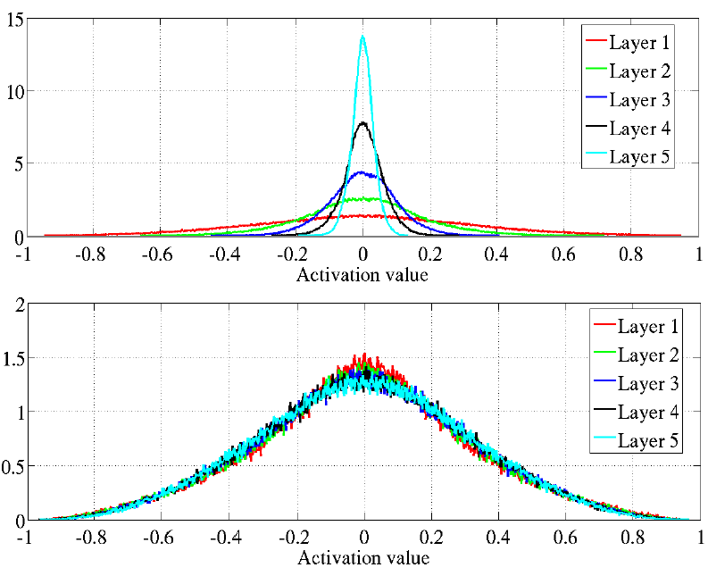
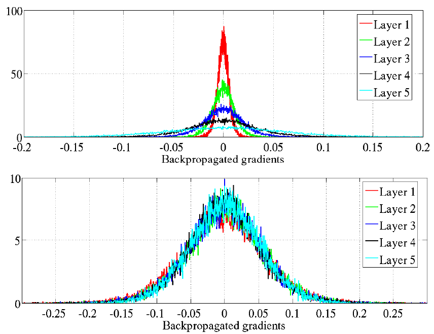
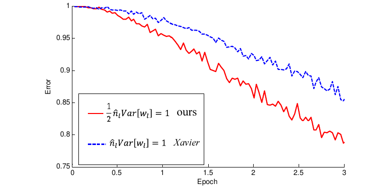

# Инициализация

Перед началом обучения нейросети необходимо случайно инициализировать её веса. 

:::tip Важность случайной инициализации

Инициализировать начальные значения весов нужно именно <u>случайно</u>, а не одинаковыми константами, иначе для симметрично расположенных нейронов с одинаковыми весами на каждом шаге оптимизации вследствие симметрии архитектуры они будут изменяться синхронно на одинаковую величину, и <u>нейроны будут извлекать одинаковые признаки</u>!

:::

Обычно веса инициализируют

- из равномерного распределения $w_n\sim U[-\varepsilon,\varepsilon]$, $Var[w_n]=\frac{\varepsilon^2}{3}$

- либо (чаще) из нормального распределения $w_n\sim \mathcal{N}(0,\sigma^2)$, $Var[w_n]=\sigma^2$,

где $\sigma^2$ и $\varepsilon$ малы, а математическое ожидание полагают равными нулю.

Разумная инициализация должна обеспечивать примерную одинаковость дисперсий по слоям нейросети для активаций, а также для градиентов потерь по промежуточным переменным вычислительного графа в [методе обратного распространения ошибки](Backpropagation).

Будем предполагать независимость и одинаковую распределённость активаций.

:::tip Насыщение функций нелинейности

В случае нелинейностей с узкой областью изменений (в районе нуля для активаций Sigmoid, Tangh, HardTanh, SoftSign) нужно дополнительно обеспечивать малость дисперсий активаций за счёт уменьшения дисперсии входных признаков и начальных значений весов. В этом случае функции нелинейности не будут выходить на насыщение, и нейроны (по крайней мере, в начале обучения) будут настраиваться на невырожденные признаки.

:::

## Нечётные функции нелинейности

Рассмотрим случай **нечётных** функций нелинейности, то есть удовлетворяющих свойству:

$$
g(-u) = -g(u)
$$

Среди [рассмотренных функций](../MLP/Activation-functions) этому свойству будут удовлетворять нелинейности Tanh, HardTanh и SoftSign.

Рассмотрим [нейрон](../MLP/Neuron-model) скрытого [слоя](../MLP/Multilayer-perceptron) с выходом $y=g(s)$, где

$$
s=\sum_{n=1}^{N_{in}} w_n z_n,
$$

а $N_{in}$ - число нейронов предыдущего слоя, $\{z_n\}_n$ - их активации, а смещение не пишем, поскольку инициализируем его нулём.

Обратим внимание, что если $\mathbb{E}w_n=0$ и $\mathbb{E}z_n=0$, то 

$$
\begin{aligned}
\mathbb{E}s &= \mathbb{E}\left\{ \sum_{n=1}^{N_{in}} w_n z_n \right\} \\
&=\sum_{n=1}^{N_{in}} \mathbb{E}\left\{  w_n z_n \right\}\\
&=\sum_{n=1}^{N_{in}} \mathbb{E}\{w_n\} \mathbb{E} \{ z_n \}=0,
\end{aligned}
$$

где в последнем переходе мы воспользовались независимостью случайных величин $z_n$ и $w_n$.

В силу нечётности функции нелинейности,

$$
\mathbb{E}\{y\} = \mathbb{E}\{g(s)\} = 0
$$

Таким образом, если входные признаки <u>отцентрированы</u> (имеют нулевое мат. ожидание), то нулевым мат. ожиданием будут обладать и полученные от них активации, а следовательно, по индукции, и активации всех последующих слоёв, если мы используем нечётные функции нелинейности.

## Калиброванная случайная инициализация

Если рассматриваем нейрон первого скрытого слоя, то $z_1,...z_{N_{in}}$ - входные признаки. Отнормируем эти признаки, чтобы они имели нулевое среднее и единичную дисперсию. По формуле [дисперсии произведения](https://en.wikipedia.org/wiki/Variance#Product_of_independent_variables) имеем:

$$
\begin{aligned}
Var[w_n z_n] &= \mathbb{E}[w_n]^2 Var[z_n]+Var[w_n] \mathbb{E}[z_n]^2+Var[w_n]Var[z_i] \\
&= Var[w_n]Var[z_n],
\end{aligned}
$$

где 

- $\mathbb{E}[w_i]^2 Var[z_i]=0$, поскольку мы так инициализируем веса, что $\mathbb{E}[w_i]=0$.

- $Var[w_i] \mathbb{E}[z_i]^2=0$, поскольку $\mathbb{E}[z_i]=0$, вследствие того, что начальные признаки отцентрированы (имеют нулевое среднее), а линейный слой с симметричными функциями нелинейности сохраняет свойство нулевых мат. ожиданий для последующих активаций. 

При нормализации входных признаков они все будут иметь нулевое мат. ожидание и дисперсию 1. 

Все веса на заданном слое инициализируются случайно с одинаковой дисперсией $Var[w_n]$. Веса генерируются независимо от входов $z_n$. Предположим также, что входы - независимые случайные величины и имеют одинаковую дисперсию $Var[z_n]$. Тогда:

$$
Var[y] \approx Var[s] = N_{in} Var[w_n] Var[z_n]
$$

$Var[y] \approx Var[s]$, поскольку веса инициализируются малыми числами, поэтому суммарный вход $s$ также мал, а для малых значений нелинейности Tanh, HardTanh и SoftSign примерно равны тождественной функции нелинейности:

$$
g(u)\approx u
$$

Входы $z_n$ в общем случае будут иметь различающиеся дисперсии, но если мы стандартизуем входные признаки (входы нулевого слоя нейросети), чтобы они имели одинаковую дисперсию, а дисперсию весов будем выбирать равной

$$
Var[w_n]=\frac{1}{N_{in}}, \tag{1}
$$

то дисперсии выходов слоя также будут равны единице и далее, по индукции, будут примерно равны единице и выходы всех последующих слоёв сети.

:::tip Отклонения от (1)

Если $Var[w_n]>\frac{1}{N_{in}}$, то дисперсии активаций будут возрастать с номером слоя, а если 

$Var[w_n]<\frac{1}{N_{in}}$ - то убывать.

:::

Инициализация весов, используя (1), называется **калиброванной случайной инициализацией** (calibrated random initialization).

- Если $w_n\sim U[-\varepsilon,\varepsilon]$, то $Var[w_n]=\frac{\varepsilon^2}{3}$, следовательно, $\varepsilon=\sqrt{\frac{3}{N_{in}}}$.

- Если $w_n\sim \mathcal{N}(0,\sigma^2)$, то $\sigma^2=\frac{1}{N_{in}}$.

## Инициализация Ксавьера

Если рассматривать не дисперсии активаций при проходе вперёд, а дисперсии градиентов при проходе назад в [методе обратного распространения ошибки](Backpropagation), то те же самые рассуждения для сохранения дисперсии градиентов по промежуточным переменным вычислительного графа приведут к требованию

$$
Var[w_n]=\frac{1}{N_{out}}, \tag{2}
$$

где $N_{out}$ - число выходов линейного слоя.

В работе [[1]](https://proceedings.mlr.press/v9/glorot10a) предложено находить компромисс между сохранением дисперсий активаций (1) и сохранением дисперсий градиентов (2), беря среднее гармоническое между ними:

$$
Var[w_n]=\frac{1}{\frac{1}{2}(1/\frac{1}{N_{in}}) + \frac{1}{2}(1/\frac{1}{N_{out}})}=\frac{2}{N_{in}+N_{out}}
$$

- Если $w_n\sim U[-\varepsilon,\varepsilon]$, то $Var[w_n]=\frac{\varepsilon^2}{3}$, следовательно $\varepsilon=\frac{\sqrt{6}}{\sqrt{N_{in}+N_{out}}}$.

- Если $w_n\sim \mathcal{N}(0,\sigma^2)$, то $\sigma^2=\frac{2}{N_{in}+N_{out}}$.

Эта инициализация называется **инициализацией Ксавьера** (Xavier initialization,  известная также как Glorot initialization, поскольку автор Glorot Xavier).

Ниже показано сравнительное распределение активаций (при прямом проходе, activation value) и градиентов (при обратном проходе, backpropagated gradients) для инициализации весов $w_n\sim U[-\varepsilon,\varepsilon]$ для $\varepsilon=1/\sqrt{N_{in}}$ и $\varepsilon=\sqrt{6}/\sqrt{N_{in}+N_{out}}$ вверху и внизу каждого из изображений.

Распределение активаций на разных слоях будет иметь вид [[1]](https://proceedings.mlr.press/v9/glorot10a):

А распределение градиентов на разных слоях будет следующим [[1]](https://proceedings.mlr.press/v9/glorot10a):

Из-за отсутствия множителя $\sqrt{6}$ в калиброванной случайной инициализации распределение активаций сужается при переходе к более поздним слоям (изображение 1), а распределение градиентов, наоборот, расширяется (изображение 3). При инициализации Ксавьера оба распределения сохраняют стабильность по слоям (изображения 2 и 4).

:::tip Инициализация сложных архитектур

Рекомендуется строить графики распределения активаций и градиентов при настройке новых сложных архитектур для контроля стабильности обучения.

:::

## Инициализация Хе

**Инициализация весов Хе** (He initialization, также известная как Kaiming initialization, поскольку автор Kaiming He) была предложена в работе [[2]](https://openaccess.thecvf.com/content_iccv_2015/html/He_Delving_Deep_into_ICCV_2015_paper.html) и рассматривает случай ReLU и Leaky ReLU функций нелинейности. Они сложнее, чем симметричные нелинейности, поскольку $\mathbb{E}z\ne 0$. Например, для ReLU всегда $\mathbb{E}z\ge 0$.

Рассмотрим нейрон в промежуточном слое с выходом

$$
y=\text{ReLU}(s),
$$

$$
s=\sum_{n=1}^{N_{in}} w_n z_n,
$$

$$
z_n=\text{ReLU}(s_n^{prev}),
$$

где $N_{in}$ - число нейронов предыдущего слоя, а $s_n^{prev}$ - сумма активаций ещё более раннего слоя, формирующая активацию нейрона $z_n$. 

Смещение, как и прежде, инициализируем нулём.

Используя генерацию весов с нулевым мат. ожиданием ($\mathbb{E}w_n=0$) и свойство

$$
Var[z_n]=\mathbb{E} [ z_n^2 ] - \mathbb{E} [ z_n ]^2,
$$

получим:

$$
\begin{aligned}
Var[w_n z_n] &= \mathbb{E}[w_n]^2 Var[z_n]+Var[w_n] \mathbb{E}[z_n]^2+Var[w_n]Var[z_i] \\
&= Var[w_n] \mathbb{E}[z_n]^2+Var[w_n]Var[z_n] \\
&= Var[w_n] (\mathbb{E}[z_n]^2+Var[z_n]) \\
&= Var[w_n] \mathbb{E} [ z_n^2 ]
\end{aligned}
$$

Предполагая независимость входов и весов,

$$
\begin{aligned}
Var[s] &= Var[\sum_{n=1}^{N_{in}} w_n z_n] = \sum_{n=1}^{N_{in}} Var[w_n z_n] \\
&= N_{in} Var[w_n] \mathbb{E} [ z_n^2 ] = \frac{1}{2} N_{in} Var[w_n] \mathbb{E} [ (s_n^{prev})^2 ],
\end{aligned}
$$

где мы воспользовались симметрией распределения $s^{prev}_n$ (как функции от весов с симметрично распределёнными весами относительно нуля), у которого половина отрезается нелинейностью ReLU:

$$
\mathbb{E} [ z_n^2 ]=\mathbb{E} [ \text{ReLU}(s^{prev}_n)^2 ]=\frac{1}{2} \mathbb{E} [(s^{prev}_n)^2]
$$

Таким образом, чтобы сохранить дисперсию $s$ при переходе от предыдущего слоя к текущему, необходимо инициализировать веса по правилу:

$$
\frac{1}{2} N_{in} Var[w_n]=1 \quad \Rightarrow \quad Var[w_n]=\frac{2}{N_{in}} \tag{3}
$$

Поэтому веса можно инициализировать из следующих распределений:

- $w_n \sim U[-\frac{\sqrt{6}}{\sqrt{N_{in}}}, \frac{\sqrt{6}}{\sqrt{N_{in}}}];$

- $w_n\sim \mathcal{N}(0,\frac{2}{N_{in}})$.

Инициализация Хе ускоряет обучение глубоких нейронных сетей с функцией нелинейности ReLU [[2]](https://openaccess.thecvf.com/content_iccv_2015/html/He_Delving_Deep_into_ICCV_2015_paper.html):

Для функции активации Leaky ReLU:

$$
h(u)=\max\{ \alpha u; u \},\; \alpha\in (0,1) - \text{гиперпараметр,}
$$

требование по равномерности дисперсии по слоям становится [[2]](https://openaccess.thecvf.com/content_iccv_2015/html/He_Delving_Deep_into_ICCV_2015_paper.html):

$$
\frac{1}{2}(1+\alpha^2) N_{in} Var[w_n]=1 \quad \Rightarrow \quad Var[w_n]=\frac{2}{N_{in}(1+\alpha^2)}
$$

Легко заметить, что полученная формула 

- при $\alpha=0$ (случай ReLU) сводится к (3), 

- при $\alpha=1$ (тождественная нечётная нелинейность) сводится к (1).

## Итог

- Веса сети нужно инициализировать из нормального или равномерного распределения с нулевым мат. ожиданием и малой дисперсией.

- Дисперсия должна быть тем меньше, чем больше нейронов в слое.

- Инициализация Ксавьера используется для слоя с нечётными функциями активации.

- Инициализация Хе используется для слоя с функциями активации ReLU и LeakyReLU.

## Литература

1. [Glorot X., Bengio Y. Understanding the difficulty of training deep feedforward neural networks //Proceedings of the thirteenth international conference on artificial intelligence and statistics. – JMLR Workshop and Conference Proceedings, 2010. – С. 249-256.](https://proceedings.mlr.press/v9/glorot10a)
2. [He K. et al. Delving deep into rectifiers: Surpassing human-level performance on imagenet classification //Proceedings of the IEEE international conference on computer vision. – 2015. – С. 1026-1034.](https://openaccess.thecvf.com/content_iccv_2015/html/He_Delving_Deep_into_ICCV_2015_paper.html)
