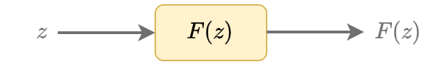
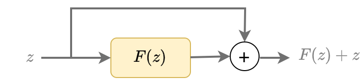
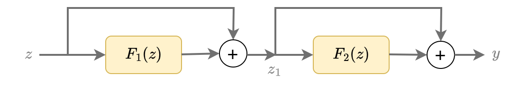
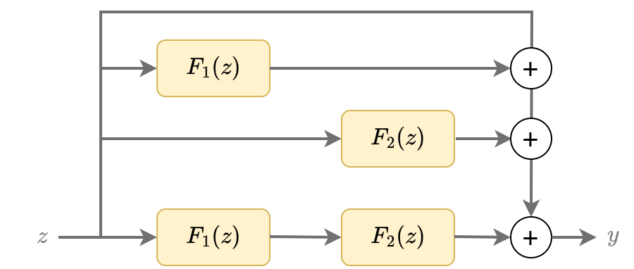
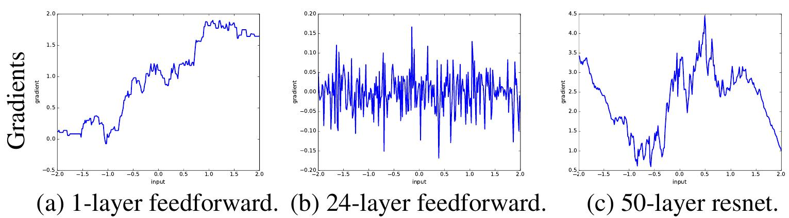
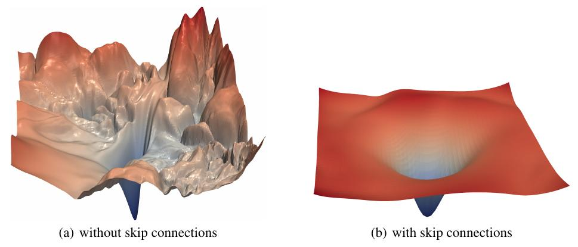

# Остаточный блок

Одним из самых популярных подходов, ускоряющих и упрощающих настройку нейросетей, является внесение в их архитектуру **остаточных блоков** (residual blocks). 

Эта архитектура стала широко известной после работы [[1]](https://openaccess.thecvf.com/content_cvpr_2016/html/He_Deep_Residual_Learning_CVPR_2016_paper.html), в которой остаточные блоки были успешно применены в новой архитектуре [ResNet](../Convolutional-architectures/ResNet) для повышения качества классификации изображений. До этой работы для классификации изображений использовались сети, содержащие 10-20 слоёв, а она позволила решать задачи, используя очень глубокие сети, содержащие 100 слоёв и более. 

> Работа [[1]](https://openaccess.thecvf.com/content_cvpr_2016/html/He_Deep_Residual_Learning_CVPR_2016_paper.html) является одной из самых цитируемой научных работ глубокого обучения!

Рассмотрим, в чём состоит идея остаточного блока.

Обычная нейросетевая архитектура преобразует вход $\mathbf{z}$, применяя к нему некоторую нелинейную функцию $F(\mathbf{z})$:

В **остаточном блоке** предлагается пробросить **тождественную связь** (skip connection, identity connection), не изменяющую вход $\mathbf{z}$, от начала к концу преобразования $F(\mathbf{z})$, а выходом блока сделать сумму входа $\mathbf{z}$ и нелинейного преобразования $F(\mathbf{z})$:

 

Таким образом, нелинейный блок $F(\mathbf{z})$ вычисляет остаток (residual) между желаемым выходом $F(\mathbf{z})+\mathbf{z}$ и входом $\mathbf{z}$.

:::tip Размерность входа и выхода

Из определения остаточного блока, преобразование $F(\mathbf{z})$ должно производить выход той же размерности, что и у входа, чтобы мы их могли сложить.

Это не всегда удобно, поскольку часто необходимо постепенно снижать размерность внутреннего представления, чтобы нейросеть не получилась слишком перепараметризованной. 

Если нужно снизить выходную размерность, то тождественное преобразование заменяется на линейное преобразование $W\mathbf{z}$ (с настраиваемой матрицей весов $W$), приводящее размерность входа к размерности нелинейного выхода $F(\mathbf{z})$ перед суммированием:

$$
\mathbf{y} = F(\mathbf{z})+W\mathbf{z},
$$

:::

:::tip Расположение активаций

Активация ReLU всегда выдаёт неотрицательные значения, а LeakyReLU смещает распределение в сторону неотрицательных значений. Чтобы нелинейный блок $F(\mathbf{z})$ мог как увеличивать, так и уменьшать вход $\mathbf{z}$, последним преобразованием нелинейного блока ставят линейный слой <u>без функции активации</u>, которую переносят в начало следующего нелинейного блока.

:::

На практике используется не один, а сразу несколько подряд идущих остаточных блоков, как показано ниже:

что аналитически записывается как

$$
\begin{aligned}
\mathbf{z}_1&=F_1(\mathbf{z})+\mathbf{z} \\
\mathbf{y}&=F_2(\mathbf{z}_1)+\mathbf{z}_1  \\
\end{aligned}
$$

Эквивалентно это можно записать как

$$
\mathbf{y} = F_2(F_1(\mathbf{z})+\mathbf{z})+F_1(\mathbf{z})+\mathbf{z},
$$

что соответствует одновременной генерации выхода сразу несколькими сетями разной глубины, как показано ниже:

Нейросети, использующие большое количество остаточных блоков, называются **остаточными сетями** (residual networks).

## Преимущества остаточных сетей

### Прогнозирование ансамблем

Как мы видели, применение цепочки остаточных блоков эквивалентно получению результата, опираясь не на одну единственную глубокую сеть, а задействуя целый [ансамбль](../../Machine-learning/Model-ensembles/Model-ensembles) глубоких и неглубоких сетей, что <u>делает прогноз более устойчивым и точным</u>.

### Естественная инициализация

Ключом к успешной настройке глубоких сетей является [грамотная инициализация](../Training/Initialization) начальных значений весов перед их настройкой. В остаточных блоках <u>естественная инициализация возникает сама собой</u> - достаточно веса нелинейных преобразований инициализировать очень малыми случайными числами! В этом случае на начальных итерациях оптимизации остаточные блоки действуют почти как тождественные преобразования, поскольку основная часть входного сигнала идёт в обход нелинейностей по тождественным связям. 

- Если для уменьшения потерь достаточно неглубокой сети, то веса так и останутся малыми. 

- Если потребуется большее число нелинейных преобразований, то оптимизатор может увеличить веса только для недостающих слоёв!

### Более устойчивая настройка

На рисунках ниже [[2]](https://arxiv.org/abs/1702.08591) визуализируется зависимость градиента выхода сети по входу (a) - однослойной сети, (b) - глубокой сети без остаточных блоков, (c) - остаточной сети, т.е. глубокой сети с использованием остаточных блоков:

Как видим из рисунка, градиенты глубокой сети без использования остаточных блоков меняются гораздо резче, чем при их использовании, что затрудняет настройку нейросетей градиентными методами. Настройка же остаточной сети проще, поскольку градиенты меняются плавно.

В работе [[3]](https://proceedings.neurips.cc/paper/2018/hash/a41b3bb3e6b050b6c9067c67f663b915-Abstract.html) предлагается схема визуализации ландшафта функции потерь, который становится более гладкими при использовании остаточных блоков [[3]](https://proceedings.neurips.cc/paper/2018/hash/a41b3bb3e6b050b6c9067c67f663b915-Abstract.html):

Гладкие потери проще минимизировать:

- можно обучать сеть с более высоким шагом обучения (learning rate)

- меньше риск остановить обучение в не самом оптимальном локальном минимуме.

:::tip Интуиция результатов

Глубокие сети сложно настраивать, поскольку чем дальше слой от выхода сети, тем менее прямая связь между весами такого слоя и выходом, так как выход слоя затем многократно преобразуется последующими слоями. 

Добавление тождественных связей делает взаимосвязь между весами ранних слоёв и выходом более непосредственной и прямой, в результате чего эти веса быстрее и проще настраиваются. В вычислительном отношении это выражается в том, что градиенты ведут себя более плавно.

:::

---

Модель ResNet, сделавшая остаточные блоки повсеместной практикой, будет [разобрана](../Convolutional-architectures/ResNet) в разделе учебника, посвящённом классификации изображений. Детальнее об остаточных блоках и истории их возникновения можно прочитать в [[4]](https://en.wikipedia.org/wiki/Residual_neural_network).

## Литература

1. [He K. et al. Deep residual learning for image recognition //Proceedings of the IEEE conference on computer vision and pattern recognition. – 2016. – С. 770-778.](https://openaccess.thecvf.com/content_cvpr_2016/html/He_Deep_Residual_Learning_CVPR_2016_paper.html)
2. [Balduzzi D. et al. The shattered gradients problem: If resnets are the answer, then what is the question? //International conference on machine learning. – PMLR, 2017. – С. 342-350.](https://proceedings.mlr.press/v70/balduzzi17b.html)
3. [Li H. et al. Visualizing the loss landscape of neural nets //Advances in neural information processing systems. – 2018. – Т. 31.](https://proceedings.neurips.cc/paper/2018/hash/a41b3bb3e6b050b6c9067c67f663b915-Abstract.html)
4. [Wikipedia: Residual neural network.](https://en.wikipedia.org/wiki/Residual_neural_network)
