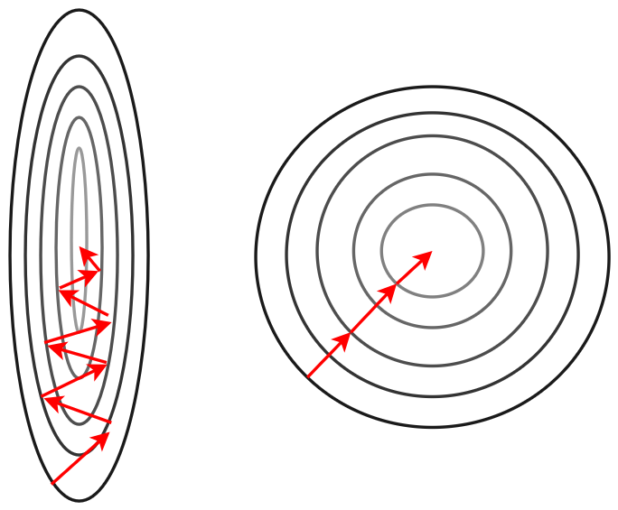
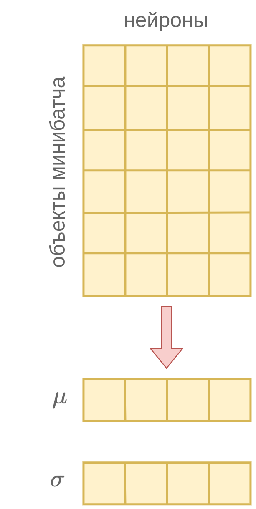

# Батч-нормализация

## Идея метода

Классическим подходом к повышению качества прогнозов моделей является [нормализация признаков](../../Machine-learning/Data-preprocessing/Feature-normalization), то есть приведение признаков к одинаковой шкале поскольку это [выравнивает способность разных признаков влиять на прогноз](../../Machine-learning/Data-preprocessing/Feature-normalization).

Самым популярным методом нормализации является **стандартизация** (standardization), приводящая каждый признак $x^i$ со средним $\mu_i$ и стандартным отклонением $\sigma_i$ к его стандартизованной версии со средним ноль и единичной дисперсией:

$$
x^i \longrightarrow \frac{x^i-\mu_i}{\sigma_i}
$$

Нормализация также ускоряет настройку градиентными методами [[1]](https://proceedings.mlr.press/v37/ioffe15.html), поскольку делает линии уровня функции потерь менее вытянутыми и более скруглёнными, как показано на рисунке:

**Батч-нормализация** (batch-normalization, [[1]](https://proceedings.mlr.press/v37/ioffe15.html)) позволяет ускорить настройку сети за счёт нормализации не только входных признаков, но и <u>активаций промежуточного слоя</u>. 

Слой батч-нормализации принимает на вход активации $z_1,...z_M$ предыдущего слоя и их линейно перемасштабирует таким образом, чтобы они имели средние $\beta_1,...\beta_M$ и стандартные отклонения $\gamma_1,...\gamma_M$:

$$
\begin{aligned}
& z_1 \;&\to\quad &\gamma_1\frac{z_1-\mu_1}{\sqrt{\sigma_1^2+\delta}}+\beta_1 \\
& z_2 \;&\to\quad &\gamma_2\frac{z_2-\mu_2}{\sqrt{\sigma_2^2+\delta}}+\beta_2 \\
& \cdots &  \cdots  \\
& z_M \;&\to\quad &\gamma_M\frac{z_M-\mu_M}{\sqrt{\sigma_M^2+\delta}}+\beta_M \\
\end{aligned}
$$

где  

- $\mu_1,...\mu_M$ - средние значения активаций $z_1,...z_M$;

- $\sigma_1,...\sigma_M$ - стандартные отклонения активаций $z_1,...z_M$;

- $\delta>0$ - малая константа, призванная исключить деление на ноль.

> Слой батч-нормализации (batch-normalization layer), нормирующий активации предыдущего слоя, может включаться в любом месте сети. 
> 
> Его используют многократно для более ранних и более поздних слоёв.

Параметры $\{\beta_i\}_i$ и $\{\gamma_i\}_i$ <u>настраиваются вместе с остальными весами нейросети</u>. Если для минимизации потерь действительно необходима стандартизация, то они настроятся на значения 0 и 1 соответственно. Если же стандартизация не нужна, то они настроятся на значения средних $\{\mu_i\}_i$ и стандартных отклонений $\{\sigma_i\}_i$ соответственно, и слой батч-нормализации будет действовать как тождественное преобразование. В общем же случае эти параметры будут принимать некоторые промежуточные значения.

:::tip Удаление лишних параметров

В линейном слое, применяемом к батч-нормализованным входам, необязательно использовать смещения (bias), поскольку нейроны уже смещаются на выучиваемые смещения $\{\beta_i\}_i$ из батч-нормализации.

:::

Батч-нормализация будет <u>по-разному</u> действовать при обучении и применении нейросети. Рассмотрим эти различия.

### Обучение нейросети

Если при стандартизации признаков мы могли предварительно вычислить их средние и стандартные отклонения, то для активаций промежуточных нейронов - уже нет, поскольку при настройке сети веса меняются, что изменяет распределение всех последующих нейронов! 

Поэтому во время обучения сети (training) на каждом шаге обновления весов $\{\mu_i\}_i$ и $\{\sigma_i\}_i$ перевычисляются как выборочные средние и стандартные отклонения нейронов <u>по текущему мини-батчу</u>, как показано ниже:

:::tip Точность оценки

Для повышения точности оценки средних и стандартных отклонений (и, как следствие, повышения устойчивости батч-нормализации) рекомендуется настраивать нейросеть с <u>повышенным</u> размером мини-батчей.

:::

### Применение нейросети

Во время применения (inference) уже обученной сети мы уже могли бы вычислить средние и стандартные отклонения нейронов, поскольку веса сети уже настроены и зафиксированы, следовательно распределения промежуточных активаций зафиксированы и не меняются. Однако это предполагает дополнительный проход по обучающей выборке. На практике, чтобы его не делать, во время обучения вычисляются не только средние и стандартные отклонения по текущему мини-батчу, но и их сглаженные версии, используя [экспоненциальное сглаживание](../../Machine-learning/Numerical-optimization/Monitoring#экспоненциальное-сглаживание). В результате к концу обучения мы просто подставляем вместо $\{\mu_i\}_i$ и $\{\sigma_i\}_i$ их сглаженные значения.

## Обоснование метода

Если поместить батч-нормализацию перед функцией нелинейности, то при соответствующей инициализации параметров $\gamma$ и $\beta$ она будет приводить аргумент нелинейности в регион её существенных изменений (изгиб в [функциях ReLU, LeakyReLU, tangh и т.д.](../MLP/Activation-functions)).

Также батч-нормализация ускоряет настройку сети в целом за счёт ускорения настройки её более поздних слоёв. Как мы знаем, на каждой итерации оптимизации <u>все веса сети обновляются одновременно</u>. Но в контексте обновлённых весов более ранних слоёв распределение активаций более поздних слоёв поменялось, и <u>обновления весов для поздних слоёв перестаёт быть актуальным</u>! В итоге настройка сети замедляется, поскольку оптимизатору необходимо вначале настроить более ранние слои, и, когда они уже почти перестанут меняться, осуществлять  предметную настройку зависящих от них более поздних слоёв.

Батч-нормализация упрощает и ускоряет одновременную настройку более ранних и более поздних слоёв за счёт того, что выходы слоя батч-нормализации, являющиеся входами последующего слоя, будут иметь предсказуемые средние и стандартные отклонения. Соответственно, слою, который эти выходы использует, будет проще под них настроить веса. 

## Батч-нормализация и прореживание сети

Если на параметры $\{\gamma_i\}_i$ наложить $L_1$ регуляризацию, то часть мультипликаторов $\gamma_i$ начнёт зануляться, что будет приводить к автоматическому исключению лишних нейронов и упрощению модели. Это является эффективным [регуляризатором](../../Machine-learning/Base-concepts/Regularization), снижая сложность модели как в терминах вычислений, так и в терминах занимаемой памяти.

## Литература

1. [Ioffe S., Szegedy C. Batch normalization: Accelerating deep network training by reducing internal covariate shift //International conference on machine learning. – pmlr, 2015. – С. 448-456.](https://proceedings.mlr.press/v37/ioffe15.html)
