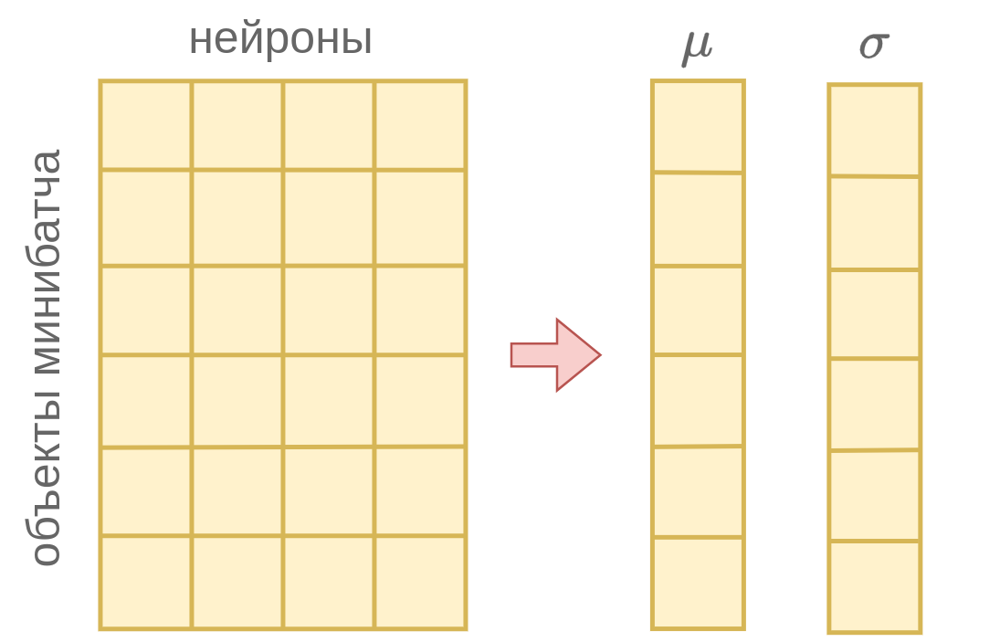

# Нормализация слоя

Помимо [батч-нормализации](BatchNorm), другим способом нормализации активаций сети для упрощения её настройки является **нормализация слоя** (layer normalization, [[1]](https://arxiv.org/abs/1607.06450)), сокращенно называемая LayerNorm.

Слой LayerNorm принимает на вход активации $z_1,...z_M$ предыдущего слоя сети и их линейно перемасштабирует:

$$
\begin{aligned}
& z_1 \;&\to\quad &\gamma_1\frac{z_1-\mu}{\sqrt{\sigma^2+\delta}}+\beta_1 \\
& z_2 \;&\to\quad &\gamma_2\frac{z_2-\mu}{\sqrt{\sigma^2+\delta}}+\beta_2 \\
& \cdots &  \cdots  \\
& z_M \;&\to\quad &\gamma_M\frac{z_M-\mu}{\sqrt{\sigma^2+\delta}}+\beta_M \\
\end{aligned}
$$

где $\delta>0$ - малая константа, призванная исключить деление на ноль, а
параметры $\mu$ и $\sigma$ вычисляются как выборочное среднее и стандартное отклонение <u>по активациям всех нейронов слоя в рамках одного объекта</u>:

$$
\begin{aligned}
\mu &= \frac{1}{M}\sum_{m=1}^M z_m \\
\sigma &= \sqrt{\frac{1}{M}\sum_{m=1}^M (z_m-\mu)^2} \\
\end{aligned}
$$

> Параметры $\{\beta_i\}_i$ и $\{\gamma_i\}_i$ настраиваются вместе с остальными весами нейросети во время обучения сети (training) и остаются фиксированными во время её применения (inference).

Схематично работа LayerNorm представлена ниже:

:::tip Преимущество по сравнению с батч-нормализацией

Поскольку расчёт $\mu$ и $\sigma$ производится по активациям нейронов слоя в рамках одного объекта, то метод работает одинаково как в режиме обучения, так и в режиме применения в отличие от [батч-нормализации](BatchNorm), в которой использовались разные методы расчёта $\mu$ и $\sigma$ в разных режимах. 

Это повышает стабильность работы и обобщаемость настроенной модели на новые данные. Также нейросеть можно настраивать с любым размером мини-батча, даже по отдельным объектам.

:::

Нормализация слоя была предложена для ускорения и повышения стабильности настройки рекуррентных нейросетей, а сейчас активно используется в архитектуре [нейросетей-трансформеров](../Transformer/Transformer).

## Литература

1. [Ba J. L., Kiros J. R., Hinton G. E. Layer normalization //arXiv preprint arXiv:1607.06450. – 2016.](https://arxiv.org/abs/1607.06450)
