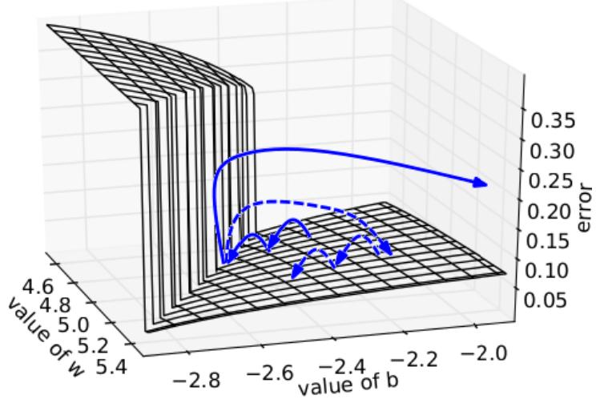

# Обрезка градиента

## Неустойчивость оптимизации

Нейросети моделируют сложные нелинейные зависимости, вследствие чего рельеф функции потерь может быть сложным и подверженным резким изменениям, что может приводить к неустойчивой оптимизации весов как показано на рисунке [[1]](https://proceedings.mlr.press/v28/pascanu13.html):

Для стабилизации обучения приходится снижать шаг обучения, замедляя его. Хотелось бы уменьшать сдвиг не постоянно, а только в областях резкого изменения функции, что достигается методом обрезки градиента.

## Обрезка градиента

**Обрезка градиента** (gradient clipping, [[1]](https://proceedings.mlr.press/v28/pascanu13.html)) - популярная процедура, повышающая стабильность и скорость обучения нейросетей. Поскольку при изменчивом ландшафте функции потерь могут возникать большие по норме градиенты, то перед каждым обновлением весов в [методе  стохастического градиентного спуска](../Training/Opt-methods-fixed-lr#стохастический-градиентный-спуск-по-мини-батчам) норма градиента сравнивается с некоторым порогом $\lambda>0$. Если норма меньше порога, то веса обновляются как обычно, а если больше - то норма градиента обрезается порогом $\lambda$ перед обновлением весов:

$$
\mathbf{w}\to\begin{cases}
\mathbf{w}-\varepsilon\nabla_{\mathbf{w}}\mathcal{L}(\widehat{y}_{i},y_{i}), & \text{если }\left\lVert \nabla_{\mathbf{w}}\mathcal{L}(\widehat{y}_{i},y_{i})\right\rVert <\lambda\\
\mathbf{w}-\varepsilon\lambda\frac{\nabla_{\mathbf{w}}\mathcal{L}(\widehat{y}_{i},y_{i})}{\left\lVert \nabla_{\mathbf{w}}\mathcal{L}(\widehat{y}_{i},y_{i})\right\rVert }, & \text{если }\left\lVert \nabla_{\mathbf{w}}\mathcal{L}(\widehat{y}_{i},y_{i})\right\rVert \ge\lambda
\end{cases}
$$

> Этот приём позволил существенно повысить стабильность и скорость настройки [рекуррентных нейронных сетей](../Recurrent-neural-nets/RNN), в которых из-за многократно повторяемых слоёв с одинаковыми весами проблема нестабильных градиентов стоит особенно остро.

## Адаптивная обрезка градиента

Также можно использовать **адаптивную обрезку градиента** (adaptive gradient clipping, [[2]](https://proceedings.mlr.press/v139/brock21a.html)):

$$
\mathbf{w}\to\begin{cases}
\mathbf{w}-\varepsilon\nabla_{\mathbf{w}}\mathcal{L}(\widehat{y}_{i}, y_{i}), & \text{если }\left\lVert \nabla_{\mathbf{w}}\mathcal{L}(\widehat{y}_{i},y_{i})\right\rVert /\left\Vert \mathbf{w}\right\Vert <\lambda\\
\mathbf{w}-\varepsilon\lambda\left\Vert \mathbf{w}\right\Vert \frac{\nabla_{\mathbf{w}}\mathcal{L}(\widehat{y}_{i},y_{i})}{\left\lVert \nabla_{\mathbf{w}}\mathcal{L}(\mathbf{\widehat{y}_{i}},y_{i})\right\rVert }, & \text{если }\left\lVert \nabla_{\mathbf{w}}\mathcal{L}(\widehat{y}_{i},y_{i})\right\rVert /\left\Vert \mathbf{w}\right\Vert \ge\lambda
\end{cases}
$$

В этом случае гораздо проще и интуитивнее задать порог $\lambda$, который теперь соответствует не максимальному абсолютному изменению весов, а их максимальному <u>относительному</u> изменению.

> Например, мы можем задать ограничение, что на каждой итерации оптимизации веса не должны меняться больше, чем на 10% от их нормы.

Проблемой остаётся необходимость выбора <u>единого</u> порога $\lambda$, который не будет оптимальным для всех весов, поскольку часть из них изменяются в широком диапазоне значений, а другая часть - в узком. Поэтому лучше работает адаптивное ограничение градиента для каждого веса $w_i$ (и его градиента) в отдельности:

$$
w_{i}\to\begin{cases}
w_{i}-\varepsilon\nabla_{w_{i}}\mathcal{L}(\widehat{y}_{i},y_{i}), & \text{если }\left| \nabla_{w_{i}}\mathcal{L}(\widehat{y}_{i},y_{i})\right| /\left| w_{i}\right| ^{*}<\lambda\\
w_{i}-\varepsilon\lambda\left| w_{i}\right| ^{*}\frac{\nabla_{w_{i}}\mathcal{L}(\widehat{y}_{i},y_{i})}{\left| \nabla_{w_{i}}\mathcal{L}(\widehat{y}_{i},y_{i})\right| }, & \text{если }\left| \nabla_{w_{i}}\mathcal{L}(\widehat{y}_{i},y_{i})\right| /\left| w_{i}\right| ^{*}\ge\lambda
\end{cases}
$$

В формуле $\left| w_{i}\right| ^{*}=\max\left(\left| w_{i}\right| ,\nu\right)$ , а $\nu=10^{-3}$ - гиперпараметр для исключения деления на ноль. 

В работе [[2]](https://proceedings.mlr.press/v139/brock21a.html) замена [батч-нормализации](BatchNorm) адаптивным ограничением градиента   позволила обучить сеть [ResNet](../Convolutional-architectures/ResNet) быстрее и повысить качество её прогнозов.

## Литература

1. [Pascanu R., Mikolov T., Bengio Y. On the difficulty of training recurrent neural networks //International conference on machine learning. – Pmlr, 2013. – С. 1310-1318.](https://proceedings.mlr.press/v28/pascanu13.html)
2. [Brock A. et al. High-performance large-scale image recognition without normalization //International conference on machine learning. – PMLR, 2021. – С. 1059-1071.](https://proceedings.mlr.press/v139/brock21a.html)
