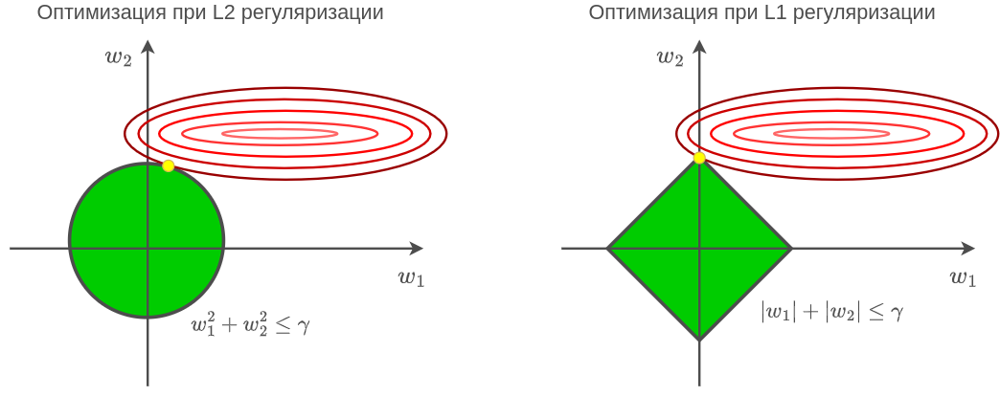

# Регуляризация весов нейросети

## Идея

Вместо того, чтобы [жёстко упрощать модель, исключая лишние признаки, нейроны и целые слои](Architecture-restriction), можно упрощать модель мягко, добавляя в функцию потерь регуляризацию, штрафующую веса по их абсолютной величине.

Пусть $X$ - вектора признаков всех объектов обучающей выборки, а Y - вектор их откликов (целевых значений), как вводилось [ранее](../../Machine-learning/Base-concepts/Function-selection#теоретический-и-эмпирический-риск).

Чаще всего используется L2-регуляризация (называемая **weight decay**):

$$
L(X,Y) \to L(X,Y)+\textcolor{red}{\lambda||\mathbf{w}||^2_2} = L(X,Y)+\textcolor{red}{\lambda \sum_{i=1}^I w_i^2}\tag{1}
$$

либо $L_1$-регуляризация:

$$
L(X,Y) \to L(X,Y)+\textcolor{red}{\lambda||\mathbf{w}||_1} = L(X,Y)+\textcolor{red}{\lambda \sum_{i=1}^I |w_i|}\tag{2}
$$

Добавление регуляризующих слагаемых делает оптимальные веса меньше по абсолютной величине, вследствие чего итоговая зависимость $f_\mathbf{w}(\mathbf{x})$ меняется <u>более плавно</u>.

> Реальные зависимости тоже в большинстве случаев обладают плавностью изменений, поэтому эти виды регуляризации весьма естественны и при подборе коэффициента $\lambda$ приводят к улучшению обобщающей способности.

:::tip Контроль силы регуляризации  

Сила регуляризации контролируется гиперпараметром $\lambda>0$: чем он выше, тем сильнее оптимальные веса будут прижаты к нулю и тем более плавную прогнозную функцию мы получим. Важно подвергать модель регуляризации не слишком сильно, иначе её прогнозы могут выродиться в константу! 

Обычно $\lambda$ подбирают по качеству модели на [отдельной валидационной выборке](../../Machine-learning/Base-concepts/Quality-estimation), перебирая значения по логарифмической сетке, например, $10^{-6},10^{-5},...10^5,10^6$.

:::

## Отличия L1- и L2-регуляризаций

Посчитав производную по весу для регуляризаторов в (1) и (2), можно увидеть, что L2-регуляризация сильнее прижимает к нулю большие веса, но слабее - малые. А L1-регуляризация прижимает веса к нулю с одинаковой силой, поскольку градиент по ней - константа. 

Поэтому при достаточно большом $\lambda$ L1-регуляризация в точности положит равными нулю часть весов (что эквивалентно удалению соответствующей связи в сети). В то же время при L2-регуляризации все веса будут в общем случае ненулевыми даже при сильной степени регуляризации $\lambda$.

Другим обоснованием, почему L2-регуляризация не зануляет веса, а L1 - зануляет, является эквивалентность следующих задач оптимизации для некоторого порога $\gamma=\gamma(\lambda)$, следующая из условий Каруша-Куна-Таккера [[1]](https://ru.wikipedia.org/wiki/Условия_Каруша_—_Куна_—_Таккера):

$$
L(\mathbf{w})+\lambda R(\mathbf{w})\to\min_\mathbf{w} \iff \begin{cases} L(\mathbf{w})\to\min_\mathbf{w} \\ R(\mathbf{w})\le\gamma \end{cases}
$$

Если визуализировать линии уровня функции потерь и область, задаваемую ограничением второй задачи оптимизации (справа), то видно, что для L2-регуляризации оптимальное значение весов (жёлтый кружок) будет иметь ненулевые веса, а для L1-регуляризации часть оптимальных весов может стать в точности равной нулю:

:::tip Особый учёт смещений

Особое значение в нейросети имеют нейроны, принимающие значение тождественной единицы. Веса связей, исходящих из таких нейронов, отвечают за смещения (bias) распределений активаций и обычно <u>не регуляризуются</u>, чтобы регуляризация не приводила к смещению прогнозов в сторону нуля. К тому же весов, отвечающих смещениям, существенно меньше, чем всех прочих, поэтому они не сильно влияют на сложность модели.

:::

## Обобщение

Вместо того, чтобы подвергать регуляризации все веса сети с одинаковой силой $\lambda$, можно подвергать регуляризации веса, отвечающие разным слоям сети, <u>с разной силой</u>. Рекомендуется слабее регуляризовать начальные слои, а сильнее - более поздние. 

> Это объясняется тем, что первые слои сильно связаны со входами $x$, информацию о которых нежелательно потерять из-за чрезмерной регуляризации. В последних же слоях генерируются всевозможные сложные признаки, не все из которых в конечном счёте окажутся полезными.

## Литература

1. [Wikipedia: Условия Каруша - Куна - Таккера.](https://ru.wikipedia.org/wiki/Условия_Каруша_—_Куна_—_Таккера)
