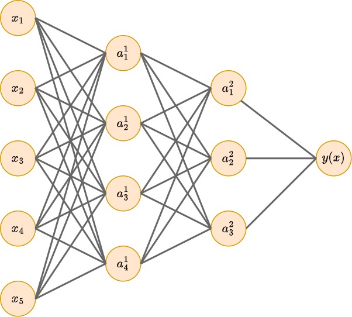
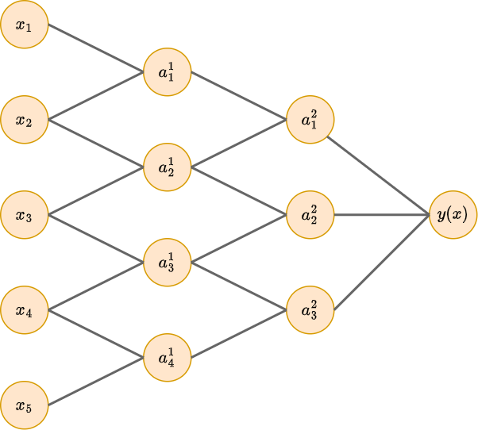
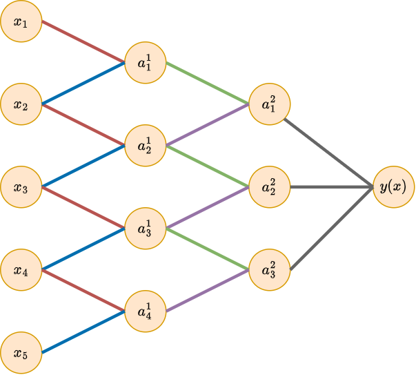

# Ограничение архитектуры

Сложные нейросети, содержащие большое число параметров, переобучаются на недостаточно больших обучающих выборках, поэтому их нужно упрощать. Для этого можно

1. использовать меньше слоёв;

2. использовать меньше нейронов;

3. использовать меньше входных признаков;

4. уменьшить число связей;

5. наложить ограничения на веса.

**Уменьшение числа слоёв** [противоречит идеологии глубокого обучения](../MLP/Modeling-ability#глубокие-нейросети) по автоматической настройке информативных признаков за счёт увеличения числа слоёв нейросети. Однако в случае, когда реальная зависимость проста (например, линейна), а обучающих данных мало, это улучшает качество.

**Уменьшение числа нейронов** способно сильно упростить модель, особенно для [многослойных персептронов](../MLP/Multilayer-perceptron), где связи между нейронами соседних слоёв устанавливаются по принципу каждый-с-каждым. 

**Уменьшение числа признаков** - частный случай предыдущего подхода, когда уменьшается число нейронов входного слоя. Если просто сокращать объём известной информации, то качество может сильно ухудшиться. Поэтому, если хотим использовать мало признаков, то имеет смысл сгенерировать максимально информативную "выжимку" из исходных признаков путём их линейных и нелинейных преобразований (dimensionality reduction, feature engineering). 

> Например, если решается задача определения времени суток по фотографии, то вместо всего изображения можно подавать интеллектуальные признаки, имеющие связь с ответом, такие как положение солнца на фото и средняя яркость пикселей. 

**Уменьшение числа связей**. Поскольку сложность модели зависит от числа настраиваемых параметров, отвечающих связям между нейронами, то можно упросить модель за счёт сокращения не числа нейронов, а <u>числа связей между ними</u>, сделав эти связи более разреженными (sparse connections).

Рассмотрим следующий многослойный персептрон, где для простоты опущены единичные нейроны.

Сделав предположение, что каждый нейрон на первом и втором скрытом слое зависит только от двух своих соседей, получим существенное уменьшение числа связей (и, соответственно, настраиваемых весов):

Можно пойти дальше, и **наложить ограничения на значения весов**, например, предполагать их неотрицательность или связать веса друг с другом (weight sharing), чтобы они принимали одинаковые значения. Пример такого ограничения приведён на рисунке ниже, где на первом и втором слое связи с одинаковыми весами помечены одинаковым цветом:

Подобное прореживание связей и привязка весов друг к другу используется в  операции свёртки (convolution) для обработки [последовательностей](../ConvPool-1D/Conv-1D) и [изображений](../ConvPool-Images/Conv-images).

**Мягкая связка весов (soft weight sharing)**

Если точное приравнивание весов друг к другу слишком сильно снижает выразительную способность модели, то веса можно привязать друг к другу мягко (soft weight sharing) за счёт того, что мы позволим им принимать разные значения, но <u>не сильно отличающиеся друг от друга</u>. Это достигается ручной разбивкой весов на группы $G_1,G_2,...G_K$ и добавлением в функцию потерь следующего регуляризатора

$$
\lambda \sum_{k=1}^K \sum_{i\in G_k}\sum_{j\in G_k, j>i}||w_i-w_j||^2
$$

Чем выше гиперпараметр $\lambda>0$, тем более похожие значения будут принимать веса, находящиеся в одной группе.

:::tip Автоматическое разбиение на группы

В работе [[1]](https://www.cs.utoronto.ca/~hinton/absps/sunspots.pdf) предлагается автоматически распределить веса на группы, предположив, что априорно веса распределены как смесь из $K$ нормальных распределений (Гауссиан):

$$
p(w)=\prod_i \left\{ \sum_{j=1}^K \pi_j \mathcal{N}(w_i|\mu_j,\sigma_j^2) \right\}
$$

Взяв логарифм со знаком минус, получим регуляризатор:

$$
R(w) = -\sum_i\ln \left(\sum_{j=1}^K \pi_j \mathcal{N}(w_i|\mu_j,\sigma_j^2) \right)
$$

Для настройки модели с автоматическим разбиением весов на группы (и сближением весов в рамках каждой группы) достаточно включить этот регуляризатор в целевую функцию потерь:

$$
L(\mathbf{w}) \to L(\mathbf{w})+\lambda R(\mathbf{w})
$$

При этом настройка будет вестись не только по весам модели, но и по параметрам $\pi_j, \mu_j,\sigma_j$ регуляризатора, подстраивая степень сближения весов по данным.

:::

## Литература

1. [Nowlan S. J., Hinton G. E. Simplifying neural networks by soft weight sharing //The mathematics of generalization. – CRC Press, 2018. – С. 373-394.](https://www.cs.utoronto.ca/~hinton/absps/sunspots.pdf)
