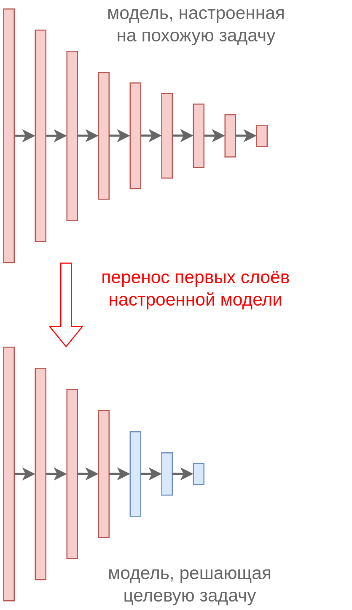

# Использование похожей задачи

## Перенос весов из другой задачи (transfer learning)

Предположим, нам нужно решить узкоспециализированную **задачу A**, такую как распознавание модели машины по её фотографии. Как правило, когда заходит речь о задаче с узкой специализацией, то данных для настройки модели оказывается мало, поскольку сбор объектов и их ручная разметка - это трудоёмкий процесс. Зато можно воспользоваться другой похожей **задачей B**, для которой собрано много обучающих данных и есть уже настроенные и хорошо зарекомендовавшие себя модели.

> Например, можно воспользоваться датасетом ImageNet [[1]](https://www.image-net.org/), в котором свыше 14 миллионов размеченных изображений на 1000 классов, содержащих типовые объекты, встречаемые на практике, такие как кошки, собаки, машины, грузовики, дома, прицепы, компьютеры и т.д. Для этого датасета уже существует большой набор настроенных моделей [[2]](https://paperswithcode.com/sota/image-classification-on-imagenet). 
> 
> Классы ImageNet хотя и не совсем соответствуют решаемой задаче определения марки машины по её фото, но в целом и та, и другая задача опирается на похожий набор признаков - чтобы распознать марку машины, нужно вначале извлечь углы распознаваемого предмета, определить его цвет, извлечь типовые графические паттерны, отвечающие резине колёс, бликам на стёклах, цветовым переливам на форме кузова и т.д. А эти признаки как раз и извлекаются в уже настроенных моделях на ImageNet!

Поэтому вместо того, чтобы обучать модель под целевую задачу с нуля, рекомендуется вначале извлечь информативные высокоуровневые признаки (high level features) из промежуточных слоёв  <u>уже настроенных моделей</u> на похожей задаче, как проиллюстрировано на схеме ниже:

Таким образом, веса первых слоёв модели, решающей задачу B (красные), переносятся в неизменном виде на первые слои модели, решающие задачу A. Это называется **жёсткая общность весов** (hard weight sharing). Под целевую задачу A настраиваются лишь последние слои (обозначенные синим цветом), что позволяет сэкономить на сложности настройки и успешно обучить модель на выборке меньшего объёма. Чем больше размеченных данных мы имеем для решения целевой задачи A, тем большее количество последних слоёв мы можем выделить для настройки под эту задачу, не переобучившись.

## Выбор похожей задачи

Тип похожей задачи может совпадать, как в примере выше, где и задача A, и задача B были задачами классификации изображений.

Но в качестве вспомогательной задачи B можно выбирать и другой тип задачи. Например, задача A - классификация изображений, а задача B - генерация изображений с помощью [автокодировщика](../Special-architectures/Autoencoders) или генеративно-состязательной сети [[3]](https://education.yandex.ru/handbook/ml/article/generativno-sostyazatelnye-seti-(gan)) (в этом случае заимствуются первые слои дискриминатора). Другой задачей может быть определение того, показан ли на изображениях один и тот же объект (под разными углами) или разные, используя [сиамские сети](../Special-architectures/Contrastive-learning) (instance discrimination). 

> Если в качестве вспомогательной задачи B используется [задача обучения без учителя](../../Machine-learning/Base-concepts/Unsupervised-learning) (unsupervised learning), не использующая внешнюю разметку, то это позволяет обучать её очень точно на гораздо больших объемах данных, поскольку ручная разметка для них не требуется!

## Донастройка перенесённых весов (finetuning)

Поскольку задача A всё же несколько отличается от задачи B, то низкоуровневые признаки, перенесённые с первых слоёв, <u>могут немного отличаться</u>. Добиться небольшой подстройки весов начальных слоёв под исходную задачу можно двумя способами:

1. После переноса весов (hard weight sharing) донастроить все веса модели, решающей целевую задачу A, <u>с малым шагом обучения</u> (learning rate), <u>используя небольшое число итераций</u>. Такая аккуратная донастройка изменит веса, но несильно и позволит ранним слоям приспособиться к решению целевой задачи A. Также можно донастраивать модель, используя шаг обучения, который плавно увеличивается с нуля до некоторого значения. Это называется [разогревом модели](../Training/Learning-rate-scheduling#разогрев-обучения).

2. Как альтернатива, можно настраивать все веса с обычным шагом обучения, но с дополнительной регуляризацией $||\mathbf{w}-\mathbf{w}_B||^2$, препятствующей сильному отклонению весов $\mathbf{w}$ целевой модели задачи A от весов референсной модели, решающей задачу $B$. Это похоже на [мягкую связку весов](Architecture-restriction), но теперь они привязываются не друг к другу, а к весам модели, решающей похожую задачу.

---

Дополнительно о представленных подходах можно прочитать в [[4]](https://www.geeksforgeeks.org/machine-learning/what-is-the-difference-between-fine-tuning-and-transfer-learning/), а в [[5]](https://d2l.ai/chapter_computer-vision/fine-tuning.html) доступна иллюстрация кода, реализующего эти методы.

## Литература

1. [Imagenet dataset.](https://www.image-net.org/)

2. [paperswithcode.com: Image Classification on ImageNet.](https://paperswithcode.com/sota/image-classification-on-imagenet)

3. [Учебник ШАД: Генеративно-состязательные сети (GAN).](https://education.yandex.ru/handbook/ml/article/generativno-sostyazatelnye-seti-(gan))

4. [Geeksforgeeks: Difference Between Fine-Tuning and Transfer Learning.](https://www.geeksforgeeks.org/machine-learning/what-is-the-difference-between-fine-tuning-and-transfer-learning/)

5. [Zhang A. et al. Dive into deep learning. – Cambridge University Press, 2023: Fine-Tuning.](https://d2l.ai/chapter_computer-vision/fine-tuning.html)
