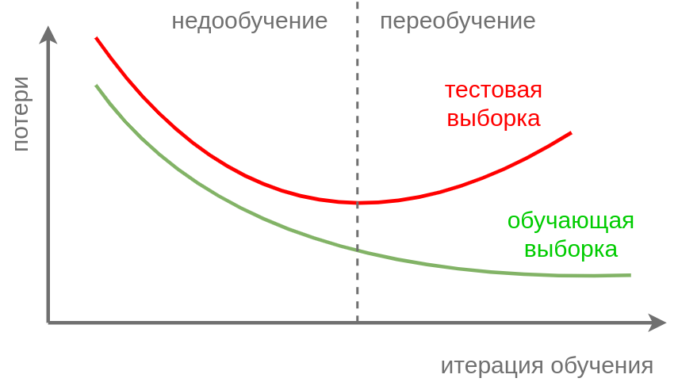

# Ранняя остановка и зашумление входов

## Ранняя остановка

**Ранняя остановка** (early stopping [[1]](https://en.wikipedia.org/wiki/Early_stopping)) - другой пример ограничения нейросети, чтобы уменьшить её степень переобучения. Для этого нужно отслеживать потери модели по ходу обучения на валидационной выборке и заранее остановить обучение, когда потери на валидации начнут расти.

На графике ниже нужно остановить обучение сети по достижении пунктирной линии:

Эта стратегия объясняется тем, что вначале модель учится восстанавливать общую закономерность в данных, а начиная с некоторого момента её обобщающая способность начинает ухудшаться из-за [переобучения под конкретную реализацию обучающей выборки](../../Machine-learning/Bias-variance/Model-complexity). 

Поэтому имеет смысл заранее прервать обучение, получив более простую и менее переобученную модель.

## Зашумление данных

Другим приёмом упрощения модели служит её **обучение на зашумлённых версиях объектов**:

$$
(\mathbf{x},y) \to (\mathbf{x}+\mathbf{\varepsilon},y),
$$

где $\mathbf{\varepsilon}$ - $D$-мерный вектор случайных чисел (случайный шум), обладающий свойствами:

$$
\mathbb{E}\mathbf{\varepsilon} = 0, \quad  \text{cov}\{\mathbf{\varepsilon}\}=\lambda I,
$$

где $I\in\mathbb{R}^{D\times D}$ - единичная матрица. При этом <u>применение модели</u> осуществляется на исходных данных <u>без зашумления</u>.

В [[2]](http://publications.aston.ac.uk/id/eprint/524/) доказывается, что обучение регресии $f(\mathbf{x})$, минимизируя MSE-критерий на зашумлённых данных, эквивалентно обучению сети на незашумлённых данных с добавлением следующей регуляризации:

$$
\frac{1}{N}\sum_{n=1}^N (f(\mathbf{x}_n)-y_n)^2 + \textcolor{red}{\lambda \| \nabla_\mathbf{x} f(\mathbf{x}) \|^2} \to \min_\mathbf{w}
$$

Таким образом, зашумление признаков требует от модели, чтобы изменение её прогнозов было менее резким при небольшом изменении вектора признаков $\mathbf{x}$, что отвечает реальным зависимостям в данных на практике. 

> В случае, когда $f(\mathbf{x})$ - линейная регрессия, [зашумление эквивалентно L2-регуляризации её весов](../../Machine-learning/Linear-regression-extensions/Regularization-in-linear-regression#зашумление-признаков).

## Литература

1. [Wikipedia: Early stopping.](https://en.wikipedia.org/wiki/Early_stopping)
2. [Bishop C. M. Regularization and complexity control in feed-forward networks. – 1995.](https://publications.aston.ac.uk/id/eprint/524/)
