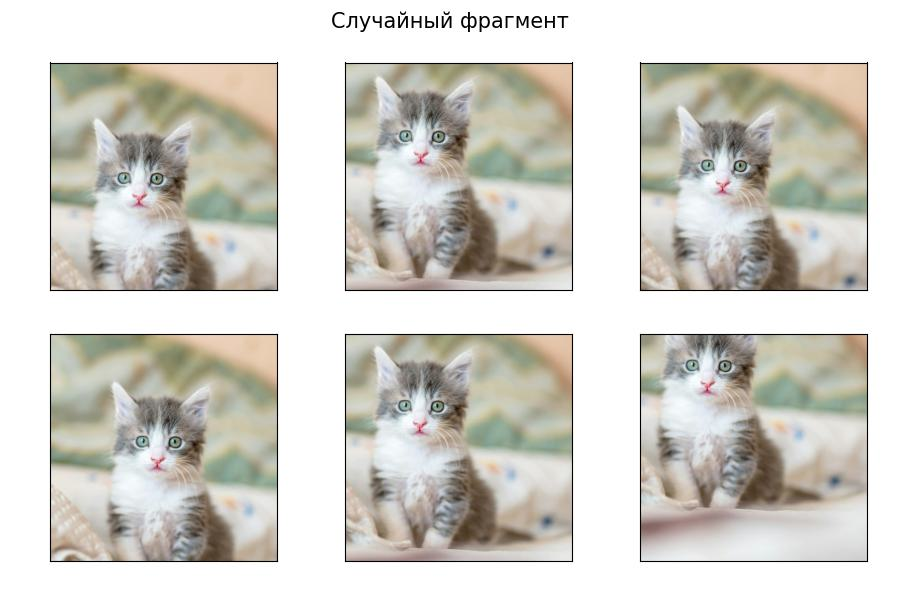
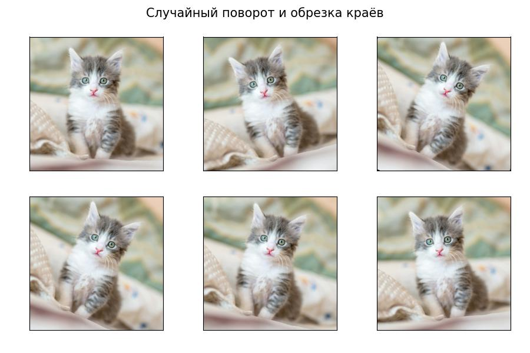
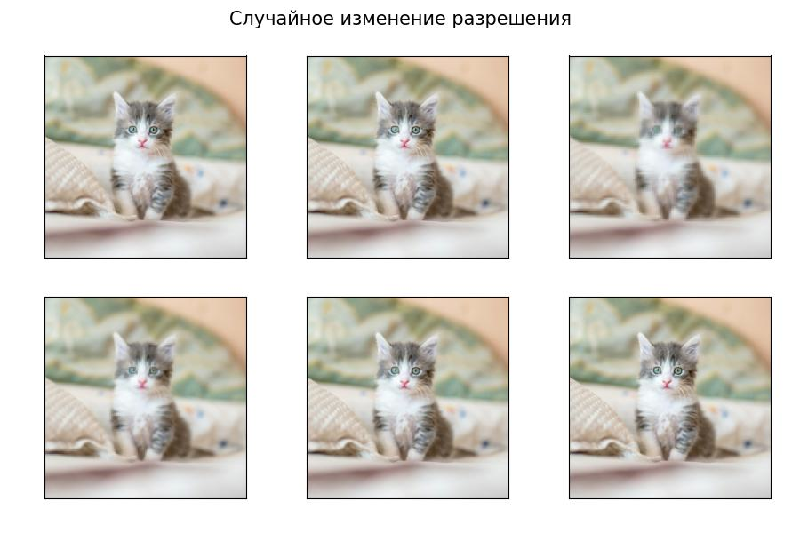
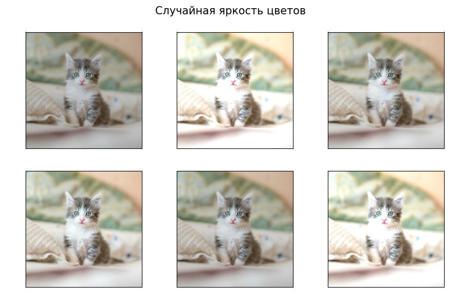
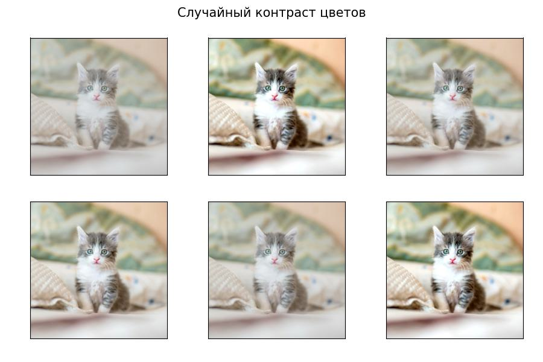
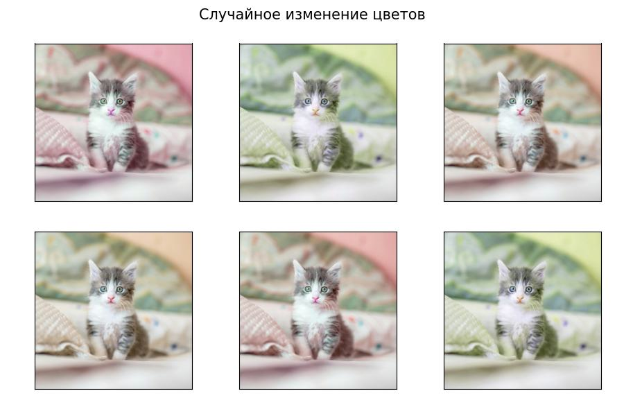
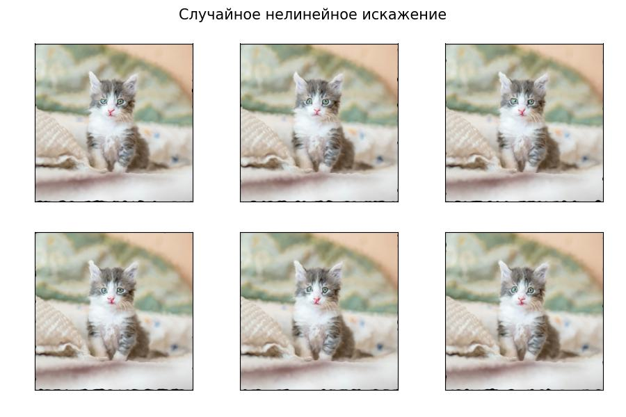
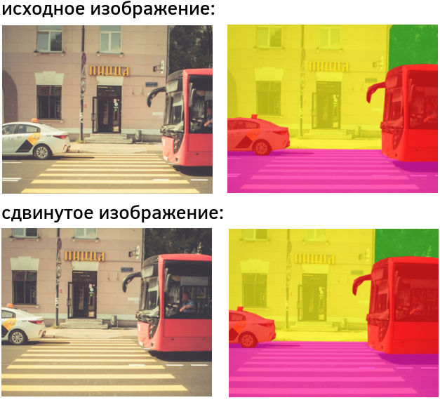

# Аугментация данных

При настройке нейросети дополнительным требованием к модели может быть её <u>инвариантность (invariance) к определённому виду преобразования</u> $g_\mathbf{\theta}(\mathbf{x})$, где $\mathbf{\theta}$ - параметр этого преобразования. 

Иными словами, если $f(\mathbf{x})$ - прогноз нейросети для объекта $\mathbf{x}$, то мы хотим, чтобы этот прогноз не изменялся при определённом преобразовании объекта, т.е. требуем, чтобы

$$
f(\mathbf{x}) \approx f(g_\theta(\mathbf{x}))
$$

Может быть много разных преобразований $g^1_{\theta_1}(\mathbf{x}), g^2_{\theta_2}(\mathbf{x}), ... g^K_{\theta_K}(\mathbf{x})$, относительно которых мы хотим достичь инвариантности. 

:::tip Пример инвариантных преобразований

Рассмотрим классификацию изображений. Фотография кошки должна относиться к классу кошка, даже если это изображение 

- повернуть на небольшой угол $\theta$;

- изменить яркость цветов на $\theta$;

- обрезать края на $\theta$ пикселей и т.д. 

:::

Самый простой способ сделать нейросеть инвариантной к определённым преобразованиям - это **расширить обучающую выборку**, применяя **аугментацию данных** (data augmentation), добавляя в обучающую выборку инвариантно преобразованные объекты с тем же откликом.

Таким образом, одно наблюдение $\{\mathbf{x},\mathbf{y}\}$ преобразуется в целый набор обучающих примеров вида

$$
\{g^1_{\theta_1}(g^2_{\theta2}...(g^K_{\theta_K}(\mathbf{x})..))\}_{\theta_1,...\theta_K}, \mathbf{y} \} \\

$$

с одним и тем же откликом $\mathbf{y}$ для всевозможных параметров инвариантных преобразований $\theta_1, ..., \theta_K$. 

Эта техника позволяет не только сделать прогнозы сети **более инвариантными** к преобразованиям, но и **существенно увеличить размер обучающей выборки** и повысить разнообразие обучающих примеров, улучшив качество настройки модели.

## Примеры инвариантных преобразований для классификации изображений

Рассмотрим задачу классификации изображений. Пусть у нас есть следующее изображение, отнесённое к классу "кошка":

Часто используются следующие инвариантные преобразования:

> Последнее преобразование (нелинейное искажение) чаще всего применяется в медицине, в которой анализируются фотографии организма. Поскольку организм состоит из эластичных тканей, то для различных изгибов тканей мы всё равно должны получать тот же самый прогноз сети (наличие заболевания или его отсутствие).

Также, в качестве расширения выборки, используется

- добавление слабого шума к изображению,

- изменение насыщенности цветов,

- представление изображения в JPEG-формате с разными уровнями сжатия.

## Аугментация данных для текстов

Рассмотрим классификацию текстов. Популярный способ аугментации текстовых данных  - это заменить текст его переформулировкой. Её можно сгенерировать автоматически, переводя текст на другой язык, а потом обратно:

Также можно заменить случайные слова их синонимами или близкими по смыслу словами:

Из текста можно исключить случайные слова, а если он состоит из предложений - то и целые предложения:

Если текст состоит из нескольких предложений, их можно менять местами:

## Аугментация данных при анализе речи

При анализе звуковых данных, главным образом, человеческой речи, применяются следующие виды расширения обучающей выборки:

- Обрезка звука. Причём обрезка может осуществляться как с начала и конца, так и в середине.

- Менять среднюю высоту всех частот звука либо случайно варьировать каждую частоту в отдельности.

- Изменение частоты можно производить не глобально для всего звука, а изменять её локально с разной силой.

- Ускорять/замедлять отдельные временные фрагменты, сохраняя частоты.

- Добавление небольшого шума к звуку. Шум можно генерировать случайным образом либо накладывать дополнительные реальные звуки с небольшой громкостью. Подобные звуки можно, например, вырезать из youtube-роликов.

## Рекомендации по применению аугментации

Расширение обучающей выборки аугментацией - мощный инструмент по увеличению числа обучающих примеров и по обучению модели быть устойчивой к тем или иным трансформациям. **Аугментация данных способна существенно повысить качество прогнозов** и активно используется в прикладных задачах и соревнованиях по анализу данных.

> Аугментация данных широко используется не только для нейросетей, но и для обычных моделей машинного обучения.

Вместе с этим, поскольку расширение генерирует синтетические объекты, которые не совсем укладываются в их типичное распределение, **слишком сильная аугментация может и ухудшить качество**.

Вот некоторые рекомендации по его использованию:

1. Валидируйте модель только по исходным (нетрансформированным) объектам. Это обеспечит адекватный контроль качества на реальных объектах, а не на их синтетических преобразованиях. 

2. Если валидируете качество модели по объекту, то его трансформированная версия не должна оказываться в обучающей выборке, иначе модель может переобучиться на этот объект и показать завышенное качество.

3. Контролируйте степень трансформации, чтобы она не слишком портила обучающие данные. Например, в задаче распознавания цифр, если девятку повернуть на 180 градусов, то получим шестёрку! Если к изображению применить слишком сильные нелинейные искажения, то потратим ценный ресурс обучения нейросети на классификацию изображений, которые в тестовой выборке никогда не встретятся.

4. Степень расширения и долю расширенных объектов необходимо подбирать по валидационной выборке.

## Синхронное изменение прогноза

Вместо того, чтобы требовать неизменности прогноза при некоторой трансформации признаков, можно требовать синхронного изменения прогноза, т.е.

$$
f(g(\mathbf{x}))\approx g(\mathbf{y}),
$$

где $f(\cdot)$ - прогностическая модель, а $g(\cdot)$ - некоторая трансформация входа и выхода.

> Указанное свойство называется **эквивариантностью** (equivariance) прогнозов модели к преобразованию.

Характерный пример - задача сегментации изображения, в которой каждый пиксель необходимо отнести к некоторому классу. Если $g(\cdot)$ - операция сдвига, то логично ожидать при сдвиге входного изображения синхронный сдвиг и выходной сегментационной маски:

Свойство эквивариантности можно модифицировать, если потребовать, чтобы  преобразованию входа $g_1(\mathbf{x})$ соответствовал преобразованный выход <u>с другой функцией трансформации</u> $g_2(\mathbf{y})$:

$$
f(g_1(\mathbf{x})) \approx g_2(\mathbf{y})
$$

---

Подходы к аугментации данных различных типов категоризованы в обзоре [[1]](https://arxiv.org/abs/2405.09591).

Подробнее об инвариантности и эквивариантности прогнозов вы можете прочитать в [[2]](https://www.bishopbook.com/).

## Литература

1. [Wang Z. et al. A comprehensive survey on data augmentation //arXiv preprint arXiv:2405.09591. – 2024.](https://arxiv.org/abs/2405.09591)
2. [Bishop C. M., Bishop H. Deep learning: Foundations and concepts. – Springer Nature, 2023.](https://www.bishopbook.com/)
