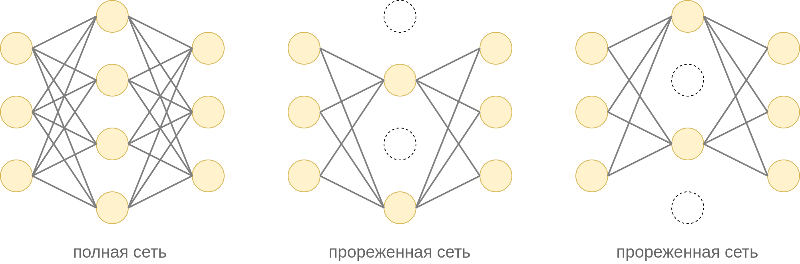
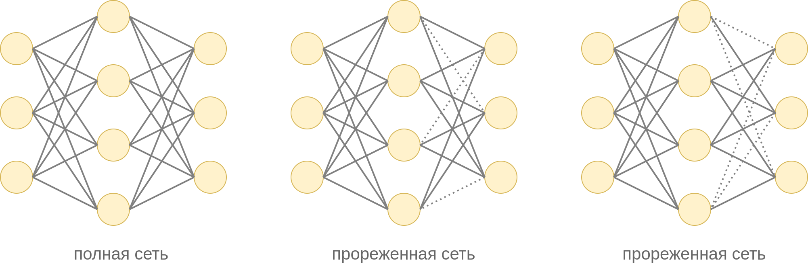

# DropOut в нейронных сетях

## Усредняющий ансамбль

В разделе про [ансамбли моделей](../../Machine-learning/Model-ensembles) мы видели, что частым способом упрощения набора переобученных моделей $f_1(\mathbf{x}),...f_M(\mathbf{x})$ является построение [усредняющего ансамбля](../../Machine-learning/Model-ensembles/Averaging-ensembles):

$$
\hat{y}=\frac{1}{M}\sum_{m=1}^M f_m(\mathbf{x})
$$

:::note Задача

Докажите, что мат. ожидание квадрата ошибки усредняющего ансамбля никогда не превосходит среднее мат. ожиданий квадратов ошибок базовых моделей $f_1(\mathbf{x}),...f_M(\mathbf{x})$.

:::

Поскольку нейросети содержат большое число параметров и часто являются переобученными, то их усреднение существенно повышает качество прогнозов. Однако применение усредняющего ансамбля напрямую несёт в себе вычислительные издержки - в $M$ раз увеличиваются расходы на настройку моделей, их хранение и применение, что особенно чувствительно, когда моделями выступают большие и глубокие нейросети.

## Дропаут

Эффективным способом моделирования усредняющего ансамбля без сопутствующих издержек является **дропаут** (DropOut) [[1]](https://www.jmlr.org/papers/volume15/srivastava14a/srivastava14a.pdf?utm_content=buffer79b43&utm_medium=social&utm_source=twitter.com&utm_campaign=buffer,).

Дропаут применяется к определённому слою нейросети, которым может выступать скрытый слой или входной слой (вектор признаков $\mathbf{x}$), но не выходной. 

Характер применения дропаута <u>различается при обучении сети (training) и её применении (inference)</u>.

### Обучение сети

На каждом шаге оптимизации методом [обратного распространения ошибки](../Training/Backpropagation) проход вперёд (forward pass) и назад (backward pass) осуществляется <u>не по всей сети, а по её прореженной версии</u>, при которой случайная часть нейронов оставляется, а другая часть - исключается, как показано на примере ниже для скрытого слоя сети:

При прореживании каждый нейрон прореживаемого слоя оставляется с вероятностью $p$ и исключается в вероятностью $1-p$ независимо от остальных нейронов. 

> Гиперпараметр $p$ подбирается по валидационной выборке. Значение по умолчанию $p=0.5$ в общем случае будет неоптимальным. При этом оптимальное значение может быть своим для каждого слоя нейросети.

Исключение нейрона означает, что исключается как сам нейрон, так и все входящие и исходящие из него связи. На практике исключение реализуется домножением весов на матрицу $R$ со случайными элементами из множества $\{0,1\}$. 

После прореживания обновление весов для минибатча производится только по оставленным связям.

Если в прореживаемом слое $M$ нейронов, то, по сути, во время обучения настраивается не одна, а целый ансамбль из $2^M$ моделей, представляющих собой различные варианты прореживания полной сети. 

> По сравнению с настройкой одной полной модели настройка не усложняется, а наоборот упрощается, поскольку проход вперед и назад происходит по облегчённой прореженной версии исходной сети! 

### Применение настроенной сети

#### Дропаут Монте-Карло

Теоретически верным построением прогноза для настроенного дропаутом ансамбля моделей будет усреднение по всевозможным вариантам прореживания $R$:

$$
\hat{y}(\mathbf{x})=\frac{1}{2^M}\sum_{R}\hat{y}(\mathbf{x}|R),
$$

где $\hat{y}(\mathbf{x}|R)$ - прогноз при прореживании $R$, а $\hat{y}(\mathbf{x})$ - итоговый прогноз. На практике усреднение уже по 10-20 случайным маскам $R$ даёт хороший результат. Такая схема применения называется **дропаутом Монте-Карло** (Monte Carlo dropout). 

Достоинством подобного применения DropOut является то, что мы получаем не одно значение прогноза, а сразу несколько, за счёт чего можем оценить стандартное отклонение прогнозов, оценивающее ожидаемую ошибку прогноза. Недостатком является усложнение построения прогноза в $K$ раз, где $K$ - число реализаций прореживания, по которым мы производим усреднение.

#### Классическое применение

Поскольку усреднение по всевозможным прореживаниям замедляет построение прогнозов, чаще всего применяется классический дропаут, при котором на этапе применения (inference) <u>используются все нейроны</u> (без прореживания), но их <u>активации домножаются</u> на $p$ (вероятность того, что нейрон был <u>оставлен</u> во время обучения).

Это мотивируется следующим. Если $z_1,...z_M$ - выходные активации прореживаемого слоя, то нейрон последующего слоя (во время обучения) принимает на вход

$$
a=\sum_{i=1}^M w_i z_i r_i,\quad r_i=\begin{cases} 1, \text{ с вероятностью } p \\ 0, \text{ с вероятностью }1-p \end{cases}
$$

Если усреднить по всевозможным реализациям прореживания, то нейрон в среднем будет получать активацию

$$
\mathbb{E}_r\left\{a\right\} = \mathbb{E}_r\left\{\sum_{i=1}^M w_i z_i r_i\right\} = \sum_{i=1}^M w_i z_i p
$$

Обратим внимание, что для не тождественной активации $g(a)$

$$
\mathbb{E}_r g(a) \ne  g(\mathbb{E}_r\{a\}),
$$

поэтому классический дропаут <u>не эквивалентен</u> усреднению конечных выходов сети по всевозможным прореживаниям. Тем не менее, это приближение наиболее часто используется на практике из-за простоты и скорости построения прогнозов.

:::tip Дополнительное ускорение

Слой дропаута при применении сети домножает активации нейронов на $p$, что приводит к дополнительным операциям умножения во время построения прогноза.

Чтобы от них избавиться, можно во время обучения сети делить активации прореживаемых нейронов на $p$. Тогда во время применения никаких умножений на $p$ производить уже не надо! 

:::

## Особенности применения DropOut

Параметром дропаута выступает вероятность оставления нейрона $p$ при прореживании.

Как влияет вероятность $p$ на сложность нейросети?

Чем $p$ выше, тем в среднем ближе прореженная сеть будет оказываться к полной сети, а следовательно, сеть с дропаутом будет получаться сложнее. Чтобы бороться с переобучением, нужно понизить $p$.   

Дропаут можно применять к скрытым слоям и к входному слою (содержащему входной вектор признаков $x$), но не к выходному слою.

Как правило, дропаут применяется не к одному, а сразу к нескольким слоям. Параметр $p$ подбирается [по валидационной выборке или кросс-валидации](../../Machine-learning/Base-concepts/Quality-estimation), причём его можно выбирать своим для каждого слоя сети.

:::tip Рекомендации по выбору $p$

Общая рекомендация по выбору параметра $p$ заключается в том, чтобы задавать его значение более высоким для начальных слоёв сети и более низким - для более глубоких.

Это связано с тем, что начальные слои содержат ключевую информацию об обрабатываемом объекте (которую нельзя терять), а более глубокие слои - всевозможные высокоуровневые признаки, лишь часть из которых окажется в итоге полезной.

:::

## Обоснование метода

Дропаут позволяет контролировать сложность нейросети, осуществляя её регуляризацию.

Он препятствует переобучению в виде чрезмерной <u>сонастройки нейронов на активации друг друга</u> (neuron co-adaptation). Выходные нейроны не могут рассчитывать на активацию отдельного нейрона предыдущего слоя (поскольку он может быть прорежен), поэтому вынуждены использовать информацию со всех доступных нейронов.

> Например, при классификации изображений промежуточные нейроны могут детектировать окна машины или её багажник. При переобучении модели машина будет детектироваться только при наличии окон и багажника. Однако реальные машины могут не иметь багажника (хетчбэк) или окон (машина с открытым верхом). Поэтому полагаться только на эти признаки неразумно, а правильнее детектировать машину по всему спектру доступных признаков (наличие дверей, фар, капота, шин и т.д.).

## DropConnect

Альтернативным дропауту методом регуляризации сети является метод **DropConnect** [[2]](https://proceedings.mlr.press/v28/wan13.html), в котором с вероятностью $p$ отбрасываются не нейроны, а отдельные связи на выбранном слое. Два варианта такого прореживания показаны ниже:

DropConnect по-разному работает в режиме обучения и применения модели аналогично дропауту.

## Литература

1. [Srivastava N. et al. Dropout: a simple way to prevent neural networks from overfitting //The journal of machine learning research. – 2014. – Т. 15. – №. 1. – С. 1929-1958.](https://www.jmlr.org/papers/volume15/srivastava14a/srivastava14a.pdf?utm_content=buffer79b43&utm_medium=social&utm_source=twitter.com&utm_campaign=buffer,)
2. [Wan L. et al. Regularization of neural networks using dropconnect //International conference on machine learning. – PMLR, 2013. – С. 1058-1066.](https://proceedings.mlr.press/v28/wan13.html)
