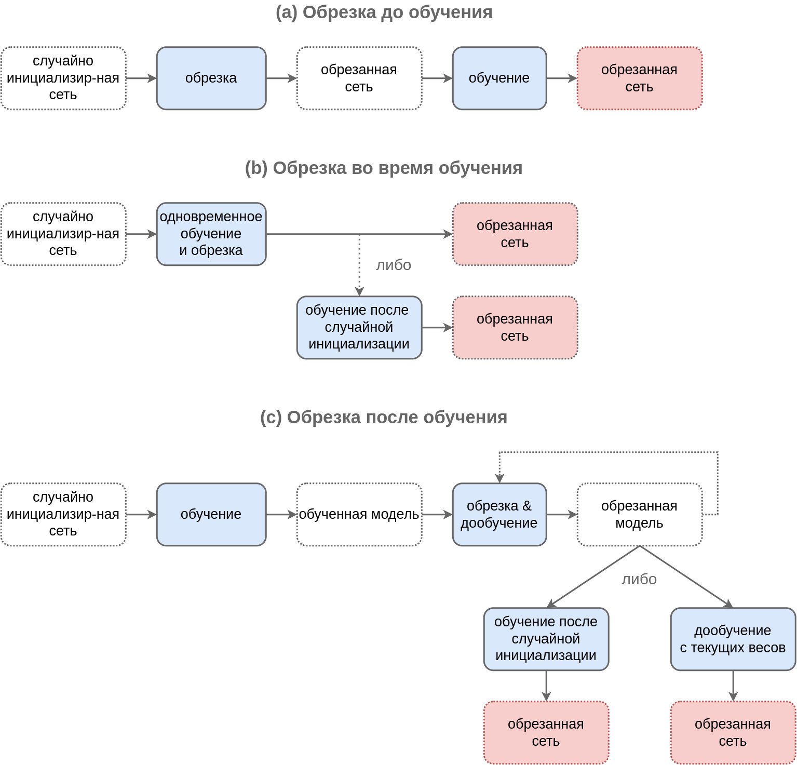

# Автоматическое прореживание сети

## Идея

Ранее мы рассматривали регуляризацию нейросети путём [упрощения её архитектуры вручную](Architecture-restriction). Более эффективным подходом является **автоматическое прореживание сети** (automatic network pruning), то есть полное отбрасывание малозначимых фрагментов сети (связей, нейронов, наборов нейронов или целых слоёв) <u>автоматическими средствами</u>. Это проще и позволяет лучше подстроить прореживание под специфику изучаемых данных.

Детальный обзор методов прореживания нейросетей приведён в [[1]](https://arxiv.org/abs/2308.06767).

## Преимущества

Прореживание нейросетей позволяет:

- упростить нейросеть, чтобы [бороться с переобучением и повысить обобщающую способность сети](../../Machine-learning/Base-concepts/Generalization-ability);

- сократить число параметров, чтобы сеть занимала меньше памяти;

- уменьшить энергопотребление ресурсоёмких вычислений;

- использовать нейросеть на менее мощных процессорах (в телефоне, автономном роботе);

- быстрее обрабатывать большие объемы информации (например, видеопоток);

- увеличить масштабируемость модели, обрабатывая большее число пользовательских запросов за единицу времени.

## Виды прореживания

По характеру прореживаемых блоков внутри сети методы прореживания сетей делятся на

- **неструктурированные** (unstructured), когда исключаются отдельные связи за счёт зануления соответствующих весов; 

- **структурированные** (structured), в которых исключаются целые блоки нейросети, такие как нейроны (со всеми входящими и исходящими связями), а в случае [свёрточных сетей](../ConvPool-Images/Conv-images) - свёрточные каналы.

Оба вида прореживания упрощают модель, уменьшая степень её [переобученности](../../Machine-learning/Base-concepts/Generalization-ability). При хранении весов в **разреженном формате** (sparse format) прореженная сеть будет занимать меньше памяти. 

Неструктурированные методы приведут к уменьшению числа вычислений, только если библиотека и оборудование <u>поддерживают</u> работу с разреженными данными. В противном случае будет производиться тот же объём вычислений, только с данными, содержащими много нулей, поскольку размеры перемножаемых тензоров от неструктурированного прореживания не изменятся.

Структурированные методы <u>всегда приводят к уменьшению объёма вычислений</u>, поскольку уменьшают размеры перемножаемых тензоров.

По времени прореживания относительно настройки модели они делятся на

- **прореживание до обучения** (pruning before training);

- **прореживание во время обучения** (pruning during training);

- **прореживание после обучения** (pruning after training).

Схемы работы этих методов приведены на рисунке ниже, где модели выделены пунктиром, а действия - сплошной линией. Красным прямоугольником обозначена конечная модель.

Как видно по схеме, в случаях (b) и (c) существуют различные стратегии:

- обрезанную сеть использовать непосредственно;

- обрезанную сеть дополнительно дообучить, но уже без обрезки;

- сеть обрезать, а потом переобучить с нуля (со случайной инициализацией весов).

## Прореживание до обучения

**Прореживание до обучения** (pruning before training, pruning at initialization) применяет алгоритм прореживания к случайно инициализированной большой сети.

Чтобы понять, какие именно связи нужно прореживать (т.е. какие именно веса нужно занулять) делается один прямой и обратный проход в [методе обратного распространения ошибки](../Training/Backpropagation#backward-mode-обратное-распространение-ошибки) на небольшой порции данных. Связи оцениваются по тому, насколько сильно их удаление влияет на функцию потерь либо на поток градиентов.

За счёт того, что обучение производится уже на прореженной сети, эффективность повышается не только на этапе применения, но и на этапе обучения модели. 

Вариант применения - произвести небольшое число итераций обучения сети до прореживания, а <u>основной</u> объём обучения производить уже после прореживания (pruning in early training), когда станет ясно, какие фрагменты сети важны, а какие - нет.

## Прореживание после обучения

**При прореживании после обучения** (pruning after training) прореживание применяется к уже настроенной полной модели.

Если вычислительных ресурсов недостаточно, то результат прореживания представляет собой конечную модель. Но можно ещё немного улучшить результат, дообучив обрезанную модель либо с текущими весами, либо после их случайной реинициализации.

> В разных исследованиях эти стратегии работают по-разному, но чаще первая работает лучше.

Самый простой подход прореживания заключается в оценке некоторой неотрицательной **локальной степени влияния** для связи / нейрона / канала в свёрточной нейросети. Если эта степень влияния меньше порога, то соответствующие связь/нейрон/канал исключаются.

Оценкой влияния отдельной связи может служить абсолютная величина веса связи. 

Оценкой влияния нейрона служит $L_p$-норма весов связей, входящих в нейрон либо исходящих из него. Аналогично можно считать важность каналов в свёрточных сетях.

Как альтернатива, можно ввести внешний <u>настраиваемый</u> множитель $\gamma$ при нейроне или целом свёрточном канале и оценивать общее влияние нейрона/канала по модулю этого множителя. Таким множителем, например, выступает параметр масштаба $\gamma$ в [батч-нормализации](../Training-simplification/BatchNorm).

> Представленные подходы обладают тем недостатком, что они <u>локальны</u>, т.е. не учитывают глобальное влияние на конечную функцию потерь. Может  оказаться, что отдельные веса или нейроны, несмотря на слабость связей, в конечном итоге существенно влияют на окончательный прогноз за счёт больших весов при их последующей обработке.

Более целостной является **глобальная степень влияния**, т.е. насколько тот или иной элемент влияет на конечную функцию потерь. По смыслу - это изменение функции потерь, когда элемент включён и исключён из нейросети.

Для оценки глобального влияния рассматривается <u>модуль частной производной конечной функции потерь по весу</u> (или мультипликатору $\gamma$  при блоке нейросети), т.е. производится оценка того, насколько резко меняется итоговое качество прогнозов при изменении влияния отдельной связи/нейрона/блока сети.

## Прореживание во время обучения

**Прореживание во время обучения сети** (pruning during training) позволяет донастраивать веса сети с учётом постепенно прореживаемых связей. Это даёт возможность сети лучше адаптироваться к постепенной потере параметров, обеспечивая в общем случае более высокое качество итоговой модели.

Чаще всего для этого используется $L_1$-регуляризация по весам или по множителям $\gamma$ при блоках нейросети, которая известна тем, что [зануляет отдельные элементы вектора](Weights-regularization), приводя к прореживанию:

$$
L(X,Y) \to L(X,Y) + \lambda \sum_{i=1}^I |w_i|,
$$

$$
L(X,Y) \to L(X,Y) + \lambda \sum_{i=1}^I |\gamma_i|,
$$

где $L(X,Y)$ - исходная функция потерь на обучающей выборке.

Также можно чередовать несколько итераций донастройки нейросети с прореживанием заданного процента связей, пока мы постепенно не дойдём до целевого уровня упрощения модели.

## Другие методы упрощения нейросетей

Процесс упрощения сети для повышения её вычислительной эффективности и возможности её использовать на более простых вычислительных системах называется **сжатием нейросети** (network compression).

Помимо прореживания существуют и другие методы упрощения нейросетевых моделей:

- <u>квантизация нейросети</u> (neural network quantization [[2]](https://arxiv.org/abs/2103.13630), [[3]](https://arxiv.org/abs/2106.08295));

- <u>низкоранговая декомпозиция тензоров</u> (low-rank tensor decomposition [[4]](https://arxiv.org/abs/2304.13539)), участвующих в нейросетевых вычислениях;

- <u>дистилляция знаний</u> (knowledge distillation [[5]](https://en.wikipedia.org/wiki/Knowledge_distillation), [[6]](https://www.v7labs.com/blog/knowledge-distillation-guide)), описанная в [следующем разделе](Knowledge-distillation).

На практике эти подходы активно сочетаются друг с другом для достижения максимального эффекта.

## Литература

1. [Cheng H., Zhang M., Shi J. Q. A survey on deep neural network pruning: Taxonomy, comparison, analysis, and recommendations //IEEE Transactions on Pattern Analysis and Machine Intelligence. – 2024.](https://arxiv.org/abs/2308.06767)
2. [Gholami A. et al. A survey of quantization methods for efficient neural network inference //Low-Power Computer Vision. – Chapman and Hall/CRC, 2022. – С. 291-326.](https://arxiv.org/abs/2103.13630)
3. [Nagel M. et al. A white paper on neural network quantization //arXiv preprint arXiv:2106.08295. – 2021.](https://arxiv.org/abs/2106.08295)
4. [Liu X., Parhi K. K. Tensor decomposition for model reduction in neural networks: A review [feature] //IEEE Circuits and Systems Magazine. – 2023. – Т. 23. – №. 2. – С. 8-28.](https://arxiv.org/abs/2304.13539)
5. [Wikipedia: Knowledge distillation.](https://en.wikipedia.org/wiki/Knowledge_distillation)
6. [v7labs.com: Knowledge Distillation: Principles & Algorithms.](https://www.v7labs.com/blog/knowledge-distillation-guide)
