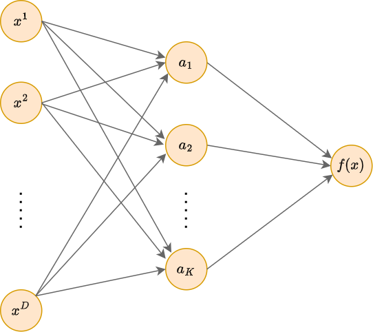
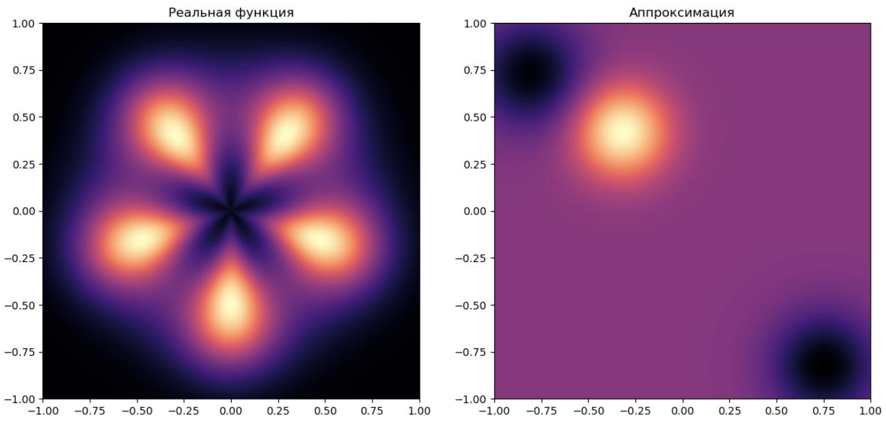
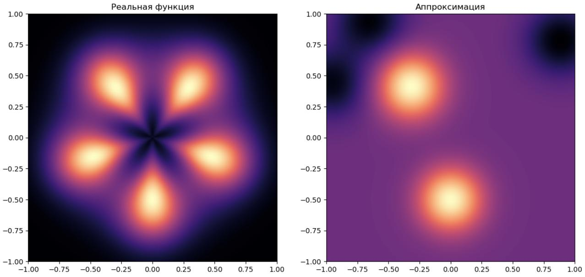
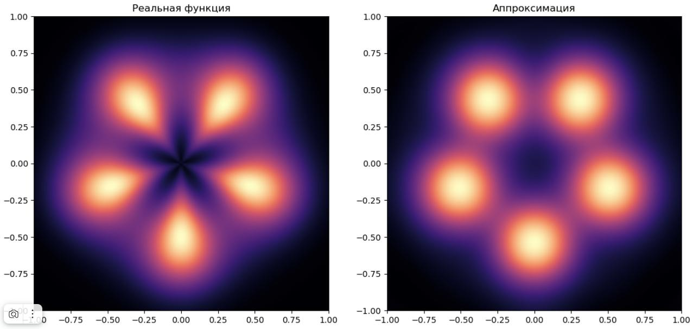

# Сеть радиальных базисных функций

## Определение

**Сеть радиально-базисных функций** (radial basis function network, RBF-network [[1]](https://en.wikipedia.org/wiki/Radial_basis_function_network), предложена в [[2]](https://wpmedia.wolfram.com/sites/13/2018/02/02-3-5.pdf)) - это специальный вид двухслойной нейронной сети, схема которой представлена ниже:

У этой архитектуры отсутствуют смещения (нейроны, выдающие константу 1), а на скрытом слое используются активации специального вида - **радиальные базисные функции** (radial basis function, RBF, RB-функции [[3]](https://en.wikipedia.org/wiki/Radial_basis_function)):

$$
a_i=S(||\mathbf{x}-\mathbf{c}_i||),
$$

которые зависят <u>только</u> от расстояния между входным объектом $\mathbf{x}$ и некоторым настраиваемым центром $\mathbf{c}_i$. 

$S(\cdot)\ge 0$ некоторая убывающая функция от расстояния, что позволяет трактовать активацию как степень близости или похожести $\mathbf{x}$ на $\mathbf{c}_i$ (similarity function).

Прогноз RBF-сети строится как взвешенная сумма таких функций близости:

$$
f(x)=\sum_{i=1}^K w_i S_i(||\mathbf{x}-\mathbf{c}_i||) \tag{1}
$$

В качестве функций чаще всего берётся функция Гауссова ядра (Gaussian kernel):

$$
S(||\mathbf{x}-\mathbf{c}||)=e^{-\gamma ||\mathbf{x}-\mathbf{c}||^2_2},
$$

где 

- $||\mathbf{x}-\mathbf{c}||^2_2$ - квадрат $L_2$-нормы;

- $\gamma>0$ - параметр, характеризующий скорость убывания функции при удалении $\mathbf{x}$ от центра $\mathbf{c}$ и управляющий гибкостью модели (при $\gamma\to0$ прогноз модели стремится к константе).

Гауссово ядро убывает к нулю экспоненциально быстро, что диктует <u>локальный</u> характер прогнозов - активации, соответствующие только самым близким центрам к $\mathbf{x}$ будут существенно влиять на решение. Если по смыслу задачи влиять должны все активации, необходимо выбрать RB-функцию, убывающую к нулю более медленно.

Для этого может использоваться обратная квадратичная функция (inverse quadratic):

$$
S(||\mathbf{x}-\mathbf{c}||)=\frac{1}{1+\gamma ||\mathbf{x}-\mathbf{c}||^2_2}
$$

и обратная мультиквадратичнвая функция (inverse multiquadratic):

$$
S(||\mathbf{x}-\mathbf{c}||)=\frac{1}{\sqrt{1+\gamma ||\mathbf{x}-\mathbf{c}||^2_2}},
$$

которая убывает ещё более медленно.

С другими популярными видами радиально-базисных функций можно ознакомиться в [[3]](https://en.wikipedia.org/wiki/Radial_basis_function).

> Идеологически RBF-сеть больше всего похожа на [метод ближайших центроидов](../../Machine-learning/Metric-methods/Nearest-centroids) классического машинного обучения, представляя его <u>сглаженную версию</u>, в которой число центроидов не связано напрямую с числом классов, а может быть любым. При этом их расположение не описывается явной формулой, а настраивается автоматически по данным. Сама же модель выдаёт непрерывные прогнозы, что позволяет использовать её как в задачах [регрессии](../../Machine-learning/Base-concepts/Supervised-learning#типы-задач-обучения-с-учителем), так и [классификации](../../Machine-learning/Base-concepts/Supervised-learning#типы-задач-обучения-с-учителем) (при вычислении [дискриминантных функций](../../Machine-learning/General-classifiers/Discriminant-functions#многоклассовый-классификатор-в-общем-виде)).

## Настраиваемые параметры

Настраиваемыми параметрами RBF-сети выступают:

- центры RBF-функций $\mathbf{c}_1,...\mathbf{c}_K$;

- параметры функций близости $\gamma_1,...\gamma_K$;

- веса, с которыми суммируются активации $w_1,...w_K$.

## Инициализация параметров

Методы инициализации параметров перед обучением:

- Центры инициализируются случайными объектами выборки.
  
  - Более устойчивый вариант: инициализировать их центроидами после кластеризации методом [K-средних](../../Machine-learning/Clustering/K-means) (K-means [[4]](https://en.wikipedia.org/wiki/K-means_clustering)).

- Коэффициенты $\gamma_1,...\gamma_K$ инициализируются обратной величиной к средним квадратам расстояний между парами объектов, чтобы в начале оптимизации скрытые нейроны имели невырожденный характер изменений.

- Веса $w_1,...w_K$ инициализируются случайно.
  
  - Более содержательный вариант: как значения откликов в обучающих объектах, ближайших к соответствующим центрам $\mathbf{c}_1,...\mathbf{c}_K$.

## Пример использования

Рассмотрим аппроксимацию следующей модельной функции:

**RBF-сеть с тремя центрами** может (при некоторой инициализации) моделировать её следующим образом:

В примере число скрытых нейронов (3 шт.) недостаточно для моделирования всех локальных максимумов функции (5 шт.), и аппроксимация получилась неточной.

**RBF-сеть с 5 центрами**:

Здесь интересно, что даже в случае, когда число скрытый нейронов совпадает с числом локальных максимумов, аппроксимация всё равно получилась неточной из-за неудачной инициализации центров RB-функций. Часть центров оказалось на периферии моделируемой области, где прогнозируемая функция принимает малые значения. Веса при таких RB-функциях оказались отрицательными.

> Это наглядный пример того, насколько для моделей с малым числом параметров важна грамотная инициализация.

**RBF-сеть с 50 центрами** будет уже значительно лучше аппроксимировать моделируемую функцию, поскольку при 50 центрах хотя бы один из них будет оказываться недалеко от локального максимума моделируемой функции:

При дальнейшем наращивании количества RB-функций в скрытом слое точность аппроксимации будет возрастать. В частности, сеть получит возможность моделировать несферическую форму локальных максимумов функции.

> Если обучающая выборка достаточно велика, то для повышения точности лучше выбирать более гибкую перепараметризованную модель.

## Варианты использования

В стандартной RBF-сети (особенно с Гауссовым ядром) функции близости быстро затухают до нуля при удалении от центров. Если объект $\mathbf{x}$ попадает в область признакового пространства, далекую от всех обучающих центров, то все активации станут близки к нулю, и сеть выдаст почти нулевой прогноз.

Поэтому вместо независимых функций близости в активациях часто используются их нормализованные варианты:

$$
S_n(||\mathbf{x}-\mathbf{c}_i||) = \frac{S(||\mathbf{x}-\mathbf{c}_i||)}{\sum_{j=1}^K S(||\mathbf{x}-\mathbf{c}_j||)},\quad i=1,2,...K
$$

В этом случае RBF-сеть будет всегда выдавать невырожденный прогноз, зависящий от того, к каким центрам объект $\mathbf{x}$ оказался ближе всего (даже если он будет далеко отстоять от каждого).

Вместо Евклидового расстояния в (1) можно использовать и другие, например, [изученные ранее](../../Machine-learning/Metric-methods/Distance-functions). В работах [[5]](https://www.researchgate.net/publication/254467552_New_RBF_neural_network_classifier_with_optimized_hidden_neurons_number), [[6]](https://www.researchgate.net/publication/224726263_Mahalanobis_distance_with_radial_basis_function_network_on_protein_secondary_structures) [расстояние Махаланобиса](../../Machine-learning/Metric-methods/Distance-functions#расстояние-махаланобиса) показало себя лучше Евклидового. Также в сами функции расстояния можно вводить настраиваемые параметры - такой подход называется metric learning.

## Совмещение подходов

[Классическая модель нейрона с нелинейностью](../MLP/Neuron-model) даёт аппроксимацию данных, изменяющуюся в зависимости от расстояния от объекта $\mathbf{x}$ до гиперплоскости $w_0+\mathbf{w}^T\mathbf{x}$.

Нейрон, основанный на RB-функции, даёт <u>локальную</u> аппроксимацию данных вокруг соответствующего центра $\mathbf{c}_i$, зависящую от расстояния до него. 

Если в целевой зависимости помимо плавных нелинейных зависимстей присутствуют локальные особенности, целесообразно их моделировать нейросетями, включающими как классические нейроны, так и активации на основе RF-функций. Это повышает выразительную способность нейросети, но может приводить к переобучению при отсутствии ярко выраженных локальных особенностей в данных.

Дополнительно о применениях радиально-базисных функций можно прочитать в [[7]](http://www.scholarpedia.org/article/Radial_basis_function).

## Литература

1. [Wikipedia: Radial basis function network.](https://en.wikipedia.org/wiki/Radial_basis_function_network)
2. [Lowe D., Broomhead D. Multivariable functional interpolation and adaptive networks //Complex systems. – 1988. – Т. 2. – №. 3. – С. 321-355.](https://wpmedia.wolfram.com/sites/13/2018/02/02-3-5.pdf)
3. [Wikipedia: Radial basis function.](https://en.wikipedia.org/wiki/Radial_basis_function)
4. [Wikipedia: k-means clustering.](https://en.wikipedia.org/wiki/K-means_clustering)
5. [Beheim L. et al. New RBF neural network classifier with optimized hidden neurons number //WSEAS Trans. Syst. – 2004. – Т. 2. – С. 467-472.](https://www.researchgate.net/publication/254467552_New_RBF_neural_network_classifier_with_optimized_hidden_neurons_number)
6. [Ibrikci T. et al. Mahalanobis distance with radial basis function network on protein secondary structures //Proceedings of the Second Joint 24th Annual Conference and the Annual Fall Meeting of the Biomedical Engineering Society. – IEEE, 2002. – Т. 3. – С. 2184-2185.](https://www.researchgate.net/publication/224726263_Mahalanobis_distance_with_radial_basis_function_network_on_protein_secondary_structures)
7. [Scholarpedia: Radial basis function.](http://www.scholarpedia.org/article/Radial_basis_function)
